# Trading System Database Schema Guide

Updated: 2026-08-06

This document is the authoritative reference for the `trading_system` PostgreSQL database. It describes the schema assembled by `init-db/01` through `init-db/40`. The overview is generated from the final public schema; detailed sections distinguish canonical tables from V1 compatibility surfaces.

> Migration note: `binance_sent_orders` was backfilled into canonical `orders` and dropped by `init-db/10-migrate-binance-sent-orders-to-orders.sql`. It is not part of the final schema. Runtime services, CLI trace, reconciliation, listener, risk rejection logging, and smoke scripts must use `orders` as the single order lifecycle source of truth. `binance_fills`, `alpha_positions`, `alpha_ledger`, `alpha_risk_config`, and `funding_rates` remain compatibility projections because legacy runtime paths still write them; they are not substitutes for the provider-neutral V2 tables.

---

## Table of Contents

- [1. Infrastructure & Connection Info](#1-infrastructure--connection-info)
- [2. Schema Overview — 88 Tables And 2 Views](#2-schema-overview--88-tables-and-2-views)
- [3. Layer 1 — Legacy / Compatibility Tables](#3-layer-1--legacy--compatibility-tables)
- [4. Layer 2 — Registry & Identity](#4-layer-2--registry--identity)
- [5. Layer 3 — Trading Core V2](#5-layer-3--trading-core-v2)
- [6. Layer 4 — Paper Mode](#6-layer-4--paper-mode)
- [7. Execution Extensions: Brackets, Sizing & Arbitrage Packages](#7-execution-extensions-brackets-sizing--arbitrage-packages)
- [8. Layer 5 — Venue Adapters, Auth & Physical Broker Sync](#8-layer-5--venue-adapters-auth--physical-broker-sync)
- [9. Layer 6 — Settlement](#9-layer-6--settlement)
- [10. Layer 7 — Observability & Security](#10-layer-7--observability--security)
- [11. Layer 8 — Performance & PnL Projection](#11-layer-8--performance--pnl-projection)
- [12. Layer 9 — Portfolio Management](#12-layer-9--portfolio-management)
- [13. Layer 10 — Copy Trading Outbox](#13-layer-10--copy-trading-outbox)
- [14. Layer 11 — Operational PnL & Emergency Ops](#14-layer-11--operational-pnl--emergency-ops)
- [15. Domain Events, Idempotency & Replay](#15-domain-events-idempotency--replay)
- [16. Redis Registry](#16-redis-registry)
- [17. Mermaid ERD](#17-mermaid-erd)
- [18. Order Lifecycle Flow](#18-order-lifecycle-flow)
- [19. Lookup Guides](#19-lookup-guides)
- [20. Expected Nulls vs Problem Nulls](#20-expected-nulls-vs-problem-nulls)
- [21. TimescaleDB Policies](#21-timescaledb-policies)
- [22. Manual Cleanup Policy](#22-manual-cleanup-policy)
- [23. Historical Decisions](#23-historical-decisions)
- [24. Migration, Compatibility & Maintenance Governance](#24-migration-compatibility--maintenance-governance)

---

## 1. Infrastructure & Connection Info

### Database Container

| Property | Value |
| --- | --- |
| Container name | `live_data_executor` |
| Image | `timescale/timescaledb:latest-pg15` |
| Internal port | `5432` |
| Host-mapped port | `127.0.0.1:7654` |
| Docker network | `executor_network` |
| DNS aliases | `live_data_executor`, `postgres` |
| Container IP (internal) | `172.20.0.2` |
| Volume | Named volume `pgdata` → `/var/lib/postgresql/data` |
| Init scripts | `./init-db` → `/docker-entrypoint-initdb.d` (run in filename order on first boot) |
| Healthcheck | `pg_isready -U bobby -d live_data_executor` every 10s |
| Extensions | `timescaledb`, `pgcrypto` |
| Custom params | `max_connections=200`, `shared_buffers=512MB`, `autovacuum_max_workers=3`, `idle_in_transaction_session_timeout=60000` |

### Database Credentials

| Role | Username | Password | Purpose |
| --- | --- | --- | --- |
| Owner / migration role | `${POSTGRES_USER}` | Secret reference / `.env` | Schema owner and governed migrations |
| Read-only | deployment-specific | Secret reference | SELECT-only operator/analytics access |
| Service roles | deployment-specific | Secret reference | Least-privilege runtime access when provisioned |

### Database Name

```
live_data_executor
```

### Connection Strings

**From within Docker network** (`executor_network`):

```
postgresql://${POSTGRES_USER}:<secret>@live_data_executor:5432/${POSTGRES_DB}
```

**From the host machine** (`127.0.0.1`, port `7654`):

```
postgresql://${POSTGRES_USER}:<secret>@127.0.0.1:7654/${POSTGRES_DB}
```

**From another server via SSH tunnel** (read-only recommended):

```bash
# Step 1: SSH tunnel from remote machine
ssh -L 7654:127.0.0.1:7654 root@160.250.181.243

# Step 2: Connect from the remote machine's local port
psql "postgresql://<read_only_user>:<secret>@127.0.0.1:7654/${POSTGRES_DB}"
```

Or with a single SSH + psql command:

```bash
ssh root@160.250.181.243 \
  "docker exec live_data_executor psql -U read_only -d live_data_executor -c 'SELECT 1;'"
```

> **Note:** The host-mapped port binds to `127.0.0.1:7654` (localhost only). Direct remote access without SSH tunnel is not possible unless firewall/port binding is changed.

### Redis

| Property | Value |
| --- | --- |
| Container name | `redis_service` |
| Image | `redis:7.2-alpine` |
| Host-mapped port | `127.0.0.1:6379` |
| Trading system DB | `0` (`TRADING_REDIS_URL`) |
| Data layer DB | `2` (`DATA_LAYER_REDIS_URL`) — read-only from trading_system perspective |
| Max memory | `2gb`, policy `volatile-lru` |
| Persistence | AOF + RDB save every 900s/1 change |

### Running Services (docker ps)

The table below is a deployment reference, not a schema contract. A service can be disabled by profile or stopped without changing the database schema. Verify the actual process set with `docker compose ps`; do not infer table ownership from whether a container is currently running.

| Container | Image | Service |
| --- | --- | --- |
| `gateway_service` | `tradingsystem-image:latest` | FastAPI gateway (port 8000) |
| `risk_engine_service` | Same | Pre-trade risk engine |
| `executor_service` | Same | Venue execution dispatcher |
| `paper_execution_service` | Same | Paper mode matching engine |
| `listener_service` | Same | Binance user data stream listener |
| `market_data_service` | Same | Data-layer bridge for market data |
| `portfolio_service` | Same | Account/position/ledger projector |
| `performance_service` | Same | PnL/equity snapshot projector |
| `reconciliation_service` | Same | Paper + broker reconciliation |
| `copy_outbox_service` | Same | Copy-trading DB outbox publisher |
| `monitor_service` | Same | Health/dead-letter/stream-lag monitor |
| `data_layer_service` | `data-layer:v0.1.0` | Market data gateway (port 8100) |
| `live_data_executor` | `timescale/timescaledb:latest-pg15` | PostgreSQL + TimescaleDB |
| `redis_service` | `redis:7.2-alpine` | Redis |
| `alpha-nginx` | `nginx:alpine` | Reverse proxy (ports 80/443) |
| `live_execution_data` | `timescale/timescaledb:latest-pg15` | Legacy second Postgres (port 65437) |

---

## 2. Schema Overview — 88 Tables And 2 Views

The final database contains **88 tables and 2 views** across the `public` schema after `init-db/01`
through `init-db/40`; `binance_sent_orders`, `positions`, and `alpha_stats_daily` are not final tables.
`init-db/10` migrates and drops `binance_sent_orders`; `init-db/18` removes the two obsolete tables if
they exist in an older database. The machine-checked owner contract is
`contracts/schema/table-ownership.generated.json`.

| # | Layer | Migration File | Tables |
| ---: | --- | --- | --- |
| 1 | Legacy / Compatibility | `02-init-schema.sql`, `05-trading-core-v2.sql` | `alphas`, `alpha_ledger`, `alpha_risk_config`, `funding_rates`, `binance_fills`, `alpha_positions` |
| 2 | Registry & Identity | `05-trading-core-v2.sql` | `traders`, `strategies`, `venues`, `instruments` |
| 3 | Trading Core V2 | `05-trading-core-v2.sql` | `accounts`, `account_balances`, `margin_balances`, `orders`, `fills`, `positions_v2`, `risk_profiles` |
| 4 | Domain Events | `04-domain-events.sql` | `domain_events`, `event_idempotency` |
| 5 | Execution Coordination | `20-execution-sessions.sql`, `21-risk-grants.sql` | `execution_sessions`, `risk_grants` |
| 6 | Paper Mode | `06-paper-mode.sql`, `13-*` | `paper_open_orders`, `paper_matcher_config`, `paper_account_seed` |
| 7 | Venue Adapters, Auth & Physical Sync | `07-venue-adapters.sql`, `24-physical-broker-sync.sql` | `venue_accounts`, `venue_credentials`, `dnse_trading_tokens`, `venue_rate_limits`, `broker_account_sync_snapshots` |
| 8 | Settlement | `08-settlement.sql` | `settlements`, `settlement_calendars`, `settlement_buckets` |
| 9 | Observability | `09-observability-security.sql`, `16-*`, `17-*` | `dead_letters`, `reconciliation_findings`, `audit_log`, `service_heartbeats` |
| 10 | Performance / PnL | `10-performance.sql` | `strategy_deployments`, `performance_snapshots`, `account_equity_snapshots`, `funding_accruals`, `performance_events` |
| 11 | Portfolio Management | `11-portfolio-management.sql` | `portfolios`, `portfolio_allocations`, `portfolio_capital_ledger`, `account_policies`, `account_sync_snapshots`, `account_reservations`, `cash_ledger`, `margin_ledger`, `portfolio_audit_log` |
| 12 | Pending Exposure | `12-pending-exposure.sql`, `26-order-brackets.sql` | `order_pending_exposure` |
| 13 | Copy Trading | `15-copy-trading-outbox.sql` | `copy_publish_policies`, `copy_event_outbox`, `copy_event_dead_letters` |
| 14 | Operational PnL | `19-performance-pnl-ops.sql` | `portfolio_equity_snapshots`, `operator_operations` |
| 15 | Execution Extensions | `26-order-brackets.sql`, `27-sizing-decisions.sql`, `30-arb-order-packages.sql` | `order_brackets`, `order_bracket_legs`, `sizing_decisions`, `arb_order_packages` |
| 16 | Conditional Order Groups | `31-conditional-order-groups.sql` | `conditional_order_groups`, `conditional_order_group_legs`, `order_group_event_inbox`, `execution_command_outbox` |
| 17 | Execution Replay | `32-execution-replay-v2.sql` | `execution_replay_jobs` |
| 18 | Durable Command Journal | `34-durable-command-journal.sql` | `command_journal`, `command_dispatch_outbox`, `command_delivery_attempts`, `command_broker_attempts`, `command_ack_evidence`, `command_stream_trim_audit` |
| 19 | Canonical Current-State Projections | `35-canonical-domain-projections.sql` | `account_sync_current_state`, `broker_account_sync_current_state`, `broker_sync_state_history`, `performance_projection_current_state`, `projection_storage_policies` |
| 20 | Change-Only Broker Storage | `41-change-only-sync-storage.sql` | `broker_sync_valuation_current_state`, `broker_sync_valuation_history`, `broker_sync_raw_hot`, `reconciliation_observation_buckets`, `portfolio_audit_current_state`, `storage_archive_manifests` |
| 20 | Product-Aware Instrument Identity | `36-product-aware-instruments.sql` | `instrument_aliases`, `instrument_metadata_history` (and additive columns/constraints on `instruments`) |
| 21 | Rust Shadow Evidence | `37-rust-shadow-evidence.sql` | `engine_shadow_comparisons` |
| 22 | Pure Engine Authority | `38-engine-authority.sql` | `engine_authority_scopes`, `engine_authority_decisions`, `engine_authority_transitions` |
| 23 | Production Governance | `39-production-governance.sql` | `schema_migration_ledger`, `compatibility_surface_registry`, `compatibility_usage_daily`, `schema_object_ownership` |
| 24 | Storage And Recovery Operations | `40-storage-operations.sql` | `maintenance_policy_registry`, `redis_transport_epochs` |

Additional migrations: `01-init-roles.sql` (roles), `03-migrations.sql` (legacy placeholder), `10-migrate-binance-sent-orders-to-orders.sql` (backfill/drop), `13-*` (paper account-scoped key), `16-*` and `17-*` (reconciliation indexes/compaction), `18-*` (drop obsolete legacy tables), `22-*` and `23-*` (order status repairs), `25-*` (NET/HEDGE account policy), `28-*` (HEDGE finding identity), `29-*` (VN derivative seed), and `33-*` (conditional-group exposure index). These additive/repair migrations do not add another final table.

---

## 3. Layer 1 — Legacy / Compatibility Tables

These tables predate the V2 canonical schema. They still have active runtime owners in legacy paths.

Source: `init-db/02-init-schema.sql`, with V2 compatibility columns added by `05-trading-core-v2.sql`.

### `alphas`

Legacy alpha registry.

| Column | Type | Constraints | Description |
| --- | --- | --- | --- |
| `alpha_id` | `TEXT` | **PK** | Alpha identifier |
| `description` | `TEXT` | | Human description |
| `created_at` | `TIMESTAMPTZ` | DEFAULT `now()` | Creation time |
| `active` | `BOOLEAN` | DEFAULT `TRUE` | Active flag |

**Convention:** For new integrations, `alphas.alpha_id` = `strategies.strategy_id`.

### `alpha_ledger`

Legacy per-alpha wallet / balance summary.

| Column | Type | Constraints | Description |
| --- | --- | --- | --- |
| `alpha_id` | `TEXT` | **PK**, FK → `alphas` | Alpha identifier |
| `currency` | `TEXT` | DEFAULT `'USDT'` | Base currency |
| `initial_balance` | `DOUBLE PRECISION` | DEFAULT `0` | Starting balance |
| `current_balance` | `DOUBLE PRECISION` | DEFAULT `0` | Current balance |
| `locked_margin` | `DOUBLE PRECISION` | DEFAULT `0` | Locked margin |
| `max_equity` | `DOUBLE PRECISION` | DEFAULT `0` | Peak equity high-water mark |
| `total_fees` | `DOUBLE PRECISION` | DEFAULT `0` | Cumulative fees |
| `total_volume` | `DOUBLE PRECISION` | DEFAULT `0` | Cumulative volume |
| `update_time` | `TIMESTAMPTZ` | DEFAULT `NOW()` | Last update |

> **Note:** Uses `DOUBLE PRECISION` (legacy). V2 equivalent is `account_balances` with `NUMERIC(38,18)`.

### `alpha_risk_config`

Legacy per-alpha risk configuration.

| Column | Type | Constraints | Description |
| --- | --- | --- | --- |
| `alpha_id` | `TEXT` | **PK**, FK → `alphas` | Alpha identifier |
| `max_notional_order` | `DOUBLE PRECISION` | DEFAULT `1000` | Max notional per order |
| `max_notional_pos` | `DOUBLE PRECISION` | DEFAULT `5000` | Max notional per position |
| `max_leverage` | `INT` | DEFAULT `20` | Max leverage |
| `max_order_per_min` | `INT` | DEFAULT `60` | Rate limit per minute |
| `max_drawdown_limit` | `DOUBLE PRECISION` | DEFAULT `0.1` | Max drawdown (fraction) |
| `max_daily_loss` | `DOUBLE PRECISION` | DEFAULT `500` | Max daily loss |
| `allowed_order_types` | `TEXT[]` | DEFAULT `{MARKET, LIMIT, STOP_MARKET, STOP_LIMIT}` | Allowed order types |
| `is_active` | `BOOLEAN` | DEFAULT `TRUE` | Active flag |
| `update_time` | `TIMESTAMPTZ` | DEFAULT `NOW()` | Last update |

> V2 equivalent: `risk_profiles` (mode/venue/instrument-aware, `NUMERIC` precision).

### `funding_rates`

Cached Binance funding rate.

| Column | Type | Constraints |
| --- | --- | --- |
| `symbol` | `TEXT` | **PK** |
| `funding_rate` | `DOUBLE PRECISION` | DEFAULT `0` |
| `next_funding_time` | `TIMESTAMPTZ` | |
| `last_fetched` | `TIMESTAMPTZ` | DEFAULT `now()` |

#### `binance_sent_orders` (removed)

This table is not part of the final schema. `init-db/10-migrate-binance-sent-orders-to-orders.sql` backfilled valid historical rows into `orders`, then dropped the table. Do not create, query, or add new runtime code for it. Risk rejects are also projected into canonical `orders` with `status='RISK_REJECTED'`, `error_code`, `error_message`, and the risk context in `raw_response`.

### `binance_fills`

Legacy Binance fill table. **TimescaleDB hypertable** on `trade_time`.

| Column | Type | Constraints |
| --- | --- | --- |
| `id` | `BIGSERIAL` | PK (with `trade_time`) |
| `trade_time` | `TIMESTAMPTZ` | NOT NULL |
| `alpha_id` | `TEXT` | NOT NULL, FK → `alphas` |
| `symbol` | `TEXT` | NOT NULL |
| `trade_id` | `BIGINT` | NOT NULL |
| `binance_order_id` | `BIGINT` | NOT NULL |
| `side` | `TEXT` | NOT NULL |
| `price` | `DOUBLE PRECISION` | NOT NULL |
| `qty` | `DOUBLE PRECISION` | NOT NULL |
| `commission` | `DOUBLE PRECISION` | DEFAULT `0` |
| `commission_asset` | `TEXT` | DEFAULT `'USDT'` |
| `realized_pnl` | `DOUBLE PRECISION` | DEFAULT `0` |
| `mode` | `TEXT` | DEFAULT `'live'` |
| `venue` | `TEXT` | DEFAULT `'BINANCE'` |
| `account_id` | `TEXT` | Added by `05-trading-core-v2.sql`; nullable for old rows |

**Index:** `idx_fills_alpha(alpha_id, trade_time)`. This is a compatibility/audit projection; provider-neutral fill accounting belongs in `fills`.

### `alpha_positions`

Legacy per-alpha/symbol position projection.

| Column | Type | Constraints |
| --- | --- | --- |
| `alpha_id` | `TEXT` | NOT NULL, FK → `alphas`, PK (with `symbol`) |
| `symbol` | `TEXT` | NOT NULL |
| `quantity` | `DOUBLE PRECISION` | DEFAULT `0` |
| `pending_buy_qty` | `DOUBLE PRECISION` | DEFAULT `0` |
| `pending_sell_qty` | `DOUBLE PRECISION` | DEFAULT `0` |
| `entry_price` | `DOUBLE PRECISION` | DEFAULT `0` |
| `realized_pnl` | `DOUBLE PRECISION` | DEFAULT `0` |
| `unrealized_pnl` | `DOUBLE PRECISION` | DEFAULT `0` |
| `update_time` | `TIMESTAMPTZ` | DEFAULT `NOW()` |
| `mode` | `TEXT` | DEFAULT `'live'` |
| `venue` | `TEXT` | DEFAULT `'BINANCE'` |
| `account_id` | `TEXT` | |

---

## 4. Layer 2 — Registry & Identity

Source: `init-db/05-trading-core-v2.sql`, extended by `init-db/36-product-aware-instruments.sql`.

### `traders`

Top-level operator/trader identity.

| Column | Type | Constraints |
| --- | --- | --- |
| `trader_id` | `TEXT` | **PK** |
| `name` | `TEXT` | |
| `active` | `BOOLEAN` | NOT NULL, DEFAULT `TRUE` |
| `created_at` | `TIMESTAMPTZ` | NOT NULL, DEFAULT `now()` |

### `strategies`

Canonical alpha/strategy registry.

| Column | Type | Constraints | Description |
| --- | --- | --- | --- |
| `strategy_id` | `TEXT` | **PK** | Unique strategy identifier |
| `trader_id` | `TEXT` | FK → `traders` | Owner |
| `description` | `TEXT` | | Human description |
| `active` | `BOOLEAN` | NOT NULL, DEFAULT `TRUE` | Active flag |
| `allowed_modes` | `TEXT[]` | NOT NULL, DEFAULT `{paper}` | Permitted modes |
| `allowed_venues` | `TEXT[]` | NOT NULL, DEFAULT `{}` | Permitted venues |
| `created_at` | `TIMESTAMPTZ` | NOT NULL, DEFAULT `now()` | Creation time |

### `venues`

Registered venue/exchange/broker.

| Column | Type | Constraints | Description |
| --- | --- | --- | --- |
| `venue` | `TEXT` | **PK** | e.g. `BINANCE`, `DNSE` |
| `venue_type` | `TEXT` | NOT NULL | e.g. `CRYPTO_EXCHANGE`, `STOCK_BROKER` |
| `timezone` | `TEXT` | NOT NULL, DEFAULT `'UTC'` | Venue timezone |
| `active` | `BOOLEAN` | NOT NULL, DEFAULT `TRUE` | Active flag |
| `raw_metadata` | `JSONB` | NOT NULL, DEFAULT `{}` | Provider-specific metadata |
| `created_at` | `TIMESTAMPTZ` | NOT NULL, DEFAULT `now()` | |
| `updated_at` | `TIMESTAMPTZ` | NOT NULL, DEFAULT `now()` | |

### `instruments`

Canonical instrument/product metadata. The V1 primary key is retained, while all new resolution and
cache paths use the product-aware canonical identity.

| Column | Type | Constraints | Description |
| --- | --- | --- | --- |
| `instrument_id` | `TEXT` | **PK** | V1 compatibility ID, e.g. `BTCUSDT.BINANCE`; non-default products may use the canonical ID |
| `venue` | `TEXT` | NOT NULL, FK → `venues` | Venue |
| `symbol` | `TEXT` | NOT NULL | Compatibility/canonical symbol e.g. `BTCUSDT` |
| `product` | `TEXT` | NOT NULL, CHECK | `SPOT`, `USD_M`, `COIN_M`, `SWAP`, `FUTURES`, `VN_EQUITY`, or `VN_DERIVATIVE` |
| `venue_symbol` | `TEXT` | NOT NULL | Exact venue-native identifier; separators are preserved |
| `canonical_instrument_id` | `TEXT` | NOT NULL, UNIQUE | Exact identity `VENUE:PRODUCT:VENUE_SYMBOL` |
| `metadata_version` | `TEXT` | | Provider/version identifier for auditable rule changes |
| `asset_class` | `TEXT` | NOT NULL | `CRYPTO_PERP`, `CRYPTO_SPOT`, `VN_STOCK`, etc. |
| `base_currency` | `TEXT` | | Base asset |
| `quote_currency` | `TEXT` | | Quote asset |
| `settlement_currency` | `TEXT` | | Settlement currency |
| `price_precision` | `INT` | NOT NULL, DEFAULT `0` | Decimal places for price |
| `size_precision` | `INT` | NOT NULL, DEFAULT `0` | Decimal places for quantity |
| `tick_size` | `NUMERIC(38,18)` | | Minimum price increment |
| `lot_size` | `NUMERIC(38,18)` | | Minimum quantity increment |
| `min_qty` | `NUMERIC(38,18)` | | Minimum order quantity |
| `max_qty` | `NUMERIC(38,18)` | | Maximum order quantity |
| `min_notional` | `NUMERIC(38,18)` | | Minimum notional value |
| `multiplier` | `NUMERIC(38,18)` | NOT NULL, DEFAULT `1` | Contract multiplier |
| `margin_init` | `NUMERIC(38,18)` | | Initial margin rate |
| `margin_maint` | `NUMERIC(38,18)` | | Maintenance margin rate |
| `trading_sessions` | `JSONB` | NOT NULL, DEFAULT `{}` | Session schedule |
| `allowed_order_types` | `TEXT[]` | NOT NULL, DEFAULT `{}` | Allowed order types |
| `active` | `BOOLEAN` | NOT NULL, DEFAULT `TRUE` | Active flag |
| `raw_metadata` | `JSONB` | NOT NULL, DEFAULT `{}` | Provider-specific metadata |
| `updated_at` | `TIMESTAMPTZ` | NOT NULL, DEFAULT `now()` | |

**Identity and compatibility rules:**

- Canonical uniqueness is `(venue, product, venue_symbol)` and `canonical_instrument_id`.
- The old `(venue, symbol)` uniqueness was removed because Spot, USD-M, Swap and Futures can share a symbol.
- A `BEFORE INSERT/UPDATE` trigger supplies the default product/native/canonical fields for bounded mixed-version V1 writers. Binance defaults to `USD_M`; DNSE-style VN futures default to `VN_DERIVATIVE`; other VN symbols default to `VN_EQUITY`; OKX defaults to `SWAP`.
- Existing accepted orders retain their stored `instrument_id` and metadata evidence. A later instrument metadata update must not silently rewrite an accepted command.

### `instrument_aliases`

Product-scoped resolution aliases. An alias is never resolved without both venue and product, which prevents `BTCUSDT` Spot/USD-M/Swap/Futures collisions.

| Column | Type | Constraints | Description |
| --- | --- | --- | --- |
| `venue` | `TEXT` | **PK part**, FK → `venues` | Venue scope |
| `product` | `TEXT` | **PK part** | Product scope |
| `alias` | `TEXT` | **PK part** | Client, canonical-symbol, or venue-native alias |
| `canonical_instrument_id` | `TEXT` | FK → `instruments.canonical_instrument_id` | Resolved identity |
| `alias_type` | `TEXT` | NOT NULL, DEFAULT `VENUE_NATIVE` | Alias provenance |
| `active` | `BOOLEAN` | NOT NULL, DEFAULT `TRUE` | Resolution gate |
| `created_at`, `updated_at` | `TIMESTAMPTZ` | NOT NULL | Audit timestamps |

### `instrument_metadata_history`

Append-only audit evidence for metadata/rule changes that can affect execution.

| Column | Type | Constraints | Description |
| --- | --- | --- | --- |
| `history_id` | `BIGSERIAL` | **PK** | Audit identity |
| `canonical_instrument_id` | `TEXT` | NOT NULL | Product-aware instrument identity |
| `previous_metadata_version`, `metadata_version` | `TEXT` | | Version transition |
| `previous_metadata`, `metadata` | `JSONB` | NOT NULL | Before/after provider metadata |
| `changed_fields` | `TEXT[]` | NOT NULL | `metadata_version`, `raw_metadata`, and/or `trading_constraints` |
| `changed_at` | `TIMESTAMPTZ` | NOT NULL, DEFAULT `now()` | Change time |

The audit trigger records changes to metadata version/raw metadata and execution constraints (`tick_size`, `lot_size`, quantities, notional, multiplier). Ordinary no-op updates do not create history.

---

## 5. Layer 3 — Trading Core V2

Source: `init-db/05-trading-core-v2.sql`, `init-db/12-pending-exposure.sql`

All monetary columns use `NUMERIC(38,18)` for precision-safe accounting.

### `accounts`

Internal trading account per strategy/mode/venue.

| Column | Type | Constraints | Description |
| --- | --- | --- | --- |
| `account_id` | `TEXT` | **PK** | e.g. `paper-binance-<strategy_id>` |
| `trader_id` | `TEXT` | FK → `traders` | Trader owner |
| `strategy_id` | `TEXT` | FK → `strategies` | Linked strategy |
| `mode` | `TEXT` | NOT NULL, CHECK `paper`/`sandbox`/`live`/`replay`/`backtest` | Trading mode |
| `venue` | `TEXT` | NOT NULL, FK → `venues` | Venue |
| `account_type` | `TEXT` | NOT NULL, CHECK `CASH`/`MARGIN`/`BETTING` | Account type |
| `base_currency` | `TEXT` | | Default currency |
| `external_account_ref` | `TEXT` | | External broker account reference |
| `active` | `BOOLEAN` | NOT NULL, DEFAULT `TRUE` | Active flag |
| `created_at` | `TIMESTAMPTZ` | NOT NULL, DEFAULT `now()` | |
| `updated_at` | `TIMESTAMPTZ` | NOT NULL, DEFAULT `now()` | |

**Convention:** One account per (strategy, mode, venue). Do not share accounts across strategies.

### `account_balances`

Internal balance state per account/currency.

| Column | Type | Constraints | Description |
| --- | --- | --- | --- |
| `account_id` | `TEXT` | NOT NULL, FK → `accounts`, PK (with `currency`) | Account |
| `currency` | `TEXT` | NOT NULL | Currency code |
| `total` | `NUMERIC(38,18)` | NOT NULL, DEFAULT `0`, CHECK `≥ 0` | Total balance |
| `locked` | `NUMERIC(38,18)` | NOT NULL, DEFAULT `0`, CHECK `≥ 0` | Locked by reservations |
| `free` | `NUMERIC(38,18)` | NOT NULL, DEFAULT `0`, CHECK `≥ 0` | Available for trading |
| `updated_at` | `TIMESTAMPTZ` | NOT NULL, DEFAULT `now()` | |

**Invariant:** `total = locked + free` at currency precision.

### `margin_balances`

Margin accounting state per account/currency/instrument.

| Column | Type | Constraints |
| --- | --- | --- |
| `account_id` | `TEXT` | NOT NULL, FK → `accounts` |
| `instrument_id` | `TEXT` | Nullable (null = account-level) |
| `currency` | `TEXT` | NOT NULL |
| `initial` | `NUMERIC(38,18)` | NOT NULL, DEFAULT `0`, CHECK `≥ 0` |
| `maintenance` | `NUMERIC(38,18)` | NOT NULL, DEFAULT `0`, CHECK `≥ 0` |
| `updated_at` | `TIMESTAMPTZ` | NOT NULL, DEFAULT `now()` |

**Unique:** `(account_id, currency, COALESCE(instrument_id, '*'))`

### `orders`

Canonical accepted order table.

| Column | Type | Constraints | Description |
| --- | --- | --- | --- |
| `order_id` | `BIGSERIAL` | **PK** | Auto-increment |
| `client_order_id` | `TEXT` | NOT NULL | Client-assigned ID |
| `venue_order_id` | `TEXT` | Nullable | Exchange-assigned ID |
| `trader_id` | `TEXT` | FK → `traders` | |
| `strategy_id` | `TEXT` | FK → `strategies` | |
| `account_id` | `TEXT` | FK → `accounts` | |
| `mode` | `TEXT` | NOT NULL, CHECK modes | Trading mode |
| `venue` | `TEXT` | NOT NULL, FK → `venues` | |
| `instrument_id` | `TEXT` | NOT NULL, FK → `instruments` | |
| `symbol` | `TEXT` | NOT NULL | Raw symbol |
| `side` | `TEXT` | NOT NULL, CHECK `BUY`/`SELL` | |
| `position_side` | `TEXT` | NOT NULL, DEFAULT `'BOTH'` | |
| `order_type` | `TEXT` | NOT NULL | `MARKET`, `LIMIT`, `STOP_MARKET`, etc. |
| `time_in_force` | `TEXT` | NOT NULL, DEFAULT `'GTC'` | |
| `quantity` | `NUMERIC(38,18)` | NOT NULL, CHECK `> 0` | |
| `price` | `NUMERIC(38,18)` | Nullable | Null for `MARKET` |
| `trigger_price` | `NUMERIC(38,18)` | Nullable | For stop/TP orders |
| `status` | `TEXT` | NOT NULL | `ACCEPTED`, `FILLED`, `CANCELED`, etc. |
| `reduce_only` | `BOOLEAN` | NOT NULL, DEFAULT `FALSE` | |
| `post_only` | `BOOLEAN` | NOT NULL, DEFAULT `FALSE` | |
| `intent` | `TEXT` | NOT NULL, DEFAULT `'OPEN'` | |
| `submitted_at` | `TIMESTAMPTZ` | NOT NULL, DEFAULT `now()` | |
| `updated_at` | `TIMESTAMPTZ` | NOT NULL, DEFAULT `now()` | |
| `raw_request` | `JSONB` | | |
| `raw_response` | `JSONB` | | |
| `error_code` | `TEXT` | Nullable | |
| `error_message` | `TEXT` | Nullable | |
| `execution_session_id` | `TEXT` | Nullable, FK -> `execution_sessions` | Durable alpha/candle execution-cycle link (`20-*`) |
| `risk_grant_id` | `TEXT` | Nullable, FK -> `risk_grants` | Risk approval scope used for the request (`21-*`) |

**Unique:** `(mode, venue, account_id, client_order_id)`
**Indexes:** `idx_orders_strategy_instrument_status`, `idx_orders_venue_order`

**Note:** Risk rejects are projected into `orders` with `status='RISK_REJECTED'`, the requested positive quantity, `error_code='RISK_REJECTED'`, the human-readable `error_message`, and `raw_response.risk_context`. A risk rejection must not create fills, positions, reservations, or pending exposure.

### `fills`

Canonical fill table. **TimescaleDB hypertable** on `trade_time`.

| Column | Type | Constraints | Description |
| --- | --- | --- | --- |
| `fill_id` | `BIGSERIAL` | PK (with `trade_time`) | Auto-increment |
| `event_id` | `UUID` | Nullable | Domain event reference |
| `trade_time` | `TIMESTAMPTZ` | NOT NULL | Partition column |
| `trade_id` | `TEXT` | Nullable | Exchange trade ID |
| `client_order_id` | `TEXT` | NOT NULL | |
| `venue_order_id` | `TEXT` | Nullable | |
| `strategy_id` | `TEXT` | FK → `strategies` | |
| `account_id` | `TEXT` | FK → `accounts` | |
| `mode` | `TEXT` | NOT NULL, CHECK modes | |
| `venue` | `TEXT` | NOT NULL, FK → `venues` | |
| `instrument_id` | `TEXT` | NOT NULL, FK → `instruments` | |
| `side` | `TEXT` | NOT NULL, CHECK `BUY`/`SELL` | |
| `price` | `NUMERIC(38,18)` | NOT NULL, CHECK `> 0` | Fill price |
| `quantity` | `NUMERIC(38,18)` | NOT NULL, CHECK `> 0` | Fill quantity |
| `commission` | `NUMERIC(38,18)` | NOT NULL, DEFAULT `0` | Fee |
| `commission_currency` | `TEXT` | Nullable | |
| `liquidity_side` | `TEXT` | Nullable | `MAKER` / `TAKER` |
| `realized_pnl` | `NUMERIC(38,18)` | NOT NULL, DEFAULT `0` | |
| `raw` | `JSONB` | Nullable | Raw broker payload |
| `execution_session_id` | `TEXT` | Nullable, FK -> `execution_sessions` | Execution-cycle link (`20-*`) |

**Indexes:** `idx_fills_trade(mode, venue, account_id, trade_id)`, `idx_fills_strategy_time(strategy_id, trade_time)`, and the partial execution-session index from `20-*`.

### `positions_v2`

Canonical position state per account/instrument/side.

| Column | Type | Constraints | Description |
| --- | --- | --- | --- |
| `position_id` | `TEXT` | **PK** | Position identifier |
| `strategy_id` | `TEXT` | FK → `strategies` | |
| `account_id` | `TEXT` | FK → `accounts` | |
| `mode` | `TEXT` | NOT NULL, CHECK modes | |
| `venue` | `TEXT` | NOT NULL, FK → `venues` | |
| `instrument_id` | `TEXT` | NOT NULL, FK → `instruments` | |
| `side` | `TEXT` | NOT NULL, CHECK `FLAT`/`LONG`/`SHORT` | |
| `signed_qty` | `NUMERIC(38,18)` | NOT NULL, DEFAULT `0` | Signed quantity |
| `quantity` | `NUMERIC(38,18)` | NOT NULL, DEFAULT `0`, CHECK `≥ 0` | Absolute quantity |
| `avg_px_open` | `NUMERIC(38,18)` | NOT NULL, DEFAULT `0` | Average entry price |
| `avg_px_close` | `NUMERIC(38,18)` | NOT NULL, DEFAULT `0` | Average close price |
| `realized_pnl` | `NUMERIC(38,18)` | NOT NULL, DEFAULT `0` | |
| `unrealized_pnl` | `NUMERIC(38,18)` | NOT NULL, DEFAULT `0` | |
| `mark_price` | `NUMERIC(38,18)` | Nullable | (Added by `19-*`) |
| `mark_price_at` | `TIMESTAMPTZ` | Nullable | (Added by `19-*`) |
| `notional` | `NUMERIC(38,18)` | NOT NULL, DEFAULT `0` | (Added by `19-*`) |
| `peak_qty` | `NUMERIC(38,18)` | NOT NULL, DEFAULT `0` | High-water mark quantity |
| `opened_at` | `TIMESTAMPTZ` | Nullable | |
| `closed_at` | `TIMESTAMPTZ` | Nullable | Null while open |
| `updated_at` | `TIMESTAMPTZ` | NOT NULL, DEFAULT `now()` | |

**Index:** `idx_positions_v2_strategy(strategy_id, mode, venue, instrument_id)`.

**Identity rule:** The database only enforces `position_id` as the primary key. The runtime-generated `position_id` must include the account/mode/venue/instrument/side scope. In `HEDGE` mode, `LONG` and `SHORT` are separate virtual rows; in `NET` mode, the venue adapter may expose one broker-net position while the internal account projection remains scoped to its own strategy/account.

### `risk_profiles`

Risk limits per strategy/mode/venue/instrument.

| Column | Type | Constraints | Description |
| --- | --- | --- | --- |
| `strategy_id` | `TEXT` | NOT NULL, FK → `strategies` | |
| `mode` | `TEXT` | NOT NULL, CHECK modes | |
| `venue` | `TEXT` | NOT NULL, FK → `venues` | |
| `instrument_id` | `TEXT` | Nullable (null = all instruments) | Specific instrument override |
| `max_notional_order` | `NUMERIC(38,18)` | Nullable | Max notional per order |
| `max_notional_position` | `NUMERIC(38,18)` | Nullable | Max notional per position |
| `max_leverage` | `NUMERIC(18,8)` | Nullable | Max leverage |
| `max_order_per_second` | `INT` | Nullable | Rate limit |
| `max_order_per_minute` | `INT` | Nullable | Rate limit |
| `max_daily_loss` | `NUMERIC(38,18)` | Nullable | Max daily loss |
| `max_drawdown` | `NUMERIC(18,8)` | Nullable | Max drawdown |
| `allowed_order_types` | `TEXT[]` | NOT NULL, DEFAULT `{}` | |
| `trading_state` | `TEXT` | NOT NULL, DEFAULT `'ACTIVE'`, CHECK `ACTIVE`/`REDUCING`/`HALTED` | |
| `is_active` | `BOOLEAN` | NOT NULL, DEFAULT `TRUE` | |
| `updated_at` | `TIMESTAMPTZ` | NOT NULL, DEFAULT `now()` | |

**Unique:** `(strategy_id, mode, venue, COALESCE(instrument_id, '*'))`

**Hierarchy:** More specific instrument-level rows override broader strategy/mode/venue rows.

### `execution_sessions`

One durable execution-cycle boundary for a strategy/account/mode/venue. Alpha cycle, candle cycle, and rebalance cycle identifiers are stored here so a restart can be audited without inferring a cycle from timestamps alone.

Source: `init-db/20-execution-sessions.sql`.

| Column | Type | Constraints | Description |
| --- | --- | --- | --- |
| `execution_session_id` | `TEXT` | **PK** | Stable cycle identifier |
| `strategy_id` | `TEXT` | NOT NULL, FK -> `strategies` | Strategy/alpha |
| `account_id` | `TEXT` | NOT NULL, FK -> `accounts` | Internal virtual account |
| `mode` | `TEXT` | NOT NULL, CHECK modes | `paper`, `sandbox`, `live`, `replay`, `backtest` |
| `venue` | `TEXT` | NOT NULL, FK -> `venues` | Venue scope |
| `cycle_key` | `TEXT` | Nullable | Alpha-defined candle/rebalance key |
| `state` | `TEXT` | NOT NULL, DEFAULT `CREATED` | Session lifecycle state |
| `submitted_count` | `INTEGER` | NOT NULL, DEFAULT `0` | Submitted requests |
| `risk_approved_count` | `INTEGER` | NOT NULL, DEFAULT `0` | Risk-approved requests |
| `risk_rejected_count` | `INTEGER` | NOT NULL, DEFAULT `0` | Risk rejects |
| `sent_count` | `INTEGER` | NOT NULL, DEFAULT `0` | Sent to executor/venue |
| `filled_count` | `INTEGER` | NOT NULL, DEFAULT `0` | Filled orders |
| `partial_fill_count` | `INTEGER` | NOT NULL, DEFAULT `0` | Orders with partial fills |
| `broker_rejected_count` | `INTEGER` | NOT NULL, DEFAULT `0` | Venue rejects |
| `accounting_recovered_count` | `INTEGER` | NOT NULL, DEFAULT `0` | Fills recovered by accounting |
| `reconciliation_deferred_count` | `INTEGER` | NOT NULL, DEFAULT `0` | Deferred reconciliation findings |
| `reconciliation_actionable_count` | `INTEGER` | NOT NULL, DEFAULT `0` | Actionable reconciliation findings |
| `metadata` | `JSONB` | NOT NULL, DEFAULT `{}` | Runtime diagnostics |
| `started_at` | `TIMESTAMPTZ` | NOT NULL, DEFAULT `now()` | Start time |
| `updated_at` | `TIMESTAMPTZ` | NOT NULL, DEFAULT `now()` | Last update |
| `completed_at` | `TIMESTAMPTZ` | Nullable | Terminal time |

**Indexes:** `idx_execution_sessions_account_state(account_id, state, started_at DESC)`, `idx_execution_sessions_strategy_cycle(strategy_id, cycle_key, started_at DESC)`.

### `risk_grants`

Short-lived persisted approval scope issued by risk for a session/package. It is not a capital ledger and does not replace `risk_profiles`; it binds approved order decisions to the execution scope and expires independently.

Source: `init-db/21-risk-grants.sql`.

| Column | Type | Constraints | Description |
| --- | --- | --- | --- |
| `risk_grant_id` | `TEXT` | **PK** | Grant identifier |
| `execution_session_id` | `TEXT` | FK -> `execution_sessions`, `ON DELETE SET NULL` | Optional cycle link |
| `strategy_id` | `TEXT` | NOT NULL | Strategy scope |
| `account_id` | `TEXT` | NOT NULL, FK -> `accounts`, `ON DELETE CASCADE` | Account scope |
| `mode` | `TEXT` | NOT NULL | Trading mode |
| `venue` | `TEXT` | NOT NULL | Venue scope |
| `state` | `TEXT` | NOT NULL, DEFAULT `ACTIVE` | Grant lifecycle |
| `approved_orders` | `JSONB` | NOT NULL, DEFAULT `{}` | Approved normalized orders |
| `rejected_orders` | `JSONB` | NOT NULL, DEFAULT `[]` | Per-order reject decisions |
| `max_gross_notional` | `NUMERIC(30,10)` | NOT NULL, DEFAULT `0` | Gross notional ceiling |
| `max_net_notional` | `NUMERIC(30,10)` | NOT NULL, DEFAULT `0` | Net notional ceiling |
| `expires_at` | `TIMESTAMPTZ` | NOT NULL | Grant expiry |
| `invalidated_at` | `TIMESTAMPTZ` | Nullable | Explicit invalidation time |
| `invalidation_reason` | `TEXT` | Nullable | Why grant was invalidated |
| `metadata` | `JSONB` | NOT NULL, DEFAULT `{}` | Risk context |
| `created_at` | `TIMESTAMPTZ` | NOT NULL, DEFAULT `now()` | |
| `updated_at` | `TIMESTAMPTZ` | NOT NULL, DEFAULT `now()` | |

**Indexes:** `idx_risk_grants_session(execution_session_id, state, expires_at DESC)`, `idx_risk_grants_account(account_id, mode, venue, state, expires_at DESC)`. `orders.risk_grant_id` references this table.

### `order_pending_exposure`

Pending position exposure reservation per open order.

| Column | Type | Constraints |
| --- | --- | --- |
| `mode` | `TEXT` | NOT NULL, PK (with venue, account_id, client_order_id) |
| `venue` | `TEXT` | NOT NULL |
| `account_id` | `TEXT` | NOT NULL |
| `client_order_id` | `TEXT` | NOT NULL |
| `strategy_id` | `TEXT` | NOT NULL |
| `symbol` | `TEXT` | NOT NULL |
| `side` | `TEXT` | NOT NULL, CHECK `BUY`/`SELL` |
| `quantity` | `DOUBLE PRECISION` | NOT NULL, CHECK `≥ 0` |
| `released_qty` | `DOUBLE PRECISION` | NOT NULL, DEFAULT `0`, CHECK `≥ 0` |
| `status` | `TEXT` | NOT NULL, DEFAULT `'OPEN'` |
| `created_at` | `TIMESTAMPTZ` | NOT NULL, DEFAULT `now()` |
| `updated_at` | `TIMESTAMPTZ` | NOT NULL, DEFAULT `now()` |

> **Note:** This table still uses `DOUBLE PRECISION` (legacy). `init-db/26` adds nullable `bracket_group_id` so sibling STOP/TP exposure can be recognized as one alternative-exit group. Healthy terminal: `status=FILLED` should have `released_qty == quantity`.

---

## 6. Layer 4 — Paper Mode

Source: `init-db/06-paper-mode.sql`, `init-db/13-paper-open-order-scope.sql`

### `paper_open_orders`

Paper-mode working order book. Orders persist across restarts.

| Column | Type | Constraints | Description |
| --- | --- | --- | --- |
| `client_order_id` | `TEXT` | NOT NULL, PK (with `account_id`) | |
| `strategy_id` | `TEXT` | NOT NULL, FK → `strategies` | |
| `account_id` | `TEXT` | NOT NULL, FK → `accounts` | |
| `venue` | `TEXT` | NOT NULL, FK → `venues` | |
| `instrument_id` | `TEXT` | NOT NULL, FK → `instruments` | |
| `side` | `TEXT` | NOT NULL, CHECK `BUY`/`SELL` | |
| `order_type` | `TEXT` | NOT NULL | |
| `quantity` | `NUMERIC(38,18)` | NOT NULL, CHECK `> 0` | Original quantity |
| `remaining_qty` | `NUMERIC(38,18)` | NOT NULL, CHECK `≥ 0` | Unfilled quantity |
| `price` | `NUMERIC(38,18)` | Nullable | Limit price |
| `trigger_price` | `NUMERIC(38,18)` | Nullable | Stop/TP trigger |
| `time_in_force` | `TEXT` | NOT NULL, DEFAULT `'GTC'` | |
| `status` | `TEXT` | NOT NULL | |
| `created_at` | `TIMESTAMPTZ` | NOT NULL, DEFAULT `now()` | |
| `expires_at` | `TIMESTAMPTZ` | Nullable | For GTD |
| `matcher_state` | `JSONB` | NOT NULL, DEFAULT `{}` | Paper matcher internal state |

**Primary Key:** `(account_id, client_order_id)` — scoped by account to avoid cross-account collision.

### `paper_matcher_config`

Paper matching engine configuration per venue/instrument.

| Column | Type | Constraints |
| --- | --- | --- |
| `venue` | `TEXT` | NOT NULL, FK → `venues` |
| `instrument_id` | `TEXT` | Nullable (null = venue default) |
| `fee_model` | `TEXT` | NOT NULL, DEFAULT `'TARGET_VENUE'` |
| `maker_fee_bps` | `NUMERIC(18,8)` | NOT NULL, DEFAULT `0` |
| `taker_fee_bps` | `NUMERIC(18,8)` | NOT NULL, DEFAULT `0` |
| `slippage_bps` | `NUMERIC(18,8)` | NOT NULL, DEFAULT `0` |
| `partial_fill_enabled` | `BOOLEAN` | NOT NULL, DEFAULT `FALSE` |
| `max_fill_ratio_per_event` | `NUMERIC(18,8)` | NOT NULL, DEFAULT `1`, CHECK `0..1` | Upper bound for one event's fill fraction |
| `default_event_liquidity` | `NUMERIC(38,18)` | Nullable | Default available liquidity for realistic matching |
| `latency_ms` | `INT` | NOT NULL, DEFAULT `0`, CHECK `≥ 0` |
| `latency_event_count` | `INT` | NOT NULL, DEFAULT `0`, CHECK `≥ 0` | Event-count latency model |
| `realistic_settlement` | `BOOLEAN` | NOT NULL, DEFAULT `FALSE` |
| `default_settlement_policy` | `TEXT` | NOT NULL, DEFAULT `'IMMEDIATE'`, CHECK `IMMEDIATE`/`VN_T_PLUS` |
| `updated_at` | `TIMESTAMPTZ` | NOT NULL, DEFAULT `now()` |

**Unique:** `(venue, COALESCE(instrument_id, '*'))`

### `paper_account_seed`

Record of paper account initial seeding.

| Column | Type | Constraints |
| --- | --- | --- |
| `account_id` | `TEXT` | NOT NULL, FK → `accounts`, PK (with `currency`) |
| `currency` | `TEXT` | NOT NULL |
| `initial_balance` | `NUMERIC(38,18)` | NOT NULL, CHECK `≥ 0` |
| `created_at` | `TIMESTAMPTZ` | NOT NULL, DEFAULT `now()` |

---

## 7. Execution Extensions: Brackets, Sizing & Arbitrage Packages

These tables extend the canonical `orders` lifecycle. They do not create a second order source of truth: every executable leg still becomes an `orders` row, while the extension table keeps the grouping or sizing audit context.

### `order_brackets`

Bracket/OCO group state. An entry is submitted first; the bracket manager submits STOP/TP/TRAILING children according to `activation_policy` after the entry is confirmed. On futures venues where native OCO is unavailable, this is an engine-managed conditional/alternative-exit group, not a claim that the venue has a native OCO endpoint.

Source: `init-db/26-order-brackets.sql`.

| Column | Type | Constraints | Description |
| --- | --- | --- | --- |
| `bracket_group_id` | `TEXT` | **PK** | Group identity |
| `strategy_id` | `TEXT` | NOT NULL, FK -> `strategies` | Strategy scope |
| `account_id` | `TEXT` | NOT NULL, FK -> `accounts` | Internal account scope |
| `mode` | `TEXT` | NOT NULL, CHECK modes | Paper/sandbox/live/etc. |
| `venue` | `TEXT` | NOT NULL, FK -> `venues` | Venue |
| `symbol` | `TEXT` | NOT NULL | Display symbol |
| `instrument_id` | `TEXT` | Nullable | Instrument identity |
| `position_side` | `TEXT` | NOT NULL, DEFAULT `BOTH` | NET/HEDGE side context |
| `state` | `TEXT` | NOT NULL, DEFAULT `CREATED` | Group lifecycle |
| `entry_client_order_id` | `TEXT` | NOT NULL | Entry order identity |
| `execution_session_id` | `TEXT` | Nullable | Session link |
| `risk_grant_id` | `TEXT` | Nullable | Risk approval link |
| `activation_policy` | `TEXT` | NOT NULL, DEFAULT `SUBMIT_CHILDREN_AFTER_ENTRY_FILLED` | Child activation rule |
| `oco_policy` | `JSONB` | NOT NULL, DEFAULT `{}` | Stop/TP/trailing policy and fractions |
| `metadata` | `JSONB` | NOT NULL, DEFAULT `{}` | Runtime/provider metadata |
| `error_message` | `TEXT` | Nullable | Group-level error |
| `created_at` | `TIMESTAMPTZ` | NOT NULL, DEFAULT `now()` | |
| `updated_at` | `TIMESTAMPTZ` | NOT NULL, DEFAULT `now()` | |

**Indexes:** `idx_order_brackets_strategy_state(strategy_id, mode, venue, account_id, state, updated_at DESC)`, `idx_order_brackets_entry_order(mode, venue, account_id, entry_client_order_id)`.

### `order_bracket_legs`

Individual entry/STOP/TP/TRAILING child metadata inside a bracket. Each leg has its own `client_order_id`; when submitted, its canonical lifecycle is in `orders`.

| Column | Type | Constraints | Description |
| --- | --- | --- | --- |
| `leg_id` | `BIGSERIAL` | **PK** | Leg identity |
| `bracket_group_id` | `TEXT` | NOT NULL, FK -> `order_brackets`, `ON DELETE CASCADE` | Parent group |
| `leg_type` | `TEXT` | NOT NULL, CHECK `ENTRY`/`STOP`/`TP`/`TRAILING` | Leg role |
| `leg_index` | `INT` | NOT NULL, DEFAULT `0` | Supports multiple TP shards |
| `client_order_id` | `TEXT` | NOT NULL | Canonical order link key |
| `side` | `TEXT` | NOT NULL, CHECK `BUY`/`SELL` | Exit side is opposite entry side |
| `order_type` | `TEXT` | NOT NULL | MARKET/LIMIT/conditional type |
| `quantity` | `NUMERIC(38,18)` | NOT NULL, CHECK `> 0` | Leg quantity |
| `quantity_fraction` | `NUMERIC(38,18)` | Nullable | Fraction of entry position |
| `price` | `NUMERIC(38,18)` | Nullable | Limit/target price |
| `trigger_price` | `NUMERIC(38,18)` | Nullable | Stop/trigger price |
| `time_in_force` | `TEXT` | NOT NULL, DEFAULT `GTC` | TIF |
| `reduce_only` | `BOOLEAN` | NOT NULL, DEFAULT `FALSE` | Protective exits should normally be true |
| `intent` | `TEXT` | NOT NULL, DEFAULT `OPEN` | `OPEN`, `CLOSE`, or `REDUCE` |
| `status` | `TEXT` | NOT NULL, DEFAULT `CREATED` | Leg lifecycle |
| `submitted_at` | `TIMESTAMPTZ` | Nullable | Submission time |
| `filled_at` | `TIMESTAMPTZ` | Nullable | Fill time |
| `cancelled_at` | `TIMESTAMPTZ` | Nullable | Cancel time |
| `raw` | `JSONB` | NOT NULL, DEFAULT `{}` | Venue response/diagnostics |
| `created_at` | `TIMESTAMPTZ` | NOT NULL, DEFAULT `now()` | |
| `updated_at` | `TIMESTAMPTZ` | NOT NULL, DEFAULT `now()` | |

**Constraints/indexes:** unique `(bracket_group_id, leg_type, leg_index)` and `(bracket_group_id, client_order_id)`; indexes on `client_order_id` and `(bracket_group_id, leg_type, status)`.

### `sizing_decisions`

Immutable audit of quantity/notional estimation before an order is submitted. It explains why a request was accepted, rounded, skipped, or rejected, including the capital model and broker binding used at that time.

Source: `init-db/27-sizing-decisions.sql`.

| Column | Type | Constraints | Description |
| --- | --- | --- | --- |
| `decision_id` | `TEXT` | **PK**, generated UUID text | Decision identity |
| `created_at` | `TIMESTAMPTZ` | NOT NULL, DEFAULT `now()` | |
| `strategy_id` | `TEXT` | NOT NULL | Strategy |
| `account_id` | `TEXT` | NOT NULL | Internal account |
| `mode` | `TEXT` | NOT NULL | Mode |
| `venue` | `TEXT` | NOT NULL | Venue |
| `symbol` | `TEXT` | NOT NULL | Symbol |
| `currency` | `TEXT` | NOT NULL, DEFAULT `USDT` | Sizing currency |
| `status` | `TEXT` | NOT NULL | `OK`, `SKIPPED`, or rejection state |
| `reason` | `TEXT` | Nullable | Decision reason |
| `quantity` | `NUMERIC(38,18)` | Nullable | Final rounded quantity |
| `requested_quantity` | `NUMERIC(38,18)` | Nullable | Pre-rounding quantity |
| `entry_price` | `NUMERIC(38,18)` | Nullable | Price used for estimate |
| `stop_price` | `NUMERIC(38,18)` | Nullable | Stop used for risk sizing |
| `equity` | `NUMERIC(38,18)` | Nullable | Equity input |
| `equity_source` | `TEXT` | Nullable | Virtual/broker/snapshot source |
| `alloc_per_trade` | `NUMERIC(38,18)` | Nullable | Allocation input |
| `leverage` | `NUMERIC(38,18)` | Nullable | Leverage input |
| `gross_notional` | `NUMERIC(38,18)` | Nullable | Before caps |
| `effective_notional` | `NUMERIC(38,18)` | Nullable | After portfolio/risk caps |
| `notional` | `NUMERIC(38,18)` | Nullable | Final notional |
| `initial_margin` | `NUMERIC(38,18)` | Nullable | Initial margin estimate |
| `maintenance_margin` | `NUMERIC(38,18)` | Nullable | Maintenance estimate |
| `risk_percent` | `NUMERIC(38,18)` | Nullable | Risk fraction |
| `risk_amount` | `NUMERIC(38,18)` | Nullable | Risk capital |
| `qty_by_risk` | `NUMERIC(38,18)` | Nullable | Risk-derived quantity |
| `qty_by_notional` | `NUMERIC(38,18)` | Nullable | Notional-derived quantity |
| `source` | `TEXT` | NOT NULL, DEFAULT `trading_system.sizing.v1` | Calculator version |
| `capital_model` | `JSONB` | NOT NULL, DEFAULT `{}` | Portfolio/account sizing configuration |
| `market_info` | `JSONB` | NOT NULL, DEFAULT `{}` | Tick/lot/multiplier metadata |
| `broker_binding` | `JSONB` | NOT NULL, DEFAULT `{}` | Physical account and position mode |
| `request` | `JSONB` | NOT NULL, DEFAULT `{}` | Original estimate request |
| `response` | `JSONB` | NOT NULL, DEFAULT `{}` | Full estimate response |

**Indexes:** strategy/time, account/symbol/time, and status/time indexes from `27-sizing-decisions.sql`.

### `arb_order_packages`

Correlated multi-leg order package for arbitrage or delta-neutral execution. The package is the coordination/audit layer; each planned leg is still validated and represented through the normal order/risk/executor path.

Source: `init-db/30-arb-order-packages.sql`.

| Column | Type | Constraints | Description |
| --- | --- | --- | --- |
| `package_id` | `TEXT` | **PK** | Package identity |
| `execution_session_id` | `TEXT` | FK -> `execution_sessions`, `ON DELETE SET NULL` | Cycle link |
| `strategy_id` | `TEXT` | NOT NULL, FK -> `strategies` | Strategy |
| `account_id` | `TEXT` | NOT NULL, FK -> `accounts`, `ON DELETE CASCADE` | Internal account |
| `mode` | `TEXT` | NOT NULL, CHECK modes | Mode |
| `venue` | `TEXT` | NOT NULL, FK -> `venues` | Venue |
| `package_policy` | `TEXT` | NOT NULL, DEFAULT `ATOMIC_ALL_OR_NONE` | Package execution policy |
| `state` | `TEXT` | NOT NULL, DEFAULT `PLANNED` | Package lifecycle |
| `leg_count` | `INTEGER` | NOT NULL, DEFAULT `0` | Number of legs |
| `gross_notional` | `NUMERIC(30,10)` | NOT NULL, DEFAULT `0` | Sum of absolute leg notionals |
| `net_notional` | `NUMERIC(30,10)` | NOT NULL, DEFAULT `0` | Net package exposure |
| `imbalance_bps` | `NUMERIC(30,10)` | NOT NULL, DEFAULT `0` | Allowed/observed imbalance |
| `request_payload` | `JSONB` | NOT NULL, DEFAULT `{}` | Original package request |
| `planned_orders` | `JSONB` | NOT NULL, DEFAULT `[]` | Planned normalized legs |
| `risk_grant_id` | `TEXT` | FK -> `risk_grants`, `ON DELETE SET NULL` | Package risk approval |
| `bulk_response` | `JSONB` | Nullable | Executor/gateway response |
| `metadata` | `JSONB` | NOT NULL, DEFAULT `{}` | Diagnostics |
| `created_at` | `TIMESTAMPTZ` | NOT NULL, DEFAULT `now()` | |
| `updated_at` | `TIMESTAMPTZ` | NOT NULL, DEFAULT `now()` | |
| `completed_at` | `TIMESTAMPTZ` | Nullable | Terminal time |

**Indexes:** `idx_arb_order_packages_strategy_state(strategy_id, account_id, mode, venue, state, created_at DESC)` and `idx_arb_order_packages_session(execution_session_id)`.

## 8. Layer 5 — Venue Adapters, Auth & Physical Broker Sync

Source: `init-db/07-venue-adapters.sql`

### `venue_accounts`

Maps internal account to external broker account.

| Column | Type | Constraints |
| --- | --- | --- |
| `venue_account_id` | `TEXT` | **PK** |
| `account_id` | `TEXT` | NOT NULL, FK → `accounts` |
| `venue` | `TEXT` | NOT NULL, FK → `venues` |
| `external_account_ref` | `TEXT` | NOT NULL |
| `market_type` | `TEXT` | Nullable |
| `order_category` | `TEXT` | Nullable |
| `raw_metadata` | `JSONB` | NOT NULL, DEFAULT `{}` |
| `active` | `BOOLEAN` | NOT NULL, DEFAULT `TRUE` |
| `created_at` | `TIMESTAMPTZ` | NOT NULL, DEFAULT `now()` |
| `updated_at` | `TIMESTAMPTZ` | NOT NULL, DEFAULT `now()` |

**Unique:** `(venue, external_account_ref, COALESCE(market_type, '*'))`

**Binding rule:** `venue_accounts` maps an internal virtual `account_id` to a physical broker reference. Multiple internal accounts may intentionally point to the same physical reference in sandbox/live shared-account testing. The internal accounts remain isolated by `strategy_id + account_id + mode + venue`; broker snapshots are aggregate and must be reconciled using the configured `position_accounting_mode` (`NET` or `HEDGE`).

### `venue_credentials`

Broker API credential metadata (secrets stored as references, not plain text).

| Column | Type | Constraints |
| --- | --- | --- |
| `credential_id` | `TEXT` | **PK** |
| `venue` | `TEXT` | NOT NULL, FK → `venues` |
| `mode` | `TEXT` | NOT NULL, CHECK modes |
| `account_id` | `TEXT` | FK → `accounts` |
| `key_alias` | `TEXT` | NOT NULL |
| `encrypted_secret_ref` | `TEXT` | NOT NULL |
| `active` | `BOOLEAN` | NOT NULL, DEFAULT `TRUE` |
| `created_at` | `TIMESTAMPTZ` | NOT NULL, DEFAULT `now()` |
| `updated_at` | `TIMESTAMPTZ` | NOT NULL, DEFAULT `now()` |

### `dnse_trading_tokens`

DNSE-specific auth / trading token storage.

| Column | Type | Constraints |
| --- | --- | --- |
| `token_id` | `UUID` | **PK**, DEFAULT `gen_random_uuid()` |
| `account_id` | `TEXT` | NOT NULL, FK → `accounts` |
| `venue` | `TEXT` | NOT NULL, DEFAULT `'DNSE'` |
| `encrypted_token_ref` | `TEXT` | NOT NULL |
| `token_status` | `TEXT` | NOT NULL, DEFAULT `'ACTIVE'`, CHECK `ACTIVE`/`EXPIRED`/`REVOKED` |
| `created_at` | `TIMESTAMPTZ` | NOT NULL, DEFAULT `now()` |
| `expires_at` | `TIMESTAMPTZ` | Nullable |
| `last_used_at` | `TIMESTAMPTZ` | Nullable |
| `revoked_at` | `TIMESTAMPTZ` | Nullable |

### `venue_rate_limits`

Rate limit tracking per venue/endpoint/window.

| Column | Type | Constraints |
| --- | --- | --- |
| `rate_limit_id` | `UUID` | **PK**, DEFAULT `gen_random_uuid()` |
| `venue` | `TEXT` | NOT NULL, FK → `venues` |
| `credential_id` | `TEXT` | Nullable |
| `endpoint` | `TEXT` | NOT NULL |
| `window_start` | `TIMESTAMPTZ` | NOT NULL |
| `window_kind` | `TEXT` | NOT NULL, CHECK `SECOND`/`MINUTE`/`HOUR`/`DAY` |
| `used_count` | `INT` | NOT NULL, DEFAULT `0`, CHECK `≥ 0` |
| `limit_count` | `INT` | Nullable |
| `reset_at` | `TIMESTAMPTZ` | Nullable |
| `updated_at` | `TIMESTAMPTZ` | NOT NULL, DEFAULT `now()` |

**Unique:** `(venue, COALESCE(credential_id, '*'), endpoint, window_start, window_kind)`

---

## 9. Layer 6 — Settlement

Source: `init-db/08-settlement.sql`

### `settlements`

Settlement lifecycle per fill/event.

| Column | Type | Constraints |
| --- | --- | --- |
| `settlement_id` | `UUID` | **PK**, DEFAULT `gen_random_uuid()` |
| `account_id` | `TEXT` | NOT NULL, FK → `accounts` |
| `strategy_id` | `TEXT` | FK → `strategies` |
| `mode` | `TEXT` | NOT NULL, CHECK modes |
| `venue` | `TEXT` | NOT NULL, FK → `venues` |
| `instrument_id` | `TEXT` | FK → `instruments` |
| `source_event_id` | `UUID` | Nullable |
| `settlement_type` | `TEXT` | NOT NULL, CHECK `CASH`/`SECURITY` |
| `direction` | `TEXT` | NOT NULL, CHECK `RECEIVABLE`/`PAYABLE` |
| `currency` | `TEXT` | Nullable |
| `quantity` | `NUMERIC(38,18)` | Nullable, CHECK `≥ 0` |
| `amount` | `NUMERIC(38,18)` | Nullable, CHECK `≥ 0` |
| `trade_date` | `DATE` | NOT NULL |
| `settlement_date` | `DATE` | NOT NULL |
| `status` | `TEXT` | NOT NULL, DEFAULT `'SCHEDULED'`, CHECK `SCHEDULED`/`SETTLED`/`FAILED`/`CANCELED` |
| `created_at` | `TIMESTAMPTZ` | NOT NULL, DEFAULT `now()` |
| `settled_at` | `TIMESTAMPTZ` | Nullable |

### `settlement_calendars`

Venue/market trading calendar for T+ settlement.

| Column | Type | Constraints |
| --- | --- | --- |
| `venue` | `TEXT` | NOT NULL, FK → `venues`, PK (with `market`, `trade_date`) |
| `market` | `TEXT` | NOT NULL |
| `trade_date` | `DATE` | NOT NULL |
| `settlement_date` | `DATE` | Nullable |
| `is_trading_day` | `BOOLEAN` | NOT NULL, DEFAULT `TRUE` |
| `metadata` | `JSONB` | NOT NULL, DEFAULT `{}` |

### `settlement_buckets`

Aggregated settlement receivable/payable per account.

| Column | Type | Constraints |
| --- | --- | --- |
| `account_id` | `TEXT` | NOT NULL, FK → `accounts` |
| `instrument_id` | `TEXT` | Nullable |
| `currency` | `TEXT` | Nullable |
| `bucket_type` | `TEXT` | NOT NULL, CHECK `AVAILABLE`/`RECEIVABLE`/`PAYABLE`/`LOCKED` |
| `quantity` | `NUMERIC(38,18)` | Nullable, CHECK `≥ 0` |
| `amount` | `NUMERIC(38,18)` | Nullable, CHECK `≥ 0` |
| `available_date` | `DATE` | Nullable |
| `updated_at` | `TIMESTAMPTZ` | NOT NULL, DEFAULT `now()` |

**Unique:** `(account_id, COALESCE(instrument_id, '*'), COALESCE(currency, '*'), bucket_type, COALESCE(available_date, '1970-01-01'))`

---

## 10. Layer 7 — Observability & Security

Source: `init-db/09-observability-security.sql`, `init-db/16-*`, `init-db/17-*`,
`init-db/37-rust-shadow-evidence.sql`, `init-db/38-engine-authority.sql`

### `dead_letters`

Failed event processing table.

| Column | Type | Constraints |
| --- | --- | --- |
| `id` | `BIGSERIAL` | **PK** |
| `stream` | `TEXT` | NOT NULL |
| `group_name` | `TEXT` | Nullable |
| `message_id` | `TEXT` | Nullable |
| `reason` | `TEXT` | NOT NULL |
| `payload` | `JSONB` | NOT NULL |
| `created_at` | `TIMESTAMPTZ` | NOT NULL, DEFAULT `now()` |
| `resolved_at` | `TIMESTAMPTZ` | Nullable |

**Index:** `idx_dead_letters_open(created_at DESC) WHERE resolved_at IS NULL`

**Healthy state:** Zero rows with `resolved_at IS NULL`.

### `reconciliation_findings`

Broker-vs-DB mismatch records.

| Column | Type | Constraints |
| --- | --- | --- |
| `finding_id` | `UUID` | **PK**, DEFAULT `gen_random_uuid()` |
| `mode` | `TEXT` | NOT NULL, CHECK modes |
| `venue` | `TEXT` | NOT NULL |
| `account_id` | `TEXT` | Nullable |
| `strategy_id` | `TEXT` | Nullable |
| `finding_type` | `TEXT` | NOT NULL |
| `severity` | `TEXT` | NOT NULL, CHECK `INFO`/`WARNING`/`ERROR`/`CRITICAL` |
| `status` | `TEXT` | NOT NULL, DEFAULT `'OPEN'`, CHECK `OPEN`/`ACKED`/`RESOLVED` |
| `details` | `JSONB` | NOT NULL, DEFAULT `{}` |
| `created_at` | `TIMESTAMPTZ` | NOT NULL, DEFAULT `now()` |
| `resolved_at` | `TIMESTAMPTZ` | Nullable |
| `execution_session_id` | `TEXT` | Nullable, FK -> `execution_sessions` | Execution-cycle link (`20-*`) |

**Indexes:** Multiple partial indexes for open finding lookup and dedup (position identity, order identity, dedup_key), plus the partial execution-session index from `20-*`.

**Unique constraints** (from `17-*`): Prevent duplicate unresolved findings per identity key.

### `audit_log`

Reserved security/admin audit trail (no active runtime writer yet).

| Column | Type | Constraints |
| --- | --- | --- |
| `audit_id` | `UUID` | **PK**, DEFAULT `gen_random_uuid()` |
| `actor` | `TEXT` | NOT NULL |
| `action` | `TEXT` | NOT NULL |
| `mode` | `TEXT` | Nullable |
| `venue` | `TEXT` | Nullable |
| `account_id` | `TEXT` | Nullable |
| `strategy_id` | `TEXT` | Nullable |
| `trace_id` | `TEXT` | Nullable |
| `payload` | `JSONB` | NOT NULL, DEFAULT `{}` |
| `created_at` | `TIMESTAMPTZ` | NOT NULL, DEFAULT `now()` |

### `service_heartbeats`

Service liveness monitoring.

| Column | Type | Constraints |
| --- | --- | --- |
| `service_name` | `TEXT` | **PK** |
| `instance_id` | `TEXT` | NOT NULL |
| `status` | `TEXT` | NOT NULL, CHECK `STARTING`/`READY`/`DEGRADED`/`STOPPING`/`FAILED` |
| `details` | `JSONB` | NOT NULL, DEFAULT `{}` |
| `last_seen_at` | `TIMESTAMPTZ` | NOT NULL, DEFAULT `now()` |

### `engine_shadow_comparisons`

Append-only evidence for comparing the authoritative Python pure engine with the non-authoritative
Rust shadow. This table is observability evidence, not an order/risk authority ledger. Rust never
writes PostgreSQL directly; Python orchestration owns the insert.

| Column | Type | Constraints / Meaning |
| --- | --- | --- |
| `comparison_id` | `UUID` | **PK**, DEFAULT `gen_random_uuid()` |
| `test_run_id` | `TEXT` | Nullable disposable-test cleanup scope |
| `component` | `TEXT` | NOT NULL, for example `RISK` |
| `account_id`, `strategy_id` | `TEXT` | Nullable selected shadow scope |
| `mode`, `venue` | `TEXT` | Nullable selected shadow scope |
| `authoritative_backend` | `TEXT` | NOT NULL, constrained to `PYTHON` |
| `shadow_backend` | `TEXT` | NOT NULL, constrained to `RUST` |
| `python_engine_version`, `contract_version` | `TEXT` | NOT NULL audited versions |
| `rust_engine_version` | `TEXT` | Nullable when the wheel/backend is unavailable |
| `input_digest` | `TEXT` | NOT NULL canonical input SHA-256 |
| `python_decision_digest` | `TEXT` | NOT NULL authoritative output digest |
| `rust_decision_digest` | `TEXT` | Nullable shadow output digest |
| `matches` | `BOOLEAN` | NOT NULL; false requires `divergence_reason` |
| `divergence_reason` | `TEXT` | Typed contract/version/capability/semantic/backend failure |
| `latency_ms` | `NUMERIC(18,6)` | Nullable shadow comparison latency |
| `redacted_input_evidence` | `JSONB` | NOT NULL, bounded and secret-redacted |
| `python_output`, `rust_output` | `JSONB` | Authoritative and optional shadow evidence |
| `created_at` | `TIMESTAMPTZ` | NOT NULL, DEFAULT `now()` |

**Indexes:** scope/time lookup and a partial mismatch index where `matches = FALSE`.

**Authority rule:** a row can explain a divergence but can never authorize, reject, submit, cancel or
replay an order. `RUST_SHADOW_MODE=OFF` remains the deployment default.

### `engine_authority_scopes`

Durable owner of one pure-engine rollout scope, uniquely identified by
`(component, mode, venue, account_id)`. `rollout_state` maps to authoritative/shadow backends;
`lifecycle_state` is `ACTIVE`, `DRAINING` or `HALTED`. `authority_epoch` changes only when a completed
handover changes backend policy; `revision` guards concurrent operator mutations. Phase 6 permits
Rust authority only when `mode='paper'`.

### `engine_authority_decisions`

One immutable backend/version/contract/epoch pin per `(scope_id, decision_key)`. `input_digest`
protects idempotency; a reused key with a different digest halts the scope. `lease_owner`,
`lease_token` and `lease_until` support bounded restart reclaim without changing the pinned backend.
Terminal state is `DECIDED` or `FAILED`. Matching decisions retain authoritative output plus both
digests; divergences retain both outputs. This table authorizes only the pure risk result; Python
still owns payload mutation and every external side effect.

### `engine_authority_transitions`

Append-only create/promote/drain/finalize/halt/rollback evidence with actor, reason, before/after
rollout and lifecycle states, authority epochs, revisions and details. Operators must use the
revision-guarded internal CLI; direct column edits are unsupported.

See `ENGINE_AUTHORITY_RUNBOOK.md` for deployment, activation and rollback order.

---

## 11. Layer 8 — Performance & PnL Projection

Source: `init-db/10-performance.sql`

### `strategy_deployments`

Deployment identity per strategy/account/mode/venue combination.

| Column | Type | Constraints | Description |
| --- | --- | --- | --- |
| `deployment_id` | `TEXT` | **PK** | Unique deployment ID |
| `strategy_id` | `TEXT` | NOT NULL, FK → `strategies` | |
| `account_id` | `TEXT` | NOT NULL, FK → `accounts` | |
| `mode` | `TEXT` | NOT NULL, CHECK modes | |
| `venue` | `TEXT` | NOT NULL, FK → `venues` | |
| `currency` | `TEXT` | Nullable | |
| `active` | `BOOLEAN` | NOT NULL, DEFAULT `TRUE` | |
| `metadata` | `JSONB` | NOT NULL, DEFAULT `{}` | |
| `created_at` | `TIMESTAMPTZ` | NOT NULL, DEFAULT `now()` | |
| `updated_at` | `TIMESTAMPTZ` | NOT NULL, DEFAULT `now()` | |
| `portfolio_id` | `TEXT` | FK → `portfolios` | (Added by `11-*`) |
| `state` | `TEXT` | NOT NULL, DEFAULT `'ACTIVE'`, CHECK `ACTIVE`/`REDUCING`/`HALTED`/`ARCHIVED` | (Added by `11-*`) |
| `risk_profile_id` | `TEXT` | | (Added by `11-*`) |
| `account_policy_id` | `TEXT` | | (Added by `11-*`) |
| `metadata_v2` | `JSONB` | NOT NULL, DEFAULT `{}` | (Added by `11-*`) |

**Unique:** `(strategy_id, account_id, mode, venue)`

### `performance_snapshots`

Per-instrument performance time series. **TimescaleDB hypertable** on `ts`.

| Column | Type | Constraints |
| --- | --- | --- |
| `id` | `BIGSERIAL` | PK (with `ts`) |
| `ts` | `TIMESTAMPTZ` | NOT NULL |
| `deployment_id` | `TEXT` | NOT NULL, FK → `strategy_deployments` |
| `strategy_id` | `TEXT` | NOT NULL, FK → `strategies` |
| `account_id` | `TEXT` | NOT NULL, FK → `accounts` |
| `mode` | `TEXT` | NOT NULL, CHECK modes |
| `venue` | `TEXT` | NOT NULL, FK → `venues` |
| `instrument_id` | `TEXT` | Nullable |
| `symbol` | `TEXT` | Nullable |
| `currency` | `TEXT` | Nullable |
| `position_side` | `TEXT` | NOT NULL, DEFAULT `'FLAT'` |
| `position_qty` | `NUMERIC(38,18)` | NOT NULL, DEFAULT `0` |
| `signed_qty` | `NUMERIC(38,18)` | NOT NULL, DEFAULT `0` |
| `avg_px_open` | `NUMERIC(38,18)` | NOT NULL, DEFAULT `0` |
| `mark_price` | `NUMERIC(38,18)` | Nullable |
| `notional` | `NUMERIC(38,18)` | NOT NULL, DEFAULT `0` |
| `exposure_long` | `NUMERIC(38,18)` | NOT NULL, DEFAULT `0` |
| `exposure_short` | `NUMERIC(38,18)` | NOT NULL, DEFAULT `0` |
| `cash_total` | `NUMERIC(38,18)` | NOT NULL, DEFAULT `0` |
| `cash_free` | `NUMERIC(38,18)` | NOT NULL, DEFAULT `0` |
| `cash_locked` | `NUMERIC(38,18)` | NOT NULL, DEFAULT `0` |
| `realized_pnl` | `NUMERIC(38,18)` | NOT NULL, DEFAULT `0` |
| `unrealized_pnl` | `NUMERIC(38,18)` | NOT NULL, DEFAULT `0` |
| `fee_total` | `NUMERIC(38,18)` | NOT NULL, DEFAULT `0` |
| `funding_pnl` | `NUMERIC(38,18)` | NOT NULL, DEFAULT `0` |
| `gross_pnl` | `NUMERIC(38,18)` | NOT NULL, DEFAULT `0` |
| `net_pnl` | `NUMERIC(38,18)` | NOT NULL, DEFAULT `0` |
| `equity` | `NUMERIC(38,18)` | NOT NULL, DEFAULT `0` |
| `total_fills` | `INT` | NOT NULL, DEFAULT `0` |
| `source` | `TEXT` | NOT NULL, DEFAULT `'INTERNAL_PROJECTION'` |
| `created_at` | `TIMESTAMPTZ` | NOT NULL, DEFAULT `now()` |

**Compression:** Segmentby `deployment_id`, compress after 7 days, retain 90 days.

### `account_equity_snapshots`

Account-level equity time series. **TimescaleDB hypertable** on `ts`.

| Column | Type | Constraints |
| --- | --- | --- |
| `id` | `BIGSERIAL` | PK (with `ts`) |
| `ts` | `TIMESTAMPTZ` | NOT NULL |
| `deployment_id` | `TEXT` | NOT NULL, FK → `strategy_deployments` |
| `strategy_id` | `TEXT` | NOT NULL, FK → `strategies` |
| `account_id` | `TEXT` | NOT NULL, FK → `accounts` |
| `mode` | `TEXT` | NOT NULL, CHECK modes |
| `venue` | `TEXT` | NOT NULL, FK → `venues` |
| `currency` | `TEXT` | Nullable |
| `cash_total` | `NUMERIC(38,18)` | NOT NULL, DEFAULT `0` |
| `cash_free` | `NUMERIC(38,18)` | NOT NULL, DEFAULT `0` |
| `cash_locked` | `NUMERIC(38,18)` | NOT NULL, DEFAULT `0` |
| `margin_initial` | `NUMERIC(38,18)` | NOT NULL, DEFAULT `0` |
| `margin_maintenance` | `NUMERIC(38,18)` | NOT NULL, DEFAULT `0` |
| `realized_pnl` | `NUMERIC(38,18)` | NOT NULL, DEFAULT `0` |
| `unrealized_pnl` | `NUMERIC(38,18)` | NOT NULL, DEFAULT `0` |
| `fee_total` | `NUMERIC(38,18)` | NOT NULL, DEFAULT `0` |
| `funding_pnl` | `NUMERIC(38,18)` | NOT NULL, DEFAULT `0` |
| `gross_pnl` | `NUMERIC(38,18)` | NOT NULL, DEFAULT `0` |
| `net_pnl` | `NUMERIC(38,18)` | NOT NULL, DEFAULT `0` |
| `equity` | `NUMERIC(38,18)` | NOT NULL, DEFAULT `0` |
| `drawdown` | `NUMERIC(18,8)` | NOT NULL, DEFAULT `0` |
| `total_notional` | `NUMERIC(38,18)` | NOT NULL, DEFAULT `0` |
| `total_fills` | `INT` | NOT NULL, DEFAULT `0` |
| `source` | `TEXT` | NOT NULL, DEFAULT `'INTERNAL_PROJECTION'` |
| `created_at` | `TIMESTAMPTZ` | NOT NULL, DEFAULT `now()` |

**Compression:** Segmentby `deployment_id`, compress after 7 days, retain 730 days (2 years).

### `funding_accruals`

Funding rate accrual records. **TimescaleDB hypertable** on `ts`.

| Column | Type | Constraints |
| --- | --- | --- |
| `id` | `BIGSERIAL` | PK (with `ts`) |
| `ts` | `TIMESTAMPTZ` | NOT NULL |
| `deployment_id` | `TEXT` | NOT NULL, FK → `strategy_deployments` |
| `strategy_id` | `TEXT` | NOT NULL, FK → `strategies` |
| `account_id` | `TEXT` | NOT NULL, FK → `accounts` |
| `mode` | `TEXT` | NOT NULL, CHECK modes |
| `venue` | `TEXT` | NOT NULL, FK → `venues` |
| `instrument_id` | `TEXT` | NOT NULL |
| `currency` | `TEXT` | Nullable |
| `funding_rate` | `NUMERIC(38,18)` | NOT NULL, DEFAULT `0` |
| `notional` | `NUMERIC(38,18)` | NOT NULL, DEFAULT `0` |
| `amount` | `NUMERIC(38,18)` | NOT NULL, DEFAULT `0` |
| `source` | `TEXT` | NOT NULL, DEFAULT `'INTERNAL_PROJECTION'` |
| `raw` | `JSONB` | NOT NULL, DEFAULT `{}` |
| `created_at` | `TIMESTAMPTZ` | NOT NULL, DEFAULT `now()` |

### `performance_events`

Performance system event log. **TimescaleDB hypertable** on `event_time`.

| Column | Type | Constraints |
| --- | --- | --- |
| `id` | `BIGSERIAL` | PK (with `event_time`) |
| `event_time` | `TIMESTAMPTZ` | NOT NULL, DEFAULT `now()` |
| `deployment_id` | `TEXT` | FK → `strategy_deployments` |
| `strategy_id` | `TEXT` | FK → `strategies` |
| `account_id` | `TEXT` | FK → `accounts` |
| `mode` | `TEXT` | Nullable |
| `venue` | `TEXT` | Nullable |
| `event_type` | `TEXT` | NOT NULL |
| `severity` | `TEXT` | NOT NULL, DEFAULT `'INFO'` |
| `details` | `JSONB` | NOT NULL, DEFAULT `{}` |

---

## 12. Layer 9 — Portfolio Management

Source: `init-db/11-portfolio-management.sql`

### `portfolios`

Top-level capital container.

| Column | Type | Constraints |
| --- | --- | --- |
| `portfolio_id` | `TEXT` | **PK** |
| `name` | `TEXT` | NOT NULL |
| `owner` | `TEXT` | Nullable |
| `base_currency` | `TEXT` | Nullable |
| `state` | `TEXT` | NOT NULL, DEFAULT `'ACTIVE'`, CHECK `ACTIVE`/`REDUCING`/`HALTED`/`ARCHIVED` |
| `metadata` | `JSONB` | NOT NULL, DEFAULT `{}` |
| `created_at` | `TIMESTAMPTZ` | NOT NULL, DEFAULT `now()` |
| `updated_at` | `TIMESTAMPTZ` | NOT NULL, DEFAULT `now()` |

### `portfolio_allocations`

Capital assignment from portfolio to strategy/account.

| Column | Type | Constraints |
| --- | --- | --- |
| `allocation_id` | `TEXT` | **PK**, DEFAULT `gen_random_uuid()::TEXT` |
| `portfolio_id` | `TEXT` | NOT NULL, FK → `portfolios` |
| `strategy_id` | `TEXT` | NOT NULL, FK → `strategies` |
| `deployment_id` | `TEXT` | FK → `strategy_deployments` |
| `account_id` | `TEXT` | NOT NULL, FK → `accounts` |
| `mode` | `TEXT` | NOT NULL, CHECK modes |
| `venue` | `TEXT` | NOT NULL, FK → `venues` |
| `currency` | `TEXT` | NOT NULL |
| `allocated_capital` | `NUMERIC(38,18)` | NOT NULL, DEFAULT `0`, CHECK `≥ 0` |
| `max_capital` | `NUMERIC(38,18)` | Nullable, CHECK `≥ allocated_capital` |
| `state` | `TEXT` | NOT NULL, DEFAULT `'ACTIVE'`, CHECK `ACTIVE`/`REDUCING`/`HALTED`/`ARCHIVED` |
| `metadata` | `JSONB` | NOT NULL, DEFAULT `{}` |
| `created_at` | `TIMESTAMPTZ` | NOT NULL, DEFAULT `now()` |
| `updated_at` | `TIMESTAMPTZ` | NOT NULL, DEFAULT `now()` |

**Unique:** `(portfolio_id, strategy_id, account_id, mode, venue, currency)`

### `portfolio_capital_ledger`

Audit trail for every capital movement.

| Column | Type | Constraints |
| --- | --- | --- |
| `capital_ledger_id` | `BIGSERIAL` | **PK** |
| `portfolio_id` | `TEXT` | NOT NULL, FK → `portfolios` |
| `allocation_id` | `TEXT` | FK → `portfolio_allocations` |
| `strategy_id` | `TEXT` | NOT NULL, FK → `strategies` |
| `account_id` | `TEXT` | NOT NULL, FK → `accounts` |
| `mode` | `TEXT` | NOT NULL, CHECK modes |
| `venue` | `TEXT` | NOT NULL, FK → `venues` |
| `currency` | `TEXT` | NOT NULL |
| `movement_type` | `TEXT` | NOT NULL, CHECK `INITIAL_ALLOCATE`/`ALLOCATE`/`WITHDRAW`/`REBALANCE`/`ADJUST` |
| `amount` | `NUMERIC(38,18)` | NOT NULL, CHECK `≥ 0` |
| `before_allocated` | `NUMERIC(38,18)` | NOT NULL, DEFAULT `0`, CHECK `≥ 0` |
| `after_allocated` | `NUMERIC(38,18)` | NOT NULL, DEFAULT `0`, CHECK `≥ 0` |
| `reason` | `TEXT` | Nullable |
| `actor` | `TEXT` | Nullable |
| `metadata` | `JSONB` | NOT NULL, DEFAULT `{}` |
| `created_at` | `TIMESTAMPTZ` | NOT NULL, DEFAULT `now()` |

### `account_policies`

Execution/accounting policy per account.

| Column | Type | Constraints | Description |
| --- | --- | --- | --- |
| `account_policy_id` | `TEXT` | **PK**, DEFAULT `gen_random_uuid()::TEXT` | |
| `account_id` | `TEXT` | NOT NULL, FK → `accounts` | **Unique** |
| `mode` | `TEXT` | NOT NULL, CHECK modes | |
| `venue` | `TEXT` | NOT NULL, FK → `venues` | |
| `account_type` | `TEXT` | NOT NULL, CHECK `CASH`/`MARGIN`/`BETTING` | |
| `margin_mode` | `TEXT` | NOT NULL, DEFAULT `'NONE'`, CHECK `NONE`/`ISOLATED`/`CROSS` | |
| `settlement_policy` | `TEXT` | NOT NULL, DEFAULT `'IMMEDIATE'`, CHECK `IMMEDIATE`/`VN_T_PLUS` | |
| `allow_borrowing` | `BOOLEAN` | NOT NULL, DEFAULT `FALSE` | |
| `default_leverage` | `NUMERIC(18,8)` | NOT NULL, DEFAULT `1`, CHECK `> 0` | |
| `maker_fee_bps` | `NUMERIC(18,8)` | NOT NULL, DEFAULT `0`, CHECK `≥ 0` | |
| `taker_fee_bps` | `NUMERIC(18,8)` | NOT NULL, DEFAULT `4`, CHECK `≥ 0` | |
| `maintenance_margin_rate` | `NUMERIC(18,8)` | NOT NULL, DEFAULT `0.005`, CHECK `≥ 0` | |
| `enforce_pretrade_balance` | `BOOLEAN` | NOT NULL, DEFAULT `TRUE` | |
| `require_broker_sync` | `BOOLEAN` | NOT NULL, DEFAULT `FALSE` | If `true`, risk rejects when broker snapshot is missing/stale/ERROR |
| `max_sync_age_seconds` | `INT` | NOT NULL, DEFAULT `60` | |
| `position_accounting_mode` | `TEXT` | NOT NULL, DEFAULT `NET`, CHECK `NET`/`HEDGE` | How broker physical positions are interpreted |
| `loan_package_id` | `TEXT` | Nullable | DNSE margin loan package |
| `metadata` | `JSONB` | NOT NULL, DEFAULT `{}` | |
| `created_at` | `TIMESTAMPTZ` | NOT NULL, DEFAULT `now()` | |
| `updated_at` | `TIMESTAMPTZ` | NOT NULL, DEFAULT `now()` | |

### `account_sync_snapshots`

Legacy account-scoped change snapshot. New authoritative reads use `account_sync_current_state`;
legacy dual-write is disabled by default after migration 41. This table is retained for compatibility
and reviewed archive, not as a per-poll time series.

| Column | Type | Constraints |
| --- | --- | --- |
| `sync_id` | `TEXT` | **PK**, DEFAULT `gen_random_uuid()::TEXT` |
| `account_id` | `TEXT` | NOT NULL, FK → `accounts` |
| `mode` | `TEXT` | NOT NULL, CHECK modes |
| `venue` | `TEXT` | NOT NULL, FK → `venues` |
| `source` | `TEXT` | NOT NULL |
| `status` | `TEXT` | NOT NULL, DEFAULT `'OK'`, CHECK `OK`/`STALE`/`MISMATCH`/`ERROR` |
| `balances` | `JSONB` | NOT NULL, DEFAULT `[]` |
| `positions` | `JSONB` | NOT NULL, DEFAULT `[]` |
| `open_orders` | `JSONB` | NOT NULL, DEFAULT `[]` |
| `buying_power` | `NUMERIC(38,18)` | Nullable |
| `currency` | `TEXT` | Nullable |
| `raw` | `JSONB` | NOT NULL, DEFAULT `{}` |
| `synced_at` | `TIMESTAMPTZ` | NOT NULL, DEFAULT `now()` |
| `created_at` | `TIMESTAMPTZ` | NOT NULL, DEFAULT `now()` |
| `execution_state_digest` | `TEXT` | Nullable for legacy rows | Semantic execution digest |
| `raw_checksum` | `TEXT` | Nullable for legacy rows | Raw payload checksum |
| `archive_state` | `TEXT` | NOT NULL, DEFAULT `HOT` | Archive lifecycle |
| `archive_manifest_id` | `UUID` | Nullable | Verified archive manifest |
| `archived_at` | `TIMESTAMPTZ` | Nullable | Archive timestamp |

**Index:** `idx_account_sync_latest(account_id, synced_at DESC)`.

### `broker_account_sync_snapshots`

Legacy physical-account change snapshot. The current broker authority is
`broker_account_sync_current_state`; this table is a compatibility/archive source and is no longer
written by default. It has no FK to `accounts` because one physical Binance account can be shared by
multiple internal sandbox/live accounts; the binding is resolved through
`venue_accounts.external_account_ref` and adapter policy.

Source: `init-db/24-physical-broker-sync.sql`.

| Column | Type | Constraints | Description |
| --- | --- | --- | --- |
| `sync_id` | `TEXT` | **PK**, generated UUID text | Snapshot identity |
| `external_account_ref` | `TEXT` | NOT NULL | Physical broker account identity |
| `mode` | `TEXT` | NOT NULL, CHECK modes | Usually `sandbox` or `live` for physical sync |
| `venue` | `TEXT` | NOT NULL, FK -> `venues` | Broker/venue |
| `source` | `TEXT` | NOT NULL | REST/user-stream/reconciliation source |
| `status` | `TEXT` | NOT NULL, DEFAULT `OK`, CHECK `OK`/`STALE`/`MISMATCH`/`ERROR` | Snapshot usability |
| `balances` | `JSONB` | NOT NULL, DEFAULT `[]` | Broker balances |
| `positions` | `JSONB` | NOT NULL, DEFAULT `[]` | Broker physical positions; may be NET or HEDGE |
| `open_orders` | `JSONB` | NOT NULL, DEFAULT `[]` | Broker open normal/algo orders |
| `buying_power` | `NUMERIC(38,18)` | Nullable | Provider buying power |
| `currency` | `TEXT` | Nullable | Snapshot currency |
| `raw` | `JSONB` | NOT NULL, DEFAULT `{}` | Raw broker payload and position mode |
| `synced_at` | `TIMESTAMPTZ` | NOT NULL, DEFAULT `now()` | Broker observation time |
| `created_at` | `TIMESTAMPTZ` | NOT NULL, DEFAULT `now()` | Persistence time |
| `execution_state_digest` | `TEXT` | Nullable for legacy rows | Semantic execution digest |
| `raw_checksum` | `TEXT` | Nullable for legacy rows | Raw payload checksum |
| `archive_state` | `TEXT` | NOT NULL, DEFAULT `HOT` | Archive lifecycle |
| `archive_manifest_id` | `UUID` | Nullable | Verified archive manifest |
| `archived_at` | `TIMESTAMPTZ` | Nullable | Archive timestamp |

**Indexes:** latest snapshot by `(venue, mode, external_account_ref, synced_at DESC)` and status lookup by `(venue, mode, external_account_ref, status, synced_at DESC)`.

**Risk rule:** When the attached `account_policies.require_broker_sync=true`, missing, `ERROR`, `MISMATCH`, or stale broker state must fail closed before a new/increasing order. Physical NET/HEDGE interpretation is not used to merge virtual `positions_v2`; it is used for reconciliation and broker-side exposure guards.

### Canonical broker sync projections

`account_sync_current_state` and `broker_account_sync_current_state` contain the latest complete
observation and are overwritten on every poll. Risk freshness and reconciliation read these current
projections through `account_sync_effective`/`broker_account_sync_effective`.

`broker_sync_state_history` is change-only execution history. Its digest includes cash wallet,
non-flat quantity/entry, open-order lifecycle, position/margin mode and broker status. It excludes
mark price, notional, unrealized PnL, request/timestamp noise and JSON ordering.

`broker_sync_valuation_current_state` keeps current buying power/mark-to-market. The corresponding
`broker_sync_valuation_history` keeps one replaceable row per 15-minute scope bucket. Therefore PnL
can remain fresh without fabricating an order/position transition every broker poll.

`broker_sync_raw_hot` stores the raw payload only when execution state changes. Its normal hot
retention is 14 days and purge requires a checksum-valid, restore-verified
`storage_archive_manifests` row. `reconciliation_observation_buckets` records bounded no-op,
mismatch and repair counters rather than one audit row per poll.

### `account_reservations`

Pre-trade cash/margin reservations.

| Column | Type | Constraints |
| --- | --- | --- |
| `reservation_id` | `TEXT` | **PK**, DEFAULT `gen_random_uuid()::TEXT` |
| `account_id` | `TEXT` | NOT NULL, FK → `accounts` |
| `strategy_id` | `TEXT` | NOT NULL, FK → `strategies` |
| `mode` | `TEXT` | NOT NULL, CHECK modes |
| `venue` | `TEXT` | NOT NULL, FK → `venues` |
| `instrument_id` | `TEXT` | Nullable |
| `client_order_id` | `TEXT` | NOT NULL |
| `reservation_type` | `TEXT` | NOT NULL, CHECK `CASH`/`MARGIN`/`SECURITY` |
| `margin_mode` | `TEXT` | NOT NULL, DEFAULT `'NONE'`, CHECK `NONE`/`ISOLATED`/`CROSS` |
| `currency` | `TEXT` | NOT NULL |
| `amount` | `NUMERIC(38,18)` | NOT NULL, CHECK `≥ 0` |
| `consumed_amount` | `NUMERIC(38,18)` | NOT NULL, DEFAULT `0`, CHECK `≥ 0` |
| `released_amount` | `NUMERIC(38,18)` | NOT NULL, DEFAULT `0`, CHECK `≥ 0` |
| `status` | `TEXT` | NOT NULL, DEFAULT `'RESERVED'`, CHECK `RESERVED`/`PARTIALLY_CONSUMED`/`CONSUMED`/`RELEASED`/`FAILED` |
| `reason` | `TEXT` | Nullable |
| `metadata` | `JSONB` | NOT NULL, DEFAULT `{}` |
| `state_digest` | `TEXT` | Nullable for rows before migration 41 | Change-only audit digest |
| `effect_changed` | `BOOLEAN` | NOT NULL, DEFAULT `TRUE` | Whether this row records a new state/effect |
| `created_at` | `TIMESTAMPTZ` | NOT NULL, DEFAULT `now()` |

Repeated identical observations do not create another row. Their count and latest observation time
are maintained in `portfolio_audit_current_state`. Immutable orders/fills/domain events/capital
ledger rows are not replaced by this compaction rule.
| `updated_at` | `TIMESTAMPTZ` | NOT NULL, DEFAULT `now()` |

### `cash_ledger`

Cash accounting event log.

| Column | Type | Constraints |
| --- | --- | --- |
| `ledger_id` | `BIGSERIAL` | **PK** |
| `account_id` | `TEXT` | NOT NULL, FK → `accounts` |
| `strategy_id` | `TEXT` | FK → `strategies` |
| `mode` | `TEXT` | NOT NULL |
| `venue` | `TEXT` | NOT NULL, FK → `venues` |
| `currency` | `TEXT` | NOT NULL |
| `amount` | `NUMERIC(38,18)` | NOT NULL |
| `balance_after` | `NUMERIC(38,18)` | Nullable |
| `entry_type` | `TEXT` | NOT NULL |
| `reservation_id` | `TEXT` | Nullable |
| `client_order_id` | `TEXT` | Nullable |
| `instrument_id` | `TEXT` | Nullable |
| `reason` | `TEXT` | Nullable |
| `metadata` | `JSONB` | NOT NULL, DEFAULT `{}` |
| `created_at` | `TIMESTAMPTZ` | NOT NULL, DEFAULT `now()` |

### `margin_ledger`

Margin accounting event log.

| Column | Type | Constraints |
| --- | --- | --- |
| `ledger_id` | `BIGSERIAL` | **PK** |
| `account_id` | `TEXT` | NOT NULL, FK → `accounts` |
| `strategy_id` | `TEXT` | FK → `strategies` |
| `mode` | `TEXT` | NOT NULL |
| `venue` | `TEXT` | NOT NULL, FK → `venues` |
| `instrument_id` | `TEXT` | Nullable |
| `currency` | `TEXT` | NOT NULL |
| `initial_delta` | `NUMERIC(38,18)` | NOT NULL, DEFAULT `0` |
| `maintenance_delta` | `NUMERIC(38,18)` | NOT NULL, DEFAULT `0` |
| `margin_mode` | `TEXT` | NOT NULL, DEFAULT `'CROSS'`, CHECK `ISOLATED`/`CROSS` |
| `reservation_id` | `TEXT` | Nullable |
| `client_order_id` | `TEXT` | Nullable |
| `entry_type` | `TEXT` | NOT NULL |
| `reason` | `TEXT` | Nullable |
| `metadata` | `JSONB` | NOT NULL, DEFAULT `{}` |
| `created_at` | `TIMESTAMPTZ` | NOT NULL, DEFAULT `now()` |

### `portfolio_audit_log`

Portfolio management change audit trail (active writer).

| Column | Type | Constraints |
| --- | --- | --- |
| `audit_id` | `BIGSERIAL` | **PK** |
| `actor` | `TEXT` | NOT NULL |
| `action` | `TEXT` | NOT NULL |
| `target_type` | `TEXT` | NOT NULL |
| `target_id` | `TEXT` | NOT NULL |
| `before_state` | `JSONB` | Nullable |
| `after_state` | `JSONB` | Nullable |
| `reason` | `TEXT` | Nullable |
| `metadata` | `JSONB` | NOT NULL, DEFAULT `{}` |
| `created_at` | `TIMESTAMPTZ` | NOT NULL, DEFAULT `now()` |

### Canonical Relationship And Accounting Rules

Use the following hierarchy when onboarding or debugging an alpha. The same strategy can have separate deployments, but an internal account is intentionally isolated by alpha/strategy and mode/venue.

```text
trader
  -> strategy (canonical alpha identity; legacy alpha_id maps here)
  -> strategy_deployment (strategy + internal account + mode + venue)
  -> portfolio_allocation (capital assigned from one portfolio)
  -> account (virtual ledger and position boundary)
  -> orders -> fills -> positions_v2
                 -> account_reservations / cash_ledger / margin_ledger
  -> performance_snapshots (instrument diagnostic)
  -> account_equity_snapshots (account NAV/PnL)
  -> portfolio_equity_snapshots (portfolio aggregate)
```

The physical broker path is parallel, not a replacement for the virtual path:

```text
account -> venue_accounts -> external_account_ref
external_account_ref -> broker_account_sync_snapshots (NET or HEDGE aggregate)
```

`paper` accounts have no physical broker authority. `sandbox` and `live` retain one virtual account per strategy/alpha, while multiple virtual accounts may intentionally bind to one physical broker credential/account. The broker snapshot is therefore used for physical exposure, sync and fail-closed risk checks; it must not silently merge the virtual `positions_v2` rows of different alphas.

For instrument metadata, the canonical unit is defined by `instruments`: `multiplier` converts quantity x price into the settlement currency. The core accounting formulas are:

- `notional = abs(signed_qty) * mark_price * multiplier`.
- `unrealized_pnl = (mark_price - avg_px_open) * signed_qty * multiplier`; a negative `signed_qty` naturally produces short PnL.
- `realized_pnl` is produced when a fill closes/reduces an existing position, using the prior average open price, closed quantity, side direction, and the same instrument multiplier. It accumulates in `positions_v2.realized_pnl` and is also recorded per fill in `fills.realized_pnl`.
- `gross_pnl = realized_pnl + unrealized_pnl + funding_pnl`.
- `net_pnl = gross_pnl - fee_total`.
- Performance account equity is calculated as `cash_total + unrealized_pnl`; realized PnL, funding and fees have already flowed into the cash/ledger projection. Portfolio equity is the aggregate of account projections in the same portfolio/currency scope, not a second position ledger.
- `drawdown = max(0, (peak_equity - equity) / peak_equity)` when a positive peak exists.

Capital changes are not transfers between alphas. A portfolio allocates or withdraws capital through `portfolio_allocations`; every change is auditable in `portfolio_capital_ledger`. Reservations lock cash/margin before routing and move through `RESERVED -> PARTIALLY_CONSUMED/CONSUMED` or `RELEASED`; fills update balances, ledgers and positions in the same accounting boundary.

---

## 13. Layer 10 — Copy Trading Outbox

Source: `init-db/15-copy-trading-outbox.sql`

### `copy_publish_policies`

Per-strategy copy-trading publication config.

| Column | Type | Constraints |
| --- | --- | --- |
| `policy_id` | `UUID` | **PK**, DEFAULT `gen_random_uuid()` |
| `strategy_id` | `TEXT` | NOT NULL |
| `mode` | `TEXT` | NOT NULL, DEFAULT `'*'`, CHECK `*`/modes |
| `venue` | `TEXT` | NOT NULL, DEFAULT `'*'` |
| `enabled` | `BOOLEAN` | NOT NULL, DEFAULT `FALSE` |
| `event_types` | `TEXT[]` | NOT NULL, DEFAULT `{}` |
| `stream_name` | `TEXT` | NOT NULL, DEFAULT `'copy:events:v1'` |
| `include_raw` | `BOOLEAN` | NOT NULL, DEFAULT `FALSE` |
| `metadata` | `JSONB` | NOT NULL, DEFAULT `{}` |
| `created_at` | `TIMESTAMPTZ` | NOT NULL, DEFAULT `now()` |
| `updated_at` | `TIMESTAMPTZ` | NOT NULL, DEFAULT `now()` |

**Unique:** `(strategy_id, mode, venue)`

### `copy_event_outbox`

Durable outbox for copy-trading events (DB → Redis Stream).

| Column | Type | Constraints |
| --- | --- | --- |
| `copy_event_id` | `UUID` | **PK**, DEFAULT `gen_random_uuid()` |
| `sequence_id` | `BIGSERIAL` | **Unique** |
| `schema_version` | `TEXT` | NOT NULL, DEFAULT `'copy.event.v1'` |
| `event_type` | `TEXT` | NOT NULL |
| `stream_name` | `TEXT` | NOT NULL, DEFAULT `'copy:events:v1'` |
| `alpha_id` | `TEXT` | Nullable |
| `strategy_id` | `TEXT` | NOT NULL |
| `account_id` | `TEXT` | Nullable |
| `mode` | `TEXT` | NOT NULL, CHECK modes |
| `venue` | `TEXT` | NOT NULL |
| `instrument_id` | `TEXT` | Nullable |
| `symbol` | `TEXT` | Nullable |
| `client_order_id` | `TEXT` | Nullable |
| `venue_order_id` | `TEXT` | Nullable |
| `source_event_type` | `TEXT` | Nullable |
| `source_status` | `TEXT` | Nullable |
| `payload` | `JSONB` | NOT NULL |
| `status` | `TEXT` | NOT NULL, DEFAULT `'PENDING'`, CHECK `PENDING`/`PUBLISHING`/`PUBLISHED`/`DEAD_LETTER`/`DISABLED` |
| `publish_attempts` | `INT` | NOT NULL, DEFAULT `0` |
| `redis_message_id` | `TEXT` | Nullable |
| `published_at` | `TIMESTAMPTZ` | Nullable |
| `next_attempt_at` | `TIMESTAMPTZ` | NOT NULL, DEFAULT `now()` |
| `last_error` | `TEXT` | Nullable |
| `created_at` | `TIMESTAMPTZ` | NOT NULL, DEFAULT `now()` |
| `updated_at` | `TIMESTAMPTZ` | NOT NULL, DEFAULT `now()` |

### `copy_event_dead_letters`

Dead letters for failed copy-trading outbox events.

| Column | Type | Constraints |
| --- | --- | --- |
| `id` | `BIGSERIAL` | **PK** |
| `copy_event_id` | `UUID` | Nullable |
| `sequence_id` | `BIGINT` | Nullable |
| `stream_name` | `TEXT` | Nullable |
| `reason` | `TEXT` | NOT NULL |
| `payload` | `JSONB` | NOT NULL |
| `created_at` | `TIMESTAMPTZ` | NOT NULL, DEFAULT `now()` |
| `resolved_at` | `TIMESTAMPTZ` | Nullable |

---

## 14. Layer 11 — Operational PnL & Emergency Ops

Source: `init-db/19-performance-pnl-ops.sql`

### `portfolio_equity_snapshots`

Portfolio-level equity time series. **TimescaleDB hypertable** on `ts`.

| Column | Type | Constraints |
| --- | --- | --- |
| `id` | `BIGSERIAL` | PK (with `ts`) |
| `ts` | `TIMESTAMPTZ` | NOT NULL |
| `portfolio_id` | `TEXT` | NOT NULL, FK → `portfolios` |
| `currency` | `TEXT` | NOT NULL |
| `allocated_capital` | `NUMERIC(38,18)` | NOT NULL, DEFAULT `0` |
| `account_count` | `INT` | NOT NULL, DEFAULT `0` |
| `cash_total` | `NUMERIC(38,18)` | NOT NULL, DEFAULT `0` |
| `cash_free` | `NUMERIC(38,18)` | NOT NULL, DEFAULT `0` |
| `cash_locked` | `NUMERIC(38,18)` | NOT NULL, DEFAULT `0` |
| `margin_initial` | `NUMERIC(38,18)` | NOT NULL, DEFAULT `0` |
| `margin_maintenance` | `NUMERIC(38,18)` | NOT NULL, DEFAULT `0` |
| `realized_pnl` | `NUMERIC(38,18)` | NOT NULL, DEFAULT `0` |
| `unrealized_pnl` | `NUMERIC(38,18)` | NOT NULL, DEFAULT `0` |
| `fee_total` | `NUMERIC(38,18)` | NOT NULL, DEFAULT `0` |
| `funding_pnl` | `NUMERIC(38,18)` | NOT NULL, DEFAULT `0` |
| `gross_pnl` | `NUMERIC(38,18)` | NOT NULL, DEFAULT `0` |
| `net_pnl` | `NUMERIC(38,18)` | NOT NULL, DEFAULT `0` |
| `equity` | `NUMERIC(38,18)` | NOT NULL, DEFAULT `0` |
| `drawdown` | `NUMERIC(18,8)` | NOT NULL, DEFAULT `0` |
| `total_notional` | `NUMERIC(38,18)` | NOT NULL, DEFAULT `0` |
| `total_fills` | `INT` | NOT NULL, DEFAULT `0` |
| `source` | `TEXT` | NOT NULL, DEFAULT `'INTERNAL_PROJECTION'` |
| `created_at` | `TIMESTAMPTZ` | NOT NULL, DEFAULT `now()` |

**Compression:** Segmentby `portfolio_id, currency`, compress after 7 days, retain 730 days.

### `operator_operations`

Audited emergency / operational actions.

| Column | Type | Constraints |
| --- | --- | --- |
| `operation_id` | `TEXT` | **PK**, DEFAULT `gen_random_uuid()::TEXT` |
| `operation_type` | `TEXT` | NOT NULL |
| `scope_type` | `TEXT` | NOT NULL, CHECK `ACCOUNT`/`ALPHA` |
| `scope_id` | `TEXT` | NOT NULL |
| `mode` | `TEXT` | Nullable |
| `venue` | `TEXT` | Nullable |
| `status` | `TEXT` | NOT NULL, CHECK `PLANNED`/`INTENTS_QUEUED`/`VERIFIED`/`PARTIAL`/`FAILED` |
| `plan` | `JSONB` | NOT NULL, DEFAULT `{}` |
| `result` | `JSONB` | NOT NULL, DEFAULT `{}` |
| `actor` | `TEXT` | NOT NULL |
| `reason` | `TEXT` | Nullable |
| `created_at` | `TIMESTAMPTZ` | NOT NULL, DEFAULT `now()` |
| `updated_at` | `TIMESTAMPTZ` | NOT NULL, DEFAULT `now()` |

---

## 15. Domain Events, Idempotency & Replay

Source: `init-db/04-domain-events.sql`

### `domain_events`

Canonical provider-neutral immutable event store. **TimescaleDB hypertable** on `event_ts`.

The gateway/event-store repository appends supported domain events here and uses `event_idempotency` for duplicate protection. Replay V1 can query these immutable events and merge them with synthetic lifecycle events derived from `orders`, `fills`, `order_brackets`, and `order_bracket_legs`. This is an order/fill/bracket audit and crash-recovery replay path; it is not a full market-data replay/backtest engine.

| Column | Type | Constraints |
| --- | --- | --- |
| `event_id` | `UUID` | NOT NULL, DEFAULT `gen_random_uuid()`, PK (with `event_ts`) |
| `event_ts` | `TIMESTAMPTZ` | NOT NULL |
| `event_type` | `TEXT` | NOT NULL |
| `schema_version` | `TEXT` | NOT NULL, DEFAULT `'2.0'` |
| `trace_id` | `TEXT` | NOT NULL |
| `causation_id` | `UUID` | Nullable |
| `correlation_id` | `TEXT` | Nullable |
| `producer` | `TEXT` | NOT NULL |
| `message_type` | `TEXT` | NOT NULL |
| `trader_id` | `TEXT` | Nullable |
| `strategy_id` | `TEXT` | Nullable |
| `account_id` | `TEXT` | Nullable |
| `mode` | `TEXT` | NOT NULL, CHECK modes |
| `venue` | `TEXT` | NOT NULL |
| `instrument_id` | `TEXT` | Nullable |
| `client_order_id` | `TEXT` | Nullable |
| `venue_order_id` | `TEXT` | Nullable |
| `trade_id` | `TEXT` | Nullable |
| `payload` | `JSONB` | NOT NULL |
| `raw` | `JSONB` | Nullable |
| `created_at` | `TIMESTAMPTZ` | NOT NULL, DEFAULT `now()` |

**Indexes:** `idx_domain_events_trace`, `idx_domain_events_strategy`, `idx_domain_events_client_order`, `idx_domain_events_type`, and the filtered `idx_domain_events_trade` from `04-domain-events.sql`.

### `event_idempotency`

Prevents duplicate event processing.

| Column | Type | Constraints |
| --- | --- | --- |
| `scope` | `TEXT` | NOT NULL, PK (with `idempotency_key`) |
| `idempotency_key` | `TEXT` | NOT NULL |
| `payload_hash` | `TEXT` | NOT NULL |
| `event_id` | `UUID` | Nullable |
| `created_at` | `TIMESTAMPTZ` | NOT NULL, DEFAULT `now()` |
| `expires_at` | `TIMESTAMPTZ` | Nullable |

---

## 16. Redis Registry

Redis DB `0` (`TRADING_REDIS_URL`) is used for gateway auth and active-alpha routing.

| Key Pattern | Type | Description |
| --- | --- | --- |
| `gate:apikeys` | Hash | Alpha ID → versioned API-key digest. Required for gateway auth; plaintext is legacy-only |
| `gate:active_alphas` | Set | Set of active alpha IDs |
| `gate:idem:order:<strategy_id>:<mode>:<venue>:<account_id>:<client_order_id>` | String | Order idempotency key |
| `market:ticker:<symbol>` | Hash/String | Latest ticker data (from data_layer bridge) |
| `market:info:<symbol>` | Hash/String | Instrument/exchange info cache |

**Rules:**

- DB registration alone is not enough for an alpha to trade. Redis gateway auth must also exist.
- Create keys through the admin registration API. A newly issued plaintext key is not recoverable
  from its Redis digest; migration-on-success for old plaintext values is temporary and observable.
- When cleaning test orders, also clean matching idempotency keys.

---

## 17. Mermaid ERD

```mermaid
erDiagram
    traders ||--o{ strategies : "owns"
    traders ||--o{ accounts : "owns"

    strategies ||--o{ accounts : "strategy_id"
    strategies ||--o{ risk_profiles : "strategy_id"
    strategies ||--o{ orders : "strategy_id"
    strategies ||--o{ fills : "strategy_id"
    strategies ||--o{ positions_v2 : "strategy_id"
    strategies ||--o{ strategy_deployments : "strategy_id"
    strategies ||--o{ portfolio_allocations : "strategy_id"
    strategies ||--o{ execution_sessions : "strategy_id"
    strategies ||--o{ risk_grants : "strategy_id"
    strategies ||--o{ order_brackets : "strategy_id"
    strategies ||--o{ sizing_decisions : "strategy_id"
    strategies ||--o{ arb_order_packages : "strategy_id"

    venues ||--o{ accounts : "venue"
    venues ||--o{ instruments : "venue"
    venues ||--o{ orders : "venue"
    venues ||--o{ fills : "venue"
    venues ||--o{ positions_v2 : "venue"
    venues ||--o{ risk_profiles : "venue"
    venues ||--o{ venue_accounts : "venue"
    venues ||--o{ venue_credentials : "venue"
    venues ||--o{ paper_open_orders : "venue"
    venues ||--o{ paper_matcher_config : "venue"
    venues ||--o{ settlements : "venue"
    venues ||--o{ settlement_calendars : "venue"
    venues ||--o{ broker_account_sync_snapshots : "venue"
    venues ||--o{ order_brackets : "venue"
    venues ||--o{ arb_order_packages : "venue"

    accounts ||--o{ account_balances : "account_id"
    accounts ||--o{ margin_balances : "account_id"
    accounts ||--o{ account_policies : "account_id"
    accounts ||--o{ account_reservations : "account_id"
    accounts ||--o{ account_sync_snapshots : "account_id"
    accounts ||--o{ orders : "account_id"
    accounts ||--o{ fills : "account_id"
    accounts ||--o{ positions_v2 : "account_id"
    accounts ||--o{ paper_open_orders : "account_id"
    accounts ||--o{ paper_account_seed : "account_id"
    accounts ||--o{ venue_accounts : "account_id"
    accounts ||--o{ dnse_trading_tokens : "account_id"
    accounts ||--o{ cash_ledger : "account_id"
    accounts ||--o{ margin_ledger : "account_id"
    accounts ||--o{ settlements : "account_id"
    accounts ||--o{ settlement_buckets : "account_id"
    accounts ||--o{ strategy_deployments : "account_id"
    accounts ||--o{ portfolio_allocations : "account_id"
    accounts ||--o{ portfolio_capital_ledger : "account_id"
    accounts ||--o{ account_equity_snapshots : "account_id"
    accounts ||--o{ performance_snapshots : "account_id"
    accounts ||--o{ execution_sessions : "account_id"
    accounts ||--o{ risk_grants : "account_id"
    accounts ||--o{ order_brackets : "account_id"
    accounts ||--o{ sizing_decisions : "account_id"
    accounts ||--o{ arb_order_packages : "account_id"

    instruments ||--o{ orders : "instrument_id"
    instruments ||--o{ fills : "instrument_id"
    instruments ||--o{ positions_v2 : "instrument_id"
    instruments ||--o{ paper_open_orders : "instrument_id"

    execution_sessions ||--o{ orders : "execution_session_id"
    execution_sessions ||--o{ fills : "execution_session_id"
    execution_sessions ||--o{ risk_grants : "execution_session_id"
    execution_sessions ||--o{ arb_order_packages : "execution_session_id"

    risk_grants ||--o{ orders : "risk_grant_id"
    risk_grants ||--o{ arb_order_packages : "risk_grant_id"

    order_brackets ||--o{ order_bracket_legs : "bracket_group_id"
    order_brackets ||--o{ orders : "entry/leg client id"

    portfolios ||--o{ portfolio_allocations : "portfolio_id"
    portfolios ||--o{ portfolio_capital_ledger : "portfolio_id"
    portfolios ||--o{ portfolio_equity_snapshots : "portfolio_id"

    strategy_deployments ||--o{ performance_snapshots : "deployment_id"
    strategy_deployments ||--o{ account_equity_snapshots : "deployment_id"
    strategy_deployments ||--o{ funding_accruals : "deployment_id"

    orders ||--o{ fills : "client_order_id"
    orders ||--o{ account_reservations : "client_order_id"
    orders ||--o{ order_pending_exposure : "client_order_id"
    orders ||--o{ paper_open_orders : "client_order_id"

    alphas ||--o{ alpha_ledger : "alpha_id"
    alphas ||--o{ alpha_risk_config : "alpha_id"
    alphas ||--o{ alpha_positions : "alpha_id"
    alphas ||--o{ binance_fills : "alpha_id"

    venue_accounts }o--|| broker_account_sync_snapshots : "external_account_ref (logical)"
```



---

In the ERD, direct table links represent declared foreign keys unless marked `logical`. `orders` and `fills` are linked by scoped `client_order_id` in runtime queries, not by a database foreign key. `venue_accounts` to `broker_account_sync_snapshots` is also a logical physical-account binding through `external_account_ref`; it is intentionally not an FK to an internal virtual account.

## 18. Order Lifecycle Flow

### Happy Path (Paper Market Order)

```text
Alpha
  → Gateway auth (Redis gate:apikeys, gate:active_alphas)
  → Gateway order schema/idempotency validation
  → Risk Engine
    → risk_profiles
    → account_policies
    → account_balances / account_sync_snapshots
    → market data from data_layer cache
  → Paper Executor
    → paper_open_orders (persisted working order state, including market orders until terminal)
    → OrderAccepted → orders (status=ACCEPTED)
    → Market tick matcher
    → OrderFilled → orders (status=FILLED)
    → fills
  → Portfolio projector
    → positions_v2
    → account_reservations (CONSUMED)
    → order_pending_exposure (FILLED)
    → account_balances / margin_ledger / cash_ledger
  → Performance projector
    → performance_snapshots
    → account_equity_snapshots
    → portfolio_equity_snapshots
  → Reconciliation
    → account_sync_snapshots
    → broker_account_sync_snapshots for physical sandbox/live binding
    → reconciliation_findings
```

For a bracket, the entry creates the `order_brackets` group and `ENTRY` leg. STOP/TP/TRAILING legs are activated after the entry fill (or according to the configured activation policy), each with its own `orders` lifecycle row. When one protective exit fills, the bracket manager cancels sibling alternatives and records the final group/leg states. Binance USDM conditional orders are represented as engine-managed bracket legs; native venue OCO support is an adapter capability, not a schema assumption.

### Risk Reject

```text
Alpha
  → Gateway
  → Risk Engine rejects
  → orders (status=RISK_REJECTED, error_code/error_message/risk_context)
  → copy_event_outbox (only when the publication policy includes rejections)
  → No orders/fills/positions/reservations side effects
```

---

## 19. Lookup Guides

### Understand One Alpha/Strategy

```sql
SELECT
  a.strategy_id, a.account_id, a.mode, a.venue, a.account_type,
  a.base_currency, a.active,
  ap.margin_mode, ap.require_broker_sync, ap.settlement_policy,
  pa.portfolio_id, pa.allocated_capital, pa.max_capital,
  pa.state AS allocation_state
FROM accounts a
LEFT JOIN account_policies ap ON ap.account_id = a.account_id
LEFT JOIN portfolio_allocations pa ON pa.account_id = a.account_id
WHERE a.strategy_id = '<strategy_id>'
ORDER BY a.mode, a.venue;
```

### Understand One Portfolio

```sql
SELECT
  p.portfolio_id, p.name, p.state,
  pa.allocation_id, pa.strategy_id, pa.account_id,
  pa.mode, pa.venue, pa.currency,
  pa.allocated_capital, pa.max_capital,
  pa.state AS allocation_state
FROM portfolios p
LEFT JOIN portfolio_allocations pa ON pa.portfolio_id = p.portfolio_id
WHERE p.portfolio_id = '<portfolio_id>'
ORDER BY pa.strategy_id, pa.mode, pa.venue;
```

### Capital Movement History

```sql
SELECT
  created_at, strategy_id, account_id, mode, venue, currency,
  movement_type, amount, before_allocated, after_allocated,
  reason, actor
FROM portfolio_capital_ledger
WHERE portfolio_id = '<portfolio_id>'
ORDER BY capital_ledger_id;
```

### Understand One Account

```sql
SELECT
  a.account_id, a.strategy_id, a.mode, a.venue,
  a.account_type, a.base_currency,
  ap.margin_mode, ap.require_broker_sync, ap.max_sync_age_seconds,
  ab.currency, ab.total, ab.free, ab.locked
FROM accounts a
LEFT JOIN account_policies ap ON ap.account_id = a.account_id
LEFT JOIN account_balances ab ON ab.account_id = a.account_id
WHERE a.account_id = '<account_id>';
```

### Debug One Order

```sql
SELECT * FROM orders WHERE client_order_id = '<client_order_id>';
SELECT * FROM fills WHERE client_order_id = '<client_order_id>';
SELECT * FROM account_reservations WHERE client_order_id = '<client_order_id>';
SELECT * FROM order_pending_exposure WHERE client_order_id = '<client_order_id>';
SELECT * FROM execution_sessions
WHERE execution_session_id = (SELECT execution_session_id FROM orders WHERE client_order_id = '<client_order_id>');
SELECT b.*, l.*
FROM order_brackets b
LEFT JOIN order_bracket_legs l USING (bracket_group_id)
WHERE b.entry_client_order_id = '<client_order_id>' OR l.client_order_id = '<client_order_id>';
```

### Debug Sizing And Broker Binding

```sql
SELECT * FROM sizing_decisions
WHERE strategy_id = '<strategy_id>' AND account_id = '<account_id>'
ORDER BY created_at DESC LIMIT 20;

SELECT va.*, ap.position_accounting_mode, ap.require_broker_sync
FROM venue_accounts va
JOIN account_policies ap ON ap.account_id = va.account_id
WHERE va.account_id = '<account_id>';

SELECT * FROM broker_account_sync_snapshots
WHERE external_account_ref = '<external_account_ref>'
ORDER BY synced_at DESC LIMIT 5;
```

### Health Checks

```sql
SELECT count(*) FROM dead_letters WHERE resolved_at IS NULL;
SELECT count(*) FROM reconciliation_findings WHERE status <> 'RESOLVED';
SELECT count(*) FROM order_pending_exposure WHERE status NOT IN ('FILLED', 'CANCELED', 'REJECTED', 'EXPIRED');
SELECT count(*) FROM account_reservations WHERE status NOT IN ('CONSUMED', 'RELEASED', 'CANCELED', 'REJECTED', 'EXPIRED');
```

---

## 20. Expected Nulls vs Problem Nulls

### Expected Nullable Fields

| Table | Column | When null |
| --- | --- | --- |
| `orders` | `price` | `MARKET` order type |
| `orders` | `trigger_price` | Non-stop/non-TP orders |
| `orders` | `venue_order_id` | Paper/internal orders |
| `orders` | `error_code`, `error_message` | Successful orders |
| `fills` | `venue_order_id` | Paper/internal orders |
| `fills` | `trade_id` | Provider did not supply one |
| `positions_v2` | `closed_at` | Position is open |
| `account_policies` | `loan_package_id` | No DNSE margin loan |
| `account_sync_snapshots` | `buying_power` | Provider did not expose it |
| `performance_snapshots` | `instrument_id`, `symbol`, `mark_price` | Account-level snapshots |
| `settlements` / `settlement_buckets` | (empty table) | Immediate settlement policy |

### Problem Nulls (should NOT be null)

| Table | Column | Indicates |
| --- | --- | --- |
| `orders` | `account_id` | Broken order pipeline |
| `orders` | `strategy_id` | Missing strategy context |
| `fills` | `account_id` / `strategy_id` | Broken fill pipeline |
| `account_reservations` | `account_id`, `strategy_id`, `client_order_id` | Incomplete reservation |
| `order_pending_exposure` | `account_id`, `strategy_id`, `client_order_id` | Incomplete exposure |
| `orders` | `account_id` / `strategy_id` (for a new risk reject) | Missing rejection context |

---

## 21. TimescaleDB Policies

### Hypertables

| Table | Partition column | Compression segmentby | Compress after | Retain |
| --- | --- | --- | --- | --- |
| `binance_fills` | `trade_time` | — | — | — |
| `domain_events` | `event_ts` | — | — | — |
| `fills` | `trade_time` | — | — | — |
| `performance_snapshots` | `ts` | `deployment_id` | 7 days | 90 days |
| `account_equity_snapshots` | `ts` | `deployment_id` | 7 days | 730 days |
| `portfolio_equity_snapshots` | `ts` | `portfolio_id, currency` | 7 days | 730 days |
| `funding_accruals` | `ts` | — | — | — |
| `performance_events` | `event_time` | — | — | — |

`domain_events`, `fills`, `binance_fills`, `funding_accruals`, and `performance_events` are hypertables without a retention/compression policy declared by the current init scripts. Do not document an automatic retention period for them until a migration explicitly adds one. `execution_sessions`, `risk_grants`, `orders`, brackets, sizing decisions, and arb packages are ordinary relational tables.

### Extensions Required

| Extension | Purpose |
| --- | --- |
| `timescaledb` | Hypertable partitioning, compression, retention |
| `pgcrypto` | `gen_random_uuid()` for UUID PK generation |

---

## 22. Manual Cleanup Policy

### Safe Test Cleanup Candidates

- Rows for known test `strategy_id` prefixes: `taalpha_%`
- Rows for known test `account_id` prefixes: `paper-binance-taalpha_%`, `paper-dnse-taalpha_%`, `sandbox-binance-taalpha_%`
- Redis idempotency keys for those exact test orders

### Do Not Automatically Delete

- `live/*` reconciliation findings with no account/strategy unless explicitly confirmed
- Broker sync snapshots needed to explain live/sandbox mismatches
- Audit logs unless a full lab reset is the goal

### Full Lab Reset

```bash
# Uses the reset script that truncates disposable runtime rows
# while preserving static venue registry rows
docker exec -i live_data_executor psql -U bobby -d live_data_executor \
  < scripts/reset_test_state.sql
```

See `PORTFOLIO_MANAGEMENT_CLI_GUIDE.md` before running the destructive reset.

---

## 23. Historical Decisions

1. **Obsolete tables removed** (`18-remove-obsolete-legacy-tables.sql`):
   - `positions` — old global Binance projection → use `positions_v2`
   - `alpha_stats_daily` — old placeholder → use `performance_snapshots` + `account_equity_snapshots`

2. **Legacy/compatibility tables intentionally retained:** `binance_fills`, `alpha_positions`, `alpha_ledger`, `alpha_risk_config`, `funding_rates` — because active legacy runtime paths still write them. They must not be treated as a second canonical order store.

3. **Reserved extension tables retained:** `domain_events`, `audit_log`, venue credential/token tables — documented contracts for future implementation.

4. **Risk rejects** are projected into canonical `orders` with status/context. There is no final `order_rejections` table; do not recreate `binance_sent_orders` for this purpose.

5. **Paper DNSE stale-data policy:** Current behavior rejects with `MARKET_DATA_STALE` outside VN market hours. A paper-only permissive policy is possible but must be explicit.

6. **Old reconciliation findings** from `live/BINANCE` were classified as disposable lab artifacts and removed during the `2026-06-01` pre-production reset. New sandbox/live findings must be retained.

---

## 24. Migration, Compatibility & Maintenance Governance

### `schema_migration_ledger`

Checksum-backed authority for existing-volume migrations. One row records version, filename,
SHA-256, `APPLIED`/`BASELINED` mode, runner identity and duration. Use
`scripts/manage_migrations.py`; do not manually replay the init directory on a populated volume.

### `compatibility_surface_registry` And `compatibility_usage_daily`

The registry identifies every supported V1 compatibility surface, owner, replacement and support
window. Daily usage is aggregate evidence only: surface, consumer, operation and count. It contains
no request payload or secret. A zero count does not automatically authorize deletion; retirement
also requires an elapsed support window and owner approval.

### `schema_object_ownership`

Runtime projection of `contracts/schema/table-ownership.generated.json`. Every public table/view has
one service owner, data class and source migration. An unknown runtime object fails inventory
verification.

### `maintenance_policy_registry`

Executable retention authority. All reviewed derived policies begin with `apply_enabled=false`.
Canonical orders, fills, domain events, capital movements and authority transitions are registered
immutable and cannot be enabled for automated retention.

### `redis_transport_epochs`

Stores the observed Redis server run id. After an epoch change, command recovery checks only
non-terminal durable outbox rows and recreates missing transport messages from PostgreSQL evidence;
ACKed/terminal work is not replayed.

Operational commands, Timescale restore order and approval boundaries are documented in
`PRODUCTION_DATA_MAINTENANCE_RUNBOOK.md`.
