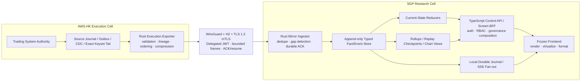

# Execution Durable Streaming, Frozen-Frontend Integration, Trade Replay & Financial Chart Plan — v1.1

| Thuộc tính | Giá trị |
|---|---|
| Ngày baseline | 2026-09-04 |
| Repository | `BobbyAxerol/awesome-portal` |
| Nhánh được audit và lập kế hoạch | `feat/execution-data-activation` |
| PR target | **Owner confirmation required:** `portal-dev` hay `dev` |
| Phạm vi | Execution Portal từ governance → Paper → Sandbox → Canary → Live → Operations |
| Frontend | **Tạm đóng version**; giữ nguyên screen hierarchy, layout, information architecture và product semantics |
| Trạng thái tài liệu | `ARCHITECTURE_BASELINED / CODE_GAPS_CONFIRMED / EXECUTION_EDGE_RETURN_PACK_REQUIRED / RUNTIME_CAPACITY_PENDING_PHASE_1` |
| Upstream prerequisite | `PORTAL_EXECUTION_EDGE_MAXIMUM_DATA_DISCOVERY_PUBLICATION_AND_RETURN_REQUEST_v1.md` |
| Kết quả mong muốn | Mỗi phase phải đưa dữ liệu thật vào đúng frontend screen trong cùng phase; không còn khái niệm “backend complete nhưng frontend chưa dùng được” |

> **Quy tắc trung tâm của v1.1:** một phase không được đánh dấu hoàn thành nếu mới có route, repository, schema, fixture hoặc test backend. Phase chỉ hoàn thành khi payload thật đã được frontend hiện tại consume, hiển thị đúng trên deployed image và có browser evidence.

---

## 1. Executive decision

### 1.1 Phán quyết kiến trúc

Không cần đập bỏ toàn bộ kiến trúc dual-cell hiện tại. Trading System ở AWS-HK vẫn là execution authority; SGP Research Server vẫn nên giữ Portal-owned durable read mirror, derived read models, governance state và screen BFF. Tuy nhiên, đường dữ liệu hiện tại phải được nâng từ bounded JSONB snapshot/polling sang mô hình:

```text
append-all durable facts/events
→ exact current-state reducers
→ complete history/replay query
→ screen-shaped BFF
→ frozen frontend
```

Rust phải thực sự trở thành data plane cho các đường latency- và throughput-sensitive: source tailing, validation, sequence/gap handling, compression, cross-cell transport, durable ingest, exact history, replay, downsampling và local realtime fan-out. TypeScript tiếp tục sở hữu auth, RBAC, workspace, governance, workflow, action availability và screen composition.

### 1.2 Phán quyết về frontend freeze

Frontend freeze không có nghĩa giữ nguyên smoke fixtures, handwritten contracts, ECharts wrapper hoặc cách format timestamp hiện tại. Freeze được hiểu là:

- Không thay screen layout, hierarchy, navigation intent, visual information density hoặc product semantics đã duyệt.
- Được phép thay internal data adapter, generated type, chart renderer, virtualized renderer, timestamp formatter và runtime state handling.
- Được phép sửa route/link mismatch để tất cả nút đi đúng resource screen.
- Được phép thay fixture bằng real data mà không làm thay đổi approved UI.
- Được phép thêm telemetry/debug evidence ở non-production hoặc dùng các status location đã tồn tại; không tự phát minh màn hình mới nếu chưa được owner duyệt.

### 1.3 Phán quyết về “stream hết”

“Stream hết” trong tài liệu này nghĩa là:

1. Mọi accepted authoritative fact/event đều được durable append, không bị mất vì cap 2.000.
2. Toàn bộ lịch sử có thể query/replay bằng cursor và range.
3. Live tail có ordering, gap detection, resume và durable acknowledgement.
4. Frontend chỉ nhận bounded frames hoặc viewport-sized chart data; không nhận một unbounded array.
5. Chart dùng server-side downsampling bảo toàn extrema, gap và marker; raw history vẫn giữ đầy đủ.
6. Trade Replay có thể seek, paginate và virtualize toàn timeline; không bị cắt còn 200 entries.

Do đó phải loại bỏ **total-history cap**, nhưng vẫn giữ **bounded transport frame** để kiểm soát memory, backpressure và recovery.

### 1.4 Phán quyết chart

Không xác định được chính xác thư viện proprietary/internal mà SetupAlpha đang dùng từ public static page. Mục tiêu đúng là mimic observable visual and interaction behavior, không copy source implementation.

Khuyến nghị v1.1:

- Dùng `uPlot` làm renderer mặc định cho dense equity, performance, drawdown và risk time series.
- Tạo `PrimusFinancialChart` wrapper và plugin riêng để đạt visual giống mẫu: logarithmic scale, hatched delta band, live boundary, endpoint halo/value pills, sparse grid, UTC tooltip và high-DPI canvas.
- Dùng TradingView Lightweight Charts cho candlestick/order-fill context của Trade Replay **chỉ khi owner chấp nhận attribution bắt buộc**.
- Không bắt buộc xoá ECharts toàn repo trong một lần. ECharts có thể được giữ sau renderer-neutral abstraction cho heatmap, graph/network, parallel coordinates hoặc visualization mà uPlot không phù hợp. Tuy nhiên, các financial time-series screens trong execution loop phải migrate khỏi current generic ECharts implementation.


### 1.5 Phán quyết “khai thác tối đa database/source”

Kế hoạch này không được giới hạn dữ liệu Portal theo current projection catalogue, theo chín missing-capability request hiện tại hoặc theo một cap rows tùy ý.

Quy tắc mới:

```text
Nếu dữ liệu authoritative hữu ích cho frozen frontend đã tồn tại
→ phải discovery
→ phân loại semantics
→ expose trực tiếp hoặc derive có provenance
→ mirror đầy đủ theo history/event semantics
→ nối vào BFF và frontend trong cùng vertical phase.
```

“Không có boundary dữ liệu tùy ý” được hiểu là:

- không bỏ relation/column/history chỉ vì current Edge chưa whitelist;
- không coi page đầu là full population;
- không giới hạn total retained history ở 2.000/5.000/20.000 rows;
- không chỉ inspect các table đã được Portal biết tên;
- không mở source-owner gap trước khi kiểm tra database/view/journal/outbox/audit và existing service APIs;
- không để Portal tự suy luận join/formula mà Execution Cell có thể trả authority/provenance chính xác hơn.

Điều này **không** loại bỏ security, profile, authority hoặc transport controls. Mỗi frame/request vẫn bounded, cursor-resumable và scoped; browser vẫn không được truy cập database/Edge trực tiếp; secrets và raw business rows không được đưa vào Git.

Bên AWS-HK phải trả một source/coverage/contract pack machine-readable theo tài liệu riêng:

```text
PORTAL_EXECUTION_EDGE_MAXIMUM_DATA_DISCOVERY_PUBLICATION_AND_RETURN_REQUEST_v1.md
```

Plan v1.1 không cho Phase 3 trở đi được đóng nếu return pack đó chưa được accept hoặc chưa có typed owner-approved gap cho từng required field.

---

## 2. Authority order và confidence labels

### 2.1 Authority order

Khi các nguồn mâu thuẫn, dùng thứ tự sau:

1. Runtime evidence từ đúng deployed image/commit/profile/window.
2. Machine-readable contract/schema/catalogue.
3. Source code và executable tests.
4. Architecture guides.
5. Unified implementation plan.
6. Historical handoff/Markdown/status notes.
7. Assumption hoặc agent inference.

### 2.2 Confidence labels

| Label | Ý nghĩa |
|---|---|
| `CODE_CONFIRMED` | Được xác nhận trực tiếp từ code nhánh hiện tại |
| `CONTRACT_CONFIRMED` | Được xác nhận từ schema/catalogue/contract hiện tại |
| `RUNTIME_DOC_CONFIRMED` | Có runtime evidence đã được commit trong repo, nhưng cần recheck trên runtime hiện tại |
| `EXTERNAL_VISUAL_OBSERVED` | Quan sát được từ screenshot/public page; không kết luận implementation nội bộ |
| `RUNTIME_PENDING` | Chỉ có thể khóa sau khi inspect AWS-HK/SGP runtime |
| `OWNER_DECISION_PENDING` | Cần quyết định sản phẩm/operations của owner |

---

## 3. Những vấn đề hiện tại đã được xác nhận

### 3.1 Root-cause matrix

| ID | Vấn đề | Evidence trên nhánh hiện tại | Hậu quả | Confidence | Phase xử lý |
|---|---|---|---|---|---|
| RC-01 | Hot projection cap 2.000 rows/relation | `apps/control-api/src/execution/profile-projection.catalog.ts` có `WARM_WINDOW_MAX_ROWS = 2_000` | Relation không thuộc history ladder bị giới hạn population | `CODE_CONFIRMED` | 3–5 |
| RC-02 | Full-depth history chỉ áp dụng cho ba relation | Chỉ `performance_snapshots`, `account_equity_snapshots`, `portfolio_equity_snapshots` được đánh dấu ladder | Orders, fills, sessions, risk, reconciliation chưa append-all | `CODE_CONFIRMED` | 3–8 |
| RC-03 | Non-ladder ingestion tối đa 10×200 rows/cycle/profile | `profile-projection.worker.ts` | Snapshot không đại diện full history; dễ `PARTIAL` hoặc mất older rows khỏi mirror | `CODE_CONFIRMED` | 4–5 |
| RC-04 | Workbench fetch bounded global pages rồi filter in memory | `paper-read.service.ts`: deployments 100; positions/orders/fills 200; history 100–200 | Detail screen phụ thuộc resource có nằm trong page đầu; có `N22_DEPLOYMENT_OUTSIDE_BOUNDED_SOURCE_PAGE` | `CODE_CONFIRMED` | 9 |
| RC-05 | Deployment matching có heuristic rộng | Match bằng `portfolio_id` hoặc ít nhất hai dimension | Cross-deployment attribution, sai PnL/exposure/risk | `CODE_CONFIRMED` | 9 |
| RC-06 | Analytics cắt facts | Flatten 20.000; positions 500; source facts 1.000/relation; equity union 5.000 | Count/completeness/replay có thể sai nhưng trông như exact | `CODE_CONFIRMED` | 7–9 |
| RC-07 | Trade Replay chỉ giữ 200 order/fill entries cuối | `local-query-analytics.service.ts` dùng `.slice(-200)` | Không thể traceback full lifecycle | `CODE_CONFIRMED` | 8 |
| RC-08 | Current replay chỉ ghép order + fill, thiếu immutable lifecycle events | Không có canonical signal→risk→command→broker→fill→recon timeline trong current read model | Không thể deterministic replay hoặc causal trace | `CODE_CONFIRMED`; source availability `RUNTIME_PENDING` | 3, 8 |
| RC-09 | Realtime SGP dùng TypeScript timer polling | `profile-realtime.service.ts`: 250 ms polling; replay limit 1.000 | Extra DB load, latency, weak durability semantics, không phải true journal tail | `CODE_CONFIRMED` | 5, 11 |
| RC-10 | Screen catalogue readiness bị trộn với data readiness | `screen-bff.service.ts` có thể trả `ready` nhưng `payload: null` | Frontend/agent hiểu sai production readiness | `CODE_CONFIRMED` | 2, 9 |
| RC-11 | Frontend contracts được chép tay từ documents | `apps/portal/frontend/src/execution/contracts.ts` | Có nhiều authority; dễ drift schema/type/nullability/state | `CODE_CONFIRMED` | 2 |
| RC-12 | Route mismatch đang được sửa tại frontend edge | `apps/portal/frontend/src/execution/links.ts::canonicalHref()` | Backend/action contract không sở hữu canonical navigation semantics | `CODE_CONFIRMED` | 2, 10 |
| RC-13 | Equity chart hiện là generic ECharts implementation | Current wrapper, theme và `EquityChart.tsx` | Category time axis, slider/toolbox generic, redraw strategy chưa tối ưu, visual không giống financial product target | `CODE_CONFIRMED` | 6, 11 |
| RC-14 | ECharts wrapper rebuild option theo `notMerge: true`, animation off và có nhiều resize fallbacks | `apps/portal/frontend/src/charts/EChart.tsx`, `theme.ts` | Update path nặng, visual/interactions thiếu tinh gọn | `CODE_CONFIRMED` | 6, 11 |
| RC-15 | Timestamp contract/display còn ISO/native/string-centric | `contracts.ts`, `theme.ts`, `EquityChart.tsx`, `clock.ts` | Timezone ambiguity, inconsistent formatting, category-axis bugs, hardcoded runtime dates | `CODE_CONFIRMED` | 2 |
| RC-16 | Equity/Trade Replay còn fixture/smoke implementation | `equity.fixtures.ts`, `TradeReplay.tsx`, nhiều `*.smoke.ts` | Showcase đẹp nhưng chưa chứng minh real data | `CODE_CONFIRMED` | 6, 8, 10 |
| RC-17 | Whole profile JSONB snapshot bị digest/rewrite khi relation đổi | `profile-projection.repository.ts` | Write amplification, TOAST/bloat, khó scale full event history | `CODE_CONFIRMED` | 4 |
| RC-18 | Silent fallback/catch làm mất visibility về source/history failure | Paper/history/analytics fallbacks | Chart có thể ngắn/partial nhưng frontend không biết nguyên nhân | `CODE_CONFIRMED` | 2, 9 |
| RC-19 | Backend phase/route/schema được coi là completion trước browser integration | Status/handoff workflow hiện tại | Khoảng gap Claude↔Codex lặp lại qua phase | `CODE_CONFIRMED` từ quy trình và artifacts | Tất cả |
| RC-20 | Full source continuity của orders/risk hiện chưa được xác nhận trên AWS-HK | Cần runtime census | Có thể phải commission source journal/outbox/CDC trước khi Portal replay được quá khứ | `RUNTIME_PENDING` | 1, 3 |

### 3.2 Root cause chính

Sai đơn vị bàn giao là root cause bao trùm:

```text
Claude hoàn thành screen/UI state
Codex hoàn thành backend phase/route/repository
                 ↓
Không có field-level source/derivation/action contract chung
                 ↓
Cả hai phía có thể “green” nhưng product vẫn thiếu data hoặc link sai
```

Đơn vị bàn giao mới phải là **Screen Data Product Vertical Slice**:

```text
mỗi visible field/widget/button
→ authoritative source
→ exact identity/join
→ derivation/formula
→ completeness/freshness policy
→ BFF JSON path
→ generated frontend type
→ real payload
→ deployed browser proof
```

---

## 4. Non-negotiable product and architecture rules

1. Mỗi phase phải có một frontend-visible real-data slice; backend-only phase không được close.
2. Frozen frontend là product contract. Codex không được bỏ field vì source chưa có; phải bổ sung source hoặc trả typed unavailability.
3. Trading System giữ authority cho orders, fills, positions, accounting, risk, reconciliation và broker truth.
4. SGP mirror là Portal read model, không trở thành trading ledger thứ hai.
5. Không mở raw SQL/Redis/arbitrary source payload từ browser hoặc generic SGP backend sang execution database.
6. Không có total-history cap 2.000 cho equity, performance, risk, order, fill, command và replayable events.
7. Bounded page/frame vẫn bắt buộc; “all history” được đạt bằng cursor/resume, không bằng unbounded response.
8. Không filter bounded global collections để dựng resource detail screen.
9. Không dùng heuristic identity join cho financial/risk truth.
10. Không coi missing source là zero; không coi partial population là exact.
11. Không có `READY + null payload`.
12. Không hardcode runtime timestamps trong production components/services.
13. Không hiển thị native JavaScript date string hoặc raw ISO/epoch cho end user.
14. Canonical wire time là UTC epoch milliseconds (`UtcEpochMs`).
15. Money/price/qty/fee/PnL giữ exact decimal semantics; JSON business values dùng decimal string.
16. Frontend không tính business truth, gate verdict, PnL, exposure hoặc cross-relation count.
17. Backend không phát arbitrary `href`; backend phát semantic action + resource, frontend registry resolve canonical route.
18. Browser count không được làm tăng số source reads ở AWS-HK.
19. Live tail ưu tiên hơn historical backfill; backfill không được làm starving live data.
20. Durable ACK chỉ được gửi sau khi SGP commit thành công.
21. Mọi stream phải có epoch, sequence, dedupe, gap, correction/tombstone và resnapshot semantics.
22. Production runtime không import smoke fixture.
23. Mỗi deployed artifact phải công bố commit, image digest, contract digest, schema/migration revision và source compatibility revision.

24. Current `profile-projection.catalog.ts` chỉ là active allowlist hiện tại, không phải giới hạn discovery.
25. Mọi relation/column/source hữu ích phải được trả trong Execution Edge source census, kể cả chưa được publish.
26. Source publication phải phân biệt `AVAILABLE_DIRECT`, `DERIVED_AT_EDGE`, `DERIVED_AT_PORTAL`, `EXISTS_NOT_PUBLISHED`, `CURRENT_STATE_ONLY` và `SOURCE_DOES_NOT_EXIST`.
27. Không được mở Trading System owner request cho candles/ticks/calendar/benchmark/twin join trước khi chứng minh Edge/Data Layer không thể adapt source hiện hữu.
28. Mutable order/session/command rows không được append history bằng entity ID + conflict-ignore; lifecycle cần `event_id` hoặc entity version.
29. Source/Edge completion không đồng nghĩa product completion; frontend consumption và deployed-browser evidence vẫn là gate bắt buộc.
30. Bên Edge phải trả complete screen-field-source coverage và action-capability coverage; `TBD` không owner bị cấm.
31. Raw authoritative facts và source-local derived metrics phải đi kèm lineage, formula revision, input population và digest; không trả opaque KPI không thể reproduce.

---

## 5. Preflight input pack cần owner gửi/xác nhận

V1 này đủ để bắt đầu thiết kế và code foundations. Các giá trị capacity/runtime sau không nên đoán. Chúng phải được gửi trước khi đóng Phase 1 và trước khi khóa partition/batch/retention/SLO tuyệt đối.

### 5.1 P0 — AWS-HK Execution Server: read-only runtime evidence

Gửi một package sanitized, không chứa token, secret, raw credential hoặc private key:

```text
preflight/aws-hk/
├── DEPLOYED_RUNTIME_MANIFEST.json
├── SOURCE_RELATION_CENSUS.csv
├── SOURCE_SCHEMA_AND_INDEXES.md
├── SOURCE_CONTINUITY_REPORT.md
├── ORDER_LIFECYCLE_SOURCE_REPORT.md
├── RISK_SOURCE_REPORT.md
├── SOURCE_RATE_WINDOWS.csv
└── PROFILE_MODE_VENUE_COVERAGE.csv
```

`DEPLOYED_RUNTIME_MANIFEST.json` tối thiểu cần:

```json
{
  "captured_at_ms": 0,
  "trading_system_commit": "...",
  "source_proxy_commit": "...",
  "execution_edge_commit": "...",
  "image_digests": {},
  "catalogue_revision": "...",
  "serving_policy_revision": "...",
  "enabled_profiles": [],
  "enabled_relations": [],
  "runtime_flags_sanitized": {}
}
```

Mỗi source relation cần:

- Relation/view/table name và source service.
- Schema revision, typed columns, primary/unique key.
- Indexes.
- Row count và estimated bytes.
- Min/max event time, created time, updated time.
- Rows/bytes trong 1h, 24h, 7d, 30d.
- Peak observed rows/s và bytes/s.
- Null rate của deployment/account/portfolio/strategy/order/fill/session identities.
- Duplicate key count.
- Late-arrival và update-in-place behavior.
- Delete/tombstone behavior.
- Retention floor.
- Mode/profile/venue coverage.
- Parent/orphan integrity.

### 5.2 P0 — Order/fill/command lifecycle evidence

Cần trả lời dứt điểm:

- `orders` là current row hay immutable state-transition history?
- State cũ của `SUBMITTED → ACKNOWLEDGED → PARTIALLY_FILLED → FILLED/CANCELED/REJECTED` nằm ở đâu?
- Có order event journal, transactional outbox, CDC, audit table hoặc Redis/NATS/Kafka stream nào không?
- Có source sequence monotonic hay chỉ timestamp?
- Có submit/dispatch/broker-ack/reject/cancel/replace/terminal timestamps không?
- Có `trace_id`, `correlation_id`, `causation_id` hoặc mapping tương đương không?
- Có mapping signal intent → sizing → risk → command → client order → venue order → fill → accounting → reconciliation không?
- Cancel/replace và late broker update được ghi nhận thế nào?
- Có thể backfill history cũ đến đâu?

Nếu source chỉ giữ current row, full lifecycle trước ngày activation không thể được phục dựng trung thực. Phải ghi rõ retention boundary và bắt đầu capture immutable events từ thời điểm commission.

### 5.3 P0 — Risk source evidence

Cần xác nhận authority cho:

- Per-order risk request/decision.
- Rule/limit ID và config revision.
- Requested versus approved size.
- Rejection/violation reason.
- Pre-/post-trade exposure.
- Margin/balance snapshots.
- Breach lifecycle.
- Kill-switch/halt transition.
- Risk grants.
- Account/deployment/portfolio risk snapshots.
- Risk limit change events.

Aggregate counters không đủ để reconstruct risk decision history.

### 5.4 P0 — SGP Research Server storage evidence

Gửi:

```text
preflight/sgp/
├── POSTGRES_RUNTIME_MANIFEST.json
├── TABLE_AND_INDEX_SIZES.csv
├── PROJECTION_HISTORY_CENSUS.csv
├── WAL_AND_IO_STATS.json
├── AUTOVACUUM_BLOAT_REPORT.md
├── QUERY_PLANS/
├── INGEST_LAG_WINDOWS.csv
└── RESTART_BACKFILL_REPORT.md
```

Tối thiểu gồm:

- PostgreSQL version.
- CPU, RAM, disk type/capacity/free space.
- DB and table/index sizes.
- `execution_timeseries_history`, projection JSONB và journal row counts/sizes.
- WAL generation rate.
- Insert/update conflicts và lock waits.
- Autovacuum/bloat.
- Query plans cho equity range, deployment orders/fills, replay trace, blotter filters.
- Current source lag, ingest lag, projection lag.
- Restart/resume duration.
- Backfill throughput.

### 5.5 P0 — Cross-cell network evidence

Gửi từ ít nhất ba windows: normal, busy và recovery/backfill.

- RTT p50/p95/p99.
- Packet loss.
- Sustained throughput.
- Connection/reconnect count.
- TLS/H2 reuse.
- Compression ratio nếu đã có.
- Time-to-catch-up sau partition 1, 5 và 30 phút.
- Maximum safe concurrent streams.

### 5.6 P0 — Product/owner confirmations

| Quyết định cần xác nhận | Lựa chọn/đề xuất mặc định |
|---|---|
| PR base | Repo policy hiện ghi `dev`; owner nói `portal-dev`. Chọn một và cập nhật policy |
| Showcase authority | Đề xuất: visual/interaction golden reference, không phải data-contract authority |
| Frontend freeze exception | Cho phép thay chart renderer, generated contracts, time formatter, fixtures và route wiring |
| Financial chart engine | `uPlot` cho equity/risk/performance |
| Candlestick replay engine | Lightweight Charts nếu chấp nhận attribution; nếu không, custom/uPlot candlestick path |
| Default display timezone | UTC trên Execution Portal; user timezone chỉ là optional display preference |
| Mode rollout | Paper → Sandbox → Canary → Live |
| Historical retention | Owner cần chọn hot retention, cold retention, legal/audit requirements |
| Benchmark authority | Xác nhận SPY benchmark source, total-return/price-return semantics, corporate actions và currency |
| Old history restoration | Xác nhận kỳ vọng backfill trước ngày event capture activation |
| Command scope trong v1 | Đề xuất reads/replay trước; risk-increasing commands activate sau qualification |

### 5.7 Read-only command hygiene

- Không gửi output chứa environment secrets.
- Không dùng `docker inspect` full environment trong package.
- Không dump raw account credentials/broker tokens.
- Hash hoặc redact external account identifiers nếu cần.
- Mọi census query chạy read-only và có statement timeout.
- Không restart producer, rotate keys hoặc alter schema trong Phase 1 census.


### 5.8 P0 — Portal Execution Edge maximum-data return pack

Ngoài preflight runtime evidence, owner cần chuyển tài liệu request riêng cho agent/operator AWS-HK:

```text
PORTAL_EXECUTION_EDGE_MAXIMUM_DATA_DISCOVERY_PUBLICATION_AND_RETURN_REQUEST_v1.md
```

Return pack tối thiểu phải gồm:

```text
portal-execution-edge-maximum-data-return-v1/
├── MASTER_RESPONSE.md
├── owner-response.v2.json
├── DEPLOYED_RUNTIME_MANIFEST.json
├── SOURCE_SYSTEM_INVENTORY.json
├── DATABASE_RELATION_CENSUS.csv
├── COLUMN_SEMANTICS_CATALOG.csv
├── SOURCE_LINEAGE_GRAPH.json
├── PROFILE_MODE_VENUE_COVERAGE.json
├── SCREEN_FIELD_SOURCE_COVERAGE.csv
├── ACTION_CAPABILITY_COVERAGE.csv
├── DERIVED_METRIC_FEASIBILITY.csv
├── EVENT_CONTINUITY_REPORT.md
├── ORDER_FILL_REPLAY_CAPABILITY.json
├── RISK_DATA_CAPABILITY.json
├── ACCOUNTING_EQUITY_CAPABILITY.json
├── ACCOUNT_BINDING_CAPABILITY.json
├── MARKET_CONTEXT_CAPABILITY.json
├── SOURCE_PUBLICATION_PLAN.json
├── SOURCE_OWNER_GAPS.json
├── PORTAL_DOWNSTREAM_WORK_ORDERS.json
├── schemas/
├── fixtures/
├── benchmarks/
└── MANIFEST.sha256
```

Acceptance:

- tất cả relevant source relations/columns đã được inventory;
- tất cả frozen frontend fields/actions đã map;
- existing-source adapter work tách khỏi genuine producer gap;
- full-history/event semantics được xác nhận;
- time dùng UTC epoch milliseconds;
- financial values dùng exact decimal strings;
- không có raw secret/business rows trong Git;
- source/Edge agent không được dừng ở current catalogue hoặc MC-01…09.
- return pack phải sinh được `PORTAL_DOWNSTREAM_WORK_ORDERS.json` để mỗi capability chuyển thẳng thành SGP storage/query/BFF/frontend tasks.

Nếu return pack chưa đủ, Phase 1 chỉ có thể đóng ở `DISCOVERY_PARTIAL`; Phase 3 không được claim `SOURCE_CONTINUITY_COMPLETE`.

---

## 6. Target architecture



### 6.1 Steady-state data path

```text
AWS-HK authoritative event/fact
→ Rust exporter validates canonical source contract
→ ordered, checksummed, compressed frame
→ SGP Rust ingestor validates epoch/sequence/filter digest
→ one transaction: append + checkpoint + optional reducer work
→ durable ACK
→ current state/read-model revision
→ TypeScript screen BFF
→ frontend screen
```

### 6.2 Bootstrap and “local history + remote latest” merge

Yêu cầu giữ local append history ở SGP và ghép latest từ AWS-HK được triển khai bằng **snapshot + continuous tail**, không bằng merge ad-hoc trên mỗi browser request.

1. Exporter tạo source snapshot tại high watermark `W`.
2. SGP backfill tất cả accepted records `<= W`.
3. SGP bắt đầu tail từ `W + 1`.
4. Mọi delta chỉ được ACK sau durable commit.
5. Current-state reducer áp event theo exact sequence.
6. Screen BFF đọc một committed composite revision.

Nếu SGP vượt freshness budget:

```text
sync coordinator background task
→ fetch exact latest delta after local watermark
→ validate/append/reduce/commit
→ publish new local revision
```

Browser request không được trực tiếp gọi AWS-HK để ghép một mutable latest row với local history. Critical command planning/verification có thể dùng authority probe riêng, nhưng read screen vẫn trả explicit local revision và freshness.

### 6.3 Composite read revision

Mỗi screen payload nên có:

```json
{
  "read_revision": {
    "source_epoch": "...",
    "history_watermark": "...",
    "current_state_revision": "...",
    "derived_revision": "...",
    "contract_revision": "...",
    "read_at_ms": 0
  }
}
```

Điều này ngăn một screen ghép panel từ các population/revision không tương thích mà không khai báo.

---

## 7. Canonical time contract: UTC epoch milliseconds

### 7.1 Quy ước chính thức

Yêu cầu “`datetime64ms` với UTC” được chuẩn hoá cross-language như sau:

> **Canonical semantic type:** `UtcEpochMs` = signed 64-bit Unix epoch milliseconds normalized to UTC.

`numpy.datetime64[ms]` là adapter phù hợp ở Python sau khi input đã được normalize UTC, nhưng nó không mang timezone metadata. Vì vậy không dùng tên NumPy type làm wire contract.

### 7.2 Field naming

Không dùng generic `timestamp` hoặc ambiguous `time` khi có nhiều clock:

```text
event_time_ms
source_published_at_ms
received_at_ms
ingested_at_ms
processed_at_ms
as_of_ms
read_at_ms
live_start_ms
created_at_ms
updated_at_ms
```

Event ordering không dựa riêng vào millisecond timestamp. Canonical order key:

```text
(source_epoch, source_sequence, event_time_ms, event_id)
```

### 7.3 Cross-language representation

| Layer | Representation |
|---|---|
| Wire JSON | Integer `UtcEpochMs` với field suffix `_ms` |
| Internal binary stream | `int64` epoch ms |
| PostgreSQL canonical event key | `BIGINT event_time_ms`; optional UTC view/generated/query expression |
| PostgreSQL existing domain tables | `TIMESTAMPTZ(3)` được chấp nhận, nhưng API vẫn emit epoch ms |
| Rust | `struct UtcEpochMs(i64);` với validated serde |
| TypeScript | Branded safe integer `type UtcEpochMs = number & {...}` |
| Python/pandas | UTC-aware `Timestamp`, convert sang `datetime64[ms]` ở compute boundary |
| Human audit/export | RFC3339 UTC milliseconds, ví dụ `2026-09-04T03:15:22.123Z` |

Epoch milliseconds hiện nằm an toàn trong JavaScript safe integer. `source_sequence`, order IDs hoặc venue IDs có thể vượt `Number.MAX_SAFE_INTEGER`, nên giữ decimal string/BigInt-safe representation riêng; không nhập nhằng với timestamp.

### 7.4 TypeScript contract

```ts
export type UtcEpochMs = number & { readonly __brand: "UtcEpochMs" };

export function asUtcEpochMs(value: number): UtcEpochMs {
  if (!Number.isSafeInteger(value) || value < 0) {
    throw new Error("Invalid UTC epoch milliseconds");
  }
  return value as UtcEpochMs;
}
```

### 7.5 Rust contract

```rust
#[derive(Clone, Copy, Debug, Eq, PartialEq, Ord, PartialOrd, serde::Serialize, serde::Deserialize)]
#[serde(transparent)]
pub struct UtcEpochMs(pub i64);
```

Validation layer phải reject out-of-policy future/past values, nhưng không đặt arbitrary bound làm mất historical data.

### 7.6 Display policy

- Default display timezone: `UTC`.
- Axis dùng adaptive UTC labels theo viewport; không dùng `String.slice()` trên ISO.
- Tooltip chính xác đến millisecond khi source có millisecond precision.
- Không hiển thị `Date.toString()`, browser locale implicit hoặc raw epoch.
- Header/table có thể dùng format ngắn, nhưng tooltip/audit drawer phải có exact UTC.
- User timezone nếu bổ sung sau chỉ là display transform; data contract/storage không đổi.
- DST không ảnh hưởng ordering hoặc bucket boundary vì backend buckets theo UTC unless a venue calendar explicitly requires local-session semantics.

### 7.7 Hardcoded timestamp policy

- Production modules: cấm hardcoded current/runtime dates.
- Test fixtures: được phép dùng fixed UTC epoch ms để deterministic, nhưng chỉ nằm trong `*.test.*`, `*.fixture.*` hoặc explicitly evidence-only directories.
- Product build CI fail nếu runtime bundle import smoke fixture.
- ESLint/AST rule kiểm tra `Date.UTC(2026, ...)`, `new Date("...")` hoặc equivalent trong production execution modules, trừ allowlist rõ ràng.

### 7.8 Migration compatibility

Trong một compatibility window ngắn:

```text
backend reads old ISO + new epoch-ms
backend emits new epoch-ms only on v2 contracts
frontend adapter supports both behind telemetry
all screens migrate
old ISO path removed after zero-use observation window
```

Không duy trì dual representation vô thời hạn.

---

## 8. Canonical event, fact and panel contracts

### 8.1 Canonical execution event envelope

```json
{
  "schema_version": "execution.event.v1",
  "source": {
    "service": "trading-system",
    "relation": "order_events",
    "profile_id": "paper-hk-01",
    "source_epoch": "epoch-...",
    "source_sequence": "18446744073709551615",
    "source_revision": "..."
  },
  "identity": {
    "event_id": "...",
    "trace_id": "...",
    "correlation_id": "...",
    "causation_id": "...",
    "deployment_id": "...",
    "strategy_id": "...",
    "portfolio_id": "...",
    "account_id": "...",
    "execution_session_id": "...",
    "command_id": "...",
    "order_id": "...",
    "client_order_id": "...",
    "venue_order_id": "...",
    "fill_id": "...",
    "instrument_id": "..."
  },
  "classification": {
    "mode": "PAPER",
    "promotion_stage": "PAPER",
    "venue": "OKX",
    "event_type": "BROKER_ACKNOWLEDGED"
  },
  "clock": {
    "event_time_ms": 0,
    "source_published_at_ms": 0,
    "received_at_ms": 0
  },
  "mutation": {
    "kind": "UPSERT",
    "state_before": null,
    "state_after": {},
    "reason_code": null
  },
  "integrity": {
    "payload_digest": "sha256:...",
    "contract_digest": "sha256:..."
  },
  "payload": {}
}
```

### 8.2 Required stream semantics

- `source_epoch` đổi khi producer/catalogue/rebuild làm sequence namespace thay đổi.
- `source_sequence` monotonic trong defined stream scope.
- Cursor bind vào profile, filters, contract revision và source epoch.
- Duplicate event là idempotent.
- Corrections là event mới; không âm thầm rewrite history.
- Delete phải có tombstone.
- Gap phải visible và làm completeness downgrade.
- Resnapshot phải explicit; không silently restart từ đầu.
- Late events giữ original event time và có ingest time riêng.

### 8.3 Panel delivery envelope

```json
{
  "panel_id": "equity_chart",
  "state": "READY",
  "required": true,
  "authority": "DERIVED",
  "as_of_ms": 0,
  "read_at_ms": 0,
  "freshness": "FRESH",
  "completeness": "COMPLETE",
  "coverage": {
    "from_ms": 0,
    "to_ms": 0,
    "source_total": 571424,
    "filtered_total": 12043,
    "returned_count": 1600,
    "truncated": false,
    "downsampled": true,
    "has_more": false,
    "next_cursor": null,
    "gaps": []
  },
  "derivation": {
    "formula_id": "deployment_equity",
    "formula_version": "2.0.0",
    "input_relations": ["account_equity_snapshots"],
    "input_revision": "...",
    "input_digest": "sha256:...",
    "currency_policy": "SINGLE_CURRENCY"
  },
  "warnings": [],
  "data": {}
}
```

### 8.4 State semantics

| State | Ý nghĩa |
|---|---|
| `LOADING` | Client đang fetch; không phải backend payload state lâu dài |
| `READY` | Required payload có dữ liệu và đáp ứng minimum completeness policy |
| `EMPTY` | Source complete cho requested scope nhưng không có row |
| `PARTIAL` | Population/window/gap không đầy đủ |
| `STALE` | Có data nhưng vượt freshness budget |
| `UNAVAILABLE` | Source/capability chưa tồn tại hoặc chưa active |
| `DENIED` | Actor không có quyền |
| `ERROR` | Retryable/non-retryable processing failure có typed reason |

Không dùng `READY` khi `data/payload` là `null`.

### 8.5 Raw history API

```http
GET /api/v1/execution/history/{relation}
  ?subject_kind=DEPLOYMENT
  &subject_id=...
  &from_ms=...
  &to_ms=...
  &limit=1000
  &cursor=...
```

Response phải có:

```text
source_total hoặc exactness flag
returned_count
has_more
next_cursor
oldest_available_ms
newest_available_ms
source_epoch
from_sequence
to_sequence
gaps
late_event_count
completeness
```

### 8.6 Chart view API

```http
GET /api/v1/execution/views/equity-chart
  ?subject_kind=DEPLOYMENT
  &subject_id=...
  &from_ms=...
  &to_ms=...
  &viewport_px=1440
  &include_benchmark=true
```

Financial values vẫn là decimal strings:

```json
{
  "time_basis": "UTC_EPOCH_MS",
  "comparison_mode": "ABSOLUTE_EQUITY",
  "scale_mode": "LOG",
  "currency": "USD",
  "live_start_ms": 0,
  "series": [
    {
      "id": "strategy",
      "label": "Strategy",
      "points": [[0, "100000.00"], [0, "100120.25"]]
    },
    {
      "id": "benchmark",
      "label": "SPY buy & hold",
      "points": [[0, "100000.00"], [0, "99910.15"]]
    }
  ],
  "sampling": {
    "algorithm": "MIN_MAX_LAST_V1",
    "source_rows": 571424,
    "returned_rows": 1600,
    "preserves_extrema": true,
    "preserves_gaps": true,
    "preserves_markers": true
  }
}
```

Frontend được convert decimal string sang floating coordinate **chỉ để render**. Exact tooltip/labels dùng original decimal string hoặc backend-formatted exact values; không dùng chart float để tính PnL/return.

### 8.7 Replay API

```http
GET /api/v1/execution/replay/traces/{trace_id}/events?limit=1000&cursor=...
GET /api/v1/execution/replay/orders/{order_id}/events?limit=1000&cursor=...
GET /api/v1/execution/replay/deployments/{deployment_id}/events?from_ms=...&to_ms=...
```

Response thêm:

```text
checkpoint_id
checkpoint_sequence
replay_state_digest
causal_edges
market_context_revision
```

---

## 9. Research Server storage architecture

### 9.1 Storage layers

#### A. Canonical append-only event log

Một canonical envelope table hoặc relation-partitioned log giữ ordering/integrity metadata. Hot query fields phải là typed columns; `payload JSONB` chỉ chứa extension/source-specific extras.

#### B. Domain typed fact/event tables

Tối thiểu:

```text
execution_order_events
execution_fill_facts
execution_command_events
execution_risk_decision_events
execution_risk_snapshot_facts
execution_equity_facts
execution_performance_facts
execution_position_events
execution_reconciliation_events
execution_account_sync_facts
execution_incident_events
```

#### C. Current-state projections

```text
execution_orders_current
execution_positions_current
execution_accounts_current
execution_deployments_current
execution_bindings_current
execution_risk_current
execution_incidents_current
```

#### D. Derived/analytical views

```text
deployment_equity_rollups
portfolio_equity_rollups
execution_quality_rollups
risk_exposure_rollups
drawdown_series
correlation_returns
trade_replay_checkpoints
screen_read_model_revisions
```

#### E. Ingest control tables

```text
execution_source_offsets
execution_ingest_batches
execution_stream_gaps
execution_source_epochs
execution_backfill_jobs
execution_contract_revisions
```

### 9.2 Conceptual typed columns

```sql
profile_id             text        not null,
mode                   text        not null,
venue                  text        null,
source_epoch           text        not null,
source_sequence        numeric(39,0) not null,
event_id               uuid/text   not null,
event_type             text        not null,
event_time_ms           bigint      not null,
ingested_at_ms          bigint      not null,
deployment_id          text        null,
strategy_id            text        null,
portfolio_id           text        null,
account_id             text        null,
execution_session_id   text        null,
order_id               text        null,
fill_id                 text        null,
trace_id                text        null,
contract_revision      text        not null,
payload_digest         text        not null,
payload                jsonb       null
```

Use domain-specific typed decimal columns for price, qty, fee, PnL, equity and exposure. Không parse JSONB trong hot query path nếu field đã được frozen frontend dùng thường xuyên.

### 9.3 Idempotency and uniqueness

Canonical unique key ưu tiên:

```text
(profile_id, source_epoch, source_sequence)
```

Nếu upstream sequence scope theo relation/stream:

```text
(profile_id, relation, stream_id, source_epoch, source_sequence)
```

Thêm unique `event_id` và payload digest checks. Duplicate cùng key/cùng digest là no-op; cùng key/khác digest là integrity incident, không overwrite silently.

### 9.4 Partitioning

Partition interval không được khóa trước runtime census. Baseline candidate:

- Time partition theo event month cho high-volume append tables.
- Optional subpartition/profile distribution khi evidence cho thấy một profile hotspot.
- Current-state tables không partition chỉ vì consistency; benchmark trước.

Indexes theo query patterns:

```text
(deployment_id, event_time_ms, source_sequence)
(order_id, event_time_ms, source_sequence)
(trace_id, source_sequence)
(account_id, event_time_ms)
(portfolio_id, event_time_ms)
(strategy_id, event_time_ms)
(profile_id, relation, source_epoch, source_sequence)
```

Không dùng offset pagination trên deep history.

### 9.5 JSONB policy

Current giant per-profile JSONB projection được giữ tạm như compatibility/cache artifact trong migration, không còn là canonical store cho full history.

JSONB chỉ dùng cho:

- Source extension fields chưa promoted thành typed column.
- Diagnostic raw payload có bounded retention.
- Small screen bootstrap/cache.
- Compatibility during dual-read phase.

### 9.6 Retention and cold storage

Default v1:

- PostgreSQL partitioned hot/current/history trước.
- Object/Parquet cold archive chỉ activate khi capacity census chứng minh cần.
- ClickHouse/Kafka/NATS không được thêm chỉ vì “fund-grade”; chỉ thêm nếu throughput, retention hoặc query concurrency có evidence.
- Retention tách theo data class: execution lifecycle/audit, equity/risk time series, diagnostics/raw payload.
- Replay metadata/digests phải còn đủ để chứng minh completeness sau archival.

### 9.7 Replay checkpoints

Mỗi N events hoặc time window, lưu reducer checkpoint:

```text
trace/order/deployment scope
checkpoint sequence
state digest
position/order/risk/accounting snapshot
contract/formula revisions
```

Seek algorithm:

```text
nearest checkpoint <= selected sequence
→ load checkpoint
→ replay delta to target
```

Không load toàn bộ timeline vào Rust `Vec` hoặc JavaScript array để seek.

---

## 10. Cross-cell Rust streaming architecture

### 10.1 Rust component boundaries

#### AWS-HK Rust Exporter

- Source adapters theo relation/revision.
- Snapshot + tail coordination.
- Validation và lineage completion.
- Sequence/epoch management nếu source đã có transactional event stream.
- Bounded frame construction.
- Compression.
- H2/mTLS streaming.
- Per-consumer flow control.
- Disk spool nếu downstream tạm unavailable.

#### SGP Rust Mirror Ingestor

- Frame validation/checksum.
- Cursor and filter binding.
- Dedupe/idempotency.
- Gap detection.
- Batch persistence.
- Offset/checkpoint transaction.
- Current-state reducer dispatch.
- Local durable journal publication.
- Backpressure metrics.

#### Rust Query/Analytics Plane

- Exact keyset history.
- Replay timeline and causal graph.
- Downsampling.
- Heavy aggregation/correlation/drawdown.
- Realtime local journal tail.

### 10.2 Transport framing

Mỗi frame hữu hạn theo ba thresholds:

```text
max_rows
max_uncompressed_bytes
max_flush_wait_ms
```

Giá trị cụ thể được benchmark trong Phase 5. Frame envelope tối thiểu:

```text
contract_revision
profile/filter digest
source_epoch
first_sequence
last_sequence
row_count
uncompressed_bytes
compression codec
payload checksum
created_at_ms
```

ACK gồm committed last sequence và SGP storage revision.

### 10.3 Backfill and live-tail lanes

Không dùng một FIFO queue chung khiến historical backfill chặn live data.

```text
Lane 0: command/order/fill/risk live transactional
Lane 1: account/position/equity current state
Lane 2: time-series live
Lane 3: historical backfill
Lane 4: low-priority metadata/diagnostics
```

Weighted scheduler dành guaranteed capacity cho Lane 0–2.

### 10.4 Backpressure

- Bounded in-memory queues.
- Maximum unacked bytes.
- Credit/ACK window.
- Disk spool ceiling.
- Explicit pause/resume.
- Lag alarms by data class.
- Typed overflow/gap; không silent drop.
- Circuit breaker tách source failure khỏi SGP failure.

### 10.5 Write-path optimization

Benchmark và ưu tiên:

- Tokio bounded task topology.
- `bytes::Bytes`/borrowed decode khi hợp lý.
- Generated typed structs, tránh intermediary dynamic JSON tree cho hot path.
- Batch insert hoặc PostgreSQL binary `COPY`.
- Prepared statements.
- Một transaction cho accepted frame + offset update.
- Relation-specific batch tuning.
- zstd/gzip/protobuf/json encoding được quyết định bằng benchmark, không bằng assumption.
- Reducer có thể async sau durable raw append nếu screen SLA cho phép; revision phải phản ánh reducer lag.

### 10.6 Correctness before micro-optimization

Rust optimization không được đánh đổi:

- Exact decimal semantics.
- Idempotency.
- Ordering.
- Gap visibility.
- Durable ACK.
- Cross-profile isolation.
- Auditable source lineage.

### 10.7 Relative performance gates before census

- Sustained ingest >= 2× observed production peak của từng data class.
- Backfill throughput > live arrival rate đủ để catch up trong recovery target.
- Accepted event loss = 0.
- Duplicate-visible fact = 0.
- Browser concurrency không làm tăng AWS-HK source reads.
- Memory/queue bounded under source burst and network partition.
- Live lane không bị starve bởi backfill.
- Recovery từ last durable ACK, không full restart mặc định.

Absolute p95/p99 budgets được khóa sau Phase 1 benchmark.

---

## 11. SetupAlpha-style financial chart specification

### 11.1 Những đặc điểm quan sát được từ mẫu

`EXTERNAL_VISUAL_OBSERVED` từ screenshot và public product page:

- White rounded card với border rất nhẹ và whitespace rộng.
- Strategy line xanh vivid; benchmark line xám muted.
- Y-axis có các mốc `$100k`, `$300k`, `$1.0M`, `$3.0M`, `$10.0M`, cho thấy logarithmic-like scale.
- Delta region giữa strategy và benchmark có diagonal hatch, không phải solid gradient nặng.
- Vertical dashed live boundary với label `Live`.
- Latest point có halo và value pill nằm ngoài plot.
- Legend dot ở bottom-left.
- X-axis sparse year labels.
- Không có visible generic toolbox hoặc slider chiếm diện tích.
- Visual ưu tiên readability, performance và comparison story.

Public page mô tả comparison Strategy vs SPY, cùng start value và live period; exact chart library không được public page reveal. Không được viết tài liệu như thể đã reverse-engineer implementation nội bộ.

### 11.2 Approximate visual tokens từ screenshot

Các giá trị dưới đây là mimic baseline, cần map vào Primus design tokens chính thức:

```text
strategy blue        #1E4BF6
benchmark gray       approximately #9AA1B1
card background      #FFFFFF
page background      approximately #F5F5F5
border/grid          cool gray, low contrast
endpoint dark pill   deep navy/charcoal
strategy stroke      ~2.0–2.5 CSS px at DPR-aware canvas
benchmark stroke     ~1.5–2.0 CSS px
card radius          approximately 22–26 px
```

### 11.3 Chart engine ADR

| Engine | Điểm mạnh | Hạn chế | Quyết định v1 |
|---|---|---|---|
| `uPlot` | Canvas 2D, nhỏ, nhanh, log scale, bands/plugins, live updates, dense time series | Không built-in animation/complex components; custom plugins cần engineering | **Default cho equity/performance/risk/drawdown** |
| TradingView Lightweight Charts | Financial/candlestick semantics, line/area/baseline/candle, good interaction | Public attribution required; custom hatch/pill cần plugin/overlay | **Candidate cho Trade Replay candles nếu owner chấp nhận attribution** |
| ECharts | Broad chart catalogue, progressive/stream rendering, Canvas/SVG | Current wrapper/theme đang generic và update path chưa phù hợp target visual | Giữ sau abstraction cho non-financial-specialty charts; không dùng cho target equity chart |
| Pure D3/custom canvas | Maximum control | Cao chi phí maintenance/performance correctness | Chỉ dùng plugin/overlay, không làm whole engine mặc định |

### 11.4 `PrimusFinancialChart` architecture

```text
PrimusFinancialChart
├── FinancialChartShell
├── UtcTimeScaleAdapter
├── ExactDecimalDisplayAdapter
├── uPlotRenderer
├── HatchedDeltaBandPlugin
├── LiveBoundaryPlugin
├── EndpointHaloAndPillLayer
├── CrosshairTooltipLayer
├── GapAndCompletenessOverlay
├── Legend
├── Resize/DPR Controller
└── AccessibleDataTable / Export Adapter
```

Public screen components không import `uPlot` trực tiếp. Chúng import domain API:

```tsx
<PrimusFinancialChart
  kind="equity-comparison"
  data={panel.data}
  delivery={panel}
  viewport={viewport}
/>
```

### 11.5 Rendering rules

- Real numeric time scale, không category axis.
- Default log scale khi tất cả display values > 0 và backend contract cho phép.
- Nếu series có zero/negative equity, backend trả `scale_mode=LINEAR` hoặc typed warning; frontend không tự silently clamp.
- Không dùng spline làm sai shape tài chính; dùng exact polyline với high-DPI antialiasing.
- Hatch plugin clip region giữa hai paths, xử lý crossing và null gaps theo segment.
- Live marker là first-class annotation từ `live_start_ms`, không hardcode year/date.
- Endpoint pills dùng exact latest decimal value và currency formatter.
- Latest-point halo không làm thay đổi coordinate.
- Missing intervals được break line hoặc gap overlay; không nối qua gap.
- Benchmark alignment và rebasing do backend công bố bằng `comparison_mode`, không client tự tính.

### 11.6 Interaction rules

- Pointer crosshair mượt và không trigger React re-render mỗi mousemove.
- Tooltip render qua lightweight overlay; exact UTC ms and exact decimal.
- Wheel/drag zoom chỉ active trong plot; không có always-visible generic slider.
- Reset view xuất hiện contextual khi viewport đã thay đổi.
- Hover nearest-series focus.
- Keyboard-accessible series toggle và table fallback.
- Export dùng raw/query endpoint, không export downsampled pixels nếu user yêu cầu full history.

### 11.7 Data-density strategy

```text
Raw store: all points
Chart API: viewport-sized downsampled points
Live tail: new/correction points only
Drill-down: exact points for narrowed range
Export/audit: cursor stream all raw points
```

Downsampling target dựa trên CSS pixel width và DPR policy, không hardcode total 2.000. Algorithm phải bảo toàn:

- min/max/last per bucket,
- drawdown extrema,
- gaps,
- live boundary,
- fills/incidents/annotations,
- first/last point.

### 11.8 Chart frontend performance budgets

Provisional budgets trên target desktop hardware, refine trong Phase 11:

- First meaningful chart paint với <= 5.000 in-view points: p95 <= 250 ms sau payload decode.
- Crosshair/pan interaction: không có main-thread long task > 50 ms; target 60 fps.
- Live updates coalesced theo animation frame hoặc bounded refresh cadence; không rerender whole React tree.
- Resize không dùng chuỗi 10 RAF + nhiều timers như permanent strategy.
- Chart instance lifecycle ổn định; data update không recreate engine.
- No per-point React DOM.
- Visual regression pixel diff có approved tolerance.

### 11.9 Migration from current ECharts

1. Tạo renderer-neutral chart contracts.
2. Implement `PrimusFinancialChart` song song với current `EquityChart`.
3. Feed cùng canonical fixture và real API payload.
4. Compare visual/performance.
5. Cut Paper equity first.
6. Cut Portfolio/Alpha/Account/Risk charts.
7. Remove ECharts-only time formatting/toolbox behavior khỏi financial screens.
8. Retain ECharts package only if remaining chart inventory justifies it.

---

## 12. Screen Data Manifest và Action/Navigation Manifest

### 12.1 Screen Data Manifest

Mỗi visible field phải xuất hiện trong machine-readable manifest:

```yaml
schema_version: execution.screen-data-manifest.v1
screen:
  id: EXECUTION_PAPER_WORKBENCH_SCREEN
  route_id: paper-deployment-workbench
  resource:
    kind: DEPLOYMENT
    key: deployment_id
  frontend_contract_commit: "<sha>"
  approved_visual_digest: "sha256:<...>"

panels:
  - id: equity_chart
    required: true
    fields:
      - path: data.series
        ui_semantics: 30-day deployment equity and benchmark
        authority: DERIVED
        delivery_class: DERIVED_FROM_EXISTING_SOURCE
        source_relations:
          - account_equity_snapshots
          - benchmark_prices
        identity:
          primary: deployment_id
          fallback: FORBIDDEN
        derivation:
          formula_id: deployment_equity.v2
          formula_version: 2.0.0
          currency_policy: SINGLE_CURRENCY
        output:
          operation_id: getPaperDeploymentWorkbench
          json_path: panels.equity_chart.data
        states:
          no_source: UNAVAILABLE
          zero_complete: EMPTY
          partial_population: PARTIAL
          stale: STALE
```

Generator tạo:

- JSON Schema/OpenAPI.
- TypeScript frontend types.
- Runtime decoder.
- Rust/TS DTOs where practical.
- Canonical state fixtures.
- Producer tests.
- Consumer tests.
- Coverage report.

### 12.2 Delivery classification

Mỗi field đúng một loại:

```text
CONNECTED
DERIVED_FROM_EXISTING_SOURCE
SUPPORTED_BUT_NOT_ACTIVATED
SOURCE_DOES_NOT_CURRENTLY_EXIST
```

Không có field unclassified.

### 12.3 Action/Navigation Manifest

```yaml
schema_version: execution.action-manifest.v1
action:
  id: OPEN_PAPER_EXIT_REVIEW
  source_screen_id: EXECUTION_PAPER_WORKBENCH_SCREEN
  kind: NAVIGATE
  target:
    screen_id: EXECUTION_PAPER_EXIT_REVIEW_SCREEN
    resource_kind: EXIT_REVIEW
    required_resource_fields:
      - exit_review_id
  authorization:
    roles: [TRADER, RISK_MANAGER]
    capabilities: [paper.exit-review.read]
  availability:
    state_path: actions.open_exit_review.state
    disabled_reason_path: actions.open_exit_review.reason_code
```

Backend response:

```json
{
  "action_id": "OPEN_PAPER_EXIT_REVIEW",
  "state": "AVAILABLE",
  "target": {
    "screen_id": "EXECUTION_PAPER_EXIT_REVIEW_SCREEN",
    "resource": {"kind": "EXIT_REVIEW", "id": "EX-771"}
  }
}
```

Frontend registry resolve URL. Backend không gửi path tùy ý.

### 12.4 Route graph CI

CI fail nếu:

- Active button không có target screen.
- Target screen không tồn tại.
- Resource ID không đủ.
- Backend action và frontend route registry khác revision.
- Role/capability mismatch.
- Có `canonicalHref()` correction mới.
- Command terminal state không có return destination.
- Playwright không click được flow trên canonical fixture/real test environment.

---

## 13. Twelve-phase implementation plan

### Global phase completion rule

Mọi phase phải đi qua đủ tám gates:

```text
G0 Execution Edge Return/Capability Evidence
G1 Source Evidence
G2 Machine Contract
G3 Durable Storage / Query
G4 Screen BFF
G5 Frozen Frontend Consumer
G6 Deployed Browser Verification
G7 Rollback Evidence
```

`G0–G4 green` nhưng `G5/G6` chưa green thì phase vẫn `IN_PROGRESS`.
Một return pack hoặc source publication không tự động hoàn thành product phase.

---

### Phase 1 — Runtime Truth Census & Frozen-Frontend Baseline

#### Objective

Biến assumptions thành measured runtime truth và đóng baseline frontend/screens/routes trước khi đổi data plane.

#### Backend/Rust/storage work

- Ghi exact commit/image/catalogue/serving-policy revisions trên AWS-HK và SGP.
- Gửi `PORTAL_EXECUTION_EDGE_MAXIMUM_DATA_DISCOVERY_PUBLICATION_AND_RETURN_REQUEST_v1.md` cho agent/operator AWS-HK và nhận return pack có digest.
- Chạy source relation census, event continuity census, SGP DB/capacity census và network benchmark.
- Reconcile `EXECUTION_SOURCE_PUBLICATION_REQUEST_2026-09-03.md`, `owner-request.v3.json` và Unified Plan §16 thành một active capability matrix; resolved/history rows không còn được coi là active ask.
- Generate current screen/field/chart/button/route inventory từ branch.
- Tạo `/api/v1/execution/runtime-manifest` hoặc internal equivalent trả sanitized build/source/data readiness metadata.
- Tách `contract_status` khỏi `runtime_delivery` ngay ở metadata/catalogue layer.
- Xác định relation nào là current state, snapshot, append-only facts hoặc event stream.
- Xác định old-history restoration boundary.

#### Same-phase frontend integration

Không thay layout. Frontend phải consume real runtime manifest để:

- Hiển thị existing build/source/freshness/status fields bằng runtime truth ở các location đã có.
- Không dùng hardcoded `as_of` cho baseline screens.
- Dev/test diagnostics capture contract/image/source digests từ browser.
- Ghi golden screenshots của tất cả frozen screens trên showcase/current branch.

#### Evidence and tests

- Browser network trace chứng minh frontend nhận runtime manifest thật.
- Screenshot route inventory.
- No `READY + null` trong runtime metadata.
- Source census được owner/source owner sign off.
- Exact deployed image được ghi nhận.

#### Exit gate

- `unknown_runtime_relations = 0` cho scope Paper P0.
- `unclassified_relevant_source_relations = 0` trong return pack.
- `unmapped_required_frontend_fields = 0` hoặc mỗi gap có owner/reason machine-readable.
- Screen/field/button inventory complete.
- Runtime manifest visible/consumed by frontend.
- All runtime-dependent v1 parameters marked measured hoặc explicitly pending source owner.

#### Deliverables

```text
upgrade/execution-v1/PHASE_01_RUNTIME_TRUTH.md
contracts/execution/runtime-manifest.v1.schema.json
artifacts/execution/screen_inventory.json
artifacts/execution/action_route_inventory.json
preflight/*
portal-execution-edge-maximum-data-return-v1/*
```

#### Rollback

Metadata endpoint/read integration có thể disable bằng feature flag; không mutation source data.

---

### Phase 2 — Generated Screen/Action Contracts & UTC Epoch-ms Migration

#### Objective

Xóa contract duplication và chuẩn hóa timestamp cho toàn execution frontend mà không đổi approved UI.

#### Backend/Rust/storage work

- Tạo Screen Data Manifest và Action Manifest v1.
- Generate OpenAPI/JSON Schema/TS DTO/runtime decoders.
- Tạo `UtcEpochMs` newtype ở Rust, branded type ở TS.
- Migrate BFF envelopes từ ISO/native strings sang `*_ms` integer.
- Tách all clock meanings.
- Sửa Screen BFF: contract readiness khác runtime readiness.
- Thêm typed panel states/completeness/coverage.
- Compatibility adapter đọc old ISO trong migration window; new v2 emit epoch ms.

#### Same-phase frontend integration

- Frontend thay handwritten execution contract imports bằng generated package.
- Mọi timestamp qua one UTC formatter service.
- Axis/tooltip/table/header không hiển thị native/raw timestamp.
- Giữ exact existing text density/layout; chỉ thay source/formatter.
- Button components consume semantic action IDs; route registry vẫn map current screen paths.
- Xóa hardcoded production clock helpers trong migrated scope.

#### Evidence and tests

- Generated contract digest bằng backend/front-end expected digest.
- Timezone matrix tests ở UTC, Asia/Ho_Chi_Minh, America/New_York nhưng output execution default vẫn UTC.
- Millisecond roundtrip tests.
- DST boundary tests.
- Sequence IDs không bị number coercion.
- Playwright verifies timestamps không đổi theo browser locale/timezone.

#### Exit gate

- 100% execution v2 timestamps là `UtcEpochMs` trên wire.
- 0 handwritten duplicate type trong migrated execution contracts.
- 0 raw/native time display.
- 0 new arbitrary href.
- Existing visual snapshots vẫn match approved layout.

#### Deliverables

```text
contracts/execution/screen-data-manifest.v1.yaml
contracts/execution/action-manifest.v1.yaml
packages/execution-contracts-generated/*
upgrade/execution-v1/PHASE_02_TIME_AND_CONTRACTS.md
```

#### Rollback

Frontend adapter có thể revert v2→v1 transport trong short compatibility window; DB/source unchanged.

---

### Phase 3 — AWS-HK Source Continuity & Append-All Event Contract

#### Objective

Chứng minh hoặc bổ sung source continuity cho equity, risk, order, fill, command và reconciliation trước khi Portal tuyên bố full history/replay.

#### Backend/Rust/storage work

- Chọn source mechanism cho từng relation theo thứ tự ưu tiên:
  1. Immutable journal/outbox có monotonic sequence.
  2. Database CDC.
  3. Append-only exact keyset tail.
  4. Poll current state với explicit `POLL_BOUNDED` limitation.
- Định nghĩa source epoch, sequence, snapshot high watermark, correction/tombstone, gap/resnapshot.
- Consume và verify Execution Edge maximum-data return pack; không mở missing-source task trước khi `EXISTS_NOT_PUBLISHED`, `DERIVED_AT_EDGE` và existing-source adapter paths đã được loại trừ.
- Commission source publication cho genuine missing order lifecycle/risk events.
- Phát hành `owner-request.v4` cho MC-01 full incremental events; không sửa v3 in-place.
- Rust source adapters validate exact contract and profile/mode isolation.
- Xây source capability endpoint per relation/profile/mode.
- Không backfill giả transition từ current order row.

#### Same-phase frontend integration

Mỗi existing frozen screen chuyển capability/readiness từ fixture/hardcode sang source truth:

- Panel có source active: hiển thị real `as_of`, freshness và earliest available history.
- Panel chưa có source: hiện typed `UNAVAILABLE` với reason, không zero/mock.
- Paper screen đầu tiên dùng real deployment/profile identity từ source contract.
- Existing disabled CTA nhận reason từ backend capability state.

#### Evidence and tests

- At least one Paper equity stream và one order/fill stream chạy snapshot+tail test.
- Gap injection và epoch reset test.
- Cross-profile event rejection.
- Source contract compatibility matrix.
- Browser screenshot chứng minh real readiness state.

#### Exit gate

- Full continuity path defined cho mọi required relation.
- Tất cả relevant DB/source data hữu ích được direct/derived/missing-classified; current catalogue không còn là discovery boundary.
- Mutable current rows được tách khỏi versioned event history.
- Missing sources có owner, source contract và implementation task duy nhất.
- Frontend không còn giả capability availability trong migrated panels.
- Không claim full replay cho relation chỉ có current-state polling.

#### Deliverables

```text
contracts/execution/source-stream.v2.*
upgrade/backend/PORTAL_EXECUTION_EDGE_MAXIMUM_DATA_DISCOVERY_PUBLICATION_AND_RETURN_REQUEST_v1.md
upgrade/backend/EXECUTION_SOURCE_PUBLICATION_ACTIVE_MATRIX.md
services/portal-execution-edge-rs/contracts/*/owner-request.v4.json
upgrade/execution-v1/PHASE_03_SOURCE_CONTINUITY.md
```

#### Rollback

Source contract activation per relation/profile bằng allowlist; old read source remains until shadow parity.

---

### Phase 4 — SGP Durable Typed Storage & Shadow Dual-Write

#### Objective

Tạo full-history foundation tại Research Server và chứng minh parity trước cutover.

#### Backend/Rust/storage work

- Migrations cho append-only event/fact tables, offsets, gaps, batches, current state và replay checkpoints.
- Partition/index strategy từ Phase 1 evidence.
- Implement idempotent append + offset transaction.
- Dual-write current accepted source rows vào old projection và new typed store.
- Reducers tạo orders/positions/deployments current state.
- Preserve old JSONB projection as compatibility, không mở rộng nó thành giant history.
- Build parity jobs: count, digest, missing, duplicate, identity and latest state comparison.

#### Same-phase frontend integration

- Cut một low-risk real vertical slice—Paper Overview deployment/current-state summary—sang new typed/current store.
- UI không đổi; BFF feature flag chọn old/new source.
- Frontend existing status area nhận new-store freshness/coverage.
- Internal test mode cho phép screenshot old-versus-new parity nhưng production chỉ render one source.

#### Evidence and tests

- Dual-write idempotency.
- Restart/resume.
- Duplicate/corrupt payload handling.
- Query plan and storage growth.
- Paper Overview browser parity old/new.
- No cross-profile leakage.

#### Exit gate

- New store catches up and remains in parity for agreed observation window.
- Paper Overview reads new current-state tables on deployed image.
- No UI regression.
- Rollback flag tested.

#### Deliverables

```text
migrations/execution_durable_store/*
crates/execution-mirror-store/*
upgrade/execution-v1/PHASE_04_DURABLE_STORAGE.md
```

#### Rollback

Switch BFF read flag to old projection; continue dual-write for diagnosis. Append tables are not deleted.

---

### Phase 5 — Rust Cross-Cell Streaming Data Plane

#### Objective

Thay steady-state TypeScript source polling bằng Rust snapshot/tail/export/ingest path có durable semantics.

#### Backend/Rust/storage work

- AWS-HK Rust exporter.
- SGP Rust mirror ingestor.
- H2/mTLS/delegated identity framing.
- Compression and batch benchmark.
- Live/backfill priority lanes.
- Bounded queues, credit window, disk spool.
- Durable ACK after PostgreSQL commit.
- Gap detection, resnapshot, epoch handling.
- Local durable journal publish.
- Metrics: source lag, network lag, ingest lag, reducer lag, queue depth, spool bytes.
- Keep TS Control API out of row-by-row ingest hot path.

#### Same-phase frontend integration

- Paper Overview/Workbench current-state panels cut to data arriving through Rust path.
- Existing freshness/completeness UI reflects real source/ingest/reducer lag.
- Trigger controlled source update and verify browser update without page reload.
- No screen layout change.

#### Evidence and tests

- Backfill while live events continue.
- 1/5/30-minute network partition recovery.
- SGP restart from last ACK.
- AWS-HK exporter restart and epoch behavior.
- Browser count scaling test: upstream reads constant.
- Live event visible on frontend end-to-end with trace ID.

#### Exit gate

- Rust stream is steady-state authority path for Phase 5 relations.
- TS 250 ms upstream polling disabled for migrated scope.
- Zero accepted-event loss/duplicate-visible rows in qualification.
- Frontend displays real data and lag from new path.

#### Deliverables

```text
crates/execution-exporter/*
crates/execution-mirror-ingestor/*
contracts/execution/frame.v1.*
upgrade/execution-v1/PHASE_05_RUST_STREAMING.md
```

#### Rollback

Per-relation fallback to old polling/read path; durable new data retained. Do not rollback by deleting offsets/history.

---

### Phase 6 — Full Equity/Performance History & SetupAlpha-style Financial Chart

#### Objective

Đưa all-history equity/performance thật vào frozen frontend và thay generic financial ECharts bằng chart mới đạt visual/performance target.

#### Backend/Rust/storage work

- Append-all account/deployment/portfolio equity và performance facts.
- Exact raw history query.
- Chart view query with viewport-aware downsampling.
- Benchmark source integration and revision/corporate-action semantics.
- Live boundary source (`live_start_ms`).
- Multi-currency policy; không aggregate nếu thiếu FX authority.
- Drawdown/current/latest markers.
- Range cache keyed by subject/range/viewport/revision.
- Corrected/late point handling.

#### Same-phase frontend integration

- Implement `PrimusFinancialChart` with uPlot.
- Migrate Paper Overview and Paper Workbench equity charts first.
- Migrate known Alpha/Portfolio/Account equity charts within phase scope.
- Visual mimic:
  - rounded white card,
  - #1E4BF6 strategy line,
  - muted benchmark,
  - logarithmic ticks,
  - hatched delta band,
  - Live marker,
  - latest halos and endpoint value pills,
  - sparse legend/grid,
  - no generic slider/toolbox.
- Real API data only on product route; fixture remains test-only.
- UTC axis and exact UTC tooltip.

#### Evidence and tests

- Compare raw row count versus chart returned points and sampling metadata.
- Extrema/gap/marker preservation property tests.
- Log/linear fallback tests.
- Benchmark alignment/rebase tests.
- Visual regression against approved screenshot.
- High-DPI, resize and interaction benchmark.
- Browser screenshot with real Paper equity.

#### Exit gate

- No total-history cap for equity/performance.
- Full raw history cursor works.
- Financial chart is real-data backed on deployed image.
- Product bundle does not import `equity.fixtures.ts`.
- Chart meets provisional performance and visual thresholds.

#### Deliverables

```text
apps/portal/frontend/src/charts/financial/*
crates/execution-query/src/equity/*
contracts/execution/equity-chart.v1.*
upgrade/execution-v1/PHASE_06_FINANCIAL_CHART.md
```

#### Rollback

Renderer feature flag can switch to old chart while retaining new API/store. Data pipeline rollback independent from renderer rollback.

---

### Phase 7 — Full Risk History & Frozen Risk-Screen Activation

#### Objective

Biến risk panels từ counters/partial/mock thành authoritative, historically queryable risk read models.

#### Backend/Rust/storage work

- Ingest per-order risk requests/decisions/grants/rejections.
- Ingest risk snapshots, exposure, margin, limits, breaches, halt/kill-switch transitions.
- Typed exact money/quantity/limit semantics.
- Build current-state and historical risk views by account/deployment/portfolio.
- Risk rollups and formula provenance.
- Correlation/exposure/drawdown calculations in Rust/SQL, not browser.
- Multi-currency/FX policy.
- Add raw risk history and chart view endpoints.

#### Same-phase frontend integration

- Connect every existing frozen risk KPI, chart, badge, limit table and warning panel in the selected Paper scope.
- Use `PrimusFinancialChart` for risk/drawdown time series.
- Use panel-level state for source gaps.
- Existing CTA enablement/disabled reason driven by real risk capability and current state.
- No fixture risk values or client-side derivation.

#### Evidence and tests

- Risk decision ↔ order causal join.
- Limit revision reproducibility.
- Breach lifecycle replay.
- Exact count versus source population.
- Missing/partial/stale behavior.
- UI screenshots for normal, warning, breach and unavailable states.

#### Exit gate

- All required frozen risk fields classified and delivered.
- Required source gaps either commissioned and active or explicitly owner-approved as unavailable.
- No aggregate counter presented as full decision history.
- Browser consumes real risk data.

#### Deliverables

```text
contracts/execution/risk-event.v1.*
crates/execution-query/src/risk/*
upgrade/execution-v1/PHASE_07_RISK.md
```

#### Rollback

Per-panel/read-model feature flags; raw appended risk events retained.

---

### Phase 8 — Full Order/Fill/Command/Reconciliation Journal & Trade Replay

#### Objective

Đưa toàn bộ execution lifecycle vào durable causal timeline và activate Trade Replay/Full Blotter bằng real data.

#### Backend/Rust/storage work

- Append all order transitions, fills, commands, risk decisions và reconciliation events.
- Canonical event types tối thiểu:
  - signal intent,
  - sizing requested/decided,
  - risk requested/approved/rejected,
  - command accepted/applied,
  - order submitted/dispatched/acknowledged/rejected,
  - cancel/replace,
  - partial/full fill,
  - fee/accounting/position updates,
  - reconciliation mismatch/resolution.
- Build trace/correlation/causation graph.
- Build replay checkpoints and deterministic reducers.
- Exact cursor APIs by trace/order/deployment/session.
- Integrate market candle context by venue/instrument/range/revision from Data Layer authority.
- Expose completeness boundary for history predating immutable capture.

#### Same-phase frontend integration

- Replace smoke-only fixed 120-candle/200-entry replay path.
- Virtualized timeline loads cursor pages and supports seek.
- Candlestick panel uses approved renderer decision.
- Overlay order/fill/risk/command/recon markers.
- Full Blotter gets exact server-side sort/filter/count and row virtualization.
- UTC ms on axis/tooltips/details.
- Gaps/late events/incomplete pre-capture history are visible, not hidden.

#### Evidence and tests

- Deterministic replay state digest.
- Order lifecycle fixture from real sanitized event corpus.
- Cancel/replace, partial fills, reject, out-of-order/late event tests.
- Deep timeline pagination without duplicates/missing events.
- Replay seek benchmark.
- Browser trace from signal/risk to fill/reconciliation.

#### Exit gate

- No `.slice(-200)` or equivalent total replay cap.
- All available lifecycle events replayable.
- Pre-capture limitation explicitly displayed if applicable.
- Trade Replay and Full Blotter run real data on deployed image.

#### Deliverables

```text
contracts/execution/replay-event.v1.*
crates/execution-replay/*
apps/portal/frontend/src/execution/trade-replay/*
upgrade/execution-v1/PHASE_08_TRADE_REPLAY.md
```

#### Rollback

Keep read-only old blotter route available behind fallback flag; never discard appended lifecycle journal.

---

### Phase 9 — Exact Resource-scoped Query Plane & Screen-shaped BFF

#### Objective

Xóa bounded-global-page filtering, heuristic joins, hidden truncation và generic analytics payloads.

#### Backend/Rust/storage work

- Exact repositories/query operations:
  - `getDeploymentById`,
  - `getOrdersByDeployment`,
  - `getFillsByDeployment`,
  - `getPositionsByDeployment`,
  - `getSessionsByDeployment`,
  - exact account/portfolio/strategy queries.
- Relation-specific lineage policies.
- Remove OR-across-identities subject selection.
- Remove `portfolio_id`-only deployment matching.
- Correct `source_total`, `filtered_total`, `returned_count`, `truncated`, `next_cursor` semantics.
- Remove silent catch; return warning/fallback basis.
- Compose atomic screen responses with panel envelopes.
- Derived values publish formula/input revision/digest.

#### Same-phase frontend integration

- Cut Paper Workbench, Alpha Fleet/360, Portfolio 360, Account 360 và Accounts & Bindings to screen-shaped BFFs according to existing screen contracts.
- No frontend relation joins/counts/verdict calculations.
- Seven data states per panel.
- Exact resource links and action availability.
- UI remains frozen visually.

#### Evidence and tests

- Cross-deployment/account/portfolio isolation property tests.
- Resource outside former first 100/200 rows still loads correctly.
- Full population versus returned page semantics.
- Required panel failure affects top-level state appropriately.
- Browser parity for every field in screen manifest.

#### Exit gate

- No detail screen depends on bounded global page.
- No heuristic financial/risk join remains in migrated paths.
- 100% manifest field coverage for migrated screens.
- Real frontend proof for each migrated screen.

#### Deliverables

```text
crates/execution-query/src/resources/*
apps/control-api/src/execution-screen-bff/*
artifacts/execution/screen_field_coverage.json
upgrade/execution-v1/PHASE_09_SCREEN_BFF.md
```

#### Rollback

Per-screen BFF version flag; old read path available only during observation window.

---

### Phase 10 — Screen-by-screen Real-data Cutover & Complete Route/Button Graph

#### Objective

Đảm bảo toàn execution loop hiện tại không còn dead link, route correction, product smoke data hoặc screen field không được backend cover.

#### Backend/Rust/storage work

- Complete screen/action manifests for governance, Paper, Sandbox, Canary, Live và Operations.
- Deliver missing list/detail contracts, đặc biệt Alpha Fleet và Accounts & Bindings.
- Semantic actions include target screen/resource/role/capability/state/reason.
- Complete mode/profile source mapping.
- Create source publication tasks for any remaining required screen field.
- Remove arbitrary hrefs from backend payloads.

#### Same-phase frontend integration

- Connect every frozen screen in route inventory to its real BFF.
- Replace smoke fixture imports screen by screen.
- Remove `canonicalHref()` corrections after backend/action registry parity.
- All buttons/navigation paths resolve through canonical route registry.
- Playwright traverses complete screen graph.
- Disabled buttons show backend reason; no dead UI.

#### Minimum screen inventory to close

The Phase 1 generated inventory is authoritative; minimum known set:

- Approval Inbox.
- Gate R1/R2.
- Conditions/Waivers.
- Live Review.
- Paper Overview, Workbench, Exit Review, Full Blotter.
- Alpha Fleet and Alpha 360.
- Portfolio 360.
- Account 360.
- Accounts & Bindings.
- Sandbox Overview, Workbench, Certification, Exit Review.
- Canary Overview and Control Room.
- Live Overview and Workbench.
- Operations Queue, Incident Detail, Command Center, Alerts.
- Trade Replay.
- Admin Action Drawer/readiness states.

#### Evidence and tests

- `unclassified_fields = 0`.
- `unmapped_actions = 0`.
- `dead_routes = 0`.
- Product runtime smoke imports = 0.
- Browser screenshot/network evidence per screen.
- Role and denied-state traversal.

#### Exit gate

- Every visible field/button is covered by manifest and runtime contract.
- Every frozen screen receives real data or owner-approved typed unavailability.
- No frontend path rewrite workaround.
- No screen is marked complete without deployed browser proof.

#### Deliverables

```text
artifacts/execution/final_screen_field_matrix.json
artifacts/execution/final_action_route_graph.json
upgrade/execution-v1/PHASE_10_CUTOVER.md
```

#### Rollback

Per-screen feature flags and route-level fallback. Fixtures never become production fallback; fallback is previous real API version only.

---

### Phase 11 — Local Realtime, Frontend Performance & Rendering Hardening

#### Objective

Làm data/chart/table/replay mượt trên workload thật và loại bỏ TypeScript polling/re-render patterns không cần thiết.

#### Backend/Rust/storage work

- Rust/local journal tail to SSE or approved realtime protocol.
- Snapshot → ordered deltas → resume → gap → resync semantics.
- Local fan-out; one source stream supports many browsers.
- Retention and Last-Event-ID compatibility.
- Per-panel delta contracts.
- Cache invalidation by read revision.
- Load/perf tuning for DB, batch, reducer, query and downsampling.

#### Same-phase frontend integration

- Incremental chart updates; không recreate chart instance.
- Coalesce updates per animation frame/bounded cadence.
- Virtualize large tables and replay timeline.
- Lazy-load detail panels.
- Stable selectors; avoid whole-screen rerender on every tick.
- Smooth crosshair/pan/zoom.
- Reconnect/gap/resync states visible.
- Current layout preserved.

#### Evidence and tests

- Live delta browser test.
- EventSource/reconnect/cursor tests using server-emitted event corpus.
- Slow consumer/backpressure.
- 1/10/100 browser scaling test.
- Long-range chart and replay benchmark.
- Memory leak soak.
- Browser performance trace and Core Web Vitals-like internal budgets.

#### Exit gate

- No 250 ms TypeScript DB polling on migrated paths.
- No browser-dependent upstream read amplification.
- Chart/replay/table meet target interaction budgets.
- Resume/gap/resync verified on deployed image.

#### Deliverables

```text
crates/execution-realtime/*
apps/portal/frontend/src/execution/realtime/*
artifacts/performance/*
upgrade/execution-v1/PHASE_11_REALTIME_PERFORMANCE.md
```

#### Rollback

Realtime feature flag falls back to bounded periodic refresh from local SGP BFF, never direct AWS-HK/browser access.

---

### Phase 12 — E2E/Failure/DR Qualification, Staged Activation & PR

#### Objective

Chứng minh correctness, operations safety và deploy consistency trước khi merge/activate full execution loop.

#### Backend/Rust/storage work

- Failure matrix: source outage, network partition, SGP DB outage, disk pressure, cursor expiry, epoch change, schema incompatibility, corrupt frame, late correction.
- DR restore from backups/cold partitions/checkpoints.
- Migration and rollback rehearsal.
- Build/startup compatibility gates.
- Artifact digests:
  - git commit,
  - image digest,
  - contract digest,
  - screen/action manifest digest,
  - source adapter revision,
  - DB migration revision,
  - frontend bundle digest.
- Command paths remain separated plan→approval→apply→ack→verify; risk-increasing commands require separate qualification.

#### Same-phase frontend integration

- Deployed-image Playwright across full screen/action graph.
- Visual regression against showcase golden reference.
- Paper activation first, then Sandbox, Canary and Live.
- Verify stale/partial/gap/denied/error UI during fault injection.
- Verify route return paths after commands/incidents/reviews.
- Final removal of expired compatibility adapters.

#### Evidence and tests

- End-to-end trace from AWS-HK source event to browser pixel/state.
- Backfill and live tail coexistence.
- Restart/rollback/restore evidence.
- Security/RBAC/tenant/profile isolation.
- Exact deployed image verification.
- Operational runbooks and alerts.

#### Exit gate

- `PRODUCT_ACTIVE` only after deployed browser evidence.
- No P0/P1 data-integrity issue.
- Rollback tested.
- Owner signs screen/action/visual parity.
- PR target confirmed and branch policy consistent.

#### Deliverables

```text
upgrade/execution-v1/PHASE_12_QUALIFICATION.md
upgrade/execution-v1/OPERATIONS_RUNBOOK.md
upgrade/execution-v1/ROLLBACK_RUNBOOK.md
artifacts/execution/release_manifest.json
```

#### Rollback

Staged per profile/screen/relation. Rollback never deletes append-only data; it changes readers/renderers/activation flags while preserving evidence.

---

## 14. Same-phase frontend proof matrix

| Phase | Frontend-visible proof bắt buộc |
|---|---|
| 1 | Real runtime/source/build freshness metadata consumed in existing screen status surfaces; golden route screenshots captured |
| 2 | All migrated timestamps render UTC from epoch-ms generated contracts; semantic actions consumed |
| 3 | Real source capability/earliest-history/gap state displayed; first Paper identities come from source |
| 4 | Paper Overview current-state data reads new typed SGP store with old/new parity evidence |
| 5 | Same Paper screens update through Rust cross-cell stream; real ingest/reducer lag visible |
| 6 | Real equity/performance on SetupAlpha-style chart; no product equity fixture |
| 7 | Real risk KPIs/charts/limits/breaches on frozen risk screens |
| 8 | Real full lifecycle Trade Replay + Full Blotter; no 120/200 cap |
| 9 | Resource screens use exact BFFs and seven panel states; no client joins |
| 10 | Every screen/button/route in execution loop wired; smoke imports and href corrections removed |
| 11 | Incremental realtime updates, virtualized tables/timeline and smooth chart interaction on deployed image |
| 12 | Full E2E staged Paper→Sandbox→Canary→Live with fault-state UI and release digests |

---

## 15. Screen/source integration matrix

Phase 1 must generate the exact final inventory. The table below is the minimum known mapping.

| Screen/domain | Required source/read models | Primary phase |
|---|---|---|
| Approval Inbox | approvals, actors, conditions, waivers, SLA clocks | 2, 9, 10 |
| Gate R1/R2 | research artifacts, approval state, execution observation evidence | 2, 7, 9, 10 |
| Paper Overview | deployments, positions, equity/performance, incidents, freshness | 4–6, 9 |
| Paper Workbench | exact deployment, positions, orders, fills, sessions, equity, risk, actions | 5–9 |
| Paper Exit Review | gate evidence, observation coverage, issues, decision/actions | 7, 9, 10 |
| Full Blotter | all orders/fills, exact count/filter/sort, replay links | 8–10 |
| Alpha Fleet | strategies, deployments, allocations, performance, approvals, incidents | 6, 7, 9, 10 |
| Alpha 360 | strategy/deployment history, equity, risk, orders/fills, approvals | 6–10 |
| Portfolio 360 | allocations, equity, exposure, correlation, drawdown, accounts | 6, 7, 9 |
| Account 360 | physical equity, virtual allocations, positions, bindings, sync/recon | 6–10 |
| Accounts & Bindings | venue accounts, credentials metadata, mapping, sync/recon health | 7, 9, 10 |
| Sandbox screens | sandbox deployments/sessions/margin/sync/orders/fills/certification | 7–10, 12 |
| Canary screens | Live facts + `promotion_stage=LIVE_CANARY`, drift/twin comparison/rollback readiness | 7–12 |
| Live screens | live account/position/order/fill/risk/recon authority views | 7–12 |
| Operations Queue | incidents, commands, alerts, SLA/priority, action state | 8–12 |
| Incident Detail | event timeline, affected resources, commands/recon/action evidence | 8–12 |
| Command Center | read snapshot + command workflow; separate command authority | 8–12 |
| Trade Replay | immutable lifecycle journal, candles, checkpoints, causal graph | 8, 11 |

---

## 16. Definition of Done for one screen

Một screen chỉ được gọi là complete khi:

| Gate | Acceptance |
|---|---|
| Visual | Khớp approved frozen frontend/golden reference |
| Field coverage | 100% visible field classified |
| Action coverage | 100% button/link mapped |
| Contract | Generated schema/type/decoder cùng digest |
| Edge return | Source relation/field/capability xuất hiện trong accepted Edge return pack hoặc có typed genuine gap |
| Source | Mỗi field có active source/derivation hoặc typed owner-approved unavailability |
| Identity | Exact resource scoping; cross-resource isolation pass |
| History | Required full history cursor/replay semantics pass |
| Precision | Decimal/currency/time semantics đúng |
| Completeness | Full/partial/truncated/gap/stale được công bố |
| Backend | Screen-shaped BFF, no hidden client join |
| Frontend | Real payload consumed, no product fixture fallback |
| Runtime | Browser smoke trên đúng deployed image pass |
| Performance | Query/render/realtime budgets pass |
| Rollback | Reader/renderer/feature flag rollback tested |
| Operations | Metrics, alert and runbook ready |

### Forbidden completion labels

Không dùng một mình:

```text
INTEGRATION_COMPLETE
BACKEND_COMPLETE
ROUTE_COMPLETE
SCHEMA_COMPLETE
```

Dùng ladder:

```text
DESIGN_LOCKED
CONTRACT_LOCKED
SOURCE_MAPPED
SOURCE_ACTIVE
MIRROR_ACTIVE
DERIVATION_READY
BFF_READY
FRONTEND_CONSUMED
DEPLOYED_IMAGE_VERIFIED
PRODUCT_ACTIVE
OPERATIONS_QUALIFIED
```

---

## 17. Test strategy

### 17.1 Contract tests

- Schema and generated type parity.
- Positive and negative fixtures.
- Populated/empty/partial/stale/unavailable/denied/error states.
- Contract digest mismatch startup failure.
- Backward compatibility only inside defined window.

### 17.2 Data integrity tests

- Idempotent duplicate frame.
- Same sequence/different payload incident.
- Gap and resnapshot.
- Cross-profile/mode/venue isolation.
- Parent/child lineage.
- Late correction.
- Tombstone.
- Exact counts and cursor traversal.
- Multi-currency fail-closed.

### 17.3 Replay tests

- Deterministic reducer state digest.
- Partial fill/cancel/replace/reject.
- Out-of-order receive but ordered source sequence.
- History boundary before capture.
- Checkpoint seek.
- Market context revision binding.

### 17.4 Time tests

- Epoch-ms roundtrip.
- Millisecond precision.
- Browser timezone independence.
- DST boundary.
- Venue session/calendar conversion.
- Equal timestamp/different sequence ordering.

### 17.5 Frontend tests

- Generated decoder.
- No client business calculation.
- Exact UI totals from server.
- Seven state visual fixtures.
- Complete route/button graph.
- Visual regression against showcase.
- Accessibility and keyboard interaction.
- No product smoke import.

### 17.6 Performance tests

- Observed peak ×2 ingest.
- Backfill + live coexistence.
- Deep range history.
- Replay seek.
- 1/10/100 browser fan-out.
- Chart render/pan/crosshair/live update.
- Long-running memory/connection soak.

### 17.7 Failure tests

- AWS-HK source unavailable.
- WireGuard/H2 partition.
- Cursor expired.
- Epoch changed.
- SGP PostgreSQL restart.
- Disk/spool full.
- Slow consumer.
- Corrupt frame.
- Partial deployment.
- Old frontend/new backend and inverse compatibility inside deployment window.

---

## 18. Observability and operational evidence

### 18.1 Required metrics

```text
source_last_sequence
source_lag_ms
network_lag_ms
ingest_lag_ms
reducer_lag_ms
screen_read_model_lag_ms
frames_received_total
frames_rejected_total
duplicate_events_total
gaps_total
resnapshots_total
queue_depth
unacked_bytes
spool_bytes
copy_rows_per_second
query_latency_by_operation
chart_payload_source_rows
chart_payload_returned_rows
sse_clients
sse_resume_failures
```

### 18.2 Required trace linkage

One trace should connect:

```text
AWS-HK source event
→ exporter frame
→ SGP ingest batch
→ raw event row
→ reducer revision
→ BFF request
→ browser request/screen
```

### 18.3 Required dashboards/alerts

- Data freshness by relation/profile/mode.
- Gap/resnapshot.
- Backfill progress.
- DB/storage/WAL/bloat.
- Stream queue/spool.
- BFF latency/error.
- Screen panel state distribution.
- Contract/image revision mismatch.
- Realtime client reconnect/resume.

Dashboard không thay runbook; mỗi P0/P1 alert phải có owner và remediation.

---

## 19. Migration and rollback strategy

### 19.1 Migration pattern

```text
old source/read path
+ new source/store shadow
→ parity observation
→ one screen/one relation canary read
→ deployed browser verification
→ wider screen cutover
→ old read path deprecate
→ compatibility removal
```

### 19.2 Feature flag granularity

Flags theo:

```text
profile
mode
relation
screen
panel
renderer
contract version
```

Không dùng one global flag cho toàn execution portal.

### 19.3 Data safety

- Append-only new store không bị xóa khi rollback reader.
- Offsets/checkpoints backup trước migration.
- Source authority unchanged.
- No reverse mutation từ Portal mirror sang Trading System.
- Commands remain on separate audited path.

### 19.4 Frontend rollback

- Renderer fallback không thay data contract.
- BFF v2→v1 fallback chỉ trong compatibility window.
- Không dùng smoke fixture làm production rollback.
- Route registry revisions deployed atomically with action contract.

---

## 20. Explicit anti-patterns prohibited by v1.1

```text
Increase 2,000 to a larger magic number and call it full history.
Return all history in one HTTP response.
Keep complete order/fill replay in one in-memory array.
Build detail screen by fetching a bounded global page then filtering.
Match deployment using portfolio_id alone or “two of four” identities.
Compute exact_total from sliced rows.
Hardcode capability AVAILABLE.
Return READY with null payload.
Catch history error and silently fall back without warning.
Treat missing source as 0.
Let browser join orders/fills/positions/equity/risk.
Let browser calculate PnL/exposure/gate verdict.
Use generic timestamp string or native Date formatting.
Use timestamp alone as event sequence.
Call AWS-HK once per browser request to merge latest.
Allow each SSE browser to amplify source polling.
Rewrite whole giant profile JSONB for every new event.
Use test smoke data in product runtime.
Emit arbitrary href from backend.
Mark a phase complete before deployed frontend evidence.
Add Kafka/ClickHouse only for architecture prestige without measured need.
Move code to Rust without correctness/performance benchmark.
```

---

## 21. Immediate owner decisions and input request

### 21.1 Gửi ngay trước khi bắt đầu implementation

1. Sanitized AWS-HK deployed runtime manifest.
2. Relation census and schema/index report.
3. Order lifecycle source report.
4. Risk source report.
5. SGP PostgreSQL/storage/capacity report.
6. Cross-cell RTT/throughput/recovery measurements.
7. Confirmation PR target: `portal-dev` hay `dev`.
8. Confirmation showcase là visual golden reference.
9. Confirmation frontend freeze cho phép internal chart/time/contract/data wiring changes.
10. Confirmation dùng uPlot cho financial time series.
11. Confirmation về TradingView attribution nếu dùng Lightweight Charts cho replay candles.
12. Retention and historical restoration requirements.
13. SPY/benchmark source and total-return semantics.
14. Rollout priority: Paper → Sandbox → Canary → Live.

### 21.2 Những gì chưa nên khóa trước khi nhận input

- Exact partition interval.
- Exact batch rows/bytes/flush time.
- Exact stream concurrency.
- Exact spool/queue limits.
- Absolute lag SLOs.
- Hot/cold retention durations.
- PostgreSQL-only hay thêm analytical/cold store.
- Outbox versus CDC versus keyset-tail implementation cho mỗi source.
- Khả năng reconstruct order/risk history trước activation date.

### 21.3 Owner sign-off format

```yaml
plan: execution-durable-streaming-v1
frontend_visual_golden: execution-portal.primusspark.com
frontend_freeze_exceptions:
  chart_renderer: approved
  utc_epoch_ms_contract: approved
  generated_contracts: approved
  real_data_cutover: approved
  route_action_repair: approved
financial_chart_engine: uplot
trade_replay_candle_engine: pending
tradingview_attribution: pending
pr_target: pending
rollout_order: [PAPER, SANDBOX, LIVE_CANARY, LIVE_FULL]
default_display_timezone: UTC
hot_retention: pending
cold_retention: pending
historical_restore_boundary: pending
```

---

## 22. Recommended implementation task template for Codex

```text
TASK TYPE
Execution Screen Vertical Slice — one phase slice, one explicit screen set.

NON-NEGOTIABLE
The frozen frontend screen is the product requirement.
No visible field/chart/count/state/filter/tooltip/action may be omitted,
renamed or silently reinterpreted.

REQUIRED INPUTS
- Screen Data Manifest revision
- Action Manifest revision
- Generated contracts
- Source census and runtime manifest
- Approved visual digest
- Current deployed image revision

BEFORE CODING
Return a field-by-field coverage report:
- screen/panel/json path
- UI meaning
- source relation/columns
- exact identity/join
- delivery classification
- formula/window/currency/time policy
- completeness/freshness policy
- BFF operation
- frontend consumer assertion

IMPLEMENT
- exact source/read path
- durable history when required
- derived provenance
- screen-shaped BFF
- semantic actions
- frontend consumer in the same change set/phase

FORBIDDEN
- bounded-global-page detail lookup
- heuristic joins
- hidden truncation
- READY + null
- source absence as zero
- product fixture fallback
- browser business calculations
- arbitrary href
- native/hardcoded timestamps

EVIDENCE
- schema/generated-type parity
- real sanitized source payload
- source-to-store-to-BFF trace
- frontend consumer test
- browser screenshot/network trace on deployed image
- performance result
- rollback proof

COMPLETION
Do not report BACKEND_COMPLETE alone.
Report all statuses through DEPLOYED_IMAGE_VERIFIED.
```

---


## 23. Upstream Execution Edge request và cách merge với tài liệu hiện tại

### 23.1 Phần phải nằm trong plan v1.1 này

Các yêu cầu sau là cross-cutting Portal architecture/product rules nên phải nằm trong plan chính:

1. Mỗi phase phải nối dữ liệu thật đến frozen frontend.
2. Không có total-history cap; chỉ bounded transport frames.
3. Maximum-data discovery không dừng ở current catalogue.
4. Generated Screen Data Manifest và Action/Navigation Manifest.
5. UTC epoch milliseconds trên wire.
6. Exact decimal/currency semantics.
7. Immutable event history tách current-state reducers.
8. Rust cross-cell stream và SGP durable mirror.
9. Exact screen BFF và no client-side financial joins.
10. Per-panel completeness/freshness/coverage.
11. Chart/replay payload compact và virtualized.
12. Deployed-browser proof, performance, failure và rollback gates.
13. Source publication không tự động bằng product completion.
14. Execution Edge return pack là `G0` prerequisite.

### 23.2 Phần phải nằm trong Markdown request riêng

Các yêu cầu dưới đây là nhiệm vụ trực tiếp của AWS-HK Execution Edge/Trading System source agent nên phải tách riêng:

- deployed runtime manifest;
- full database/source census;
- complete column semantics;
- source lineage graph;
- order/fill/risk/command lifecycle investigation;
- event continuity and retention;
- current-state versus history classification;
- existing-source adapter discovery;
- market-data/calendar/twin/benchmark source checks;
- source-local derivation feasibility;
- screen-field-source coverage;
- action-capability coverage;
- owner-request v4 for genuine missing sources;
- Edge schemas, fixtures and benchmarks;
- release compatibility/rollback matrix;
- machine-readable return pack.

Tài liệu riêng:

```text
PORTAL_EXECUTION_EDGE_MAXIMUM_DATA_DISCOVERY_PUBLICATION_AND_RETURN_REQUEST_v1.md
```

### 23.3 Reconciliation với request ngày 2026-09-03

`upgrade/backend/EXECUTION_SOURCE_PUBLICATION_REQUEST_2026-09-03.md` được giữ làm runtime evidence annex. Active actions phải được tách thành:

```text
EDGE_ADAPTER_OR_PUBLICATION_WORK
TRADING_SYSTEM_GENUINE_SOURCE_GAP
OWNER_OPERATIONAL_DECISION
RESOLVED_OR_SUPERSEDED
```

Không để một row đồng thời là resolved ở summary nhưng vẫn active ở body.

### 23.4 Reconciliation với Unified Plan §16

§16 tiếp tục là screen-level runtime audit. Trước implementation, cần bổ sung:

- field/panel-level source coverage;
- action/route graph;
- compact chart DTO budget;
- multidimensional completeness;
- deterministic replay coverage;
- realtime snapshot/tail/gap evidence;
- UTC epoch-ms compliance;
- Git evidence sanitization;
- vertical phase closure ladder.

### 23.5 Final dependency rule

```text
Execution Edge return accepted
does not mean
Portal implementation complete.

Portal screen complete
requires:
Edge source/contract
→ SGP durable ingest
→ exact query/derivation
→ screen BFF
→ frozen frontend
→ deployed browser evidence.
```

---

## 24. Evidence appendix

### 24.1 Repository paths audited

- `AGENTS.md`
- `upgrade/EXECUTION_LOOP_BACKEND_UNIFIED_PLAN_AND_GUIDE.md`
- `upgrade/backend/DATA_ACTIVATION_STATUS_2026-09-03.md`
- `upgrade/backend/EXECUTION_SOURCE_PUBLICATION_REQUEST_2026-09-03.md`
- `apps/control-api/src/execution/profile-projection.catalog.ts`
- `apps/control-api/src/execution/profile-projection.worker.ts`
- `apps/control-api/src/execution/profile-projection.repository.ts`
- `apps/control-api/src/execution/profile-realtime.service.ts`
- `apps/control-api/src/execution/local-query-analytics.service.ts`
- `apps/control-api/src/paper-read/paper-read.service.ts`
- `apps/control-api/src/screen-bff/screen-bff.service.ts`
- `apps/portal/frontend/src/execution/contracts.ts`
- `apps/portal/frontend/src/execution/links.ts`
- `apps/portal/frontend/src/charts/EChart.tsx`
- `apps/portal/frontend/src/charts/theme.ts`
- `apps/portal/frontend/src/execution/EquityChart.tsx` or current equivalent path
- `apps/portal/frontend/src/execution/equity.fixtures.ts`
- `apps/portal/frontend/src/execution/TradeReplay.tsx`
- `apps/portal/frontend/src/execution/clock.ts`
- `upgrade/upgrade_frontend_plan_hifi/hifi_execution_loop/*`

Exact path names must be regenerated/verified against Phase 1 branch commit before implementation commits.

### 24.2 External references

- SetupAlpha chart/product reference: `https://setupalpha.com/products/mean-reversion-2025-realtest-strategy?variant=55056749723973`
- uPlot official repository: `https://github.com/leeoniya/uPlot`
- TradingView Lightweight Charts docs: `https://tradingview.github.io/lightweight-charts/docs`
- Binance developer docs: timestamps are commonly expressed as milliseconds UTC.
- OKX V5 docs: request/event timestamp contracts commonly use Unix milliseconds and/or UTC ISO-8601 where specified.

### 24.3 Scope limitation

This v1.1 performs a static branch/code/contract audit plus review of committed runtime evidence and the supplied visual reference. It does not claim to have independently queried AWS-HK Trading System databases, SGP PostgreSQL runtime or private deployed services. Phase 1 exists specifically to replace all remaining runtime-dependent assumptions with measured evidence before capacity and source-continuity values are frozen.

---

## Final approval statement

Approve this v1.1 as the architecture and implementation baseline only under the following interpretation:

```text
Every phase is a vertical product slice.
Every backend change must be consumed by the frozen frontend in that phase.
Every history-bearing execution relation is append-all and cursor-queryable.
Every browser view is bounded and optimized, never history-truncated silently.
Every time value is UTC epoch milliseconds on the wire.
Every financial screen uses exact source/derivation/completeness semantics.
Every screen/button/link is covered by generated manifests.
Every useful authoritative source is discovered beyond the current catalogue and classified direct/derived/missing.
Every source-side completion is backed by the accepted Execution Edge return pack.
Every completion claim is proven on the deployed image.
```
