# QuantBT Portal — Kiến trúc Backend, Tech Stack & UI/UX Wireframe

> **Trạng thái hiện hành:** **Architecture Baseline v0.4 — FINAL cho scope M-1A/M-1B** (Unified Portal prototype, secure hostname, login/identity bootstrap và handoff cho agent). Các bounded context Alpha/Data/Paper/Sandbox/Live vẫn tiếp tục được khóa theo từng repository/screen concern ở các vòng sau.<br>
> **Trạng thái lịch sử v0.1:** tài liệu thảo luận kiến trúc, chưa phải specification cuối cùng.<br>
> **Ngày:** 2026-08-13<br>
> **Phạm vi:** Portal hợp nhất Alpha Research, Alpha Mining, QuantBT Backtest/WFO, Approval, Paper, Sandbox, Live Operations, Data Quality, Monitoring, Roadmap và Task Board<br>
> **Engine baseline:** `quantbt-engine==1.0.8` cài từ PyPI<br>
> **Định hướng ngôn ngữ:** TypeScript + Rust cho platform/backend; Python cho strategy, alpha research và QuantBT compute<br>
> **Đối tượng đọc:** Platform/backend/frontend engineer, quant researcher, trading-engine engineer, SRE, risk/manager, agent triển khai
> **Bổ sung additive — Draft v0.2:** thêm giai đoạn Unified Portal Prototype & Current Feature Integration trước toàn bộ migration kỹ thuật; giữ nguyên các quyết định, section và phase của Draft v0.1.<br>
> **Bổ sung additive — Draft v0.3 (2026-08-15):** khóa hostname `portal.primusspark.com`, tách pre-M0 thành M-1A/M-1B, bổ sung Cloudflare Access/Tunnel + Nginx Origin CA, local login/first-password-change, bootstrap users và security acceptance gates; không xóa nội dung v0.1–v0.2.<br>
> **Finalization — v0.4 (2026-08-15):** khóa Cloudflare Zero Trust team `primussparkquant`, issuer/team domain, Access Application AUD thực tế, policy boundary `@azdag.com`, first-login identity binding, thứ tự Access → Tunnel/DNS → origin → app RBAC, cấu hình handoff và acceptance gates; các secret còn lại vẫn phải sinh tại runtime, không ghi vào tài liệu/repository.<br>
> **Historical Data addendum (2026-08-15):** khóa approved reader wheel `primus-historical-market-data==0.1.0rc3`, `hmd-loader-v1`, canonical storage read-only/fail-closed manifest boundary và U01-BE là backend phase mở đầu; xem §P0.24A và §8.10.<br>
> **Nguyên tắc revision:** chỉ bổ sung, không rút gọn hoặc xóa nội dung thảo luận trước; các feature chưa triển khai được hiển thị ở trạng thái `COMMISSIONED`/`PROTOTYPE` thay vì bị giả lập như production.

---

## Mục lục định hướng

0. Giai đoạn ưu tiên Unified Portal Prototype & ghép hai capability hiện tại — §P0
1. Kết luận kiến trúc và đánh giá hiện trạng — §§0–5
2. Service boundary, QuantBT capability và artifact architecture — §§6–9
3. Domain model, API, paper/sandbox/live, security và performance — §§10–16
4. UI/UX direction, Wealthfolio adaptation và information architecture — §§17–20
5. Wireframe đầy đủ 26 màn hình — §§21–24
6. Component system, responsive/accessibility và Figma-ready spec — §§25–27
7. End-to-end flows, migration, backlog, testing và risk — §§28–33
8. Stack đề xuất, input cho draft tiếp theo và kết luận — §§34–37

---

## P0. Giai đoạn ưu tiên trước — Unified Portal Prototype & Current Feature Integration

> **Mục tiêu của giai đoạn này:** dựng một prototype đủ thuyết phục để manager nhìn thấy toàn bộ Portal như một sản phẩm thống nhất, trong khi chỉ hai vùng chức năng hiện tại được xem là đã có implementation thật: **QuantBT Research Portal** và **Roadmap / Task Board / Migration Documentation**. Các vùng còn lại vẫn xuất hiện trong information architecture để mô tả hướng đi end-to-end, nhưng phải được gắn trạng thái rõ ràng và tuyệt đối không giả vờ rằng chúng đã production-ready.
>
> **Quan hệ với các phần còn lại của tài liệu:** P0 được thực hiện **trước** migration M0–M8 ở §29. P0 không thay thế kiến trúc TypeScript + Python + Rust đã đề xuất; nó tạo ra product shell, visual language, route contract và prototype evidence để các quyết định backend sâu hơn được triển khai theo từng bounded context, thay vì cố xây tất cả trong một lần.

### P0.1 Vì sao phải thêm giai đoạn prototype-first

Tài liệu hiện tại mô tả đầy đủ một Portal đích rất lớn: Alpha Pool, research, mining, backtest, approval, paper, sandbox, live, operations, data và planning. Tuy nhiên, để triển khai đúng end-to-end cần đọc và xác minh thêm nhiều repository, contract và runtime khác nhau:

- QuantBT public capability và artifact thực tế.
- Strategy/alpha package contract thực tế.
- `quant-data-layer` historical/realtime contracts.
- Private trading-engine deployment, risk, execution và reconciliation contracts.
- Account/subaccount/venue permission model.
- Monitoring, incident và migration task data.

Nếu bắt đầu ngay bằng việc triển khai toàn bộ platform, frontend sẽ sớm hard-code assumption chưa được xác minh. Giai đoạn P0 giải quyết vấn đề này theo thứ tự:

1. **Ghép đúng hai phần đang có** vào một mother Portal.
2. **Dựng toàn bộ navigation và lifecycle map** để manager thấy được hình hài sản phẩm cuối.
3. **Phân biệt rõ màn thật, prototype và commissioned** để không tạo kỳ vọng sai.
4. **Tạo contract cho từng screen/feature concern** trước khi đi sâu vào backend.
5. **Dùng Roadmap & Task Board làm planning authority** cho chính quá trình hoàn thiện Portal.
6. Sau khi shell và luồng được duyệt, mới lần lượt mở từng feature, đọc repository liên quan và khóa API/domain contract.

Đây không phải “làm UI giả trước rồi bỏ”. P0 tạo ra các tài sản có thể giữ lại:

- Shared app shell.
- Route architecture.
- Feature registry.
- Design tokens và component foundations.
- Authentication boundary.
- Prototype fixtures và trạng thái dữ liệu.
- Figma frames/prototype flows.
- Visual regression tests.
- Liên kết hai chiều giữa feature screen và migration task.

### P0.2 Baseline thực tế đang có trong `awesome-portal`

Repository hiện tại đã là một monorepo/deployable mother Portal với một public gateway. Hai capability có implementation thật là:

#### A. QuantBT Research Portal — `apps/portal`

Các màn và flow hiện tại đã có:

```text
New Run / Config Workspace
Run Library
Run Progress
Overview
Optimization
Parameters
Execution
Audit
```

Frontend hiện dùng React/Vite, React Router, TanStack Query, ECharts và Fund Paper typography/tokens. App hiện lấy `run` qua query string, giữ progress screen cho tới khi người dùng chủ động mở result, và có local tab routes cho Overview, Optimization, Parameters, Execution và Audit.

#### B. Planning feature — `features/roadmap-task-board`

Các view hiện tại đã có:

```text
Docs
Roadmap
Board
Reports
Interpretation
Evidence
Portal Mockup
```

Feature này đã có topbar/sidebar, light/dark token, responsive shell và route-level lazy loading. Backend hiện vẫn là private FastAPI + SQLite companion; frontend có thể chạy local-storage mode hoặc API mode.

#### C. Kết luận integration baseline

Hai frontend đều dùng React 18 + Vite và cùng nằm trong một monorepo. Vì vậy, hướng phù hợp nhất không phải iframe hoặc hai portal tách biệt, mà là:

```text
One Portal Shell
  ├── QuantBT Research feature module
  ├── Planning feature module
  └── Commissioned feature previews
```

Backend hiện tại được giữ nguyên trong P0. Việc thay control-plane authority sang TypeScript chỉ bắt đầu ở các phase migration sau.

Nguồn baseline:

- `awesome-portal` root và layout: <https://github.com/BobbyAxerol/awesome-portal>
- Current architecture: <https://github.com/BobbyAxerol/awesome-portal/blob/main/docs/architecture.md>
- QuantBT frontend app: <https://github.com/BobbyAxerol/awesome-portal/blob/main/apps/portal/frontend/src/App.tsx>
- Planning frontend app: <https://github.com/BobbyAxerol/awesome-portal/blob/main/features/roadmap-task-board/frontend/src/App.tsx>

### P0.3 Outcome bắt buộc của prototype

Sau P0, manager phải làm được các việc sau trong cùng một Portal:

1. Đăng nhập hoặc vào local prototype mode.
2. Nhìn thấy **Command Center** mô tả toàn bộ lifecycle từ alpha research đến live.
3. Mở QuantBT Research và sử dụng các flow hiện tại mà không mất chức năng.
4. Mở Docs, Roadmap, Board, Reports và Evidence trong cùng shell.
5. Nhìn thấy các feature tương lai ở navigation nhưng phân biệt rõ trạng thái.
6. Mở một commissioned feature để xem:
   - mục tiêu;
   - wireframe;
   - concern chưa khóa;
   - repository/dependency cần nghiên cứu;
   - roadmap epic/task liên quan;
   - expected activation gate.
7. Từ một task trong Board, mở ngược lại feature hoặc screen preview tương ứng.
8. Dùng cùng typography, spacing, status semantics, header, sidebar, command palette và responsive behavior.
9. Không có màn nào trình bày fixture/mock như dữ liệu production.
10. Không thay đổi QuantBT accounting/metrics hoặc private execution logic.

### P0.4 Non-goals của prototype-first

P0 cố ý **không** làm các việc sau:

- Không xây xong Alpha Registry hoặc Alpha Mining backend.
- Không tích hợp live trading chỉ để demo UI.
- Không rewrite Roadmap SQLite sang Postgres ngay.
- Không chuyển FastAPI sang TypeScript ngay.
- Không thêm NATS, Rust query service hoặc distributed worker nếu current prototype chưa cần.
- Không tạo browser strategy editor.
- Không lưu password production trong Portal nếu Cloudflare Access/IdP đã làm authentication.
- Không tạo fake broker account, fake live PnL hoặc fake incident nhưng hiển thị như dữ liệu thật.
- Không ép mọi commissioned screen có đầy đủ interaction; chúng chỉ cần đủ để review product direction và concern.
- Không khóa final route/domain contract trước khi đọc bounded context liên quan.

### P0.5 Maturity model cho feature và screen

Portal phải có một trạng thái maturity machine-readable. Không dùng text thủ công rải rác trong component.

| Maturity | Ý nghĩa | Navigation | Screen behavior | Data rule |
|---|---|---|---|---|
| `AVAILABLE` | Đã có implementation thật và có thể dùng | Full opacity | Mở feature thật | Chỉ real/local persisted data |
| `PROTOTYPE` | Có interaction prototype, một phần dùng fixture | Full opacity + badge `Prototype` | Mở prototype có banner rõ | Fixture phải gắn nhãn và provenance |
| `COMMISSIONED` | Đã duyệt direction nhưng chưa implement | Opacity khoảng 55–65% + badge `Soon` | Mở Feature Brief/Wireframe; không mở action giả | Không có metric giả |
| `BLOCKED` | Chưa thể thiết kế/implement do dependency | Disabled + tooltip nguyên nhân | Mở dependency brief nếu có quyền | Không dựng mock để che blocker |
| `HIDDEN` | Không phù hợp role/environment hiện tại | Không render trong nav thường | Có thể tìm trong admin catalog | Không áp dụng |
| `DEPRECATED` | Legacy route/feature chờ retire | Chỉ hiện khi truy cập trực tiếp/admin | Redirect hoặc read-only | Read-only archive |

#### Visual treatment đề xuất

```text
AVAILABLE     icon/text 100% opacity, không cần badge xanh ở mọi nơi
PROTOTYPE     icon/text 100%, badge viền accent-2 “PROTOTYPE”
COMMISSIONED  icon/text 58%, icon outline, badge nét đứt “SOON”
BLOCKED       icon/text 38%, lock/dependency icon, không hover như action thường
DEPRECATED    màu mờ + badge “LEGACY”
```

Không chỉ dựa vào màu; badge text, icon và tooltip đều phải có.

#### Click behavior của `COMMISSIONED`

Không nên hoàn toàn disable, vì mục tiêu của prototype là giúp manager hình dung Portal lớn. Khi click:

```text
Commissioned nav item
  -> Feature Preview page
       -> purpose
       -> target persona
       -> target workflow
       -> low/mid fidelity wireframe
       -> data/API concerns
       -> security/permission concerns
       -> repositories cần đọc
       -> related roadmap epic/tasks
       -> “not available” banner
```

Các CTA có tính destructive hoặc compute phải disabled. CTA hợp lệ chỉ gồm:

- Open roadmap epic.
- Open design concern.
- View Figma prototype.
- Copy feature/screen ID.
- Add planning comment nếu role cho phép.

### P0.6 Status matrix cho Portal prototype đầu tiên

#### `AVAILABLE` — giữ và ghép ngay

| Group | Feature/screen |
|---|---|
| QuantBT Research | New Run / Config Workspace |
| QuantBT Research | Run Library |
| QuantBT Research | Run Progress |
| QuantBT Research | Overview |
| QuantBT Research | Optimization |
| QuantBT Research | Parameters |
| QuantBT Research | Execution |
| QuantBT Research | Audit |
| Planning | Documentation viewer |
| Planning | Roadmap |
| Planning | Task Board |
| Planning | Reports source |
| Planning | Interpretation |
| Planning | Evidence |

#### `PROTOTYPE` — dựng trong P0

| Group | Feature/screen | Data mode |
|---|---|---|
| Overview | Unified Command Center | Aggregate real counts nếu có; phần chưa có dùng placeholder |
| Overview | Portal Map / Lifecycle | Static product model |
| Shell | Unified navigation, breadcrumbs, search | Real route registry |
| Shell | Feature Status Catalog | Real feature registry |
| Administration | Access/Profile/Role diagnostic | Real Access claims hoặc dev fixture |
| Planning | Feature-to-task cross-link | Real task metadata sau khi bổ sung mapping |
| Design | Commissioned Feature Preview | Static brief + wireframe |

#### `COMMISSIONED` — visible nhưng màu nhạt

```text
Alpha Pool
Alpha Detail
Alpha Import
Research Workbench mở rộng
Alpha Mining
Strategy Composer
QuantBT Endpoint Explorer đầy đủ
Generic Backtest Wizard đầy đủ capability
Run Queue platform-wide
WFO Lab nâng cấp
Compare Runs
Approval Inbox
Paper Trading
Sandbox
Live Operations
Portfolio & Alpha Performance
Data Catalog / Quality
Monitoring / Incidents
Accounts & Brokers
Audit Log platform-wide
Organization / Users / Integrations / Compute Settings
```

Status của từng item không cố định mãi. Feature registry là nơi thay đổi maturity khi có evidence và exit gate.

### P0.7 Information architecture cho prototype chung

Navigation nên theo **domain/lifecycle**, không theo repository. Người dùng không cần biết một màn đến từ `apps/portal` hay `features/roadmap-task-board`.

```text
COMMAND
  Command Center                    PROTOTYPE
  Portal Map                        PROTOTYPE

RESEARCH
  Alpha Pool                        COMMISSIONED
  QuantBT Research                  AVAILABLE
  Alpha Mining                      COMMISSIONED
  Strategy Composer                 COMMISSIONED

BACKTESTS
  New Run                           AVAILABLE
  Run Library                       AVAILABLE
  WFO / Optimization                AVAILABLE
  Compare Runs                      COMMISSIONED
  Approval Inbox                    COMMISSIONED

DEPLOYMENTS
  Paper                             COMMISSIONED
  Sandbox                           COMMISSIONED
  Live                              COMMISSIONED
  Portfolio                         COMMISSIONED

DATA & OPERATIONS
  Data Catalog                      COMMISSIONED
  Monitoring                        COMMISSIONED
  Incidents                         COMMISSIONED
  Accounts                          COMMISSIONED

PLANNING
  Documents                         AVAILABLE
  Roadmap                           AVAILABLE
  Task Board                        AVAILABLE
  Reports                           AVAILABLE
  Evidence                          AVAILABLE

ADMINISTRATION
  Profile & Access                  PROTOTYPE
  Users & Roles                     PROTOTYPE / COMMISSIONED tùy scope
  Settings                          PROTOTYPE
```

#### Quy tắc grouping

- QuantBT Research nằm dưới Research/Backtests, không phải là tên toàn bộ Portal.
- Roadmap/Task Board nằm dưới Planning, không phải top-level product độc lập.
- `Portal Mockup` hiện tại của Planning được đổi vai trò thành `Portal Map / Feature Preview`.
- `Reports` và `Evidence` của migration planning khác với QuantBT run reports; label và breadcrumb phải làm rõ context.
- Commissioned features vẫn hiện với role manager/admin; viewer thông thường có thể có toggle `Show planned modules`.

### P0.8 Unified shell architecture

#### Shell anatomy

```text
┌────────────────────────────────────────────────────────────────────────────────────┐
│ Brand | Workspace | Environment | Breadcrumbs       Search ⌘K | Health | User      │ 56
├───────────────┬────────────────────────────────────────────────────────────────────┤
│               │ Module header: title, maturity, context actions                    │
│ Primary nav   ├────────────────────────────────────────────────────────────────────┤
│ 248px / 72px  │ Optional module subnav                                              │
│               ├────────────────────────────────────────────────────────────────────┤
│ grouped by    │                                                                    │
│ lifecycle     │ Main content                                                       │
│               │ max-width theo screen density                                      │
│ muted future  │                                                                    │
│ modules       │                                                         Drawer →   │
│               │                                                                    │
└───────────────┴────────────────────────────────────────────────────────────────────┘
```

#### Kích thước tham chiếu

| Element | Desktop | Compact desktop | Mobile |
|---|---:|---:|---:|
| Topbar | 56 px | 52 px | 52 px |
| Sidebar expanded | 248 px | 228 px | Drawer |
| Sidebar collapsed | 72 px | 64 px | Không áp dụng |
| Content gutter | 32 px | 24 px | 16 px |
| Detail drawer | 420–520 px | 380–440 px | Full-screen sheet |
| Dense table row | 36–40 px | 34–38 px | 44 px touch target |

#### Topbar

Left:

- Brand mark `QuantBT / Quant Ecosystem Portal`.
- Workspace selector; P0 có thể chỉ có `Default Workspace` nhưng vẫn giữ component.
- Environment badge: `LOCAL`, `RESEARCH`, `PAPER`, `SANDBOX`, `LIVE`.
- Breadcrumbs.

Center:

- Universal search / command palette.
- Trong P0 search được feature, run và planning document/task nếu API hiện có hỗ trợ.

Right:

- API/data status.
- Theme.
- Notifications placeholder nếu commissioned.
- User/avatar menu.

#### Sidebar

- Collapsible, icon + label.
- Group label mono uppercase nhỏ.
- Commissioned item dùng opacity thấp nhưng vẫn focusable/clickable để mở preview.
- Item đang active có nền `accent-soft`, không chỉ đổi màu text.
- Maturity badge nằm ở trailing slot; sidebar collapsed chỉ hiện tooltip.
- Mobile chuyển thành drawer.

#### Module header

Mỗi feature phải cung cấp:

```text
title
short description
maturity badge
source mode: real / fixture / static preview
primary action
secondary actions
help/docs link
context chips
```

### P0.9 Cách ghép QuantBT Research vào shell chung

Current QuantBT frontend đang để `TopBar`, `RunPassport` và `NavTabs` trực tiếp trong `App.tsx`. P0 nên refactor thành feature module nhưng giữ nguyên logic run:

```text
PortalShell
  └── QuantBTResearchModule
        ├── QuantBTModuleHeader
        │     ├── run selector
        │     ├── run status
        │     ├── export/new-run actions
        │     └── maturity = AVAILABLE
        ├── RunPassport
        ├── QuantBTSubnav
        │     ├── Overview
        │     ├── Optimization
        │     ├── Parameters
        │     ├── Execution
        │     └── Audit
        └── route content
```

#### Route mapping đề xuất

| Current route | Canonical prototype route | Compatibility |
|---|---|---|
| `/?new=1` | `/research/quantbt/new` | Redirect giữ query/config |
| `/runs` | `/research/quantbt/runs` | Redirect |
| `/overview?run=...` | `/research/quantbt/runs/:runId/overview` | Legacy route vẫn hoạt động |
| `/optimization?run=...` | `/research/quantbt/runs/:runId/optimization` | Legacy route vẫn hoạt động |
| `/parameters?run=...` | `/research/quantbt/runs/:runId/parameters` | Legacy route vẫn hoạt động |
| `/execution?run=...` | `/research/quantbt/runs/:runId/execution` | Legacy route vẫn hoạt động |
| `/audit?run=...` | `/research/quantbt/runs/:runId/audit` | Legacy route vẫn hoạt động |

P0 không buộc backend đổi endpoint. Browser route mới vẫn gọi current `/api` thông qua gateway.

#### Các invariant phải giữ

- Không tính lại metric trong shell.
- Không thay đổi run selection semantics.
- Không bỏ progress state hoặc SSE behavior.
- Không đổi artifact route/format.
- Back/forward browser hoạt động.
- Deep link vào run cũ vẫn mở đúng.
- Export vẫn sử dụng đúng run hiện tại.
- Visual regression của các màn QuantBT hiện có phải pass.

### P0.10 Cách ghép Roadmap & Task Board vào shell chung

Roadmap frontend hiện tự render `Topbar` và `Sidebar`, dùng hash router và lazy-load từng view. P0 nên tách phần **feature body** ra khỏi standalone shell:

```text
StandaloneRoadmapApp               EmbeddedPlanningModule
  Topbar                              PortalShell sở hữu topbar
  Sidebar                             PortalShell sở hữu primary nav
  PlanningFeatureBody       --->      PlanningFeatureBody
  hash router                         route adapter
```

#### Component boundary đề xuất

```text
features/roadmap-task-board/frontend/src/
  App.tsx                         # legacy standalone entry còn giữ
  embedded/
    PlanningFeature.tsx           # reusable feature body
    PlanningRouteAdapter.tsx      # canonical path <-> legacy view mapping
    planningFeatureManifest.ts
  features/
    docs/
    roadmap/
    tasks/
    reports/
    evidence/
```

#### Canonical route mapping

| Current hash view | Canonical prototype route |
|---|---|
| `#view=docs&page=:id` | `/planning/docs/:id?` |
| `#view=roadmap` | `/planning/roadmap` |
| `#view=board` | `/planning/board` |
| `#view=reports` | `/planning/reports` |
| `#view=interpretation` | `/planning/interpretation` |
| `#view=evidence` | `/planning/evidence` |
| `#view=portal` | `/portal-map` hoặc `/planning/portal-preview` |

#### Compatibility route

Existing `/roadmap-task-board/` và `/roadmap-task-board/api/` phải tiếp tục hoạt động cho tới khi embedded route đạt parity. Không xóa legacy route trong P0.

#### Không dùng iframe làm kiến trúc chính

Iframe chỉ có thể dùng cho một spike cực ngắn. Không dùng lâu dài vì:

- Hai navigation stack.
- Back/forward và deep-link khó đồng bộ.
- Theme/context/auth propagation phức tạp.
- Accessibility và keyboard focus kém.
- Drawer/modal/toast bị chia cắt.
- Khó dùng shared command palette và resource links.

### P0.11 Shared source/package strategy

P0 không cần đổi package manager. Có thể giữ npm hiện tại và tiến hành theo ba bước:

#### Bước 1 — Extract shared contracts trong source

```text
apps/portal/frontend/src/app/
  PortalShell.tsx
  PortalRoutes.tsx
  FeatureRegistry.ts
  AuthContext.tsx
  WorkspaceContext.tsx

apps/portal/frontend/src/features/
  command-center/
  portal-map/
  quantbt-research/
  settings/
```

Planning module tạm thời được import qua explicit source boundary hoặc build alias đã review.

#### Bước 2 — Khi boundary ổn định, tạo packages dùng chung

```text
packages/
  portal-ui/
  portal-shell/
  portal-feature-contract/
  portal-auth-contract/
```

#### Bước 3 — Standalone entry chỉ còn compatibility

- QuantBT và Planning dùng cùng shell package.
- Standalone Planning entry có thể giữ cho rollback/test.
- Không triển khai Module Federation trong P0.
- Không tạo microfrontend runtime nếu source monorepo đã giải quyết được vấn đề.

### P0.12 Feature Registry — contract trung tâm của prototype

Navigation, route, maturity, preview và task link phải sinh từ một registry duy nhất.

```ts
type FeatureMaturity =
  | "AVAILABLE"
  | "PROTOTYPE"
  | "COMMISSIONED"
  | "BLOCKED"
  | "HIDDEN"
  | "DEPRECATED";

type FeatureDataMode = "REAL" | "FIXTURE" | "STATIC_PREVIEW" | "NONE";

interface PortalFeatureDefinition {
  id: string;
  group: "command" | "research" | "backtests" | "deployments" |
         "data_ops" | "planning" | "administration";
  label: string;
  description: string;
  canonicalRoute: string;
  legacyRoutes?: string[];
  maturity: FeatureMaturity;
  dataMode: FeatureDataMode;
  permissions: string[];
  environments: Array<"local" | "research" | "paper" | "sandbox" | "live">;
  sourceModule?: string;
  prototypeFrameId?: string;
  roadmapEpicId?: string;
  defaultTaskId?: string;
  concernIds?: string[];
  hiddenForRoles?: string[];
  activationGate?: string;
}
```

#### Registry sở hữu các hành vi

- Sidebar rendering.
- Command palette entries.
- Route guard.
- Maturity badge.
- Preview fallback.
- Role/environment visibility.
- Link sang roadmap/task.
- Analytics/telemetry `feature_id`.
- Figma frame mapping.
- Feature flag mapping.

Frontend không được tự hard-code “soon” trong từng page.

### P0.13 Screen Contract — đơn vị thảo luận cho các vòng sau

Mỗi màn hình khi đi sâu phải có một `Screen Contract`. Đây là cách tránh thảo luận mơ hồ hoặc cố hoàn thiện toàn bộ Portal trong một lần.

```yaml
screen_id: RUN_DETAIL
feature_id: QUANTBT_RESEARCH
maturity: AVAILABLE
primary_persona: quant_researcher
primary_decision: "Run này có đủ evidence để compare/approve hay không?"

inputs:
  - run_id
  - artifact_manifest
  - metrics
  - series

backend_dependencies:
  - current_quantbt_fastapi
  - quantbt_engine_1_0_8

concerns:
  data_contract: OPEN
  authorization: PARTIAL
  chart_semantics: VERIFIED_CURRENT
  performance_budget: OPEN
  error_states: PARTIAL
  auditability: VERIFIED_CURRENT
  responsive: PARTIAL

related_repositories:
  - awesome-portal/apps/portal
  - quantbt

related_tasks:
  - PORTAL-RUN-DETAIL-001
```

#### Concern categories chuẩn

1. Product decision/question.
2. User/role/permission.
3. Inputs và source of truth.
4. Backend/API contract.
5. State machine.
6. Empty/loading/error/stale states.
7. Quant/chart correctness.
8. Performance/payload budget.
9. Audit/lineage.
10. Security/destructive actions.
11. Responsive/accessibility.
12. Test/evidence.
13. Repository/dependency cần đọc.
14. Open questions và activation gate.

### P0.14 Command Center prototype

Command Center đầu tiên không cố làm dashboard đầy đủ dữ liệu. Nó là **product map có operational signal thật ở những vùng đang có**.

#### Bố cục

```text
┌──────────────────────────────────────────────────────────────────────────────┐
│ COMMAND CENTER            RESEARCH env        Last refresh 21:04            │
│ Product lifecycle, current capability and migration progress                │
├──────────────────────────────────────────────────────────────────────────────┤
│ [Available modules 2] [Prototype 5] [Commissioned 18] [Blocking concerns 7] │
├──────────────────────────────────────┬───────────────────────────────────────┤
│ QuantBT Research                     │ Migration / Planning                  │
│ Latest runs / active run / status    │ Current milestone                    │
│ [Open QuantBT Research]              │ Tasks by state                       │
│                                      │ [Open Roadmap] [Open Board]          │
├──────────────────────────────────────┴───────────────────────────────────────┤
│ Lifecycle ribbon                                                               │
│ Alpha → Research → Backtest → Approval → Paper → Sandbox → Live → Monitor    │
│   Soon    Available   Available     Soon      Soon      Soon     Soon   Soon  │
├──────────────────────────────────────┬───────────────────────────────────────┤
│ Priority concerns                    │ Recently updated docs/evidence        │
│ • Alpha package contract             │ • Migration architecture             │
│ • Data snapshot contract             │ • Current task report                │
│ • Private execution adapter          │ • Evidence pack                      │
└──────────────────────────────────────┴───────────────────────────────────────┘
```

#### Data rules

- Run count/status dùng current QuantBT API nếu có.
- Planning task counts dùng current Planning API/local store nếu có.
- Lifecycle stages là product metadata, không phải live state.
- Commissioned module count lấy từ Feature Registry.
- Blocking concern count lấy từ Screen/Concern Registry hoặc planning metadata.
- Không hiển thị fake PnL, fake deployment hoặc fake incident.

### P0.15 Portal Map / Lifecycle prototype

Portal Map là màn quan trọng để manager hình dung toàn hệ thống trước khi từng feature được implement.

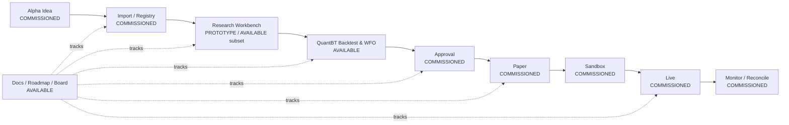

#### Interaction

- Hover/click stage để mở Feature Brief.
- Badge cho maturity và data mode.
- Hiển thị dependency repositories.
- Link tới concern và roadmap epic.
- Cho phép filter theo persona: Manager, Quant, Operator, Platform.
- Cho phép filter theo status: available, prototype, commissioned, blocked.

### P0.16 Wireframe — Portal shell với toàn bộ navigation

```text
┌──────────────────────────────────────────────────────────────────────────────────────────┐
│ ◇ QuantBT Portal  [Default Workspace ▾] [RESEARCH]  / Command Center   [Search ⌘K]  ◉ BA │
├──────────────────────┬───────────────────────────────────────────────────────────────────┤
│ COMMAND              │ Command Center                                                    │
│ ● Command Center     │ Product lifecycle, capability and migration status                │
│ ○ Portal Map         │                                                                   │
│                      │ [AVAILABLE 14] [PROTOTYPE 7] [SOON 18] [BLOCKED 3]                │
│ RESEARCH             │                                                                   │
│ ◌ Alpha Pool   SOON  │ ┌─────────────────────────────┐ ┌───────────────────────────────┐ │
│ ● QuantBT Research   │ │ QuantBT Research            │ │ Migration Plan                │ │
│ ◌ Alpha Mining SOON  │ │ latest run / WFO / audit    │ │ milestone / task status       │ │
│ ◌ Composer     SOON  │ │ [Open workspace]            │ │ [Roadmap] [Board]             │ │
│                      │ └─────────────────────────────┘ └───────────────────────────────┘ │
│ BACKTESTS            │                                                                   │
│ ● New Run            │ Alpha → Research → Backtest → Approval → Paper → Sandbox → Live │
│ ● Run Library        │  SOON     PARTIAL      LIVE       SOON      SOON      SOON    SOON│
│ ● WFO / Optimization │                                                                   │
│ ◌ Compare       SOON │ Priority concerns                                                │
│ ◌ Approvals     SOON │ [Alpha contract] [Data snapshot] [Execution adapter]             │
│                      │                                                                   │
│ DEPLOYMENTS          │                                                                   │
│ ◌ Paper         SOON │                                                                   │
│ ◌ Sandbox       SOON │                                                                   │
│ ◌ Live          SOON │                                                                   │
│                      │                                                                   │
│ PLANNING             │                                                                   │
│ ● Documents          │                                                                   │
│ ● Roadmap            │                                                                   │
│ ● Task Board         │                                                                   │
│ ● Reports/Evidence   │                                                                   │
│                      │                                                                   │
│ ADMIN                │                                                                   │
│ ◐ Profile & Access   │                                                                   │
│ ◌ Settings      SOON │                                                                   │
└──────────────────────┴───────────────────────────────────────────────────────────────────┘
```

### P0.17 Wireframe — QuantBT Research được nhúng trong Portal

```text
┌──────────────────────────────────────────────────────────────────────────────────────────┐
│ Portal topbar / workspace / environment / user                                           │
├──────────────────────┬───────────────────────────────────────────────────────────────────┤
│ Sidebar              │ QuantBT Research                     AVAILABLE · REAL DATA         │
│ Research active      │ Run [RUN-2026-0813 ▾] Status COMPLETED  [New Run] [Export]        │
│                      ├───────────────────────────────────────────────────────────────────┤
│                      │ Passport: strategy · dataset · engine 1.0.8 · dates · hash        │
│                      ├───────────────────────────────────────────────────────────────────┤
│                      │ Overview | Optimization | Parameters | Execution | Audit           │
│                      ├───────────────────────────────────────────────────────────────────┤
│                      │ Existing QuantBT screen content                                   │
│                      │                                                                   │
│                      │ No duplicated Portal topbar                                       │
│                      │ No metric recalculation                                            │
│                      │ Existing run/SSE/artifact behavior preserved                      │
└──────────────────────┴───────────────────────────────────────────────────────────────────┘
```

### P0.18 Wireframe — Planning được nhúng trong Portal

```text
┌──────────────────────────────────────────────────────────────────────────────────────────┐
│ Portal topbar / workspace / environment / user                                           │
├──────────────────────┬───────────────────────────────────────────────────────────────────┤
│ Sidebar              │ Planning & Migration                   AVAILABLE                  │
│ Planning active      │ Track documentation, roadmap, tasks and evidence                  │
│                      ├───────────────────────────────────────────────────────────────────┤
│                      │ Documents | Roadmap | Task Board | Reports | Interpretation | Evidence│
│                      ├───────────────────────────────────────────────────────────────────┤
│                      │ Current Planning feature body                                     │
│                      │                                                                   │
│                      │ API mode badge: API / LOCAL                                        │
│                      │ Context drawer: linked feature / screen / concern                 │
│                      │                                                                   │
│                      │ [Open related Portal feature] [Copy task link]                    │
└──────────────────────┴───────────────────────────────────────────────────────────────────┘
```

### P0.19 Wireframe — Commissioned feature preview

```text
┌──────────────────────────────────────────────────────────────────────────────────────────┐
│ Alpha Pool                                                        COMMISSIONED · SOON     │
│ This feature is part of the approved Portal direction but is not deployed.               │
├──────────────────────────────────────┬───────────────────────────────────────────────────┤
│ Target experience                    │ Delivery context                                  │
│                                      │                                                   │
│ [muted low-fidelity wireframe]       │ Owner: TBD                                        │
│                                      │ Maturity: COMMISSIONED                            │
│ Filters / scorecards / pool table    │ Data mode: NONE                                   │
│ shown as skeleton, not fake values   │ Required repositories: alpha repos, data layer    │
│                                      │ Blocking concerns:                                │
│                                      │ • Alpha package contract                         │
│                                      │ • Registry/version identity                      │
│                                      │ • Scorecard definitions                          │
├──────────────────────────────────────┴───────────────────────────────────────────────────┤
│ [Open roadmap epic] [Open concern brief] [View Figma frame]                             │
│ Disabled: [Import Alpha] [Run Research] — requires activation gate                       │
└──────────────────────────────────────────────────────────────────────────────────────────┘
```

### P0.20 Wireframe — Profile, Access và Settings prototype

```text
┌──────────────────────────────────────────────────────────────────────────────────────────┐
│ Settings / Profile & Access                                         PROTOTYPE             │
├───────────────────────────┬──────────────────────────────────────────────────────────────┤
│ Profile                   │ Signed-in identity                                            │
│ Access & Sessions         │ Email          user@example.com                               │
│ Users & Roles             │ Provider       Cloudflare Access / Local Dev                  │
│ Feature Visibility        │ Role           MANAGER                                        │
│ Appearance                │ Workspace      Default                                        │
│ Prototype                 │ Session expiry 21:45 UTC                                      │
│                           │ Groups         quant-managers                                  │
│                           │ [Sign out] [Refresh identity]                                  │
│                           │                                                              │
│                           │ Access diagnostics                                             │
│                           │ JWT verified ✓  issuer ✓  audience ✓                          │
│                           │ Raw token is never rendered                                   │
│                           │                                                              │
│                           │ Planned modules                                                │
│                           │ [✓] Show commissioned features                                │
└───────────────────────────┴──────────────────────────────────────────────────────────────┘
```

### P0.21 Design direction: Wealthfolio pattern + QuantBT Fund Paper

Prototype dùng Wealthfolio như nguồn tham khảo bố cục, không clone code/component một cách mù quáng.

#### Pattern nên adapt

- Compact sidebar với nhóm chức năng rõ.
- Workspace/account context ở header.
- Metric strip ngắn ở đầu màn.
- Một main visualization lớn, các detail card nhỏ hơn.
- Dense table có search/filter và contextual drawer.
- Empty state có hướng dẫn hành động.
- Mobile navigation có hierarchy rõ.

#### DNA phải giữ từ QuantBT Portal

- Paper canvas và typography Newsreader / Inter / JetBrains Mono.
- Số liệu mono, căn phải.
- Accent structural và accent highlight hiện tại.
- IS/OOS/Holdout có semantic color nhất quán.
- ECharts cho quantitative charts.
- Publication-grade result screen; không biến Run Detail thành generic SaaS dashboard.

#### Hai density mode

1. `Research`: rộng, nhiều khoảng thở, paper surface, chart/report oriented.
2. `Operations`: compact hơn, dark/high contrast optional, status/action oriented.

P0 chủ yếu triển khai Research mode và Planning mode. Operations mode chỉ xuất hiện trong commissioned preview.

### P0.22 Figma-ready prototype package cần dựng trước

Dù implementation có thể chạy trực tiếp bằng React, Figma vẫn cần để review luồng và từng concern trước khi code sâu.

#### Figma pages

```text
00 — Read Me / Status Legend
01 — Current Baseline
02 — Foundations / Variables
03 — Unified App Shell
04 — Command Center / Portal Map
05 — QuantBT Research Embedded
06 — Planning Embedded
07 — Commissioned Feature Previews
08 — Authentication / Settings
09 — Responsive
10 — Prototype Flows
11 — Screen Concern Templates
12 — Archive / Rejected Options
```

#### `01 — Current Baseline`

Chứa screenshot/frame tham chiếu của:

- Current QuantBT Config Workspace.
- Current QuantBT result tabs.
- Current Roadmap Docs/Roadmap/Board.
- Current tokens và shell.

Mục đích là so sánh before/after, không phải copy screenshot vào UI mới.

#### `02 — Foundations`

- Color variables light/dark.
- Typography roles.
- Spacing/radius/elevation.
- Maturity status.
- Environment status.
- Data provenance status.
- Buttons, fields, tabs, nav item, badge, cards, table rows, drawers.

#### `03 — Unified App Shell`

Frames:

- Desktop 1440×900 expanded sidebar.
- Desktop 1280×720 collapsed sidebar.
- Tablet 1024×768.
- Mobile 390×844.
- Light Research mode.
- Dark Operations preview.

#### `10 — Prototype Flows`

Flow 1:

```text
Access sign-in
 -> Command Center
 -> QuantBT Research
 -> Run Library
 -> Run Overview
 -> Optimization
 -> Audit
```

Flow 2:

```text
Command Center
 -> Planning
 -> Roadmap milestone
 -> Task Board
 -> Task detail
 -> Open linked Feature Preview
```

Flow 3:

```text
Portal Map
 -> Alpha Pool commissioned stage
 -> Feature Preview
 -> Concern brief
 -> Open roadmap epic
```

Flow 4:

```text
User menu
 -> Profile & Access
 -> Role/feature visibility
 -> Toggle commissioned modules
```

#### Handoff requirements

Mỗi frame có:

- `screen_id`.
- `feature_id`.
- maturity.
- data mode.
- responsive notes.
- primary decision.
- source API/fixture.
- permissions.
- linked concern/task IDs.

### P0.23 Liên kết Portal Feature với Roadmap/Task Board

Đây là phần giúp hai capability hiện tại đóng góp cho nhau thay vì chỉ đứng cạnh nhau.

#### Entity mapping tối thiểu

```text
feature_id        -> Portal feature registry
screen_id         -> Screen contract
concern_id        -> Open design/architecture concern
roadmap_epic_id   -> Roadmap milestone/epic
planning_task_id  -> Task Board task
figma_frame_id    -> Figma prototype frame
repository_scope  -> Repositories/directories phải đọc
```

#### Field bổ sung cho task metadata

```yaml
feature_id: ALPHA_POOL
screen_id: ALPHA_POOL_LIST
concern_ids:
  - ALPHA_PACKAGE_CONTRACT
  - SCORECARD_SEMANTICS
repository_scope:
  - alpha-repositories
  - quant-data-layer
prototype_route: /research/alphas/preview
figma_frame_id: ALPHA_POOL_DESKTOP_V1
activation_gate: alpha-registry-contract-approved
```

P0 không nhất thiết migrate SQLite schema. Có thể lưu mapping trong một versioned sidecar JSON/YAML hoặc optional metadata field trước, sau đó đưa vào Planning bounded context ở phase M1/M2.

#### Cross-link behavior

- Feature preview → `Open roadmap epic`.
- Feature preview → `Open implementation tasks`.
- Task detail → `Open Portal screen`.
- Concern brief → liệt kê task và screens bị ảnh hưởng.
- Command Center → số task/blocker theo feature group.
- Figma frame → ghi feature/screen/task ID trong description.

### P0.24 Prototype data và fixture policy

#### Bốn data mode

| Mode | Dùng khi | UI treatment |
|---|---|---|
| `REAL` | Current API/artifact/local persisted data | Không banner mock; hiển thị freshness/provenance |
| `FIXTURE` | Interaction cần review nhưng backend chưa có | Banner `Prototype data`; reset được; không export như evidence |
| `STATIC_PREVIEW` | Commissioned screen | Skeleton/wireframe + explanatory copy; không có fake metric |
| `NONE` | Blocked/unknown contract | Dependency brief; không render fake dashboard |

#### Fixture rules

- Fixture nằm trong `fixtures/prototype/`, không trộn với API response cache.
- Object phải có `fixture_id`, `generated_at`, `scenario`, `not_for_decision=true`.
- Toàn bộ screen có fixture phải có visual banner cố định.
- Không dùng tên account/API key/venue thật.
- Không dùng fixture để pass backend contract test.
- Screenshot Figma/Playwright phải ghi scenario.

#### Product copy

Không dùng copy mơ hồ như “Live” nếu dữ liệu là fixture. Dùng:

```text
Prototype scenario
Sample paper deployment
Illustrative portfolio
Commissioned — no runtime connected
```

### P0.24A Historical Market Data consumer contract — addendum 2026-08-15

> **Concern-specific authority:** section này bổ sung v0.4 sau khi đã audit
> `/home/bobby/pool_alpha/HISTORICAL_MARKET_DATA_CONSUMER_GUIDE.md` và public
> reader contract trong `/home/bobby/historical_market_data`. Với Historical
> Market Data, section này có authority trước các giả định data/path cũ trong
> guide. Source checkout thứ hai chỉ là nơi kiểm chứng contract; Portal không
> được phụ thuộc vào nó khi build hoặc chạy.

#### P0.24A.1 Boundary đã khóa

```text
Historical Market Data collectors/writers
  -> canonical immutable storage release
       /srv/primus/historical-market-data/storage
          + _primus_metadata/release_manifest.json
  -> read-only mount /data:ro
  -> approved code-only reader wheel
       primus-historical-market-data==0.1.0rc3
       loader contract hmd-loader-v1
  -> Portal HistoricalMarketDataProvider
  -> validated/provenanced DataQueryResult
  -> QuantBT current FastAPI / later Control API + worker
```

Portal là **consumer**, không phải collector/operator của repository dữ liệu:

- Không `pip install -e /home/bobby/historical_market_data`.
- Không copy/mount source checkout, `storage/`, `state/`, `logs`, collector
  config hoặc secrets vào Portal.
- Không tạo `data_loader.py` trong Portal vì sẽ shadow module từ wheel.
- Không dùng arbitrary host path hay `DATA_ROOT` làm production fallback.
- Không cho Portal API user quyền Docker group, writer ACL hoặc quyền sửa
  canonical storage.

Approved wheel artifact hiện hành:

| Field | Locked value |
|---|---|
| Distribution | `primus-historical-market-data==0.1.0rc3` |
| Wheel | `primus_historical_market_data-0.1.0rc3-py3-none-any.whl` |
| SHA-256 | `3b2a41b87ff834912556bb3039bf3e3c148bd859a1ced9ee4f52a3c658ca5663` |
| Reader import | `from data_loader import CryptoBinance1m` |
| Namespace import | `from primus.historical_market_data import CryptoBinance1m` |
| Loader contract | `hmd-loader-v1` |
| Python | `>=3.12,<3.14` |
| Reader dependency lock | DuckDB `1.5.5`, pandas `2.3.3`, PyArrow `24.0.0` |

Image build phải nhận wheel qua approved immutable artifact channel/build
context và verify exact SHA. Không dùng unversioned `latest`; không làm wheel
source thành Git submodule của Portal. `quantbt-engine==1.0.8` vẫn là dependency
PyPI độc lập và không thay thế reader này.

#### P0.24A.2 Runtime mount và fail-closed compatibility

Target Compose contract:

```yaml
services:
  portal-api:
    environment:
      HISTORICAL_MARKET_DATA_ROOT: /data
    volumes:
      - /srv/primus/historical-market-data/storage:/data:ro
```

`HISTORICAL_MARKET_DATA_ROOT` là biến bắt buộc. Khi biến này được set, reader
phải đọc `_primus_metadata/release_manifest.json` và từ chối đọc nếu:

- manifest thiếu/malformed hoặc `status != "pass"`;
- storage release không support `hmd-loader-v1`;
- requested dataset family không được manifest declare;
- dataset schema/layout không support loader contract hiện hành.

Portal readiness và capability registry phải phản ánh lỗi
`StorageCompatibilityError` thành typed unavailable reason; không catch rồi
fallback sang path/fixture khác. Một environment chỉ được ghi `REAL/AVAILABLE`
khi reader doctor và real-reader smoke của chính environment đó pass.

Host operator có thể kiểm tra contract hiện tại bằng:

```bash
cd /home/bobby/pool_alpha
./run_hmd_python.sh examples/reader_doctor.py
```

Portal production container không phụ thuộc wrapper host này; image của Portal
cài wheel trực tiếp, còn wrapper chỉ là operator reference/independent doctor.
Audit ngày 2026-08-15 cho thấy doctor import từ installed `site-packages`, root
canonical ở `/srv/primus/historical-market-data/storage`, release `pass` tại
commit `d9327fb2fff11d0d864c811d8286716b9b192343`. Đây là environment evidence tại
thời điểm audit, không được hard-code thay manifest lookup lúc runtime.

#### P0.24A.3 Dataset eligibility hiện hành

| Dataset family | Public endpoint/router | Portal state |
|---|---|---|
| Binance USD-M perpetual 1m | `CryptoBinance1m` / `crypto_1m` | Approved; first BE-01 hot path |
| Binance USD-M quarterly 1m | `CryptoBinanceQuarterly1m` / `binance_usdm_quarterly_1m` | Approved; register in U13 |
| Binance spot 1m | `CryptoBinanceSpot1m` / `binance_spot_1m` | Approved; register in U13 |
| Binance futures metrics 5m | `BinanceFuturesMetrics5m` / `futures_metrics_5m` | Approved; typed non-OHLCV adapter in U13 |
| Binance order-book features 1h | `BinanceOrderBookSnapshot1h` / `orderbook_snapshot_1h` | Approved; typed non-OHLCV adapter in U13 |
| Binance daily matrix | `CryptoDailyMatrix` / `binance_daily_matrix` | Approved; matrix adapter in U13 |
| VN equity daily | `VnStockDaily` / `vn_stock_daily` | Approved; register in U13 |
| VN daily matrix | `VNDailyMatrix` / `vn_daily_matrix` | Approved; matrix adapter in U13 |
| VN30F1M continuous 1m/daily | `VnDerivativesContinuous1m` / `VnDerivativesContinuousDaily` | Approved VNDIRECT continuous alias; not reconstructed contracts |
| VN raw equity/futures 1m | `VnStock1m` / `VnFutures1m` | Not declared; fail closed |
| Concrete VN contracts | `VnDerivativesContracts1m/Daily` | Not declared; fail closed |
| Binance options 5m | `BinanceOptions5m` | Public code only, not release-approved |
| Deribit options | Deribit public reader classes | Disabled/not called |

Class existence không phải evidence coverage. Portal chỉ advertise capability
khi release manifest cho phép đúng family và adapter schema tương ứng đã được
certify. Matrix, metrics và order-book không được ép về OHLCV chỉ để tái dùng UI.

#### P0.24A.4 Query, time và quality semantics

Service request contract tối thiểu:

```ts
type HistoricalMarketDataQuery = {
  datasetId: string;
  symbol: string;
  start: string;          // inclusive, explicit timezone/venue interpretation
  end: string;            // explicit boundary contract
  timeframe?: string;
  columns: string[];      // minimal required projection
};
```

Rules:

1. Explicit symbol + bounded `start/end` là bắt buộc cho Portal services.
   `limit` chỉ trim kết quả sau discovery nên không thay time window.
2. `check_val=True` luôn bật. Loader warning/gap evidence được propagate vào
   provenance/quality state; reader không tự repair canonical data.
3. Empty frame có thể là symbol/range/release không có dữ liệu, không phải bằng
   chứng “market activity = 0”.
4. Không forward-fill, fabricate candle hoặc viết lại source/session gaps.
5. Crypto timestamps naive được interpret là UTC; VN timestamps naive được
   interpret là `Asia/Ho_Chi_Minh`. Adapter normalize ra UTC và luôn giữ
   `source_timezone`/venue session metadata.
6. Kết quả phải sorted, unique theo time/key và validate schema/finite/OHLCV
   invariant khi dataset kind là candle.
7. Provenance tối thiểu gồm reader version, loader contract, storage release
   tag/commit, manifest digest, dataset release ID, requested window, validation
   mode, source timezone và normalized result/content digest.

#### P0.24A.5 Portal adapter và implementation order

Current `CryptoBinanceMarketDataProvider` là một seam hữu ích nhưng implementation
host-path hiện tại không đạt contract production: nó tìm và import
`data_loader.py` từ `PORTAL_CRYPTO_DATA_ROOT`, không truyền explicit date window
và localize mọi naive timestamp như UTC. U01-BE phải thay debt đó trước khi mở
rộng shell/control plane:

```text
U00/U01 baseline
  -> U01-BE reader wheel + manifest doctor + one Binance real-data smoke
  -> U02/U03 shared UI + mother shell
  -> U08/U09/U10 contract/control-plane migration
  -> U13 full Data Catalog + approved family adapters/query foundation
```

U01-BE giữ FastAPI hiện tại làm first consumer, để chỉ thay một boundary mỗi
lần. Unit/contract tests dùng injected fake reader và synthetic fixture; real
smoke là opt-in test trên target VPS với một fixed, small BTCUSDT window. Generic
CI thiếu canonical mount phải report `external-data-unavailable/skip`, tuyệt đối
không được ghi real-data smoke đã pass.

### P0.25 Authentication baseline — Cloudflare Zero Trust, vừa đủ cho prototype

Cloudflare Zero Trust/Access và Nginx không phải hai lựa chọn loại trừ nhau:

- **Cloudflare Access/Tunnel**: public edge, identity, allow/deny policy, session và origin shielding.
- **Nginx hoặc gateway hiện tại**: serve frontend, route `/api`, `/planning/api`, static assets và compatibility paths trong private origin.

Kiến trúc đề xuất:

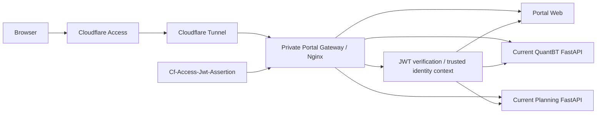

#### P0 authentication decision

- Production/demo external access dùng Cloudflare Access.
- Local development dùng `AUTH_MODE=dev` và chỉ bind loopback/private network.
- Portal **không lưu password production** trong baseline.
- User password/OTP/SSO được xử lý bởi identity provider được Cloudflare Access sử dụng.
- Portal sở hữu authorization: role, workspace và permission.

#### Identity choices phù hợp giai đoạn đầu

1. Email allowlist + Cloudflare One-time PIN cho nhóm nhỏ.
2. Google/GitHub/OIDC IdP nếu team đã có.
3. Một IdP duy nhất có thể bật instant authentication để giảm bước login.

#### Role tối thiểu trong prototype

```text
ADMIN     users/roles/settings/feature visibility
MANAGER   read all prototype, run allowed workflow, planning write theo policy
QUANT     QuantBT research/run workflow, planning comments/tasks liên quan
VIEWER    read-only reports/docs/roadmap/approved results
```

Các role chi tiết ở §13.2 vẫn là target sau này.

#### Bootstrap admin/user

Prototype có thể dùng:

```text
PORTAL_BOOTSTRAP_ADMINS=user1@example.com,user2@example.com
PORTAL_DEFAULT_ROLE=VIEWER
PORTAL_ROLE_MAPPING_FILE=/config/role-mapping.yaml
```

Khi user đã được Cloudflare Access xác thực lần đầu:

1. Backend đọc claim email/subject/groups.
2. Verify JWT.
3. Tạo hoặc cập nhật `user_identity_binding` tối thiểu.
4. Apply bootstrap/group mapping.
5. Tạo `PortalPrincipal` dùng cho authorization/audit.

Admin tạo role binding trong Settings, không tạo password trong Portal.

#### JWT validation bắt buộc

Origin/backend không chỉ kiểm tra header có tồn tại. Phải verify:

- Chữ ký RS256/JWKS.
- `iss` đúng Cloudflare team domain.
- `aud` chứa Application Audience tag đúng.
- `exp`, `nbf`, `iat` hợp lệ.
- Email/subject claim theo policy.

Header identity do gateway nội bộ tạo phải:

- Strip mọi header tương tự do browser gửi vào.
- Chỉ được backend tin khi request đến từ trusted gateway/network.
- Không log raw JWT.

#### Browser session

P0 ưu tiên Access session cookie + BFF/gateway context. Không phát thêm một JWT dài hạn riêng chỉ vì frontend là SPA.

- Cookie `Secure`, `HttpOnly`, `SameSite` phù hợp.
- State-changing request có CSRF/origin protection.
- Logout xóa Portal session và redirect qua Access logout nếu cấu hình.
- WebSocket/SSE dùng Access session hoặc one-time short-lived ticket; không đưa token dài hạn vào query log.

#### Local dev mode

```text
AUTH_MODE=dev
DEV_IDENTITY_EMAIL=owner@local
DEV_IDENTITY_ROLE=ADMIN
```

Rules:

- Chỉ được bật ở `local`/test environment.
- UI có banner `LOCAL AUTH BYPASS` cố định.
- Startup fail nếu `AUTH_MODE=dev` + environment `paper/sandbox/live` hoặc bind public interface ngoài allowlist.
- Không chứa exchange/live secret.

#### Local password fallback — không phải baseline

Chỉ cân nhắc nếu sau này có deployment air-gapped không dùng IdP. Khi đó:

- Argon2id.
- HttpOnly server session, không localStorage token.
- Rate limit, lockout, reset flow, audit.
- MFA cho admin.
- Tách task/spec riêng.

Không thêm fallback này vào P0 chỉ để có một form username/password.

#### Controls “vừa đủ”, chưa enterprise-overkill

Bắt buộc trong prototype external:

- Cloudflare Access allow policy.
- Tunnel/private origin; không public backend port.
- JWT verification.
- Role check server-side.
- Secure session/cookie.
- CSRF/origin validation cho mutation.
- Basic rate limit.
- Audit login, role change, run submit/cancel và planning write.

Commissioned cho phase sau:

- Device posture.
- SCIM provisioning.
- Fine-grained ABAC đầy đủ.
- Step-up MFA cho live.
- Break-glass workflow.
- Service mTLS.
- Hardware key requirement.

Nguồn Cloudflare tham chiếu:

- Self-hosted Access application: <https://developers.cloudflare.com/cloudflare-one/access-controls/applications/http-apps/self-hosted-public-app/>
- Access JWT validation: <https://developers.cloudflare.com/cloudflare-one/access-controls/applications/http-apps/authorization-cookie/validating-json/>
- Application token claims: <https://developers.cloudflare.com/cloudflare-one/access-controls/applications/http-apps/authorization-cookie/application-token/>

### P0.25A Addendum Draft v0.3 — `portal.primusspark.com`, login nội bộ và identity bootstrap

> **Quyết định mới của owner:** external prototype được publish tại `https://portal.primusspark.com` trên VPS SGP. Cloudflare Access/Tunnel tiếp tục là front door bắt buộc, nhưng Portal cần thêm màn đăng nhập username/password nội bộ và ba tài khoản bootstrap. Addendum này **mở rộng** P0.25; các đoạn trước nói “không lưu production password” vẫn là target dài hạn SSO-only, còn M-1B áp dụng một ngoại lệ có kiểm soát: password nội bộ chỉ hoạt động sau khi request đã vượt qua Cloudflare Access và JWT đã được xác minh.

#### P0.25A.1 Kết luận kiến trúc

Topology owner đề xuất là đúng hướng và được giữ lại với bốn điều chỉnh bắt buộc:

1. `Cf-Access-Jwt-Assertion` là trust input chính; email phải được lấy từ **JWT đã verify**, không được tin chỉ vì `CF-Access-Authenticated-User-Email` hoặc `X-Auth-User-Email` tồn tại.
2. `cloudflared` bật `originRequest.access.required=true` với đúng `teamName` và `audTag`; backend vẫn verify JWT lần nữa để tạo `PortalPrincipal`.
3. Nginx chỉ bind loopback, strip các identity header tự chế và không tự tuyên bố một email là “verified”.
4. Ba account local được seed theo username/role, nhưng không dùng chung một password yếu. Mỗi account nhận một activation secret ngẫu nhiên, dùng một lần, bắt đổi password trước khi truy cập Portal.

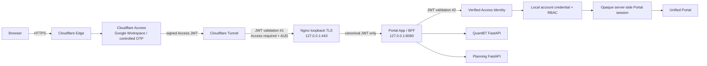

#### P0.25A.2 Trust boundary và authority

| Boundary | Authority | Không được làm |
|---|---|---|
| Cloudflare Access | Xác định external identity được phép đi qua hostname | Không quyết định role nghiệp vụ chi tiết trong Portal |
| Cloudflare Tunnel | Outbound-only transport, hostname routing, optional Access JWT pre-validation | Không thay app authorization |
| Nginx | TLS local origin, route, body/time limits, trusted header normalization | Không tin raw email header; không phát role |
| Portal auth middleware | Verify JWT signature/issuer/audience/time; tạo Access identity | Không lấy role từ browser |
| Local credential service | Xác thực account `bobby`/`stan`/`thanhvuong`, first-login change | Không lưu plaintext/reversible password |
| Portal authorization | Role/permission, workspace/resource checks | Không chỉ dựa vào UI hide/show |
| QuantBT/Planning services | Enforce capability-specific permission hoặc chỉ nhận signed internal principal | Không nhận trực tiếp browser-supplied identity header |

Quy tắc bất biến:

```text
Cloudflare email header without valid JWT = untrusted
valid JWT without active local account = no Portal access
active local account without valid Access identity = no external Portal access
frontend-visible role without server-side authorization = no authority
```

#### P0.25A.3 Authentication modes

```text
AUTH_MODE=dev
AUTH_MODE=cloudflare_access
AUTH_MODE=cloudflare_access_local_password
```

| Mode | Dùng ở đâu | Hành vi |
|---|---|---|
| `dev` | Local/test only | Inject dev identity; banner bắt buộc; startup guard |
| `cloudflare_access` | Target SSO-only sau này | Access JWT hợp lệ + active identity binding tạo Portal session; không hỏi local password |
| `cloudflare_access_local_password` | **M-1B deployed prototype** | Access JWT hợp lệ trước; sau đó username + local password; first login bắt đổi |

`cloudflare_access_local_password` không được hiểu là MFA mặc định. Hai password vẫn có thể cùng là “knowledge factor”; độ mạnh thực tế phụ thuộc Google Workspace/IdP có MFA hay không. Trước khi mở sandbox/live action, admin/risk-sensitive action phải có step-up policy hoặc IdP MFA.

#### P0.25A.4 Auth state machine

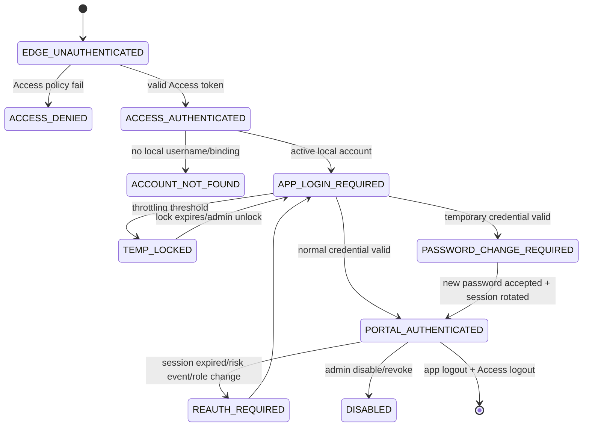

#### P0.25A.5 Tài khoản bootstrap đã chốt

Username và role được seed như sau:

```yaml
users:
  - username: bobby
    role: ADMIN
    status: INVITED
    access_email: null # bind sau bằng email @azdag.com đã verify
    credential_mode: generated_one_time
    must_change_password: true

  - username: stan
    role: USER
    status: INVITED
    access_email: null
    credential_mode: generated_one_time
    must_change_password: true

  - username: thanhvuong
    role: USER
    status: INVITED
    access_email: null
    credential_mode: generated_one_time
    must_change_password: true
```

Password tám chữ số dùng chung được nêu trong planning note **không được seed, commit hoặc deploy** vì:

- cùng một secret cho ba account làm mất identity assurance;
- là giá trị phổ biến, phải bị password blocklist từ chối;
- bất kỳ người nào biết secret đều có thể thử impersonate account khác sau khi qua Access;
- việc “bắt đổi lần đầu” không loại bỏ risk trong khoảng trước lần đăng nhập đầu tiên.

Thay vào đó, deploy command tạo một secret ngẫu nhiên riêng cho từng user hoặc activation URL dùng một lần:

```bash
sudo bash -c 'umask 077; \
  sudo -u portal /opt/portal/bin/portalctl users bootstrap \
    --file /etc/portal/bootstrap-users.yaml \
    --generate-one-time-credentials \
    --print-one-time-credentials \
    > /root/portal-bootstrap-secrets.txt'

sudo chmod 0600 /root/portal-bootstrap-secrets.txt
```

Rules cho output:

- file chỉ tồn tại đủ lâu để owner phân phối out-of-band;
- không ghi secret vào journald, CI log, Docker log hoặc Planning task;
- sau khi cả ba user activate, xóa file và ghi audit/evidence rằng bootstrap secret đã được hủy;
- reset sau này tạo secret mới, không khôi phục secret cũ.

#### P0.25A.6 Binding username với Cloudflare identity

Vì owner mới cung cấp username nhưng chưa cung cấp email thực tế, account bắt đầu ở `INVITED` và `access_email=null`.

First activation flow:

1. User đi qua Cloudflare Access bằng email thuộc `@azdag.com`.
2. Backend verify Access JWT và tạo `verified_access_identity` gồm `sub`, `email`, `iss`, `aud`, `authentication_time`.
3. User nhập username và one-time credential riêng.
4. Trong một transaction, backend:
   - xác nhận account `INVITED`;
   - xác nhận activation credential chưa dùng/chưa hết hạn;
   - bind `access_email` và `access_subject` với identity hiện tại;
   - đặt `must_change_password=true`;
   - chuyển session sang `PASSWORD_CHANGE_REQUIRED`.
5. User đặt password mới.
6. Backend revoke activation credential, rotate session ID và chuyển account sang `ACTIVE`.
7. Những lần sau, JWT email/subject phải match binding trước khi local password được kiểm tra.

Binding conflict:

```text
same username + different Access identity -> deny + security audit
same Access identity + different username -> deny unless ADMIN-approved transfer
case-only email change -> normalize then compare
IdP subject changed but email same -> require admin review, không auto-rebind
```

Sau khi owner cung cấp exact emails, nên pre-bind qua admin seed thay vì on-first-use.

#### P0.25A.7 Password policy

Baseline vừa đủ nhưng không yếu:

```text
minimum user-selected length: 15 characters
maximum accepted length: at least 64 characters
composition rules: none
Unicode: accepted and NFC-normalized
blocklist: common/breached/context-specific values
password manager paste/autofill: allowed
periodic forced rotation: no
forced change: bootstrap/reset/compromise only
```

Storage:

```text
algorithm: Argon2id
minimum work factor: memory 19 MiB, iterations 2, parallelism 1
salt: unique random per credential
pepper: optional; stored outside database in secret file/vault
plaintext/reversible encryption: forbidden
```

M-1B nên benchmark Argon2id trên VPS rồi tăng work factor nếu login latency vẫn dưới budget; không hạ thấp hơn baseline chỉ để benchmark đẹp.

Temporary/activation credential:

- ít nhất 192 bit entropy từ CSPRNG;
- single-use;
- expire sau tối đa 24 giờ hoặc thời gian ngắn hơn do owner chọn;
- stored hashed, không plaintext trong database;
- lần dùng thành công hoặc reset mới lập tức revoke giá trị cũ.

#### P0.25A.8 Login throttling và account protection

Baseline:

```text
per account: 5 failed attempts / 15 minutes -> exponential delay
10 failed attempts / 30 minutes -> temporary lock 15 minutes
per source/session: gateway rate limit để giảm spray
successful password change -> reset counters
ADMIN unlock/reset -> audit bắt buộc
```

Response login luôn generic:

```text
Tên đăng nhập hoặc thông tin xác thực không hợp lệ.
```

Không trả lời khác nhau cho user không tồn tại, password sai, email binding mismatch hoặc account disabled. Security detail chỉ xuất hiện trong audit nội bộ.

#### P0.25A.9 Session model

Portal dùng opaque server-side session, không phát long-lived app JWT cho browser.

```text
cookie name: __Host-portal_session
Secure: true
HttpOnly: true
Path: /
Domain: omitted
SameSite: Lax
idle timeout: 30 minutes
absolute timeout: 8 hours
renewal/rotation: login, password change, role change, privilege elevation
```

Cloudflare Access session có thể giữ 24 giờ theo owner; app session ngắn hơn là độc lập. Access token còn hiệu lực không tự phục hồi một app session đã bị admin revoke.

Mutation protection:

- kiểm tra `Origin`/`Referer` theo `PORTAL_PUBLIC_ORIGIN`;
- CSRF token cho cookie-authenticated mutation;
- idempotency key cho action như submit/cancel run;
- session ID không xuất hiện trong URL/log;
- raw Access JWT không vào localStorage, frontend state persistence hoặc error telemetry.

Logout flow:

```text
POST /api/auth/logout
 -> revoke app session server-side
 -> clear __Host-portal_session
 -> redirect /cdn-cgi/access/logout
```

#### P0.25A.10 In-app RBAC cho hai role ban đầu

| Capability | ADMIN | USER |
|---|:---:|:---:|
| View Portal shell/commissioned previews | ✓ | ✓ |
| View QuantBT runs/reports được share | ✓ | ✓ |
| Create/cancel own allowed QuantBT run | ✓ | ✓ |
| Modify another user's run | ✓ theo audit | ✗ |
| Read Docs/Roadmap | ✓ | ✓ |
| Update assigned Planning task/comment | ✓ | ✓ theo assignment |
| Manage all Planning tasks/milestones | ✓ | ✗ |
| Manage users/roles/settings | ✓ | ✗ |
| View auth/security audit | ✓ | ✗ |
| Approve promotion | Commissioned | ✗ |
| Paper/sandbox/live command | Commissioned + step-up | ✗ |
| Manage broker/API secrets | Không trực tiếp trong prototype | ✗ |

`USER` là role prototype, không đồng nhất vĩnh viễn với `VIEWER` hay `QUANT`. Khi alpha/paper/live bounded context được mở, role này phải được tách theo separation of duties.

#### P0.25A.11 Cloudflare Access application baseline

```text
Application name: PrimusSpark Portal
Application type: Self-hosted
Hostname: portal.primusspark.com
Session duration: 24 hours
Default behavior: deny
Preferred IdP: Google Workspace; prototype fallback: One-time PIN restricted to @azdag.com
Primary allow rule: Emails ending in @azdag.com
Optional require rule: Login method = Google Workspace sau khi IdP được cấu hình/kiểm thử
Instant authentication: chỉ enable khi đúng một IdP đã được owner xác nhận
```

OTP policy:

- không mở OTP cho mọi email tùy ý;
- nếu cần recovery/temporary access, dùng policy riêng với exact email list hoặc domain restriction;
- nếu user đăng nhập bằng OTP thay vì IdP, không giả định IdP group claims vẫn tồn tại;
- admin account nên dùng Google Workspace với MFA thay vì OTP email làm đường chính.

Các value cần lấy từ dashboard và đặt ở secret/config:

```text
CLOUDFLARE_TEAM_NAME=primussparkquant
CLOUDFLARE_TEAM_DOMAIN=https://primussparkquant.cloudflareaccess.com
CLOUDFLARE_ACCESS_ISSUER=https://primussparkquant.cloudflareaccess.com
CLOUDFLARE_ACCESS_AUD=564a9f0023fbaa7af966e1056687ae4f6d9523f052b75b83be623678ac70684e
CLOUDFLARE_ACCESS_JWKS_URI=https://primussparkquant.cloudflareaccess.com/cdn-cgi/access/certs
CLOUDFLARE_ALLOWED_EMAIL_DOMAIN=azdag.com
```

#### P0.25A.12 Access JWT verification contract

Backend reject fail-closed nếu thiếu hoặc invalid:

- JWT header `Cf-Access-Jwt-Assertion`;
- algorithm không nằm trong allowlist;
- `kid` không resolve qua JWKS;
- signature invalid;
- `iss` không đúng team domain;
- `aud` không chứa Portal application AUD;
- `exp`, `nbf`, `iat` không hợp lệ ngoài clock-skew tolerance nhỏ;
- email claim thiếu/không thuộc policy kỳ vọng;
- token không thể map sang active identity/account.

JWKS behavior:

- fetch remote JWKS theo `kid`;
- cache có TTL và refresh khi gặp key mới;
- không hard-code một public key duy nhất vì Access rotate signing keys;
- giữ last-known-good keys trong thời gian ngắn để tránh outage do transient fetch failure, nhưng không bypass signature;
- không log raw token.

Normalized principal tham chiếu:

```json
{
  "principal_id": "usr_...",
  "username": "bobby",
  "access_subject": "...",
  "access_email": "name@azdag.com",
  "role": "ADMIN",
  "authn_methods": ["cloudflare_access", "local_password"],
  "session_id": "ses_...",
  "must_change_password": false,
  "issued_at": "...",
  "policy_version": "auth-policy-v1"
}
```

#### P0.25A.13 App auth API contract

```text
GET  /api/auth/context
POST /api/auth/login
POST /api/auth/change-password
POST /api/auth/logout
GET  /api/auth/csrf

GET    /api/admin/users
POST   /api/admin/users
PATCH  /api/admin/users/{user_id}
POST   /api/admin/users/{user_id}/reset-credential
POST   /api/admin/users/{user_id}/revoke-sessions
POST   /api/admin/users/{user_id}/disable
```

`GET /api/auth/context` states:

```text
ACCESS_REQUIRED
APP_LOGIN_REQUIRED
PASSWORD_CHANGE_REQUIRED
AUTHENTICATED
ACCOUNT_DISABLED
IDENTITY_BINDING_CONFLICT
```

`POST /api/auth/login` preconditions:

- request đã có verified Access identity;
- CSRF/origin validation pass;
- rate limit pass;
- account active/invited theo flow;
- password/activation secret được xử lý constant-time qua credential verifier.

#### P0.25A.14 Data model tối thiểu

```sql
portal_users(
  user_id,
  username unique,
  display_name,
  role,
  status,
  must_change_password,
  failed_login_count,
  locked_until,
  session_version,
  created_at,
  updated_at,
  disabled_at
)

external_identity_bindings(
  binding_id,
  user_id,
  provider,
  issuer,
  subject,
  normalized_email,
  email_verified,
  bound_at,
  last_seen_at,
  unique(provider, issuer, subject),
  unique(provider, issuer, normalized_email)
)

password_credentials(
  credential_id,
  user_id unique,
  password_hash,
  algorithm,
  parameters_json,
  created_at,
  changed_at,
  compromised_at
)

activation_credentials(
  activation_id,
  user_id,
  token_hash,
  expires_at,
  used_at,
  revoked_at,
  created_by
)

auth_sessions(
  session_id,
  session_token_hash unique,
  user_id,
  access_subject,
  access_token_expires_at,
  state,
  csrf_secret_hash,
  created_at,
  last_seen_at,
  idle_expires_at,
  absolute_expires_at,
  revoked_at,
  revoke_reason
)

auth_audit_events(
  event_id,
  event_type,
  actor_user_id,
  target_user_id,
  access_subject,
  request_id,
  source_ip,
  user_agent_hash,
  result,
  reason_code,
  occurred_at,
  metadata_json
)
```

Password tables không được expose qua generic admin CRUD, data export hoặc debug endpoint.

#### P0.25A.15 Hardened Nginx origin configuration

Nginx chỉ làm local TLS/router. Identity verification vẫn nằm trong app middleware.

```nginx
# /etc/nginx/conf.d/00-portal-maps.conf
map $http_upgrade $portal_connection_upgrade {
    default upgrade;
    ''      close;
}

map $http_cf_connecting_ip $portal_client_ip {
    default $http_cf_connecting_ip;
    ''      $remote_addr;
}

upstream portal_app {
    server 127.0.0.1:8080;
    keepalive 32;
}
```

```nginx
# /etc/nginx/sites-available/portal.primusspark.com
server {
    # Syntax này tương thích rộng với package Ubuntu/Debian; Nginx mới có thể
    # cảnh báo deprecation và cho phép chuyển sang `listen ... ssl; http2 on;`.
    listen 127.0.0.1:443 ssl http2;

    server_name portal.primusspark.com;

    ssl_certificate     /etc/ssl/certs/primusspark_origin.crt;
    ssl_certificate_key /etc/ssl/private/primusspark_origin.key;
    ssl_protocols TLSv1.2 TLSv1.3;
    ssl_session_cache shared:PORTAL_TLS:10m;
    ssl_session_timeout 1d;
    ssl_session_tickets off;

    server_tokens off;
    client_max_body_size 25m;

    location = /nginx-healthz {
        access_log off;
        return 200 "ok\n";
    }

    location / {
        proxy_pass http://portal_app;
        proxy_http_version 1.1;

        proxy_set_header Host              $host;
        proxy_set_header X-Forwarded-Host  $host;
        proxy_set_header X-Forwarded-Proto https;
        proxy_set_header X-Forwarded-Port  443;

        # Override client-provided forwarding chain; tunnel là ingress duy nhất.
        proxy_set_header X-Real-IP       $portal_client_ip;
        proxy_set_header X-Forwarded-For $portal_client_ip;

        # Chỉ forward canonical Access assertion để app tự verify.
        proxy_set_header Cf-Access-Jwt-Assertion $http_cf_access_jwt_assertion;

        # Strip identity aliases có thể bị client/internal caller spoof.
        proxy_set_header CF-Access-Authenticated-User-Email "";
        proxy_set_header X-Auth-User-Email "";
        proxy_set_header X-Cf-Access-Jwt "";
        proxy_set_header X-Portal-User "";
        proxy_set_header X-Portal-Role "";

        proxy_set_header Upgrade    $http_upgrade;
        proxy_set_header Connection $portal_connection_upgrade;

        proxy_connect_timeout 10s;
        proxy_send_timeout 300s;
        proxy_read_timeout 300s;
    }
}

server {
    listen 127.0.0.1:80;
    server_name portal.primusspark.com;
    return 301 https://$host$request_uri;
}
```

Operational notes:

- `nginx -t` phải pass trước reload;
- cert `0644`, private key `0600 root:root`;
- app và Nginx không listen `0.0.0.0`/public interface;
- CSP/security headers nên do Portal gateway/app quản lý theo asset/runtime thực tế; không copy một CSP cứng gây vỡ Vite/chart worker;
- không dùng `X-Auth-User-Email` làm authorization input.

#### P0.25A.16 Hardened Cloudflare Tunnel configuration

Credentials nên nằm trong `/etc/cloudflared`, không phụ thuộc `/root/.cloudflared` sau khi systemd service chạy.

```yaml
# /etc/cloudflared/config.yml
tunnel: <TUNNEL_UUID>
credentials-file: /etc/cloudflared/<TUNNEL_UUID>.json

loglevel: info
metrics: 127.0.0.1:2000

ingress:
  - hostname: portal.primusspark.com
    service: https://127.0.0.1:443
    originRequest:
      originServerName: portal.primusspark.com
      httpHostHeader: portal.primusspark.com
      noTLSVerify: false
      connectTimeout: 10s
      tlsTimeout: 10s
      keepAliveTimeout: 90s

      # Defense-in-depth: cloudflared verify Access JWT trước origin.
      access:
        required: true
        teamName: primussparkquant
        audTag:
          - 564a9f0023fbaa7af966e1056687ae4f6d9523f052b75b83be623678ac70684e

  - service: http_status:404
```

Validation:

```bash
sudo cloudflared --config /etc/cloudflared/config.yml tunnel ingress validate
sudo cloudflared --config /etc/cloudflared/config.yml \
  tunnel ingress rule https://portal.primusspark.com
sudo systemctl restart cloudflared
sudo systemctl status cloudflared --no-pager
```

TLS notes:

- `originServerName` phải match SAN `portal.primusspark.com` hoặc wildcard thích hợp trên origin cert;
- giữ `noTLSVerify: false` trong production;
- nếu dùng custom/private CA không được trust, cấu hình `caPool` với CA bundle đúng; không chuyển sang `noTLSVerify: true` như cách sửa nhanh;
- zone `Full (Strict)` là baseline tốt, nhưng local Tunnel → Nginx TLS verification được quyết định bởi `originRequest`, không được giả định chỉ setting zone là đủ.

Credentials hardening:

```bash
sudo install -d -o root -g cloudflared -m 0750 /etc/cloudflared
sudo chown root:cloudflared /etc/cloudflared/<TUNNEL_UUID>.json
sudo chmod 0640 /etc/cloudflared/<TUNNEL_UUID>.json
sudo chmod 0640 /etc/cloudflared/config.yml
```

Account-wide `cert.pem` dùng để manage tunnel không nên để thường trực trên runtime VPS nếu không cần; runtime chỉ cần tunnel-specific credentials.

#### P0.25A.17 VPS firewall và bind policy

Recommended UFW sequence:

```bash
sudo ufw default deny incoming
sudo ufw default allow outgoing
sudo ufw allow in on lo

# Tốt nhất restrict SSH theo management IP/CIDR hoặc private overlay.
sudo ufw allow from <ADMIN_IP_OR_CIDR> to any port 22 proto tcp

sudo ufw enable
sudo ufw status verbose
```

Không mở 80/443 public. Nếu chưa có management IP ổn định, chỉ giữ rule SSH rộng trong thời gian bootstrap có kiểm soát, sau đó thay bằng allowlist/WARP/Tailscale/VPN phù hợp. Luôn xác minh một SSH session thứ hai trước khi đóng rule hiện tại để tránh tự khóa VPS.

Port acceptance:

```bash
sudo ss -lntp
# Expect:
# 127.0.0.1:443  nginx
# 127.0.0.1:8080 portal app
# 127.0.0.1:2000 cloudflared metrics
# public:22 only according to management policy
```

#### P0.25A.18 App/service binding

```text
Portal gateway/app: 127.0.0.1:8080
QuantBT service:    127.0.0.1:<internal-port>
Planning service:   127.0.0.1:<internal-port>
PostgreSQL:         localhost/private socket only
Redis/NATS later:   private interface/socket only
```

Container deployment phải publish host port về loopback:

```yaml
services:
  portal:
    ports:
      - "127.0.0.1:8080:8080"
```

Không dùng `ports: ["8080:8080"]` trên VPS public.

#### P0.25A.19 Environment và secret contract

```dotenv
PORTAL_ENV=prototype
PORTAL_PUBLIC_ORIGIN=https://portal.primusspark.com
PORTAL_BIND_HOST=127.0.0.1
PORTAL_BIND_PORT=8080

AUTH_MODE=cloudflare_access_local_password
CLOUDFLARE_TEAM_NAME=primussparkquant
CLOUDFLARE_TEAM_DOMAIN=https://primussparkquant.cloudflareaccess.com
CLOUDFLARE_ACCESS_ISSUER=https://primussparkquant.cloudflareaccess.com
CLOUDFLARE_ACCESS_AUD=564a9f0023fbaa7af966e1056687ae4f6d9523f052b75b83be623678ac70684e
CLOUDFLARE_ACCESS_JWKS_URI=https://primussparkquant.cloudflareaccess.com/cdn-cgi/access/certs
CLOUDFLARE_ALLOWED_EMAIL_DOMAIN=azdag.com
AUTH_BINDING_MODE=first_login
AUTH_REQUIRE_ACCESS_IDENTITY_MATCH=true
TRUST_CLOUDFLARE_EMAIL_HEADER=false

PORTAL_SESSION_COOKIE=__Host-portal_session
PORTAL_SESSION_IDLE_SECONDS=1800
PORTAL_SESSION_ABSOLUTE_SECONDS=28800
PORTAL_PASSWORD_MIN_LENGTH=15
PORTAL_PASSWORD_PEPPER_FILE=/run/secrets/portal_password_pepper
PORTAL_BOOTSTRAP_USERS_FILE=/etc/portal/bootstrap-users.yaml
```

Không commit:

- Origin CA private key;
- tunnel credentials JSON;
- password pepper;
- activation secrets;
- user password hashes dump;
- Cloudflare API token;
- database credentials.

#### P0.25A.20 Login UI — screen hierarchy

Cloudflare Access page là external pre-auth screen. Portal không kiểm soát hoàn toàn layout đó ngoài branding trong Cloudflare. Sau khi Access thành công, Portal hiển thị app login.

```text
Step 0 — Browser opens portal.primusspark.com
Step 1 — Cloudflare Access / Google Workspace
Step 2 — Portal app login (username + local credential)
Step 3 — Forced password change when invited/reset
Step 4 — Workspace/Command Center
```

Portal Login frame:

```text
┌──────────────────────────────────────────────────────────────────────────┐
│ PrimusSpark Quant Portal                                  System status  │
├───────────────────────────────┬──────────────────────────────────────────┤
│                               │  Sign in to Portal                       │
│  Research → Backtest → Live   │  Protected by Cloudflare Zero Trust     │
│                               │                                          │
│  Reproducible research        │  Verified Access identity               │
│  Governed promotion           │  name@azdag.com                          │
│  Audited operations           │                                          │
│                               │  Username                                │
│  Environment: PROTOTYPE       │  [ bobby                           ]      │
│  No live execution connected  │                                          │
│                               │  Password / activation credential        │
│                               │  [ •••••••••••••••••••••          ]      │
│                               │  [ Show ]                                │
│                               │                                          │
│                               │  [ Sign in ]                             │
│                               │                                          │
│                               │  First time? Use the private activation  │
│                               │  credential sent by the administrator.   │
│                               │  [Switch Access identity] [Get support]  │
├───────────────────────────────┴──────────────────────────────────────────┤
│ Version • Privacy • Access policy • Request ID                          │
└──────────────────────────────────────────────────────────────────────────┘
```

UX rules:

- verified Access email hiển thị read-only, không lấy từ query string;
- không prefill password;
- cho phép paste/password manager;
- error generic, nhưng có request ID;
- không hiển thị account có tồn tại hay không;
- `Switch Access identity` đi qua Access logout;
- login card có badge `PROTOTYPE`, không giả production/live;
- keyboard/focus/error accessibility đầy đủ.

Forced password change:

```text
┌────────────────────────────────────────────────────────────────┐
│ Secure your account                                            │
│ Signed in as: bobby • name@azdag.com                           │
│                                                                │
│ This one-time credential cannot be used again.                 │
│ New password             [                              ]       │
│ Confirm new password     [                              ]       │
│                                                                │
│ ✓ 15+ characters   ✓ not a common/compromised password         │
│ ✓ password managers supported                                  │
│                                                                │
│ [ Set password and continue ]                                  │
└────────────────────────────────────────────────────────────────┘
```

Trong state này, mọi route khác trả `403 PASSWORD_CHANGE_REQUIRED`; chỉ auth context, change-password, logout và static assets được phép.

#### P0.25A.21 Settings → Users & Access

Admin screen tối thiểu:

```text
Users & Access
├── Users
│   username | role | status | bound Access email | last login | actions
├── Sessions
│   active sessions | revoke selected/all
├── Access integration
│   team domain | AUD fingerprint | JWKS health | last key refresh
├── Login policy
│   app mode | idle/absolute timeout | password baseline | rate limit
└── Audit
    login failures | binding conflicts | password reset | role changes
```

Allowed admin actions:

- create/invite user;
- bind/rebind identity với explicit confirmation;
- change role;
- generate one-time reset credential;
- revoke sessions;
- disable/enable account;
- view audit metadata.

Forbidden UI:

- view/reveal current password;
- export password hash;
- set all users to một shared password;
- silently rebind external identity;
- change own role without audit/policy.

#### P0.25A.22 Audit và metrics

Audit events tối thiểu:

```text
auth.access_assertion_verified
auth.access_assertion_rejected
auth.local_login_succeeded
auth.local_login_failed
auth.account_locked
auth.account_bound
auth.identity_binding_conflict
auth.password_change_required
auth.password_changed
auth.session_created
auth.session_rotated
auth.session_revoked
auth.role_changed
auth.user_disabled
```

Metrics:

```text
portal_auth_login_total{result,reason}
portal_auth_active_sessions
portal_auth_locked_accounts
portal_auth_jwks_refresh_total{result}
portal_auth_jwt_verify_duration_seconds
portal_auth_password_verify_duration_seconds
portal_auth_binding_conflict_total
cloudflared_tunnel_healthy
nginx_upstream_errors_total
```

Do not log:

- password/activation secret;
- raw JWT;
- session token/cookie;
- full password hash;
- Origin CA private key/tunnel credential;
- sensitive request body.

#### P0.25A.23 Deployment order cho M-1B

```text
M-1A approved unified shell
  -> bind all app services to loopback
  -> provision Origin CA cert/key + Nginx local TLS
  -> create/configure cloudflared named tunnel
  -> route DNS portal.primusspark.com
  -> create Access self-hosted app and deny-by-default policy
  -> configure Google Workspace / restricted OTP
  -> record team domain + application AUD
  -> enable cloudflared Access validation
  -> deploy app JWT verifier
  -> deploy local account/session schema
  -> seed usernames/roles and generate unique activation credentials
  -> deploy Login / Change Password / Users & Access screens
  -> run security + parity acceptance tests
  -> manager sign-off
  -> begin M0
```

DNS route không được xem là done nếu Access policy, origin JWT verifier hoặc account bootstrap chưa pass acceptance gate.

#### P0.25A.23.1 Command sequence tham chiếu trên VPS

Các lệnh dưới đây là implementation reference, không chứa secret thật.

Nginx site:

```bash
sudo install -d -m 0755 /etc/ssl/certs
sudo install -d -m 0700 /etc/ssl/private
sudo chmod 0644 /etc/ssl/certs/primusspark_origin.crt
sudo chmod 0600 /etc/ssl/private/primusspark_origin.key
sudo chown root:root \
  /etc/ssl/certs/primusspark_origin.crt \
  /etc/ssl/private/primusspark_origin.key

sudo ln -sfn \
  /etc/nginx/sites-available/portal.primusspark.com \
  /etc/nginx/sites-enabled/portal.primusspark.com

sudo nginx -t
sudo systemctl reload nginx
```

Tunnel creation/bootstrap:

```bash
# Run interactive account login only on a controlled admin session.
cloudflared tunnel login
cloudflared tunnel create sgp-vps-tunnel

sudo install -d -o root -g cloudflared -m 0750 /etc/cloudflared
sudo install -o root -g cloudflared -m 0640 \
  ~/.cloudflared/<TUNNEL_UUID>.json \
  /etc/cloudflared/<TUNNEL_UUID>.json

sudo install -o root -g cloudflared -m 0640 \
  ./config.yml \
  /etc/cloudflared/config.yml

cloudflared tunnel route dns \
  sgp-vps-tunnel \
  portal.primusspark.com

sudo cloudflared --config /etc/cloudflared/config.yml \
  tunnel ingress validate

sudo cloudflared --config /etc/cloudflared/config.yml \
  service install

sudo systemctl enable --now cloudflared
sudo systemctl status cloudflared --no-pager
```

Nếu service đã tồn tại, không chạy install lặp mù; update config rồi restart:

```bash
sudo systemctl restart cloudflared
sudo journalctl -u cloudflared -n 100 --no-pager
```

Cloudflare dashboard checklist:

```text
DNS CNAME/tunnel route active
SSL/TLS mode Full (Strict)
Access application = portal.primusspark.com
Allow policy = @azdag.com
Primary IdP = Google Workspace
Application/session duration recorded
Application AUD copied to secret/config
Policy tester passes allowed + denied cases
```

Application bootstrap:

```bash
sudo install -d -o root -g portal -m 0750 /etc/portal
sudo install -o root -g portal -m 0640 \
  ./bootstrap-users.yaml \
  /etc/portal/bootstrap-users.yaml

sudo -u portal /opt/portal/bin/portalctl db migrate
sudo bash -c 'umask 077; \
  sudo -u portal /opt/portal/bin/portalctl users bootstrap \
    --file /etc/portal/bootstrap-users.yaml \
    --generate-one-time-credentials \
    --print-one-time-credentials \
    > /root/portal-bootstrap-secrets.txt'

sudo chmod 0600 /root/portal-bootstrap-secrets.txt
sudo systemctl restart primusspark-portal
```

Post-deploy checks:

```bash
sudo ss -lntp
sudo nginx -t
sudo systemctl is-active nginx cloudflared primusspark-portal
curl --resolve portal.primusspark.com:443:127.0.0.1 \
  --cacert <trusted-origin-ca-bundle-if-required> \
  https://portal.primusspark.com/nginx-healthz
```

Không paste activation secrets vào command history, screenshot, task comment hoặc chat room. Sau activation:

```bash
sudo shred -u /root/portal-bootstrap-secrets.txt 2>/dev/null \
  || sudo rm -f /root/portal-bootstrap-secrets.txt
```

`shred` không bảo đảm secure erase trên mọi filesystem/SSD; control chính là secret single-use, expiry và revoke, không phải phụ thuộc vào file deletion.


#### P0.25A.24 Acceptance tests

External/edge:

- unauthenticated browser bị chuyển tới Access;
- email ngoài `@azdag.com` bị deny;
- Access application không có allow policy thì deny-by-default;
- expired/revoked Access session không vào origin flow;
- Access logout xóa khả năng truy cập lại.

Tunnel/origin:

- public VPS 80/443 closed;
- Nginx/app chỉ listen loopback;
- `cloudflared tunnel ingress validate` pass;
- wrong hostname/cert SAN làm tunnel fail, không auto-fallback `noTLSVerify`;
- missing/wrong Access AUD bị `cloudflared` reject;
- tunnel restart tự recover và health observable.

JWT/header:

- valid signature + issuer + audience pass;
- wrong `aud`, wrong `iss`, expired token, unknown `kid`, tampered signature fail;
- forged `X-Auth-User-Email` bị ignore;
- JWT absent nhưng email header present vẫn fail;
- raw token không xuất hiện trong log/error.

Account/login:

- `bobby` seed role `ADMIN`;
- `stan` và `thanhvuong` seed role `USER`;
- mỗi user có unique activation credential;
- first login bắt đổi password trước khi vào Portal;
- shared/common weak password bị blocklist reject;
- activation credential single-use và expire đúng;
- identity binding mismatch bị deny/audit;
- login response không enumerate account;
- rate limit/temporary lock hoạt động;
- password change rotate session;
- role change/revoke invalidates relevant session.

RBAC/UI:

- USER không mở Users & Access;
- USER không mutate account khác;
- ADMIN action có audit;
- hidden/disabled button không thay server authorization;
- deep link trái quyền trả 403/Not Authorized state, không leak data;
- login/change-password responsive và keyboard accessible.

#### P0.25A.25 Rollback và failure policy

Rollback không bao giờ mở origin public để “chữa cháy”.

```text
App auth regression
 -> feature flag return cloudflare_access-only for pre-bound emergency admin
 -> revoke affected app sessions
 -> keep Access + Tunnel + closed origin

Tunnel/Nginx regression
 -> rollback previous config
 -> validate ingress/nginx
 -> no direct 80/443 exposure

Bootstrap credential leak
 -> revoke activation credential
 -> revoke account sessions
 -> issue unique new activation credential
 -> record incident/audit

Access policy mistake
 -> use Cloudflare dashboard break-glass admin process
 -> restore tested policy
 -> never add public bypass rule to Portal hostname
```

Break-glass account, nếu sau này có, phải là spec riêng: disabled by default, credential trong secret manager, explicit incident reason, short session và immediate post-use rotation.

#### P0.25A.26 Những gì chưa làm trong M-1B

- SCIM lifecycle provisioning;
- WebAuthn/passkey;
- hardware-key requirement;
- device posture/WARP requirement;
- per-resource ABAC hoàn chỉnh;
- SSO group-to-role automation;
- self-service email password reset nếu chưa có mail service;
- sandbox/live step-up authorization;
- service-to-service mTLS;
- multi-region tunnel/HA VPS.

Các mục này là commissioned và chỉ được mở theo risk của paper/sandbox/live, không chặn prototype portal.

#### P0.25A.27 Nguồn chuẩn dùng để khóa addendum

- Cloudflare self-hosted Access application và deny-by-default: <https://developers.cloudflare.com/cloudflare-one/access-controls/applications/http-apps/self-hosted-public-app/>
- Cloudflare Access JWT validation/JWKS: <https://developers.cloudflare.com/cloudflare-one/access-controls/applications/http-apps/authorization-cookie/validating-json/>
- Cloudflare Tunnel origin parameters và `access.required`: <https://developers.cloudflare.com/cloudflare-one/networks/connectors/cloudflare-tunnel/configure-tunnels/origin-parameters/>
- Cloudflare Tunnel configuration/ingress validation: <https://developers.cloudflare.com/cloudflare-one/networks/connectors/cloudflare-tunnel/do-more-with-tunnels/local-management/configuration-file/>
- Cloudflare Tunnel firewall model: <https://developers.cloudflare.com/cloudflare-one/networks/connectors/cloudflare-tunnel/configure-tunnels/tunnel-with-firewall/>
- Cloudflare Access policy by email domain: <https://developers.cloudflare.com/cloudflare-one/access-controls/policies/common-policies/>
- Cloudflare session/logout behavior: <https://developers.cloudflare.com/cloudflare-one/access-controls/access-settings/session-management/>
- OWASP password storage/Argon2id: <https://cheatsheetseries.owasp.org/cheatsheets/Password_Storage_Cheat_Sheet.html>
- OWASP authentication/session guidance: <https://cheatsheetseries.owasp.org/cheatsheets/Authentication_Cheat_Sheet.html> and <https://cheatsheetseries.owasp.org/cheatsheets/Session_Management_Cheat_Sheet.html>
- NIST SP 800-63B password baseline: <https://pages.nist.gov/800-63-4/sp800-63b/authenticators/>


### P0.26 Gateway và route topology trong prototype

```text
Cloudflare Access / local browser
  -> one Portal gateway
       /                              Portal shell
       /research/quantbt/*            QuantBT feature routes
       /planning/*                    Planning feature routes
       /portal-map                    Product/lifecycle map
       /settings/*                    Profile/access/prototype settings

       /api/*                         current QuantBT FastAPI compatibility
       /roadmap-task-board/api/*      current Planning API compatibility
       /assets/*                      portal assets
       /roadmap-task-board/*          legacy route during parity window
```

#### Legacy note v0.2 — Domain từng chưa khóa; **superseded bởi §40**

Config dùng placeholder/env:

```text
PORTAL_PUBLIC_ORIGIN
CLOUDFLARE_TEAM_DOMAIN
CLOUDFLARE_ACCESS_AUD
CLOUDFLARE_TUNNEL_ID
```

Không hard-code domain trong source, Figma hoặc route contract.

### P0.27 Implementation sequence — thứ tự nên làm trước/sau

#### P0-A — Baseline inventory và visual evidence

Deliverables:

- Capture route/screen inventory của hai app hiện tại.
- Playwright screenshots 1440×900, 1280×720 và 390×844.
- Record current navigation, run flow, planning flow và API mode.
- Freeze screenshot/reference artifact.
- Lập Feature Registry draft và maturity mapping.

Exit gate:

- Không bỏ sót current route/action chính.
- Current app build/test/smoke xanh.

#### P0-A1 / U01-BE — Historical Data consumer boundary

Đây là backend phase đầu tiên sau baseline inventory, trước khi refactor shell:

- Install exact approved reader wheel trong Portal API image và verify SHA.
- Mount canonical storage `/data:ro`; set
  `HISTORICAL_MARKET_DATA_ROOT=/data` để manifest validation fail-closed.
- Thay host-path `data_loader.py` import bằng installed-package adapter.
- Thêm explicit symbol/time-window/column projection và timezone provenance.
- Chứng nhận duy nhất `CryptoBinance1m` hot path trước; family khác để U13.
- Chạy manifest doctor, fail-closed contract tests và một small real BTCUSDT
  smoke trên target VPS; giữ synthetic/golden suite xanh.

Exit gate chi tiết và technical debt được quản lý tại
[Unified Plan — U01-BE](./UNIFIED_IMPLEMENTATION_PLAN.md#phase-u01-be--historical-market-data-consumer-boundary--real-reader-smoke).

#### P0-B — Shared tokens và App Shell

Deliverables:

- Unified token file lấy Fund Paper làm authority.
- `PortalShell`, sidebar, topbar, module header, breadcrumbs, drawer.
- Maturity badge/nav state.
- Responsive shell.
- Command palette skeleton.
- Theme context.

Exit gate:

- Shell render được feature fixture độc lập.
- Keyboard navigation và mobile drawer pass.
- Không duplicate raw color ngoài token file.

#### P0-C — Feature Registry và commissioned preview

Deliverables:

- Typed Feature Registry.
- Route guard/fallback.
- Feature Preview page.
- Portal Map.
- Screen Concern template.
- `Show commissioned modules` toggle.

Exit gate:

- Add một commissioned feature bằng registry mà không sửa sidebar component.
- No fake metric rule pass.

#### P0-D — Embed QuantBT Research

Deliverables:

- Extract current QuantBT app body thành module.
- New canonical routes.
- Legacy redirects.
- Preserve run selector, progress, result tabs, export.
- QuantBT module header và subnav.

Exit gate:

- Golden browser flow parity.
- Current APIs/artifacts không đổi.
- Deep links và back/forward pass.

#### P0-E — Embed Planning

Deliverables:

- `PlanningFeature` reusable body.
- Canonical path adapter cho docs/roadmap/board/reports/evidence.
- Legacy hash/subpath compatibility.
- Shared shell/theme.
- API/LOCAL badge giữ lại.

Exit gate:

- Current planning views parity.
- No nested topbar/sidebar.
- Print/docs/board interactions pass.

#### P0-F — Command Center và cross-link

Deliverables:

- Command Center.
- Real QuantBT and Planning summary adapters nếu API hỗ trợ.
- Feature/task cross-link metadata.
- Concern registry.
- Manager prototype flow.

Exit gate:

- Manager đi từ lifecycle → feature → task → feature mà không mất context.

#### P0-G — Cloudflare Access integration skeleton

Deliverables:

- `AUTH_MODE=dev|cloudflare_access`.
- Access JWT verifier middleware/gateway contract.
- Principal/role mapping.
- Profile & Access page.
- Admin bootstrap mapping.
- Audit cơ bản.
- Tunnel/deployment config placeholder; domain inject sau.

Exit gate:

- Unauthenticated external request bị chặn.
- Viewer không thực hiện mutation trái quyền.
- Dev bypass không thể chạy trong protected environment.

#### P0-H — Prototype review và stabilization

Deliverables:

- Figma package.
- Playwright visual regression.
- Usability review với manager/quant.
- Accessibility pass cơ bản.
- Performance baseline.
- Concern/task backlog cho từng commissioned feature.

Exit gate:

- Product flow được duyệt.
- Hai feature hiện tại không regression.
- Mọi planned screen có maturity/data-mode rõ.
- Không có dead-end route không giải thích.

### P0.28 Prototype backlog đề xuất

| ID | Task | Priority | Dependency | Evidence |
|---|---|---:|---|---|
| PRT-001 | Inventory current QuantBT routes/screens/actions | P0 | Current app | Route matrix + screenshots |
| PRT-002 | Inventory Planning routes/views/data modes | P0 | Current feature | Route matrix + screenshots |
| PRT-003 | Define Feature Registry schema | P0 | PRT-001/002 | Type + fixture tests |
| PRT-004 | Define maturity/data-mode visual semantics | P0 | Design tokens | Figma + Storybook/fixture |
| PRT-005 | Build unified PortalShell | P0 | Tokens | Responsive visual tests |
| PRT-006 | Build Portal Map | P0 | Registry | Prototype flow |
| PRT-007 | Build Commissioned Feature Preview | P0 | Registry/concerns | No-fake-data test |
| PRT-008 | Embed QuantBT Research module | P0 | Shell | Parity E2E |
| PRT-009 | Add canonical QuantBT routes + legacy redirects | P0 | PRT-008 | Deep-link tests |
| PRT-010 | Extract reusable PlanningFeature | P0 | Shell | Parity E2E |
| PRT-011 | Add Planning route adapter | P0 | PRT-010 | Hash/path tests |
| PRT-012 | Build Command Center | P1 | QuantBT/Planning adapters | Manager flow |
| PRT-013 | Add feature ↔ task mapping | P1 | Planning metadata | Cross-link E2E |
| PRT-014 | Define Screen Contract/Concern Registry | P1 | Feature Registry | Versioned YAML/JSON |
| PRT-015 | Add Profile & Access page | P1 | Auth context | Identity tests |
| PRT-016 | Cloudflare Access verifier skeleton | P1 | Deployment gateway | JWT tests |
| PRT-017 | Bootstrap role mapping | P1 | PRT-016 | RBAC tests |
| PRT-018 | Figma prototype package | P1 | Shell/screens | Review sign-off |
| PRT-019 | Visual regression across both feature families | P1 | Integration complete | Playwright artifacts |
| PRT-020 | Prototype UX review and concern backlog | P1 | Figma/running build | Review notes/tasks |

### P0.29 Acceptance criteria / Definition of Done cho prototype

#### Product integration

- Một public Portal entry point.
- Một topbar và một primary sidebar.
- QuantBT Research và Planning mở trong cùng shell.
- Không có nested/duplicate shell.
- Browser back/forward/deep links hoạt động.
- Legacy routes vẫn có compatibility path.

#### Current capability parity

- New run/config, run library, progress, overview, optimization, parameters, execution và audit không regression.
- Docs, roadmap, board, reports, interpretation và evidence không regression.
- Current APIs và artifact format không bị thay đổi chỉ vì UI integration.

#### Prototype clarity

- Mọi nav item có maturity từ registry.
- Commissioned item có màu nhạt/badge/preview rõ.
- Fixture có banner.
- Không fake live/broker/performance data.
- Mỗi commissioned feature có concern và roadmap link.

#### UI/UX

- Fund Paper identity được giữ.
- Layout tham khảo pattern portal hiện đại nhưng không clone code không kiểm soát.
- Desktop/tablet/mobile navigation usable.
- Focus, keyboard, contrast và reduced-motion baseline pass.
- Large table/chart không render ngoài viewport vô kiểm soát.

#### Security

- External prototype được bảo vệ bởi Cloudflare Access.
- Origin/backend không exposed trực tiếp.
- JWT signature/issuer/audience được verify.
- Server-side role check cho mutation.
- Dev auth bypass có environment guard và warning.
- Không lưu raw Access JWT hoặc password trong frontend/localStorage.

#### Planning governance

- Feature, screen, concern và task có ID liên kết.
- Manager từ feature preview mở được task/roadmap.
- Task mở lại được feature/screen liên quan.
- P0 review decision được ghi vào Docs/Evidence hoặc task comment.

### P0.30 Những concern sẽ được khóa dần sau prototype

P0 không cố trả lời mọi chi tiết. Thứ tự deep-dive đề xuất sau khi prototype được duyệt:

1. **QuantBT full capability:** đọc public endpoint/capability và mở rộng Backtest UX.
2. **Alpha package contract:** dùng mẫu Python owner cung cấp để khóa import/pool/research.
3. **Historical/data snapshot:** đọc `quant-data-layer` và data repositories.
4. **Research/mining/composer:** khóa experiment/study/trial semantics.
5. **Approval/promotion:** khóa governance và artifact identity.
6. **Paper mode:** đọc simulator/execution event contract.
7. **Sandbox/live:** đọc private trading engine, risk, account và reconciliation.
8. **Monitoring/data quality:** đọc telemetry/state/incidents.
9. **Planning migration:** sau khi metadata model ổn định mới chuyển SQLite sang Postgres/control plane.
10. **Rust fast paths:** chỉ sau khi payload/latency profiling có evidence.

Mỗi vòng chỉ chọn một feature group, cập nhật Screen Contracts, wireframe, API contract, task backlog và acceptance criteria; không cố final toàn Portal trong một lần.

### P0.31 Quyết định chốt cho giai đoạn bổ sung

- Làm **Unified Portal Prototype** trước M0.
- Giữ nguyên hai backend hiện tại trong P0.
- Dùng `apps/portal` làm host/mother shell.
- Nhúng QuantBT Research và Planning thành feature modules; không dùng iframe lâu dài.
- Giữ compatibility routes cho rollback.
- Hiện toàn bộ Portal IA nhưng gắn `AVAILABLE / PROTOTYPE / COMMISSIONED / BLOCKED`.
- Commissioned feature được click để xem brief/wireframe/task, không phải dead disabled item.
- Dùng Feature Registry + Screen Contract + Concern Registry làm nguồn cấu hình.
- Dùng Roadmap/Task Board theo dõi chính việc mở khóa từng feature.
- Dùng Cloudflare Access/Tunnel cho external prototype; Portal quản lý role, không lưu password production.
- Domain, full RBAC, TypeScript control plane, Rust fast path và live integration được triển khai ở các phase sau theo tài liệu hiện có.

---

## 0. Kết luận kiến trúc trước khi đi vào chi tiết

### 0.1 Quyết định đề xuất

Portal nên dùng **ba ngôn ngữ với ranh giới rất rõ**, không dùng một ngôn ngữ cho mọi vấn đề:

1. **TypeScript** là ngôn ngữ chính của product/control plane:
   - React + Vite cho frontend.
   - NestJS chạy trên Fastify cho API/BFF và các workflow nghiệp vụ.
   - Sở hữu identity, workspace, alpha registry, run registry, approval, promotion, deployment control, account metadata, audit, roadmap và task board.

2. **Python** chỉ nằm trong quant compute plane:
   - Strategy/alpha SDK, feature engineering, alpha mining và research adapters.
   - Worker cô lập chạy đúng wheel `quantbt-engine==1.0.8`.
   - Không làm public portal backend dài hạn, không giữ session người dùng, không giữ broker secret, không làm live execution gateway.

3. **Rust** dùng tại các đường dữ liệu thực sự cần hiệu năng, kiểm soát bộ nhớ và concurrency:
   - Artifact Query Service đọc Parquet/Arrow, range query, aggregate và downsample chart.
   - Realtime Gateway fan-out WebSocket, subscription, backpressure và telemetry normalization.
   - Runner Supervisor là tùy chọn cho bare-metal/local isolation; trên Kubernetes có thể để Job/Pod controller đảm nhiệm.

4. **Không thêm Java hoặc Go trong v1**:
   - Java rất mạnh cho enterprise backend nhưng không tạo lợi thế đủ lớn để bù thêm JVM ecosystem, build/release path và contract surface trong hệ thống đã chọn TS + Rust + Python.
   - Go là lựa chọn tốt nếu thay Rust; nhưng dùng đồng thời Go và Rust sẽ tạo hai lớp backend hiệu năng cao có vùng trách nhiệm chồng lấn.

5. Kiến trúc vật lý ban đầu nên là **modular monolith control plane + isolated workers**, không phải hàng chục microservice:
   - `portal-web`
   - `control-api-ts`
   - `quant-worker-py`
   - PostgreSQL
   - S3/MinIO
   - NATS JetStream
   - Realtime/Artifact Rust service chỉ tách khi workload hoặc latency chứng minh cần thiết.

6. Portal là **control plane**, tuyệt đối không phải execution hot path. Lệnh live vẫn đi qua private trading engine, risk gateway, execution router và reconciliation. Portal chỉ phát hành deployment intent đã ký, policy decision và operator action có audit.

7. Toàn bộ QuantBT phải được support qua **Engine Capability Registry**, không hardcode một danh sách form trong React. Mỗi release engine tự công bố endpoint, backend, execution contract, input/output schema, parameter schema, capability flag và certification level.

8. UI giữ nguyên DNA của QuantBT Portal hiện tại:
   - “Fund Paper” canvas sáng, typography serif/sans/mono.
   - Màu semantic IS/OOS/Holdout hiện có.
   - ECharts cho quantitative analytics.
   - Mượn clean-room các interaction pattern tốt của Wealthfolio: compact rail, workspace switcher, metric strip, treemap, health center, dense table, detail drawer và responsive monitoring.

### 0.2 Tại sao đây là lựa chọn cân bằng nhất

Độ “mượt” của portal không phụ thuộc chủ yếu vào việc CRUD API viết bằng Rust hay TypeScript. Phần quyết định trải nghiệm là:

- Không gửi hàng triệu bar/trade qua JSON.
- Có read model và server-side aggregation phù hợp với từng màn hình.
- Range query, downsample và pagination đúng.
- Bảng được virtualize.
- Chart chỉ tải resolution cần thiết.
- Run compute tách khỏi API event loop.
- Progress/event có cơ chế durable và reconnect.
- Frontend không tự tính lại metric nghiệp vụ.

TypeScript tối ưu tốc độ phát triển product và chia sẻ contract với UI. Rust giải quyết đúng hai điểm thường tạo bottleneck: **artifact analytics** và **realtime fan-out**. Python giữ nguyên hệ sinh thái quant và public contract của QuantBT thay vì ép strategy đi qua FFI không cần thiết.

---

## 1. Bối cảnh và đánh giá hiện trạng

### 1.1 Nền tảng đang có

Repository portal hiện tại đã đi đúng một số hướng quan trọng:

- `awesome-portal` là một monorepo/deployable portal có một public gateway; `apps/portal` đang chứa QuantBT Research, `features/roadmap-task-board` là feature nhúng, và dependency được pin tới `quantbt-engine==1.0.8`. citeturn597331view0
- Kiến trúc hiện tại dùng React/Vite ở frontend, FastAPI ở backend và một FastAPI/SQLite companion cho Roadmap & Task Board. Tài liệu repo cũng đã yêu cầu domain mới phải đi qua module boundary và explicit contract thay vì direct cross-domain import. citeturn597331view1
- Portal đã tiêu thụ QuantBT qua public package PyPI thay vì checkout source sibling; đây là boundary đúng cần giữ. citeturn597331view2
- QuantBT 1.0.8 cung cấp một public `QuantBTEndpoint` ổn định trên vectorized, event-driven, portfolio, WFO và validation routes. Chính tài liệu QuantBT yêu cầu service dùng public endpoint thay vì chọn internal engine trực tiếp. citeturn597331view6turn362015view0

Về product research, prototype hiện tại đã có các nguyên tắc tốt:

- Không tính lại PnL, Sharpe hay selection objective ở frontend.
- Có IS/OOS/Holdout, Advanced WFO, persisted artifact và asynchronous run lifecycle.
- Không biến portal thành browser strategy editor hoặc notebook thứ hai. citeturn576605view4turn576605view5
- Artifact contract đã bao gồm manifest, metrics, WFO folds/trials/candidates và series Parquet. citeturn576605view6

Về UI, portal hiện có một design system rõ:

- Publication-grade “paper theme”.
- Heading serif, body sans, số liệu/ticker/timestamp dùng mono.
- ECharts là Tier 1 cho chart tương tác.
- Màu bị giới hạn theo vai trò semantic thay vì thêm màu tùy ý. citeturn576605view0turn576605view1
- Token hiện tại gồm `paper`, `ink`, structural accent `#0f4c5c`, highlight `#9a6a1f`, good/bad và màu cố định cho IS/OOS/Holdout. citeturn597331view3

### 1.2 Khoảng trống giữa prototype và platform hoàn chỉnh

Prototype FastAPI hiện tại phù hợp cho một research domain, nhưng portal mục tiêu có thêm nhiều bounded context:

- Multi-user identity, organization/workspace/project và RBAC/ABAC.
- Alpha Pool, versioning, import pipeline, certification và lineage.
- Experiment tracking, alpha mining, ensemble/strategy composition.
- Full QuantBT capability discovery, không chỉ route đang có form.
- Durable queue, retry/cancel/quota, run attempt và artifact registry.
- Approval/promotion từ research sang paper, sandbox và live.
- Broker/account metadata, permission scope và secret references.
- Realtime deployment health, order/fill/position/PnL read models.
- Incident, reconciliation, kill/pause/rollback policy.
- Planning domain: roadmap, migration gate, task board, ADR và risk register.

Khoảng trống lớn không phải là thiếu một backtest engine khác. Tài liệu migration trước đã xác định đúng rằng cần bổ sung dataset snapshot, alpha registry, worker orchestration, run/artifact registry, approval portal, durable event log, monitoring và một promotion identity xuyên suốt. fileciteturn0file1L173-L192

### 1.3 Điều cần giữ, điều cần thay

| Thành phần | Giữ nguyên | Nâng cấp |
|---|---|---|
| QuantBT | `QuantBTEndpoint`, accounting semantics, WFO, audit artifact | Worker isolation, engine capability manifest, version governance |
| Strategy/alpha | Python, NumPy/pandas/PyArrow ecosystem | Alpha SDK, package manifest, CI certification, immutable artifact |
| Portal frontend | React/Vite, Fund Paper tokens, ECharts, current report views | Unified shell, full IA, virtualized tables, chart query API, responsive ops |
| FastAPI prototype | Adapter logic, current API semantics, golden tests | Chuyển authority sang TS control plane; FastAPI trở thành compatibility/worker boundary rồi retire |
| Roadmap board | Existing feature/data | Gộp vào Planning bounded context, Postgres, link tới alpha/run/deployment/incident |
| Trading engine | Private risk/execution/accounting logic | Versioned adapter, signed deployment intent, telemetry/reconciliation contract |
| Data layer | Venue adapters, historical/streaming contracts | Immutable snapshot ID, online data health, chart/read API |

### 1.4 Non-goals của lần nâng cấp này

- Không rewrite QuantBT.
- Không rewrite private trading engine chỉ để đồng bộ ngôn ngữ.
- Không chạy arbitrary Python do browser gửi trực tiếp trong môi trường có live secret.
- Không để portal hoặc TradingView chart gửi order bỏ qua risk gateway.
- Không biến mọi module thành microservice từ ngày đầu.
- Không thêm Java, Go, Rust và Python vào cùng một domain chỉ vì benchmark framework.
- Không dùng “latest dataset” cho approved run; mọi run phải gắn immutable snapshot.
- Không để frontend tự suy diễn fill, order, selection objective hoặc audited metric.

Các non-goal này nhất quán với kế hoạch migration trước: giữ proven logic, không rewrite core và không đưa arbitrary browser Python vào môi trường có exchange secret. fileciteturn0file3L370-L400

---

## 2. Product scope mục tiêu

### 2.1 Primary user groups

| Persona | Mục tiêu chính | Quyền điển hình |
|---|---|---|
| Quant Researcher | Tạo/import alpha, chạy experiment, WFO, compare | Research datasets, alpha draft/candidate, compute quota |
| Quant Lead/Reviewer | Review methodology, approve alpha/run | Certification, approval, promotion request |
| Portfolio Manager | Chọn alpha, allocation, xem performance/drift | Read/compare/approve theo policy |
| Trader/Operator | Theo dõi paper/sandbox/live, xử lý incident | Start/pause/rollback theo environment permission |
| Risk | Định nghĩa limit, review live gate, block deployment | Risk policy, dual approval, kill/protective action |
| Data Engineer | Dataset catalog, lineage, quality, snapshots | Publish/quarantine dataset |
| SRE/Platform | Queue, worker, service health, incidents | Infrastructure/operational action |
| Administrator | Organization, users, roles, connections | Identity, workspace, audit, retention |
| Stakeholder/Viewer | Xem report đã duyệt và roadmap | Read-only, không truy cập secret/code nhạy cảm |

### 2.2 Functional domains

1. **Command Center** — tổng quan alpha pipeline, run queue, deployment health, incidents, allocation và migration work.
2. **Alpha Pool** — catalog, version, scorecard, correlation, lineage, owner, status, certification.
3. **Alpha Import & Publish** — nhận artifact qua CI/Git/wheel/OCI, validate contract và publish version.
4. **Research Workbench** — experiment config, data, feature/strategy parameters, TradingView-like price overlay, trial explorer.
5. **Alpha Mining** — hypothesis, feature recipe, candidate generation, experiment batch, novelty/correlation/capacity checks.
6. **Strategy Composer** — kết hợp các alpha version thành ensemble/portfolio strategy theo operator đã được quản trị.
7. **QuantBT Endpoint Explorer** — toàn bộ capability theo engine release, schema, backend và certification.
8. **Backtest Wizard** — preflight, data snapshot, methodology, assumptions, params, cost estimate và submit.
9. **Optimization/WFO Lab** — trials, folds, selection trace, sensitivity, plateau, IS/OOS/Holdout.
10. **Run Queue & Run Detail** — progress, logs, artifacts, metrics, charts, orders/fills/positions và audit.
11. **Compare Runs** — đồng bộ chart, metric delta, parameter/config/data diff, statistical/operational context.
12. **Approval Inbox** — evidence pack, policy gate, comments, dual approval, immutable decision.
13. **Paper Trading** — same artifact, simulated execution, drift và operational monitoring.
14. **Sandbox** — testnet/broker sandbox, limited credential, reconciliation checklist.
15. **Live Operations** — canary/scale/pause/rollback, capital/risk, order/fill/position/PnL, incidents.
16. **Portfolio & Alpha Performance** — allocation, contribution, correlation, risk budget, capacity và costs.
17. **Data Catalog & Quality** — dataset/snapshot/universe, provenance, gaps, freshness, schema.
18. **Monitoring & Incidents** — service/data/alpha/execution/reconciliation health, policy action timeline.
19. **Accounts & Brokers** — venue/account/subaccount metadata, permission, connection test, secret reference.
20. **Roadmap & Task Board** — Now/Next/Later, Kanban, dependencies, migration gates, release train, risk register.
21. **Audit Log** — identity, configuration, approval, run, artifact, deployment và operator actions.
22. **Settings** — user, organization, workspace, project, role, token, notification, integration, compute và retention.

Danh sách này mở rộng trực tiếp từ portal scope trước gồm Alpha Catalog, Backtest Wizard/Queue/Run/Compare, Approval, Paper/Live, Performance, Monitoring, Data Quality và Audit. fileciteturn0file0L36-L52

---

## 3. Nguyên tắc kiến trúc bắt buộc

### 3.1 Mười hai nguyên tắc

1. **Preserve proven logic, replace coupling.** Giữ QuantBT và private execution logic; thay direct import/mount/manual path bằng versioned contract.
2. **Control plane không phải execution engine.** Portal có thể down mà execution/risk/monitoring vẫn hoạt động an toàn.
3. **Immutable by default.** Alpha artifact, engine release, dataset snapshot, RunSpec, result artifact và approval record không sửa tại chỗ.
4. **Một identity xuyên lifecycle.** `alpha_version_id`, `artifact_digest`, `run_id`, `promotion_id`, `deployment_id` liên kết đầy đủ.
5. **Build once, promote same artifact.** Không rebuild strategy riêng cho paper/live.
6. **Execution contract explicit.** Close-target, next-open, intrabar, explicit order, basket, arbitrage và options không được trộn ngữ nghĩa.
7. **Point-in-time correctness.** Event time, availability time, ingest time, effective-date universe và corporate action/funding/borrow provenance phải rõ.
8. **Capability-driven UI.** Engine release quyết định endpoint/schema nào được bật; React không hardcode assumption về backend.
9. **Frontend is a renderer, not a calculator.** UI chỉ format, filter và visualize artifact/read model đã được backend xác nhận.
10. **At-least-once means idempotent.** Mọi command/event consumer dùng idempotency key, unique constraint và replay-safe transition.
11. **Fail closed for live.** Stale data, missing risk grant, reconciliation mismatch hoặc unknown capability phải block hành động mới.
12. **Profile before Rust extraction.** Chỉ tách Rust service khi có flamegraph, payload/latency/RSS evidence hoặc operational isolation requirement.

Các nguyên tắc immutable, one identity, same artifact promotion, explicit execution contract, point-in-time correctness và control-plane separation đã được đặt ra trong migration plan trước và cần trở thành invariant của code. fileciteturn0file6L601-L609

### 3.2 Bốn plane logic

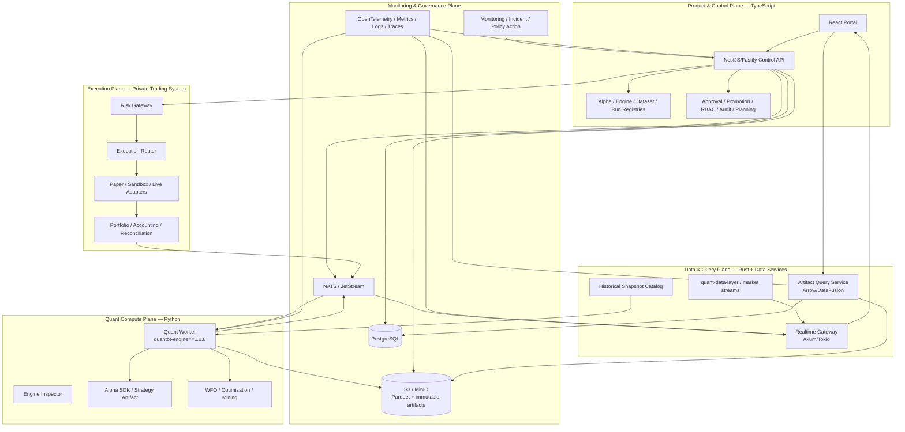

Tách bốn plane này phù hợp với mục tiêu cũ: control, quant compute, data/execution và monitoring/governance. fileciteturn0file9L816-L821

---

## 4. Đánh giá ngôn ngữ và tech stack

### 4.1 Ma trận quyết định định tính

Điểm dưới đây là đánh giá kiến trúc tương đối cho đúng workload này, không phải benchmark tuyệt đối.

| Tiêu chí | TypeScript | Rust | Python | Go | Java |
|---|---:|---:|---:|---:|---:|
| Product/control-plane delivery | Rất tốt | Trung bình | Tốt | Tốt | Tốt |
| Chia sẻ type với frontend | Rất tốt | Tốt qua codegen | Trung bình | Tốt qua codegen | Tốt qua codegen |
| Auth/RBAC/workflow/CRUD | Rất tốt | Tốt nhưng nhiều boilerplate | Tốt | Tốt | Rất tốt |
| Quant/strategy ecosystem | Yếu | Trung bình | Rất tốt | Yếu | Yếu–trung bình |
| Parquet/Arrow query service | Tốt | Rất tốt | Tốt | Tốt | Tốt |
| Realtime fan-out/backpressure | Tốt | Rất tốt | Trung bình–tốt | Rất tốt | Rất tốt |
| Memory predictability | Trung bình | Rất tốt | Trung bình | Rất tốt | Tốt |
| Iteration/UI contract velocity | Rất tốt | Trung bình | Tốt | Tốt | Trung bình |
| Phù hợp với core QuantBT | Qua worker contract | Qua artifact/query/native capability | Trực tiếp | Qua contract | Qua contract |
| Rủi ro khi thêm vào stack hiện tại | Thấp | Trung bình | Thấp | Cao vì overlap Rust | Cao vì thêm JVM domain |
| Quyết định | **Chọn làm control plane** | **Chọn có chọn lọc** | **Giữ cho compute** | Không chọn v1 | Không chọn v1 |

### 4.2 TypeScript — backend chính của portal

#### Vai trò

- API/BFF public cho browser.
- Identity/session integration, RBAC/ABAC.
- Domain workflow và state machines.
- Alpha/engine/dataset/run/deployment registry.
- Approval, audit, notification, planning.
- REST/OpenAPI, SSE và adapter tới Rust/Python/private engine.

#### Framework

**NestJS + Fastify adapter** là lựa chọn phù hợp hơn Fastify thuần cho scope này:

- NestJS cung cấp module, guard, interceptor, validation, dependency injection và test structure cho nhiều bounded context.
- Fastify giữ HTTP overhead thấp; NestJS có adapter chính thức và khuyến nghị Fastify khi ưu tiên hiệu năng. citeturn762760search0turn762760search19
- Webhook verification cần raw body có hỗ trợ chính thức với Fastify adapter. citeturn762760search4

Không nên tạo hai TS backend song song. Một `control-api-ts` dạng modular monolith là authority; module nào cần scale riêng sẽ được tách bằng contract đã có.

#### Stack đề xuất

```text
Runtime             Node.js LTS
Framework           NestJS + Fastify
API                  REST/JSON + OpenAPI; SSE; WebSocket only where needed
Validation           Zod/Ajv at external schema; generated DTO/contracts
Database             PostgreSQL, SQL-first typed query layer (Kysely/Drizzle-class)
Async/events         NATS + JetStream
Cache                Redis only for ephemeral cache/rate limit/session aids
Telemetry            OpenTelemetry + Pino structured logs
Testing              Vitest/Jest-class unit, Testcontainers integration, Pact/schema tests
Code generation      OpenAPI + Buf/Protobuf for cross-language contracts
```

### 4.3 Rust — backend hiệu năng cao nhưng không phải CRUD authority

#### Service 1: Artifact Query Service

Trách nhiệm:

- Đọc immutable Parquet từ object storage.
- Predicate pushdown theo run/segment/symbol/time range.
- Aggregate/resample/downsample server-side.
- Trả chart-ready JSON cho payload nhỏ hoặc Arrow IPC cho bulk table/export.
- Cache derived query theo artifact digest + query hash.
- Không tính lại domain metrics như Sharpe/selection objective trừ khi đó là một artifact derivation contract có version và parity test.

Stack:

```text
Axum + Tokio + Tower
Apache Arrow + Parquet
Apache DataFusion
object_store crate
SQLx for metadata lookup
Tonic/Protobuf or internal HTTP
tracing + OpenTelemetry
```

Axum tích hợp trực tiếp với Tokio/Hyper và Tower middleware; DataFusion là query engine Rust dùng Arrow làm in-memory format, phù hợp cho service đọc/aggregate Parquet. citeturn762760search1turn762760search2turn762760search3

#### Service 2: Realtime Gateway

Trách nhiệm:

- Một connection browser có thể subscribe nhiều channel: run progress, deployment health, orders, fills, positions, incidents và market snapshot.
- Fan-out, authorization theo subscription, backpressure, slow-consumer policy.
- Coalesce “latest-state” update; không ép mọi tick vào durable stream.
- Replay event quan trọng từ JetStream; market tick transient có thể dùng Core NATS hoặc upstream data layer.
- Axum có WebSocket support và Tower middleware phù hợp cho auth, timeout, tracing và compression. citeturn762760search1turn762760search5

#### Service 3: Runner Supervisor — tùy chọn

Chỉ cần khi:

- Chạy bare metal hoặc cần kiểm soát process tree, cgroup, signal/cancel chặt.
- Cần warm pool theo `engine_release_id` và dataset affinity.
- Kubernetes Job controller chưa đáp ứng latency/cost mục tiêu.

Không cần nếu Kubernetes đã đảm nhiệm pod lifecycle tốt. Không nên viết supervisor Rust chỉ để “có Rust”.

### 4.4 Python — compute authority

Python giữ đúng nơi có giá trị nhất:

- `quantbt-engine==1.0.8`.
- Strategy, feature, alpha mining và optimization.
- pandas/NumPy/PyArrow boundary.
- Pydantic model cho RunSpec worker-side.
- Optuna và domain-specific research.

Mỗi run phải chạy trong process/container cô lập. Python worker:

- Không expose public multi-user API.
- Không sở hữu RBAC hoặc approval.
- Không có broker live secret.
- Không ghi trực tiếp business state tùy ý vào Postgres; chỉ qua run/event contract.
- Chỉ đọc immutable artifact/snapshot được cấp quyền.

QuantBT 1.0.8 đã có prepared service context để replay nhiều signal/position matrix trên cùng market tape và có report level nhẹ hơn cho service/optimizer; worker scheduler nên khai thác affinity này trong optimization batch thay vì cache pandas object trong control API. citeturn362015view6

### 4.5 Vì sao không chọn Rust-only

Rust-only nghe hấp dẫn về benchmark nhưng tạo các vấn đề không cần thiết:

- Strategy vẫn là Python, nên FFI/process boundary vẫn tồn tại.
- Auth, admin, workflow, notification, roadmap và form-heavy API không phải bottleneck số học.
- Một Rust CRUD/control plane lớn làm chậm iteration product và tăng cost onboarding.
- Nguy cơ duplicate QuantBT domain logic trong Rust portal service.
- UI không nhanh hơn nếu payload vẫn quá lớn hoặc query không được aggregate.

Rust nên làm “data fast path”, không làm “mọi path”.

### 4.6 Vì sao không giữ Python làm toàn bộ backend

FastAPI prototype hiện tại vẫn có giá trị và không cần bỏ ngay. Tuy nhiên, dài hạn:

- Numerical dependencies và public API lifecycle bị coupling trong cùng process.
- WFO/optimization dễ cạnh tranh CPU/RSS với request handling nếu isolation không chặt.
- Frontend/contract evolution mất lợi thế TS end-to-end.
- Khi thêm identity, approval, audit, planning, deployment control, Python backend sẽ trở thành một platform monolith ngoài mục tiêu ban đầu của codebase quant.

Do đó migration phải theo strangler pattern: TS proxy/read model trước, workerize Python, rồi retire từng FastAPI control endpoint sau parity.

### 4.7 Vì sao không thêm Go

Go có thể thay Rust cho realtime/supervisor và là lựa chọn rất tốt nếu team vận hành mạnh Go. Nhưng khi định hướng đã chọn Rust vì QuantBT có native Rust capability và cần Arrow/Parquet service, Go tạo overlap:

- Hai event/realtime ecosystem.
- Hai serialization/client sets.
- Hai build/toolchain cho cùng lớp infrastructure.
- Không cải thiện Python integration hơn Rust/TS contract.

Quy tắc: **Go là phương án thay Rust, không phải cộng thêm Rust**.

### 4.8 Vì sao không thêm Java

Java/Spring hoặc Quarkus có thể xây control plane institutional tốt, nhưng trong hệ hiện tại:

- Frontend vẫn TypeScript.
- Quant vẫn Python.
- Data fast path đã giao Rust.
- Thêm JVM chỉ đáng khi team/company có platform Java mạnh, private trading engine chia sẻ Java domain library, hoặc enterprise integration bắt buộc.

Không có một trong các điều kiện đó thì Java làm tăng số runtime mà không giảm boundary.

---

## 5. Kiến trúc triển khai mục tiêu

### 5.1 Topology giai đoạn đầu

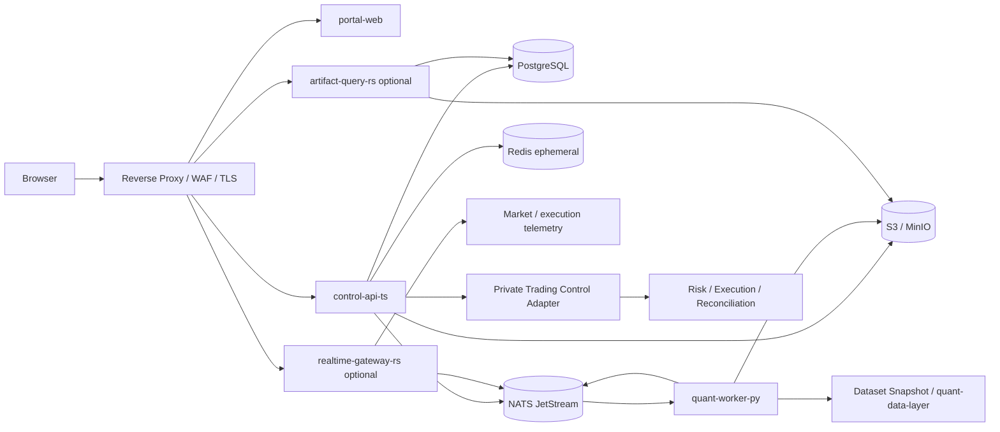

### 5.2 Physical deployment theo maturity

#### Stage A — Không microservice hóa quá sớm

```text
portal-web
control-api-ts
quant-worker-py pool
postgres
minio/s3
nats
redis optional
existing market-data/trading services
```

Artifact query vẫn có thể do TS API gọi object storage với giới hạn nhỏ hoặc một Python read adapter tạm thời. Mục tiêu là establish contract trước.

#### Stage B — Tách fast paths

```text
+ artifact-query-rs
+ realtime-gateway-rs
+ dedicated worker pools by engine release/resource class
+ TimescaleDB read models where useful
```

#### Stage C — Scale/operations

```text
+ Kubernetes Jobs or runner supervisor
+ regional read replicas/object-cache
+ ClickHouse only if event volume/query shape proves PostgreSQL/Timescale insufficient
+ dedicated optimization worker pools
```

### 5.3 Modular monolith boundaries trong `control-api-ts`

```text
src/modules/
  identity/
  organizations/
  workspaces/
  projects/
  alphas/
  alpha-imports/
  experiments/
  engine-catalog/
  datasets/
  runs/
  optimization/
  artifacts/
  approvals/
  promotions/
  deployments/
  accounts/
  risk-policies/
  monitoring/
  incidents/
  audit/
  notifications/
  planning/
  admin/
```

Mỗi module có:

```text
domain/          pure entities, policies, state transitions
application/     commands, queries, use cases
infrastructure/  postgres, nats, object store, external adapters
api/             controller, DTO, auth guard
contracts/       public events and schemas
```

Không module nào được import trực tiếp infrastructure/repository nội bộ của module khác. Cross-domain mutation đi qua application command hoặc event; read có thể dùng denormalized query model.

### 5.4 Authority matrix

| Dữ liệu/quyết định | System of record | Không được tự quyết ở đâu |
|---|---|---|
| User/session/role | Identity provider + Control API/Postgres | Python worker, Rust query service |
| Alpha version/artifact digest | Alpha Registry/Postgres + object store | Browser, notebook local state |
| Engine capability | Engine Inspector manifest | React hardcode |
| Dataset snapshot | Data Catalog | Run worker dùng “latest” path |
| Run state | Run Registry/Postgres | Worker local file là authority duy nhất |
| Numerical result | QuantBT artifact | Frontend recomputation |
| Approval/promotion | Governance module/Postgres | Slack/email reply hoặc manual config |
| Risk permission | Private Risk Engine | Portal button state |
| Order/fill/position/PnL | Execution/ledger/reconciliation | Portal inferred state |
| Incident action | Monitoring policy + authorized operator | Chart interaction |
| Roadmap/task | Planning module/Postgres | Separate SQLite lâu dài |

---

## 6. Service responsibility và contract boundary

### 6.1 `portal-web` — React/Vite/TypeScript

#### Sở hữu

- Routing, page shell, design system và accessibility.
- Query/cache client state.
- Form generation từ JSON Schema/UI Schema.
- Chart/table rendering.
- Optimistic interaction chỉ cho UX; server vẫn là authority.
- SSE/WS reconnect state và notification UX.

#### Không sở hữu

- Tính QuantBT metric.
- Chọn best trial/candidate.
- Suy diễn execution fill hoặc position.
- Giữ broker secret.
- Quyết định user có thể live deploy chỉ từ client-side role.

#### Frontend stack đề xuất

```text
React + Vite + TypeScript
React Router hoặc TanStack Router (giữ React Router nếu migration thấp hơn)
TanStack Query
TanStack Table + TanStack Virtual
React Hook Form + Zod/Ajv
Radix UI primitives + portal-owned component package
CSS variables là source of truth; Tailwind/shadcn pattern có thể dùng nhưng phải map vào token hiện tại
Apache ECharts cho quant analytics
TradingView Lightweight Charts cho candle/trade overlay mặc định
React Flow chỉ cho lineage/composition graph khi thực sự cần
Dnd Kit cho task board
Lucide icons
Playwright + Testing Library + visual regression
```

Frontend hiện đã dùng React/Vite, TanStack Query, ECharts, Lucide và đúng ba font Inter/JetBrains Mono/Newsreader, nên nên tiến hóa trên nền đó thay vì rewrite UI framework. citeturn597331view5

### 6.2 `control-api-ts` — authoritative control plane

#### Commands

- `CreateAlphaImport`
- `PublishAlphaVersion`
- `CreateExperiment`
- `PreflightRun`
- `SubmitRun`
- `CancelRun`
- `RetryRun`
- `RequestApproval`
- `ApprovePromotion`
- `CreateDeployment`
- `Start/Pause/Stop/RollbackDeployment`
- `AcknowledgeIncident`
- `ApplyProtectiveAction`
- `CreateRoadmapItem/Task`

#### Queries

- Catalog/search/filter alpha, runs, deployments, incidents.
- Read model dashboard.
- Policy/evidence status.
- Artifact metadata and signed query/export URLs.
- Capability schema.
- Account/venue health.

#### Invariants

- Mọi state transition validate version hiện tại và actor permission.
- Mọi write có `request_id`, `actor_id`, `workspace_id`, `idempotency_key`.
- Mọi business write và outbound event dùng transactional outbox.
- Không publish NATS event trước khi DB commit.
- Không cho retry tạo run ID mới một cách mơ hồ; retry tạo `run_attempt_id` mới dưới cùng immutable `run_id` hoặc clone thành run mới có lineage explicit.

### 6.3 `engine-inspector-py`

Một image/tool nhỏ chạy khi build hoặc đăng ký engine release:

1. Cài exact `quantbt-engine` wheel.
2. Import public `QuantBTEndpoint` và capability API/registry.
3. Thu thập version, extras, optional dependency, backend availability.
4. Build JSON Schema cho factory configuration và run input.
5. Chạy smoke/capability probe bằng synthetic data.
6. Ký/hash `engine-capability-manifest.json`.
7. Control plane chỉ cho `ACTIVE` khi manifest signature, package hash và smoke gate pass.

Inspector phải dùng public API hoặc một capability-export API chính thức trong QuantBT. Không scrape docstring như permanent contract.

### 6.4 `quant-worker-py`

#### Input

Worker nhận một `RunEnvelope` bất biến:

```text
run_id
run_attempt_id
workspace_id
engine_release_id + wheel/image digest
endpoint_id
alpha_version_id + artifact digest
run_spec_uri + sha256
dataset_snapshot_id
universe_snapshot_id
resource_profile
trace_context
```

#### Lifecycle

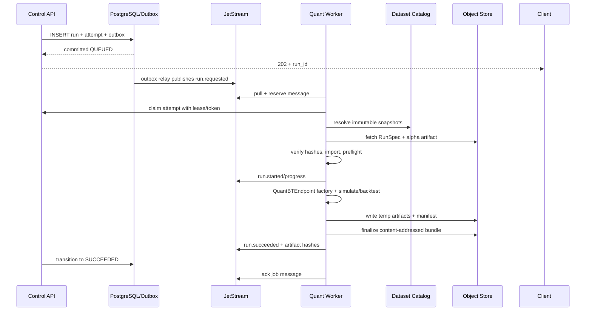

#### Failure handling

- Worker không ack JetStream job cho đến khi result/failure event đã persisted hoặc claim lease được release an toàn.
- Redelivery phải nhìn thấy `run_attempt_id` đã completed và trở thành no-op.
- Failure code chuẩn hóa: `ENGINE_IMPORT_FAILED`, `CAPABILITY_MISMATCH`, `DATASET_NOT_FOUND`, `SCHEMA_INVALID`, `ALPHA_IMPORT_FAILED`, `RESOURCE_EXCEEDED`, `CANCELLED`, `ENGINE_ERROR`, `ARTIFACT_COMMIT_FAILED`, `LEASE_LOST`.
- Structured logs có `run_id`, `attempt_id`, `alpha_version_id`, `engine_release_id`, `trace_id`.
- Cancellation là desired-state command; worker kiểm tra cooperative token giữa fold/trial và supervisor có hard kill sau grace period.

### 6.5 `artifact-query-rs`

#### Public/internal API mẫu

```http
GET /v1/runs/{run_id}/series
  ?segment=oos
  &columns=timestamp,equity,drawdown
  &from=...
  &to=...
  &max_points=4000
  &method=lttb

GET /v1/runs/{run_id}/table/trades
  ?cursor=...
  &limit=200
  &symbol=BTCUSDT
  &sort=-exit_time

POST /v1/runs/compare/series
{
  "run_ids": ["...", "..."],
  "segment": "oos",
  "normalization": "rebased_100",
  "max_points": 4000
}

GET /v1/studies/{study_id}/trials
  ?fields=number,state,objective,params,duration
  &filters=...
  &cursor=...
```

#### Query contract

- Query chỉ đọc artifact đã register và actor có quyền.
- `artifact_schema_version` quyết định parser.
- Response có `source_artifact_digest`, `query_hash`, `downsample_method`, `source_rows`, `returned_rows`, `truncated`.
- Server không silently đổi time zone, return unit hoặc segment semantics.
- Large export trả signed object URL hoặc Arrow stream; không proxy file nhiều GB qua Node API.

### 6.6 `realtime-gateway-rs`

#### Subscription topics browser-facing

```text
runs:{run_id}:progress
runs:{run_id}:logs-tail
studies:{study_id}:progress
deployments:{deployment_id}:health
deployments:{deployment_id}:orders
deployments:{deployment_id}:fills
deployments:{deployment_id}:positions
accounts:{account_id}:equity
incidents:{workspace_id}
market:{instrument_id}:{timeframe}
```

#### Policy

- Browser gửi subscription request; gateway gọi/verify signed authorization snapshot từ Control API.
- Subscription token ngắn hạn, chứa workspace/project/resource/action.
- Slow consumer:
  - Market/latest health: coalesce và drop superseded update.
  - Order/fill/incident: không drop; disconnect và yêu cầu replay từ cursor nếu buffer vượt ngưỡng.
- Event payload có `event_id`, `schema_version`, `sequence`, `occurred_at`, `source`, `resource_id`.
- Client reconnect dùng last acknowledged cursor cho durable channel.

### 6.7 NATS và event semantics

NATS JetStream phù hợp cho job/domain event đa ngôn ngữ vì thêm persistence, replay và at-least-once delivery; consumer state/ack do server theo dõi. Core NATS chỉ giao message cho subscriber đang online và phù hợp hơn với transient latest-state. citeturn328700view6

#### Đề xuất stream/subject

```text
Stream CONTROL_EVENTS
  alpha.*
  dataset.*
  run.*
  approval.*
  promotion.*
  deployment.*
  incident.*

Stream QUANT_JOBS
  quant.run.requested.{resource_class}
  quant.run.cancelled
  quant.study.requested.{resource_class}

Stream EXECUTION_EVENTS
  execution.order.*
  execution.fill.*
  execution.position.*
  execution.reconciliation.*

Core NATS / transient
  market.latest.*
  worker.heartbeat.*
  ui.presence.*
```

JetStream hỗ trợ TypeScript, Go, Python, Java và Rust client patterns; worker pool nên dùng pull consumer với explicit ack để kiểm soát batch/concurrency. citeturn328700view7

#### Event envelope

```json
{
  "event_id": "evt_01...",
  "event_type": "quant.run.progressed.v1",
  "schema_version": 1,
  "aggregate_type": "run_attempt",
  "aggregate_id": "ra_01...",
  "aggregate_version": 12,
  "workspace_id": "ws_01...",
  "occurred_at": "2026-08-13T10:00:00.123456Z",
  "produced_at": "2026-08-13T10:00:00.130000Z",
  "producer": "quant-worker-py@sha256:...",
  "traceparent": "00-...",
  "idempotency_key": "ra_01...:progress:12",
  "payload": {}
}
```

### 6.8 Protocol selection

| Boundary | Protocol | Lý do |
|---|---|---|
| Browser → Control API | REST/JSON + OpenAPI | Cache/debug/tooling tốt, phù hợp workflow/forms |
| Browser ← Run progress | SSE | Một chiều, reconnect đơn giản, ít overhead |
| Browser ↔ Live ops | WebSocket | Multi-topic realtime, ack/cursor |
| Control API → Async worker | NATS JetStream + Protobuf/JSON schema | Durable, retry, cross-language |
| Control API ↔ Rust query | Internal HTTP/gRPC | Typed low-latency request/response |
| Bulk artifacts | Parquet/Arrow/object URL | Không serialize millions rows vào JSON |
| Trading control | Signed versioned command/event contract | Audit, idempotency, fail-closed |
| TradingView chart | Datafeed HTTP + WebSocket | Historical bars + realtime updates |

---

## 7. Full QuantBT 1.0.8 integration

### 7.1 Public contract phải là boundary duy nhất

`QuantBTEndpoint` là public integration layer; factory khai báo account/backend/sizing/execution/strategy mode, còn `backtest()`/`simulate()` nhận dữ liệu cụ thể. Điều này cho phép engine thay internal implementation mà service giữ stable contract. citeturn362015view0

Portal không được:

- Import internal kernel.
- Tự chọn private backend class.
- Sửa result rồi gọi đó là QuantBT result.
- Hardcode `backend="rust"` vì package 1.0.8 ghi rõ `auto` vẫn là Python và Rust chỉ explicit capability-gated. citeturn597331view9

### 7.2 Stable factory/routes cần support

Từ public endpoint contract hiện tại, portal phải nhận biết ít nhất các factory sau. citeturn362015view0turn362015view1

| Category | `endpoint_id` / factory | Use case | UI chuyên biệt |
|---|---|---|---|
| Legacy signal | `pct_equity` | `%_equity`, notional theo live equity | Signal config, legacy warning |
| Fast signal | `signal_notional` | Single-symbol vectorized research | Signal column, sizing, cost |
| Intrabar | `intrabar_bracket` | Next-open SL/TP/trailing/reversal | Bracket visualizer, causal timing |
| Reference | `intrabar_bracket_reference` | Readable oracle/parity | Validation badge, compare kernel |
| Replay | `fill_replay` | Accounting từ explicit fills | Fill schema/import, replay audit |
| Structured | `dca_ladder` | DCA/grid levels, high/low touch | Ladder editor, touch assumptions |
| Orders | `orders` | Explicit market/limit/stop intents | Order lifecycle config |
| Event strategy | `event_driven` | Reactive strategy hoặc orders facade | Input mode, profile, backend capability |
| Basket | `basket` | Pair/basket frozen hedge-ratio units | Leg editor, hedge/freeze policy |
| Arbitrage | `arbitrage` | Package-style arbitrage | Leg/package validation, rejection report |
| Validation workflow | `walk_forward` | Fold-based train/select/stitch | WFO Lab |
| Validation workflow | `train_test_split` | Single holdout với WFO modes | Three-window/default protocol |
| Portfolio | `portfolio` | Multi-symbol positions/weights/notionals | Universe, exposure, rebalance, attribution |
| External validation | `nautilus_validation` | Independent smaller-run validation | Capability/known-difference evidence |

QuantBT 1.0.8 mô tả thêm native portfolio, prepared contexts, Optuna adapters, event/order/fill, basket/arbitrage, margin/funding/liquidation và stable audit artifacts; portal nên surface đúng capability thay vì chỉ dựng một backtest form chung chung. citeturn362015view5

### 7.3 Capability không nằm trong stable factory table

Một số mode/backend có thể tồn tại trong package code hoặc optional extras nhưng chưa phải stable public factory ở table trên, ví dụ options/native package capability. Quy tắc portal:

- Chỉ hiển thị khi `EngineCapabilityManifest` của exact release công bố.
- Gắn `STABLE`, `EXPERIMENTAL`, `SCHEMA_ONLY`, `VALIDATION_ONLY`, `DISABLED`.
- Không suy ra capability từ tên method hoặc README cũ.
- Không cho promotion live nếu certification policy của capability chưa đạt.

### 7.4 Engine Capability Manifest

#### Mục tiêu

- Full QuantBT support mà không sửa frontend cho mỗi endpoint mới.
- Pin UI form và validation vào exact engine release.
- Phân biệt factory, mode, backend, input contract, result schema và certification.

#### Schema đề xuất

```json
{
  "manifest_schema_version": "1.0.0",
  "engine": {
    "package": "quantbt-engine",
    "version": "1.0.8",
    "python": ">=3.11,<3.14",
    "wheel_sha256": "...",
    "image_digest": "sha256:...",
    "built_at": "..."
  },
  "capabilities": [
    {
      "endpoint_id": "event_driven",
      "display_name": "Event-Driven Strategy",
      "category": "event_execution",
      "factory": "QuantBTEndpoint.event_driven",
      "status": "stable",
      "input_modes": ["strategy", "orders"],
      "profiles": ["research", "optimize", "audit"],
      "backends": [
        {"id": "auto", "available": true, "policy": "release_default"},
        {"id": "python", "available": true, "certification": "canonical"},
        {"id": "rust", "available": false, "reason": "native wheel absent"}
      ],
      "execution_contracts": ["event_lifecycle_v2"],
      "factory_schema_ref": "schemas/event_driven.factory.schema.json",
      "run_input_schema_ref": "schemas/event_driven.input.schema.json",
      "result_schema_ref": "schemas/backtest-result-v2.schema.json",
      "required_dataset_capabilities": ["ohlcv", "timezone_aware"],
      "artifacts": ["metrics", "equity", "orders", "fills", "audit"],
      "ui": {
        "renderer": "event-driven-run-form",
        "advanced_sections": ["margin", "funding", "retention"],
        "docs_anchor": "event-driven"
      },
      "certification": {
        "research": "pass",
        "paper": "conditional",
        "sandbox": "conditional",
        "live": "blocked"
      }
    }
  ],
  "signature": "..."
}
```

### 7.5 Capability status và policy

| Status | Research | Paper | Sandbox | Live |
|---|---:|---:|---:|---:|
| `STABLE` | Có | Theo alpha policy | Theo venue policy | Theo certification |
| `EXPERIMENTAL` | Có cảnh báo | Có thể shadow | Không mặc định | Không |
| `VALIDATION_ONLY` | So sánh | Không deploy | Không deploy | Không |
| `SCHEMA_ONLY` | Xem contract | Không run | Không | Không |
| `DISABLED` | Không | Không | Không | Không |

### 7.6 Generic Run API thay vì route riêng cho từng factory

```http
POST /v1/runs/preflight
POST /v1/runs
GET  /v1/runs/{run_id}
POST /v1/runs/{run_id}/cancel
POST /v1/runs/{run_id}/retry
POST /v1/runs/{run_id}/clone
GET  /v1/runs/{run_id}/artifacts
GET  /v1/runs/{run_id}/events
```

`POST /v1/runs` dùng `endpoint_id` và schema-resolved config:

```json
{
  "idempotency_key": "ui-01J...",
  "workspace_id": "ws_01...",
  "project_id": "prj_01...",
  "alpha_version_id": "av_01...",
  "engine_release_id": "er_quantbt_1_0_8_py312",
  "endpoint_id": "walk_forward",
  "dataset_snapshot_id": "dss_01...",
  "universe_snapshot_id": "uss_01...",
  "protocol": "three_window_decay_v1",
  "factory_config": {},
  "run_input": {},
  "methodology": {},
  "resource_profile": "cpu-large",
  "retention_profile": "audit",
  "tags": ["candidate", "btc", "daily"]
}
```

### 7.7 Typed preflight

Preflight phải trả:

```json
{
  "valid": false,
  "errors": [
    {"path": "/methodology/holdout/from", "code": "WINDOW_OVERLAP", "message": "..."}
  ],
  "warnings": [
    {"code": "EXPERIMENTAL_BACKEND", "severity": "warning", "message": "..."}
  ],
  "resolved": {
    "engine_digest": "sha256:...",
    "alpha_digest": "sha256:...",
    "dataset_digest": "sha256:...",
    "execution_contract": "close_target_v2",
    "backend": "python",
    "estimated_trials": 400,
    "estimated_fold_count": 6,
    "estimated_compute_units": 2400,
    "approval_required": false
  }
}
```

Preflight không được chỉ validate JSON. Nó phải validate:

- Actor permission và quota.
- Alpha supported endpoint/execution contract.
- Dataset columns, timeframe, symbol/universe và quality status.
- Date windows, causal split, warmup và non-overlap.
- Backend/capability availability.
- Parameter bounds và combinatorial explosion.
- Resource class.
- Live/paper restrictions nếu run gắn promotion context.

### 7.8 Event-driven profiles trong UI

QuantBT 1.0.8 định nghĩa `research`, `optimize`, `audit` với retention/execution khác nhau; `backend="rust"` là explicit capability request và không silently fallback. citeturn362015view2

Portal render:

| Profile | Mục đích UI | Artifact mặc định | Guardrail |
|---|---|---|---|
| `research` | Iteration nhanh | Minimal metrics/series | Không dùng trực tiếp làm approval evidence |
| `optimize` | Trial scoring | Objective + compact trial output | Không tải audit ledger mỗi trial |
| `audit` | Final replay/certification | Full orders/fills/accounting/audit | Bắt buộc cho approval/live evidence |

Optimization phải chạy profile nhẹ cho trials, rồi tự động tạo **final audit replay** bằng selected params. Trial tốt nhất không tự động là approved run.

### 7.9 WFO và train/test correctness

Portal phải giữ nguyên semantics từ QuantBT metadata:

- Fold-local IS-only retraining.
- Outer OOS không tham gia candidate selection khi mode yêu cầu causal validation.
- Seed được xác định theo run/fold.
- Không lấy “latest fold params” làm deployment params nếu policy không nói vậy.
- Holdout mutation test phải chứng minh holdout không tham gia selection.

Public docs của QuantBT mô tả outer OOS chỉ được score sau khi params đã frozen và unsupported schedule/mode phải raise, không fallback. citeturn362015view4

### 7.10 Prepared context và worker scheduling

Prepared context chỉ được reuse khi cache key đầy đủ:

```text
engine_release_digest
endpoint_id
execution_contract
backend
report_level
market_tape_digest
symbol/universe mapping digest
alignment policy
corporate action/funding/borrow digest
```

Không cache user-generated signal nếu strategy semantics không đảm bảo deterministic/pure. Cache là worker-local hoặc pool-affinity optimization; kết quả cuối vẫn gắn exact input hashes.

---

## 8. Run, study và artifact architecture

### 8.1 Tách `run`, `run_attempt`, `study`, `trial`

| Entity | Ý nghĩa |
|---|---|
| `run` | Immutable research/backtest intent và RunSpec hash |
| `run_attempt` | Một lần thực thi cụ thể; retry tạo attempt mới |
| `study` | Optimization/WFO experiment gồm nhiều trial/fold |
| `trial` | Một parameter candidate/scoring execution |
| `artifact` | Immutable output có schema/version/hash |
| `derived_artifact` | Query/downsample/report tạo từ source artifact, có lineage |

Không đặt trạng thái retry trực tiếp lên cùng một execution record vì sẽ mất lịch sử resource/error/artifact của lần trước.

### 8.2 Run state machine

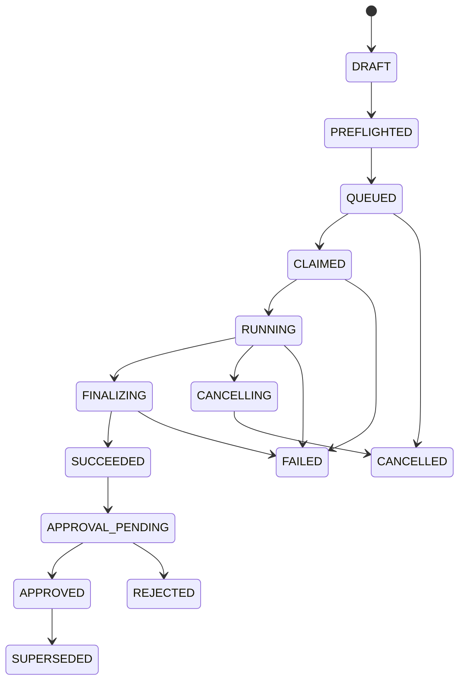

`run.status` là aggregate state; `attempt.status` có lease/start/heartbeat/resource/error riêng.

### 8.3 Content-addressed artifact layout

```text
s3://quant-platform/
  engines/{engine_release_id}/{manifest_sha}/...
  alphas/{alpha_id}/{alpha_version_id}/{artifact_sha}/...
  datasets/{dataset_id}/snapshots/{snapshot_id}/...
  runs/{workspace_id}/{run_id}/
    run-spec/{run_spec_sha}.json
    attempts/{run_attempt_id}/
      temp/...
      bundle/{bundle_sha}/
        manifest.json
        metrics/metrics.v2.json
        audit/audit.v2.json
        config/resolved-config.json
        quality/data-quality.json
        series/is.parquet
        series/oos.parquet
        series/holdout.parquet
        orders/orders.parquet
        fills/fills.parquet
        positions/positions.parquet
        trades/trades.parquet
        wfo/folds.parquet
        wfo/trials.parquet
        wfo/candidates.parquet
        wfo/selection-trace.json
        attribution/by-symbol.parquet
        reports/report.html
        logs/structured.ndjson.zst
        attestations/provenance.json
        checksums.sha256
```

Layout này mở rộng artifact contract hiện tại mà không phá các artifact đã có. Current prototype đã dùng manifest/metrics/audit, WFO Parquet và segment Parquet; migration nên có importer/schema adapter thay vì đổi tất cả một lần. citeturn576605view6

### 8.4 Artifact manifest tối thiểu

```json
{
  "artifact_schema_version": "2.0.0",
  "run_id": "run_01...",
  "run_attempt_id": "ra_01...",
  "status": "succeeded",
  "engine": {
    "release_id": "er_...",
    "package": "quantbt-engine",
    "version": "1.0.8",
    "wheel_sha256": "...",
    "image_digest": "sha256:...",
    "backend": "python",
    "endpoint_id": "walk_forward"
  },
  "alpha": {
    "alpha_version_id": "av_...",
    "artifact_digest": "sha256:...",
    "entrypoint": "my_alpha.strategy:Alpha"
  },
  "data": {
    "dataset_snapshot_id": "dss_...",
    "universe_snapshot_id": "uss_...",
    "content_digest": "sha256:...",
    "quality_report_digest": "sha256:..."
  },
  "run_spec_sha256": "...",
  "random_seed": 42,
  "execution_contract": "close_target_v2",
  "artifacts": [],
  "warnings": [],
  "capabilities_used": [],
  "created_at": "...",
  "completed_at": "...",
  "producer_attestation": {},
  "bundle_sha256": "..."
}
```

### 8.5 Artifact commit protocol

1. Worker ghi vào temp prefix theo attempt.
2. Tính checksum từng file.
3. Validate artifact schema và reconciliation checks.
4. Ghi `manifest.json` cuối cùng.
5. Copy/commit sang content-addressed bundle prefix hoặc object-lock version.
6. Publish `run.succeeded` chứa bundle hash.
7. Control plane register bundle trong một transaction.
8. Temp prefix được GC theo retention.

Nếu event publish thành công nhưng DB chưa register, outbox/reconciler phải phát hiện orphan bundle. Nếu DB state `SUCCEEDED` nhưng bundle missing/checksum fail, run chuyển `CORRUPT` và block approval.

### 8.6 Read models

Không để dashboard query trực tiếp hàng chục bảng normalized. Tạo read model:

```text
alpha_catalog_view
run_catalog_view
run_summary_view
deployment_health_view
portfolio_performance_daily
incident_inbox_view
workspace_command_center_view
roadmap_release_view
```

Read model có `source_event_cursor`, `updated_at`, `staleness_ms`. UI hiển thị staleness badge khi vượt SLA.

### 8.7 PostgreSQL, TimescaleDB, ClickHouse

#### PostgreSQL — bắt buộc

- Metadata, identity binding, state machines, policies, audit index, outbox.
- JSONB cho immutable schema payload nhưng critical searchable fields vẫn normalized/indexed.
- Row-level security có thể dùng defense-in-depth cho tenant/workspace.
- Advisory lock/unique constraint cho claim/idempotency.

#### TimescaleDB — tùy workload

Dùng extension/read database cho:

- Deployment health samples.
- Account equity/PnL time series.
- Execution latency aggregates.
- Monitoring SLI.

Không dùng Timescale để thay object store cho raw backtest artifacts.

#### ClickHouse — chưa cần ở MVP

Chỉ thêm khi:

- Orders/fills/signals/telemetry vượt khả năng query/read model của Postgres/Timescale.
- Có benchmark và query pattern cụ thể.
- Team đủ khả năng backup/upgrade/operate thêm datastore.

### 8.8 Object storage

- Production: S3-compatible managed/object store có versioning, encryption, lifecycle và object lock nơi cần.
- Local/CI: MinIO.
- Dataset, alpha artifact, engine artifact và run artifact là immutable.
- Signed URL ngắn hạn, permission checked trước khi issue.
- Không nhúng local filesystem path vào public API.

### 8.9 Redis

Chỉ dùng cho:

- Ephemeral query cache.
- Rate limiter/token bucket.
- Distributed short lock không critical.
- Session aid nếu identity architecture cần.

Không dùng Redis list/pubsub làm source of truth cho run queue hoặc audit event.

### 8.10 Historical Market Data reader boundary

Historical storage không phải một object-store path mà Portal được tự do scan.
Portal đi qua approved reader contract tại [§P0.24A](#p024a-historical-market-data-consumer-contract--addendum-2026-08-15),
với canonical storage mount read-only và accepted release manifest. Boundary này
tồn tại trước U13 để current QuantBT FastAPI có thể dùng data thật an toàn.

U13 bọc reader output thành `Dataset`, `DatasetSnapshot`, `UniverseSnapshot` và
`DataQualityReport`; nó không thay reader bằng direct filesystem access. Một
approved storage release có thể cấp nhiều dataset family, nhưng availability
vẫn được đánh giá theo từng family + schema adapter + environment smoke.

```text
accepted release manifest
  -> reader compatibility + family eligibility
  -> bounded typed query
  -> normalized frame/table/matrix + provenance
  -> immutable Portal DatasetSnapshot identity
  -> preflight / run manifest / artifact lineage
```

Historical read path, realtime event path và future ingest/control path là ba
concern riêng. Việc historical reader đã sẵn sàng không tự động chứng nhận
realtime hoặc cấp cho Portal quyền vận hành collectors.

---

## 9. Alpha Platform và chuẩn import dự kiến

> Phần contract dưới đây là **draft placeholder** để sau này thay bằng mẫu chuẩn Python mà owner cung cấp. Mục tiêu hiện tại là khóa boundary và UI flow, không đóng cứng tên class.

### 9.1 Phân biệt các khái niệm

| Entity | Ý nghĩa |
|---|---|
| `alpha` | Identity logic dài hạn, ví dụ `delta-rsi-polynomial` |
| `alpha_version` | Một version immutable của code + manifest + dependency |
| `alpha_artifact` | Wheel/OCI/content digest thực thi |
| `experiment` | Một research intent/config có thể chưa đủ chuẩn publish |
| `candidate` | Kết quả experiment đề xuất thành alpha version |
| `strategy_composition` | Ensemble/portfolio graph của nhiều alpha version |
| `certification` | Evidence cho research/paper/sandbox/live eligibility |
| `promotion` | Quyết định đưa exact artifact/config sang environment kế tiếp |

### 9.2 Package layout đề xuất

```text
alpha-package/
  alpha.yaml
  pyproject.toml
  uv.lock                         # hoặc lockfile được policy chấp nhận
  README.md
  src/
    my_alpha/
      __init__.py
      strategy.py                 # entrypoint
      features.py
      adapters.py
      contracts.py
  schemas/
    parameters.schema.json
    output.schema.json
    ui.schema.json
  tests/
    test_contract.py
    test_determinism.py
    test_no_lookahead.py
    test_smoke_quantbt.py
    fixtures/
  evidence/
    methodology.md
    known_limitations.md
```

### 9.3 `alpha.yaml` draft

```yaml
schema_version: alpha-manifest/v1
alpha_id: delta-rsi-polynomial
version: 1.4.0
name: Delta RSI Polynomial
owner:
  team: quant-research
  maintainers: [user_123]
entrypoint: my_alpha.strategy:Alpha
artifact:
  type: python-wheel
  digest: sha256:...
  lock_digest: sha256:...
  sbom_digest: sha256:...

strategy:
  family: momentum
  input_kind: target_signal
  supported_endpoint_ids:
    - signal_notional
    - walk_forward
    - train_test_split
  execution_contracts:
    - close_target_v2
  determinism:
    seed_required: true
    external_io: false

data_requirements:
  asset_classes: [crypto]
  columns: [open, high, low, close, volume]
  timeframes: [1h, 4h, 1d]
  warmup_bars: 300
  point_in_time: true
  funding: optional
  borrow: none
  corporate_actions: none

parameters:
  schema: schemas/parameters.schema.json
  manager_exposed:
    - rsi_period
    - polynomial_degree
    - entry_threshold
    - exit_threshold
  immutable_for_live:
    - execution_delay

outputs:
  contract: target-signal-frame/v1
  schema: schemas/output.schema.json

resources:
  cpu: 2
  memory_mb: 4096
  timeout_seconds: 1800
  network_policy: deny

certification:
  current_level: research
  required_tests:
    - contract
    - deterministic
    - lookahead
    - quantbt_smoke
```

### 9.4 Canonical output contracts

Portal/worker không nên ép mọi alpha trả cùng một DataFrame mơ hồ. Dùng explicit output kind:

1. `TargetSignalFrame/v1`
   - `timestamp`, `instrument_id`, `target`, optional `confidence`, `reason_code`.
2. `TargetPositionFrame/v1`
   - `target_units`, `target_notional` hoặc `target_weight`, unit explicit.
3. `IntrabarIntentFrame/v1`
   - entry timing, stop/take-profit/trailing/reversal contract.
4. `OrderIntentStream/v1`
   - market/limit/stop, time-in-force, reduce-only, client intent ID.
5. `BasketIntentStream/v1`
   - package ID, legs, ratios, atomicity/hedge/freeze policy.
6. `ArbitragePackageStream/v1`
   - spread/package spec, rejection semantics.
7. `OptionPackageStream/v1`
   - chỉ bật khi engine capability và risk/accounting contract support.

Mỗi contract phải có:

- Unit và sign convention.
- Time semantics.
- Causal availability.
- Null/NaN policy.
- Duplicate policy.
- Instrument canonical ID.
- Expected QuantBT endpoint/execution contract.

### 9.5 Import sources

| Source | Policy |
|---|---|
| Git commit/tag | Khuyến nghị; CI checkout exact SHA, build artifact |
| Python wheel | Chấp nhận nếu hash/signature/SBOM và source provenance đạt policy |
| OCI image | Chấp nhận cho dependency phức tạp; non-root, read-only, signed |
| ZIP upload | Chỉ vào quarantine build pipeline, không execute trực tiếp |
| Notebook | Không phải deployable artifact; phải export/package qua SDK |
| Browser-pasted Python | Không hỗ trợ cho shared/live environment |

### 9.6 Import/publish pipeline

```mermaid
flowchart LR
    SRC[Git / Wheel / OCI / Quarantined ZIP] --> INGEST[Ingest + checksum]
    INGEST --> BUILD[Hermetic build]
    BUILD --> SBOM[SBOM + secret/license scan]
    SBOM --> CONTRACT[Manifest/schema/entrypoint validation]
    CONTRACT --> TEST[Unit + deterministic + lookahead + smoke]
    TEST --> PERF[Resource/performance profile]
    PERF --> CERT[Certification evidence]
    CERT --> REG[Alpha Version Registry]
    REG --> POOL[Alpha Pool]
```

#### Gate chi tiết

1. Source/provenance verified.
2. Dependency lock và license policy.
3. Secret scan, unsafe import/network/file policy.
4. Manifest and JSON Schema validation.
5. Entrypoint load trong sandbox.
6. Synthetic contract test.
7. Determinism test với same seed/input.
8. Timestamp/look-ahead checks.
9. Dataset requirement compatibility.
10. QuantBT smoke trên endpoint khai báo.
11. Resource limit test.
12. Artifact signing và immutable registry publication.

### 9.7 Alpha lifecycle

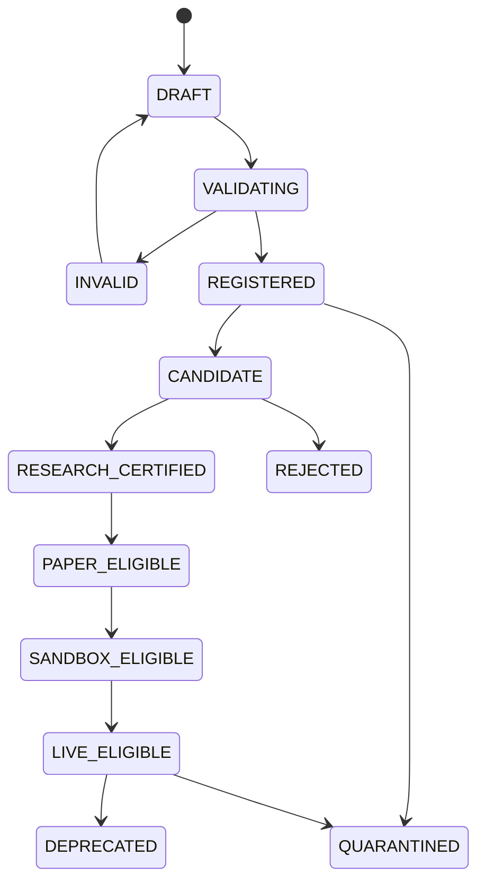

Status là evidence-based. `LIVE_ELIGIBLE` không đồng nghĩa đang live; deployment/promotion là aggregate riêng.

### 9.8 Alpha Pool scorecard

Mỗi alpha card/table row nên có:

- Owner/team, family, universe/timeframe.
- Latest certified version.
- Lifecycle stage.
- OOS/Holdout performance range, không chỉ một Sharpe.
- Drawdown, turnover, fee/funding drag, capacity proxy.
- Correlation/overlap với pool.
- Data quality/certification badges.
- Paper/live drift nếu có.
- Last evidence date và evidence staleness.
- Active deployments/allocation.
- Known limitations.

Không tạo một “Alpha Score” duy nhất che giấu methodology. Nếu cần ranking, hiển thị component breakdown và multiple-testing warning.

### 9.9 Alpha Research Workbench

Portal không thay IDE/notebook. Workbench là **experiment console**:

- Chọn alpha draft/version hoặc composition.
- Chọn dataset snapshot/universe/timeframe.
- Sửa manager/research-exposed params theo schema.
- Chọn endpoint/methodology/cost/risk assumptions.
- Preview signal/trades trên chart.
- Submit run/study.
- Xem trials/folds/candidates/lineage.
- Deep-link sang repository/Jupyter/VS Code environment nếu được cấu hình.

Source code chỉ hiển thị read-only metadata/diff/contract; sửa code diễn ra trong dev workflow và publish qua CI.

### 9.10 Alpha Mining

#### Domain model

```text
hypothesis
feature_recipe
feature_version
experiment_batch
candidate_alpha
novelty_report
correlation_report
capacity_report
promotion_candidate
```

#### Flow

1. Ghi hypothesis và expected mechanism.
2. Chọn point-in-time dataset và universe.
3. Chọn/generate feature recipe.
4. Batch experiment với budget/quota.
5. Filter invalid/unstable candidates.
6. Kiểm tra correlation/novelty với Alpha Pool.
7. Strict validation/WFO/holdout.
8. Researcher review methodology.
9. Package candidate thành alpha artifact.
10. Publish qua cùng certification pipeline.

UI phải phân biệt:

- **Mining score**: dùng để triage candidate.
- **Selection evidence**: dùng cho research review.
- **Approval evidence**: final audit replay.

Không dùng mining score trực tiếp để live promote.

### 9.11 Strategy Composer

Composer cho phép kết hợp **versioned alpha outputs**, không nối arbitrary Python node:

Operators được quản trị:

```text
weighted_sum
rank_normalize
volatility_scale
risk_budget
regime_gate
confidence_gate
voting
long_short_netting
conflict_resolution
turnover_cap
exposure_cap
rebalance_schedule
```

Mỗi composition có graph/version/hash và compile thành một `strategy_composition` artifact. Một thay đổi weight/operator tạo version mới.

### 9.12 TradingView integration

#### Khuyến nghị mặc định

- **ECharts** cho equity, drawdown, heatmap, sensitivity, trial/fold, contribution, treemap và monitoring analytics. ECharts hỗ trợ Canvas/SVG, progressive rendering, dataset transforms và accessibility features. citeturn328700view5
- **TradingView Lightweight Charts** cho candle/OHLC, volume, signal marker, order/fill overlay và synchronized crosshair. Cần giữ attribution theo license/NOTICE. citeturn297351search2

#### Advanced Charts

Advanced Charts chỉ dùng sau khi legal/licensing/use-case được xác nhận. Nó là client-side chart cần portal cung cấp historical/realtime datafeed; thư viện không cung cấp market data. citeturn328700view4

Lưu ý quan trọng:

- Advanced Charts miễn phí có điều kiện môi trường public và attribution; private/internal/paywalled use cần kiểm tra điều khoản phù hợp. citeturn297351search1
- Pine Script không được support trong Advanced Charts/Trading Platform libraries; custom indicator phải viết theo JavaScript API của library. citeturn297351search3
- Library không redistributable và không được đưa vào public repository. citeturn297351search18

#### TradingView alert/webhook adapter

Nếu alpha bên ngoài phát từ TradingView/Pine alert:

```text
TradingView webhook
  -> signed webhook gateway
  -> canonical ExternalSignalEvent
  -> validation/deduplication/timestamp policy
  -> paper or sandbox deployment by default
  -> risk gateway before any live order intent
```

Không cho webhook gọi broker adapter trực tiếp. Mọi alert có `source_alert_id`, `received_at`, `event_time`, `instrument_id`, `signal_contract`, `dedupe_key`, `payload_hash` và replay/audit record.

---

## 10. Domain model và lifecycle xuyên suốt

### 10.1 Aggregate chính

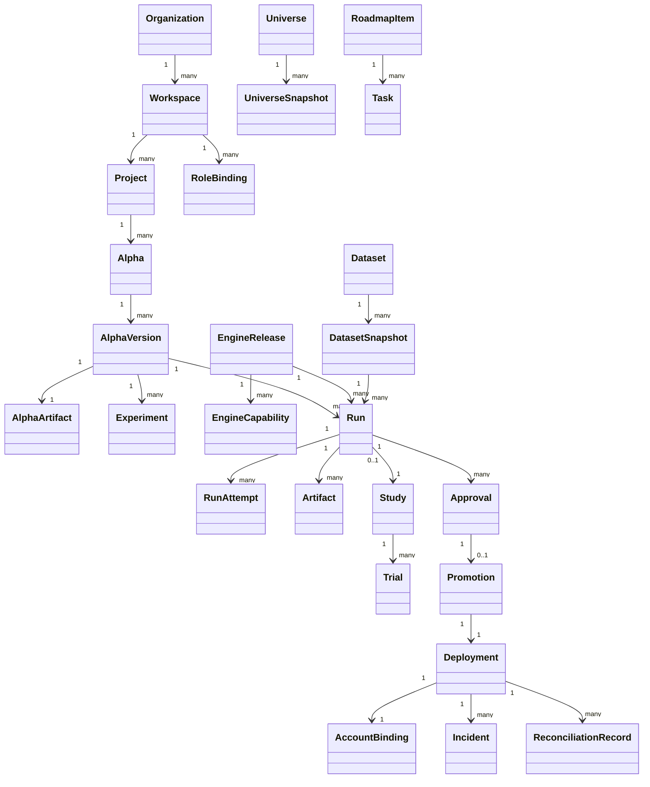

### 10.2 Core identifiers

Identifier không dùng human name làm primary key:

```text
org_id
workspace_id
project_id
alpha_id
alpha_version_id
alpha_artifact_id
dataset_id
dataset_snapshot_id
universe_snapshot_id
engine_release_id
engine_capability_id
experiment_id
study_id
trial_id
run_id
run_attempt_id
artifact_id
approval_id
promotion_id
deployment_id
account_id
incident_id
roadmap_item_id
task_id
```

Mọi ID có prefix để log/debug rõ và tránh cross-resource misuse.

### 10.3 Alpha, run và deployment linkage

Một live deployment phải truy ngược được:

```text
deployment_id
  -> promotion_id
  -> approval_id(s)
  -> final_audit_run_id
  -> run_spec_sha256
  -> alpha_version_id / alpha_artifact_digest
  -> engine_release_id / wheel + image digest
  -> dataset_snapshot_id / universe_snapshot_id
  -> selected params artifact
  -> risk policy version
  -> account binding version
```

Nếu bất kỳ link nào mutable hoặc không resolve được, deployment không đủ chuẩn production.

### 10.4 Promotion state machine

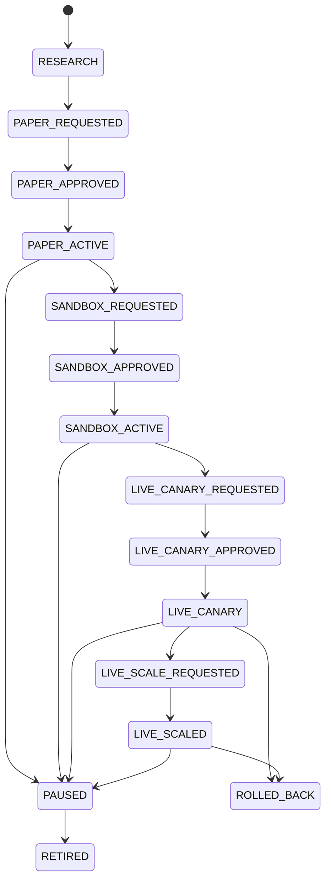

### 10.5 Gate matrix

| Gate | Research | Paper | Sandbox | Live canary | Live scaled |
|---|---:|---:|---:|---:|---:|
| Artifact signed/immutable | Required | Required | Required | Required | Required |
| Engine capability eligible | Research | Paper | Sandbox | Live | Live |
| Dataset quality | Pass | Pass | Pass/current feed | Pass/current feed | Pass/current feed |
| Final audit run | Recommended | Required | Required | Required | Required |
| Holdout/WFO evidence | Method-dependent | Required policy | Required | Required | Required |
| Paper observation | No | N/A | Required threshold | Required threshold | Continuous |
| Reconciliation | No | Simulator parity | Broker/testnet | Clean | Continuous clean |
| Risk approval | No | Optional | Required | Dual approval | Dual approval |
| Secret/account permission | No | Paper account | Sandbox-limited | Canary-limited | Scoped live |
| Rollback plan | No | Basic | Required | Required/tested | Required/tested |
| Incident/SLO readiness | No | Monitor | Required | Required | Required |

### 10.6 Deployment state machine

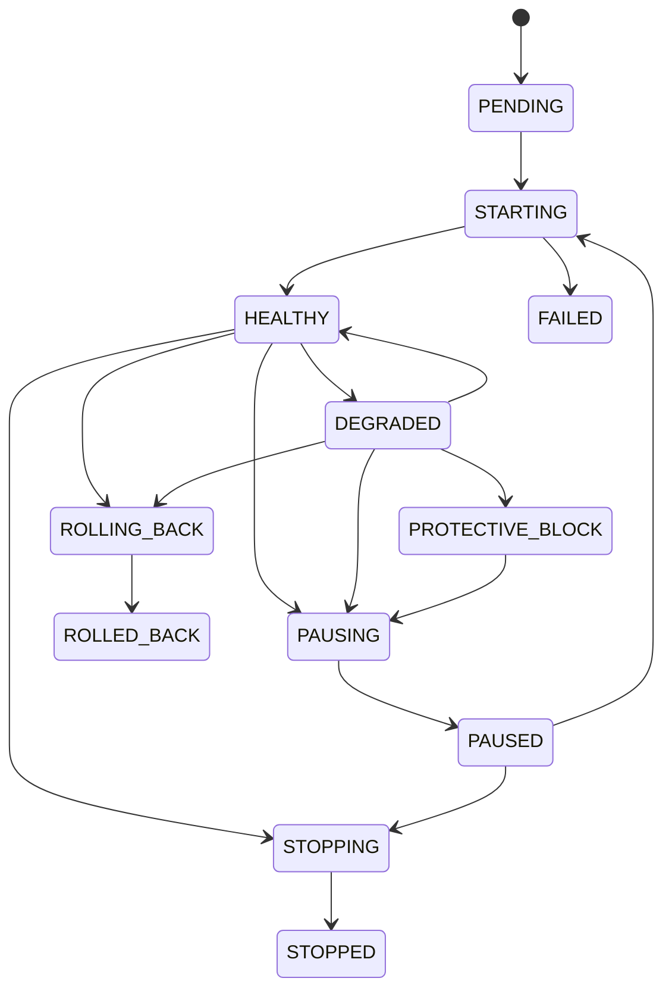

Portal hiển thị state nhưng private risk/execution system vẫn là authority cho khả năng nhận lệnh. `HEALTHY` trên portal không cấp quyền bypass risk.

### 10.7 Incident state machine

```text
OPEN -> ACKNOWLEDGED -> MITIGATING -> MONITORING -> RESOLVED -> CLOSED
                  \-> ESCALATED
OPEN/ACKNOWLEDGED/MITIGATING -> FALSE_POSITIVE (có evidence)
```

Mọi incident có:

```text
severity
scope/resource
first_seen/last_seen
rule/policy version
evidence links
owner/on-call
operator actions
protective action
resolution/root cause
follow-up tasks
```

### 10.8 Optimistic concurrency

Mọi aggregate write dùng `version`:

```http
PATCH /v1/deployments/{id}
If-Match: "17"
```

Nếu current version khác, trả `409 AGGREGATE_VERSION_CONFLICT`. Không dùng last-write-wins cho approval, deployment hoặc risk policy.

---

## 11. API surface đề xuất

### 11.1 Conventions

- Prefix `/api/v1`.
- OpenAPI là external contract; codegen TypeScript client.
- Cross-language internal events dùng Protobuf hoặc JSON Schema có compatibility gate.
- Cursor pagination, không offset cho bảng lớn.
- RFC 7807-style problem details.
- `Idempotency-Key` bắt buộc cho command tạo run/deployment/action.
- `ETag`/`If-Match` cho mutable aggregate.
- UTC RFC3339 với microseconds; không naive timestamp.
- Money/quantity ở string decimal hoặc scaled integer, không float JSON cho execution accounting.
- Mỗi response có `request_id`; mỗi async resource có `trace_id` hoặc trace link.

### 11.2 Identity và organization

```text
GET    /api/v1/me
GET    /api/v1/me/sessions
DELETE /api/v1/me/sessions/{session_id}
GET    /api/v1/organizations
POST   /api/v1/organizations
GET    /api/v1/workspaces
POST   /api/v1/workspaces
GET    /api/v1/projects
POST   /api/v1/projects
GET    /api/v1/role-bindings
POST   /api/v1/role-bindings
DELETE /api/v1/role-bindings/{id}
```

### 11.3 Alpha Registry

```text
GET    /api/v1/alphas
POST   /api/v1/alphas
GET    /api/v1/alphas/{alpha_id}
PATCH  /api/v1/alphas/{alpha_id}
GET    /api/v1/alphas/{alpha_id}/versions
POST   /api/v1/alpha-imports
GET    /api/v1/alpha-imports/{import_id}
POST   /api/v1/alpha-imports/{import_id}/validate
POST   /api/v1/alpha-imports/{import_id}/publish
GET    /api/v1/alpha-versions/{version_id}
POST   /api/v1/alpha-versions/{version_id}/certification-runs
POST   /api/v1/alpha-versions/{version_id}/quarantine
GET    /api/v1/alpha-versions/{version_id}/lineage
GET    /api/v1/alpha-pool/scorecards
GET    /api/v1/alpha-pool/correlation
```

### 11.4 Experiments, mining và composition

```text
POST   /api/v1/experiments
GET    /api/v1/experiments
GET    /api/v1/experiments/{id}
POST   /api/v1/experiment-batches
POST   /api/v1/mining-campaigns
GET    /api/v1/mining-campaigns/{id}/candidates
POST   /api/v1/mining-candidates/{id}/promote-to-import
POST   /api/v1/compositions
GET    /api/v1/compositions/{id}
POST   /api/v1/compositions/{id}/versions
POST   /api/v1/compositions/{id}/validate
```

### 11.5 Engine catalog

```text
GET    /api/v1/engine-releases
POST   /api/v1/engine-releases/register
GET    /api/v1/engine-releases/{id}
POST   /api/v1/engine-releases/{id}/activate
POST   /api/v1/engine-releases/{id}/deprecate
GET    /api/v1/engine-releases/{id}/capabilities
GET    /api/v1/engine-releases/{id}/capabilities/{endpoint_id}
GET    /api/v1/engine-releases/{id}/schemas/{schema_id}
GET    /api/v1/engine-releases/{id}/support-matrix
```

### 11.6 Data catalog

```text
GET    /api/v1/datasets
POST   /api/v1/datasets
GET    /api/v1/datasets/{id}
GET    /api/v1/datasets/{id}/snapshots
POST   /api/v1/datasets/{id}/snapshots
GET    /api/v1/dataset-snapshots/{id}
GET    /api/v1/dataset-snapshots/{id}/quality
POST   /api/v1/dataset-snapshots/{id}/quarantine
GET    /api/v1/universes
GET    /api/v1/universe-snapshots/{id}
GET    /api/v1/instruments
GET    /api/v1/data-health
```

### 11.7 Runs và studies

```text
POST   /api/v1/runs/preflight
POST   /api/v1/runs
GET    /api/v1/runs
GET    /api/v1/runs/{id}
POST   /api/v1/runs/{id}/cancel
POST   /api/v1/runs/{id}/retry
POST   /api/v1/runs/{id}/clone
GET    /api/v1/runs/{id}/attempts
GET    /api/v1/runs/{id}/events
GET    /api/v1/runs/{id}/metrics
GET    /api/v1/runs/{id}/artifacts
GET    /api/v1/runs/{id}/manifest
GET    /api/v1/runs/{id}/series
GET    /api/v1/runs/{id}/tables/{table_name}
POST   /api/v1/runs/compare
POST   /api/v1/studies
GET    /api/v1/studies/{id}
GET    /api/v1/studies/{id}/trials
GET    /api/v1/studies/{id}/folds
GET    /api/v1/studies/{id}/selection-trace
```

### 11.8 Approval và promotion

```text
GET    /api/v1/approval-inbox
POST   /api/v1/approval-requests
GET    /api/v1/approval-requests/{id}
POST   /api/v1/approval-requests/{id}/comment
POST   /api/v1/approval-requests/{id}/approve
POST   /api/v1/approval-requests/{id}/reject
POST   /api/v1/promotions
GET    /api/v1/promotions/{id}
POST   /api/v1/promotions/{id}/advance
POST   /api/v1/promotions/{id}/withdraw
GET    /api/v1/promotions/{id}/evidence
```

### 11.9 Deployment, accounts và operations

```text
GET    /api/v1/deployments
POST   /api/v1/deployments
GET    /api/v1/deployments/{id}
POST   /api/v1/deployments/{id}/preflight
POST   /api/v1/deployments/{id}/start
POST   /api/v1/deployments/{id}/pause
POST   /api/v1/deployments/{id}/resume
POST   /api/v1/deployments/{id}/stop
POST   /api/v1/deployments/{id}/rollback
GET    /api/v1/deployments/{id}/health
GET    /api/v1/deployments/{id}/performance
GET    /api/v1/deployments/{id}/orders
GET    /api/v1/deployments/{id}/fills
GET    /api/v1/deployments/{id}/positions
GET    /api/v1/deployments/{id}/reconciliation
GET    /api/v1/accounts
POST   /api/v1/accounts
POST   /api/v1/accounts/{id}/test-connection
GET    /api/v1/accounts/{id}/permissions
GET    /api/v1/venues
GET    /api/v1/risk-policies
POST   /api/v1/risk-policies
```

### 11.10 Monitoring, incident, audit và planning

```text
GET    /api/v1/health-map
GET    /api/v1/slos
GET    /api/v1/incidents
POST   /api/v1/incidents/{id}/acknowledge
POST   /api/v1/incidents/{id}/assign
POST   /api/v1/incidents/{id}/protective-action
POST   /api/v1/incidents/{id}/resolve
GET    /api/v1/audit-events
GET    /api/v1/roadmap
POST   /api/v1/roadmap/items
PATCH  /api/v1/roadmap/items/{id}
GET    /api/v1/tasks
POST   /api/v1/tasks
PATCH  /api/v1/tasks/{id}
POST   /api/v1/tasks/{id}/move
GET    /api/v1/releases
GET    /api/v1/migration-gates
```

### 11.11 SSE

```text
GET /api/v1/event-stream?topics=run:{id},study:{id},approval-inbox
Last-Event-ID: evt_...
```

SSE event:

```text
id: evt_01...
event: quant.run.progressed.v1
data: {"run_id":"...","phase":"fold_3","progress":0.61,...}
```

### 11.12 WebSocket protocol

```json
{"op":"auth","token":"short-lived-subscription-token"}
{"op":"subscribe","id":"sub-1","topic":"deployments:dep_01:health","cursor":"evt_..."}
{"op":"ack","id":"sub-1","cursor":"evt_..."}
{"op":"unsubscribe","id":"sub-1"}
```

### 11.13 TradingView/market datafeed

```text
GET /api/v1/chart/config
GET /api/v1/chart/symbols?symbol=...
GET /api/v1/chart/search?query=...
GET /api/v1/chart/history?symbol=...&resolution=...&from=...&to=...
WS  /api/v1/chart/stream
```

Datafeed adapter map canonical instrument master sang exchange/timezone/session/price-scale contract. Advanced Charts yêu cầu backend cung cấp symbol resolution, historical OHLC và realtime updates. citeturn328700view4

---

## 12. Paper, Sandbox và Live Operations

### 12.1 Một artifact, ba execution environment

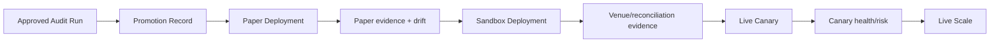

Không copy code bằng tay giữa environment. Promotion giữ:

- Alpha artifact digest.
- Engine/runtime digest nếu live runtime dùng chung component.
- Parameter/config artifact digest.
- Data/execution contract version.
- Risk policy binding.
- Account binding.
- Approval evidence.

### 12.2 Mode semantics

| Mode | Execution venue | Credentials | Capital | Mục tiêu |
|---|---|---|---|---|
| Research | QuantBT | Không | Simulated | Methodology/selection |
| Paper | Paper broker/simulator | Không live | Simulated | Runtime behavior, data, signal, expected execution |
| Sandbox | Venue testnet/sandbox | Limited sandbox | Virtual/test | Adapter/order/reconciliation certification |
| Live Canary | Live subaccount/limits | Scoped live | Rất nhỏ/limited | Production parity và safety |
| Live Scaled | Live | Scoped live | Policy allocation | Production operation |

### 12.3 Paper trading page phải trả lời

- Strategy có chạy đúng artifact/version không?
- Signal heartbeat/freshness ra sao?
- Expected order vs simulated order/fill có lệch không?
- Slippage/fee/funding model so với backtest assumption thế nào?
- Position/PnL attribution theo alpha/symbol.
- Backtest–paper drift decomposition.
- Data quality/venue state.
- Incident và operator action.

### 12.4 Sandbox page phải thêm

- Testnet venue/account/subaccount.
- API permission scope.
- Order-type capability matrix.
- Clock/timezone/symbol mapping.
- Ack/fill/cancel/replace latency.
- Partial-fill and reject scenarios.
- Reconciliation status.
- Kill/pause/rollback test evidence.
- Known venue differences.

### 12.5 Live Operations rule

Portal không gửi raw order từ normal application UI. Các action được phép:

- Start approved deployment.
- Pause new intents.
- Stop gracefully.
- Rollback to approved deployment version.
- Protective block.
- Cancel-all/flatten chỉ qua policy + elevated permission + explicit confirmation + risk engine.

### 12.6 Live action confirmation

High-risk action dialog phải hiển thị:

```text
Environment: LIVE
Account/Subaccount
Deployment/Alpha version
Current positions/exposure/PnL
Action scope
Estimated consequence
Risk policy and approval requirement
Required typed confirmation phrase
MFA/step-up authentication status
Reason / incident link
```

Không dùng một nút đỏ đơn lẻ không context.

### 12.7 Drift model

Backtest–paper–live divergence cần tách:

```text
signal drift
feature/data drift
availability/latency drift
execution timing drift
fill ratio/partial-fill drift
slippage drift
fee/funding/borrow drift
position sizing drift
risk rejection drift
universe/instrument mapping drift
portfolio netting drift
```

Mỗi drift metric có expected range, severity, first_seen và evidence link. Không chỉ plot ba equity curve rồi kết luận.

### 12.8 Reconciliation

Reconcile:

- Order state.
- Fill.
- Position.
- Cash/balance.
- Realized/unrealized PnL.
- Fees/funding/borrow.
- Alpha attribution.
- Expected simulator behavior.
- Backtest cost assumption vs realized cost.

Migration plan trước đã xác định reconciliation và ba mức action: alert-only, protective block, emergency action; không được mặc định flatten cho mọi lỗi. fileciteturn0file2L258-L307

---

## 13. Identity, security và governance

### 13.1 Identity architecture

- OIDC/OAuth 2.1-compatible identity provider.
- Portal không tự lưu password hash nếu không có lý do bắt buộc.
- MFA/step-up authentication cho live action, secret/account change và role escalation.
- Session list, device revoke, inactivity timeout, absolute timeout.
- Service account dùng short-lived token/mTLS, không dùng user API key lâu dài.
- Identity provider có thể là managed hoặc self-hosted; domain code chỉ phụ thuộc OIDC claims/SCIM-style provisioning contract.

### 13.2 Authorization model

Kết hợp:

- **RBAC**: role baseline.
- **ABAC**: organization/workspace/project/resource/environment/account/venue.
- **Policy decision**: action high-risk.

Roles tối thiểu:

```text
viewer
researcher
quant_reviewer
portfolio_manager
operator
risk_reviewer
data_engineer
sre
workspace_admin
organization_admin
service_account
```

Permission sample:

```text
alpha.read
alpha.publish
run.create
run.cancel.own
run.cancel.any
approval.review
promotion.paper
promotion.sandbox
promotion.live
account.bind
risk.policy.write
deployment.start.paper
deployment.start.live
deployment.pause.live
deployment.flatten.live
incident.manage
audit.read_sensitive
```

### 13.3 Separation of duties

- Author không tự approve final live promotion.
- Reviewer methodology và risk reviewer là hai policy role khác nhau khi live.
- Operator có thể pause nhưng không tự tăng capital allocation nếu không có approval.
- Admin identity không mặc định có quyền trading action.
- Break-glass account có hardware/MFA, time-bound elevation và mandatory audit/review.

### 13.4 Secret management

- Vault/KMS/cloud secret manager.
- Database chỉ lưu `secret_ref`, version và permission metadata.
- Worker research không resolve live secret.
- Credential được scope theo venue/account/environment/IP/action.
- Rotation và revoke workflow.
- Secret không đi vào logs, artifacts, NATS payload, browser hoặc crash dump.

### 13.5 Worker sandbox

- Non-root container.
- Read-only root filesystem.
- Ephemeral `/tmp` quota.
- CPU/memory/pid/time limit.
- Network deny by default; allowlist only dataset/object endpoints if needed.
- No Docker socket.
- No host path mount chứa secret.
- Seccomp/AppArmor/gVisor/Kata tùy threat model.
- Wheel/OCI signature and digest verification.
- Dependency lock/SBOM/license/secret scan.

### 13.6 Threat model trọng yếu

| Threat | Control |
|---|---|
| Malicious alpha code | CI build, sandbox, network deny, no live secret, resource limits |
| Dependency supply-chain | Lock, hash, SBOM, signature, trusted registry, provenance |
| Cross-tenant artifact access | Workspace authorization, signed URLs, object prefix policy |
| Duplicate async command | Idempotency key, aggregate version, unique constraint |
| Replay old live command | Command expiry, nonce, desired-version check, signature |
| Webhook spoofing | Raw-body HMAC, timestamp tolerance, replay cache |
| Browser token theft | Secure cookie/BFF pattern, CSP, short session, MFA |
| Privilege escalation | RBAC+ABAC, separation of duties, audit, step-up |
| Secret leakage in artifact/log | Structured redaction, schema denylist, scan before finalize |
| Portal compromise sends order | Private risk engine rejects unsigned/unapproved deployment intent |
| Stale UI enables unsafe action | Server-side policy re-evaluation at command time |

### 13.7 Audit event

Mọi consequential action có:

```text
actor identity and auth context
impersonation/break-glass context
organization/workspace/project
resource and before/after version
command/request/idempotency IDs
policy decision and policy version
reason/comment/ticket/incident
source IP/device/session
occurred/recorded timestamps
result/failure
artifact/evidence links
```

Audit log append-only; correction là event mới, không update lịch sử.

### 13.8 Prototype identity profile — Cloudflare Access trước, Portal authorization sau

Giai đoạn prototype dùng profile đơn giản hơn target enterprise ở các mục trên:

```text
Cloudflare Access/Tunnel
  -> xác thực user và bảo vệ public hostname
  -> chuyển signed Access JWT tới origin
Portal gateway/backend
  -> verify signature + issuer + audience + expiry
  -> map identity sang PortalPrincipal
  -> áp dụng role/permission nội bộ
Feature/API
  -> authorize action và ghi audit
```

Cloudflare Access không thay thế authorization trong domain. Access trả lời “người này là ai và có được đi qua front door hay không”; Portal vẫn phải trả lời “người này được xem/chạy/sửa/approve tài nguyên nào”.

#### Role prototype

```text
ADMIN
MANAGER
QUANT
VIEWER
```

Role này là subset đơn giản của role model đầy đủ ở §13.2. Khi các bounded context paper/sandbox/live được mở, role sẽ được tách thành reviewer/operator/risk/data/SRE theo separation-of-duties đã định nghĩa.

#### Authentication mode

```text
AUTH_MODE=dev                 # local/test only
AUTH_MODE=cloudflare_access   # external prototype/default deployed mode
```

`AUTH_MODE=dev` phải fail startup nếu environment là paper/sandbox/live hoặc service bind public interface không nằm trong allowlist.

#### Password policy

Portal không tự quản lý production password trong baseline. Password, one-time PIN hoặc SSO nằm ở IdP/Cloudflare Access. Settings quản lý user identity binding và role, không quản lý password plaintext/hash.

Local password fallback chỉ được xem xét trong spec riêng nếu có yêu cầu air-gapped; không được âm thầm thêm vào prototype.

#### JWT verification

Backend phải xác minh:

- thuật toán/signature theo Cloudflare JWKS;
- `iss` đúng team domain;
- `aud` đúng Access application;
- `exp`, `nbf`, `iat`;
- subject/email/group claims cần dùng;
- request thực sự đến từ trusted ingress path.

Không tin `Cf-Access-Jwt-Assertion`, `X-User-Email` hoặc header tương tự chỉ vì chúng tồn tại. Gateway phải strip header do client tự gửi và chỉ inject trusted identity context sau khi verify.

#### Session và browser

- Ưu tiên Access session cookie và server-side/BFF authorization context.
- Không lưu raw Access JWT trong localStorage.
- Cookie dùng `Secure`, `HttpOnly`, `SameSite` phù hợp.
- Mutation có CSRF/origin protection.
- SSE/WebSocket dùng session hoặc one-time ticket ngắn hạn.
- Profile page chỉ hiển thị claim đã normalize; không render raw token.

#### Cloudflare và Nginx/gateway

Cloudflare Zero Trust không thay chức năng origin router. Topology hợp lý là:

```text
Cloudflare Access + Tunnel
  -> private Nginx/current Portal gateway
       -> Portal static frontend
       -> QuantBT FastAPI
       -> Planning FastAPI
```

Nginx/gateway không có public port ngoài tunnel trong deployed prototype. Local Compose vẫn chạy như hiện tại.

#### Domain configuration

Legacy note v0.2: domain từng được owner để mở. Từ v0.4, hostname/team/AUD đã được khóa tại §40; source vẫn nhận chúng qua config, không hard-code vào component:

```text
PORTAL_PUBLIC_ORIGIN
CLOUDFLARE_TEAM_DOMAIN
CLOUDFLARE_ACCESS_AUD
CLOUDFLARE_TUNNEL_ID
```

Không hard-code hostname trong frontend, API contract hoặc Figma link.

#### Minimum prototype controls

- Access allow policy.
- Private origin.
- JWT verification.
- Server-side role checks.
- Basic rate limits.
- Audit login, role changes và mutations chính.
- Dev bypass guard.

Device posture, SCIM, step-up MFA, break-glass và fine-grained ABAC vẫn là target sau, đặc biệt trước sandbox/live.

### 13.9 Deployed prototype identity — explicit override cho `portal.primusspark.com`

Draft v0.3 khóa external prototype theo profile sau:

```text
public hostname              portal.primusspark.com
edge authentication          Cloudflare Access
transport                    Cloudflare Tunnel, outbound-only
origin gateway               Nginx 127.0.0.1:443 + Origin CA TLS
Portal app                   127.0.0.1:8080
app authentication mode      cloudflare_access_local_password
app session                  opaque server-side cookie session
initial local roles           ADMIN / USER
```

Đây là một profile **hybrid có giới hạn**, không phải thay đổi nguyên tắc dài hạn:

- Access JWT đã verify tạo external identity context.
- Username/password local chọn account nội bộ và tạo app session.
- Portal role được lấy từ database, không từ browser/header.
- Cùng một request phải pass cả Access identity binding và local account state.
- Khi SSO-only được duyệt sau này, local password có thể bị disable mà không thay role/resource model.

#### Initial principals

```text
bobby       ADMIN
stan        USER
thanhvuong  USER
```

Các principal trên được tạo ở `INVITED`, có unique one-time activation credential và `must_change_password=true`. Shared default password không được phép tồn tại trong source, migration, container image, database seed hoặc deployment log.

#### Authorization invariant

```text
verified Access identity
AND active local account
AND valid Portal session
AND server-side permission
AND resource/workspace policy
= authorized action
```

Không một điều kiện đơn lẻ nào đủ để authorize mutation.

#### Identity propagation tới service hiện tại

Trong M-1B, Portal BFF là trust termination point. Sau khi verify Access JWT và Portal session, BFF có thể proxy QuantBT/Planning request với internal principal context. Downstream service chỉ tin context đó khi:

- connection đến từ loopback/private gateway allowlist;
- header do BFF overwrite, không forward từ browser;
- principal envelope có timestamp/request ID và HMAC/signature hoặc service-level trust phù hợp;
- downstream vẫn enforce capability permission cần thiết.

Không proxy raw local password hoặc raw session token xuống QuantBT/Planning.

#### Security evolution

```text
M-1B prototype
  Access + local password + ADMIN/USER

M1–M5 platform
  Access identity binding + richer roles/workspaces

M6 paper/sandbox
  reviewer/operator/risk split + step-up

M7 live
  high-risk approval, short-lived grant, break-glass/runbook
```

Chi tiết triển khai, Nginx/Tunnel config, first-login state machine và acceptance tests nằm tại §P0.25A và Phase M-1B ở §29.


---

## 14. Observability, monitoring và incident response

### 14.1 OpenTelemetry end-to-end

Trace phải xuyên:

```text
Browser action
  -> Control API
  -> Postgres transaction/outbox
  -> NATS event/job
  -> Worker claim
  -> dataset/object fetch
  -> QuantBT execution
  -> artifact commit
  -> result event
  -> read model
  -> UI completion
```

Context IDs:

```text
request_id
trace_id
user_id
workspace_id
run_id/run_attempt_id
study_id/trial_id
deployment_id
incident_id
engine_release_id
alpha_version_id
```

### 14.2 Stack đề xuất

```text
OpenTelemetry SDK/Collector
Prometheus-compatible metrics
Grafana dashboards
Loki-compatible logs
Tempo/Jaeger-compatible traces
Sentry-class frontend/backend error tracking optional
Alertmanager/PagerDuty/Slack/email integration through notification service
```

### 14.3 Service SLI

#### Control API

- Request rate/error/duration.
- DB pool saturation/query latency.
- Outbox lag.
- Authorization denial/error.
- Idempotency conflict.

#### Quant workers

- Queue wait.
- Claim/start latency.
- Run duration by endpoint/resource/data size.
- RSS/CPU/temporary disk.
- Trial/fold throughput.
- Cancellation latency.
- Artifact finalize latency/error.
- Determinism/parity failures.

#### Artifact query

- Query duration by artifact/table/range.
- Bytes scanned vs returned.
- Predicate pushdown/cache hit.
- Downsample duration.
- Object store latency/error.

#### Realtime gateway

- Active connections/subscriptions.
- Event ingress/egress.
- Buffer depth.
- Slow-consumer disconnect.
- Reconnect/replay count.
- End-to-end event age.

#### Trading operations

- Signal freshness.
- Market-data freshness/sequence gap.
- Order ack/fill/cancel latency.
- Reject/partial-fill rate.
- Position/cash reconciliation delta.
- Risk rejection.
- Backtest/paper/live drift.

### 14.4 Monitoring domains

| Domain | Checks | Portal surface | Action class |
|---|---|---|---|
| Historical data | Gap, duplicate, schema, snapshot quality | Data Quality | Quarantine/block run |
| Streaming data | Freshness, sequence, skew, divergence | Health Map | Switch/pause/block |
| Alpha runtime | Signal heartbeat/null/latency/anomaly | Deployment | Pause/open incident |
| Backtest | Queue lag, worker crash, non-determinism | Run Queue | Retry/reject/block approval |
| Risk | Exposure, leverage, daily loss, drawdown, concentration | Live Ops | Reject/reduce/stop |
| Execution | Reject, ack/fill latency, orphan order | Live Ops | Cancel/retry/pause |
| Reconciliation | Order/fill/position/cash/PnL mismatch | Incidents | Halt account/deployment |
| Infrastructure | CPU/memory/disk/network/DB/event lag | Health Map | Failover/restart/scale |
| Performance | Backtest-paper-live cost/drift | Performance | Review/reduce/suspend |

### 14.5 Proposed SLO targets — draft

> Các con số dưới đây là target khởi đầu để thiết kế và benchmark; cần điều chỉnh theo topology, user count và data volume thực tế.

| SLI | Initial target |
|---|---|
| Metadata/read-model API p95 | < 200 ms same region |
| Run submit acknowledgement p95 | < 500 ms |
| First progress event after worker starts | < 2 s |
| Cached chart query p95 | < 500 ms |
| Non-cached medium chart query p95 | < 1.5 s |
| Live telemetry age p95 | < 1 s, theo source SLA |
| Control API monthly availability | 99.9% |
| Realtime monitoring availability | 99.9% hoặc cao hơn theo live policy |
| Audit event durability | Không mất event đã commit |
| Approved artifact checksum success | 100% |
| Live reconciliation critical mismatch detection | Theo venue cycle, target seconds/minutes explicit |

Portal outage không được làm monitoring/risk action ngừng hoạt động; đây cũng là acceptance criterion trong migration plan trước. fileciteturn0file4L456-L462

### 14.6 Game-day tests

- Kill worker giữa fold.
- NATS redelivery cùng job.
- Object store timeout lúc finalize.
- DB failover/outbox backlog.
- Corrupt artifact checksum.
- Stale market feed.
- Sequence gap/clock skew.
- Delayed order ack.
- Position mismatch.
- Risk limit breach.
- Portal/realtime gateway outage.
- Duplicate TradingView webhook.
- Expired/revoked broker secret.

Mỗi test phải verify detection, incident, policy action, recovery và full audit timeline.

---

## 15. Performance architecture

### 15.1 Performance budget theo lớp

#### Browser

- Initial JS bundle theo route; không bundle toàn bộ ECharts/ops module ở login/dashboard.
- LCP target < 2.5 s trên internal corporate network warm path.
- Main thread long task < 50–100 ms where practical.
- Table scroll 60 fps với virtualization.
- Chart update không làm layout shift.

#### API

- Metadata payload < 100–250 KB cho page thông thường.
- Không trả raw series trong run detail summary.
- Cursor pagination; filter/sort server-side.
- Compression offload tại reverse proxy cho high traffic theo khuyến nghị NestJS production. citeturn762760search13

#### Chart/query

- Default `max_points` 2,000–5,000 mỗi series theo viewport.
- Progressive fetch khi zoom.
- LTTB/min-max bucket hoặc contract-approved downsample.
- Table preview < 200 rows; export riêng.
- Cache key gắn artifact digest.

#### Worker

- One heavy run per process/container hoặc explicit controlled concurrency.
- Resource profiles theo endpoint/workload.
- Prepared context cho repeated trials cùng tape.
- Audit replay tách khỏi optimization trial.
- Measure RSS, CPU, object I/O, not just engine kernel runtime.

### 15.2 Frontend techniques

- Route-level code splitting.
- Lazy-load chart modules.
- Web Worker cho parse Arrow/large CSV export preview.
- TanStack Virtual cho trial/order/fill tables.
- Memoize chart options theo query result hash.
- Do not recreate ECharts instance on tab/filter if data update đủ.
- Abort stale requests khi user đổi range/run.
- Prefetch adjacent tab summary, không prefetch full artifacts.
- Persist lightweight filter/workspace state, không persist sensitive data.
- `prefers-reduced-motion` và animation duration thấp.

### 15.3 Chart data pyramid

Đối với series dài, worker hoặc query service tạo/derive levels:

```text
raw
1s/1m/5m/1h/daily aggregate where semantically valid
min-max buckets
LTTB chart samples
monthly/weekly performance aggregate
```

Derived artifact có source digest/method/version. Không downsample orders/fills theo cách mất audit; audit table vẫn query raw.

### 15.4 ECharts usage

Portal hiện đã chọn ECharts và chart catalog có dataZoom/crosshair/dual-grid conventions. citeturn576605view2

Quy tắc mới:

- `dataset` API thay vì inline arrays lặp lại.
- Canvas cho dense points; SVG cho print/export nhỏ.
- `progressive`, `large` mode nơi phù hợp.
- Fixed chart height/aspect ratio.
- Synchronized time axis cho price/equity/exposure.
- Color roles từ design tokens, không raw hex trong feature component.
- Accessible text summary và table fallback cho chart quan trọng.

### 15.5 Realtime smoothing

Không render mỗi market tick vào React state toàn app:

```text
WebSocket ingress
 -> gateway coalesce/window
 -> client stream store outside React tree
 -> requestAnimationFrame/throttled chart update
 -> summary state at lower frequency
```

Orders/fills/incidents vẫn append exactly; price/health latest-state có thể coalesce.

### 15.6 Rust extraction criteria

Tách một path sang Rust khi ít nhất một điều kiện đúng:

- p95/p99 không đạt target sau SQL/query/payload optimization.
- Node/Python RSS hoặc GC pause gây instability.
- Parquet scan/downsample chiếm phần lớn latency.
- WebSocket fan-out/backpressure cần isolation.
- Process supervision/cancellation cần stronger guarantees.
- Có benchmark parity và owner dài hạn.

Không tách chỉ vì microbenchmark hello-world tốt hơn.

### 15.7 Benchmark suite

```text
api_catalog_benchmark
run_submit_benchmark
run_progress_reconnect_benchmark
artifact_series_query_benchmark
trial_table_filter_benchmark
compare_runs_benchmark
websocket_fanout_benchmark
worker_cold_start_benchmark
worker_prepared_context_benchmark
wfo_resource_benchmark
frontend_lighthouse/playwright_trace
```

Dataset benchmark phải gồm:

- Small run.
- Medium single-symbol intraday.
- Large portfolio.
- WFO many folds/trials.
- Dense orders/fills.
- 1/10/100 concurrent viewers.
- 1/5/20 concurrent workers theo infra budget.

---

## 16. Repository, build và deployment architecture

### 16.1 Monorepo đề xuất

```text
portal/
  apps/
    portal-web/                         # React/Vite
    control-api/                        # NestJS/Fastify

  services/
    artifact-query-rs/                  # phase-gated
    realtime-gateway-rs/                # phase-gated
    runner-supervisor-rs/               # optional
    quant-worker-py/
    engine-inspector-py/

  packages/
    ui/                                 # portal-owned design system
    contracts-ts/
    api-client-ts/
    feature-flags/
    testing-ts/

  crates/
    contracts-rs/
    artifact-domain/
    realtime-domain/

  python/
    alpha-sdk/
    worker-contracts/
    testing/

  proto/
    common.proto
    run.proto
    event.proto
    artifact.proto
    deployment.proto

  schemas/
    alpha-manifest/
    engine-capability/
    run-spec/
    artifact/
    events/

  features/
    roadmap-task-board-migration/       # temporary importer/compatibility only

  infra/
    compose/
    kubernetes/
    terraform/
    observability/
    policies/

  docs/
    architecture/
    adr/
    api/
    runbooks/
    ui-ux/
    migration/

  constraints/
    python.txt
    node-version
    rust-toolchain.toml
```

Giữ một source monorepo/deployable portal như hiện tại là hợp lý; runtime boundaries vẫn explicit. citeturn597331view0turn597331view1

### 16.2 Build systems

```text
pnpm workspace + Turborepo/Nx-class task graph
Cargo workspace
uv/pip build + locked constraints
Buf for protobuf lint/breaking/codegen
Docker BuildKit multi-stage
Trivy/Grype-class image scan
Cosign/Sigstore-class artifact signature
SBOM SPDX/CycloneDX
```

Không bắt buộc một meta-build system điều khiển mọi ngôn ngữ nếu làm CI khó debug. Root scripts chỉ orchestration các native toolchain.

### 16.3 Environment

```text
local        Compose, synthetic/local data, no live credential
ci           ephemeral Compose/Testcontainers
research     shared compute, no live secret
paper        paper runtime/data, isolated accounts
sandbox      venue sandbox/testnet, limited credentials
staging      production-like control plane, no unrestricted live
production   live control plane + private execution integration
```

Environment là policy dimension, không chỉ `.env` file.

### 16.4 Kubernetes deployment

- `portal-web`, `control-api`, query/realtime là Deployments.
- Quant runs là Jobs hoặc worker pods với one-run child process.
- Node pools/resource classes cho CPU-heavy/large-memory.
- PodDisruptionBudget cho control/realtime.
- HPA dựa trên request/connection/queue depth; worker scale theo JetStream lag.
- NetworkPolicy: worker chỉ data/object/NATS/control claim endpoint.
- Read-only root, non-root, seccomp.
- Liveness không thay readiness; readiness kiểm tra dependencies cần thiết.
- Graceful drain cho WebSocket và worker cancellation.

### 16.5 Release governance

Mỗi release portal gồm:

```text
portal_web_digest
control_api_digest
rust_service_digests
schema bundle version
DB migration version
compatible engine release range
feature flag defaults
SBOM/signature
release notes
rollback plan
```

Engine release độc lập với portal release nhưng compatibility matrix phải được test/publish.

### 16.6 Database migration

- Expand/contract migration.
- Backward-compatible event/schema reader trong migration window.
- Không rename/drop column cùng release với code consumer change.
- Online index creation cho bảng lớn.
- Roadmap SQLite importer idempotent, có checksum và reconciliation report.

### 16.7 Backup và disaster recovery — draft

- PostgreSQL PITR + restore drill.
- Object store versioning/cross-region replication theo criticality.
- NATS stream replicated và export/recovery procedure.
- Identity provider backup/config-as-code.
- Secret manager recovery policy.
- Run/alpha/engine artifact hash verification sau restore.
- RPO/RTO phải tách control metadata, research artifacts và live operational state.

### 16.8 Local developer experience

```bash
./scripts/portal doctor
./scripts/portal up core
./scripts/portal up research
./scripts/portal test contracts
./scripts/portal test golden
./scripts/portal run synthetic-smoke
./scripts/portal seed demo
```

`doctor` kiểm tra Node/Python/Rust/Docker versions, ports, engine wheel hash, database migration, NATS, object store và optional services.

---

## 17. UI/UX direction

### 17.1 Product design statement

QuantBT Portal không nên trông như một generic SaaS dashboard và cũng không nên là một terminal dày đặc khó đọc. Hướng phù hợp là:

> **Research-grade paper surface + operational trading workstation.**

- **Research/report mode**: sáng, publication-grade, calm, giải thích được methodology và evidence.
- **Operations/live mode**: tối hơn, high-contrast, density cao vừa phải, tập trung health/risk/action; vẫn dùng cùng spacing, typography và component anatomy.
- Chuyển mode theo route/environment, không để user tùy ý biến mỗi card một theme khác nhau.

### 17.2 Giữ nguyên QuantBT “Fund Paper”

Các token hiện tại nên là foundation, không thay palette toàn bộ:

```css
--paper: #faf9f5;
--paper-raised: #ffffff;
--paper-sunken: #f4f2ec;
--ink: #1c2532;
--ink-soft: #4e5a6e;
--ink-faint: #939db0;
--line: #e3e0d7;
--line-soft: #efede4;
--accent: #0f4c5c;
--accent-soft: #e2edf0;
--accent-2: #9a6a1f;
--accent-2-soft: #f4ecdb;
--good: #1e7b4f;
--bad: #b43a3a;
--ink-panel: #161e2a;
--role-is: #7a8699;
--role-oos: #0f4c5c;
--role-holdout: #9a6a1f;
```

Đây là exact token foundation trong portal hiện tại. citeturn597331view3

### 17.3 Typography

| Role | Font | Usage |
|---|---|---|
| Display | Newsreader | Page title, section heading, report narrative |
| Body | Inter | UI, descriptions, forms, buttons |
| Mono | JetBrains Mono | Metric, ticker, timestamp, parameter, table numbers, code/ID |

Rules:

- `font-variant-numeric: tabular-nums` cho metric/table.
- Numeric cell right-aligned.
- Không uppercase toàn bộ body label; chỉ kicker/status/compact meta.
- H1/H2 report giữ serif; operational table heading dùng sans/mono để scan nhanh.

### 17.4 Theme proposal

#### Light Research Theme

- Canvas `paper`.
- Unframed sections; card chỉ cho KPI/repeated items/modal.
- Border mảnh, shadow rất nhẹ.
- Chart pane trắng hoặc `paper-sunken`.
- Structural accent teal, highlight ochre.

#### Dark Operations Theme

Bổ sung token nhưng derive từ `ink-panel`, không tạo palette neon:

```css
--ops-canvas: #101720;
--ops-panel: #161e2a;
--ops-panel-raised: #1c2634;
--ops-line: #2b3747;
--ops-text: #e3e9f1;
--ops-text-soft: #aab6c5;
--ops-text-faint: #738095;
```

- Good/bad/alert giữ semantic tương ứng.
- Không dùng gradient/orb/glow.
- Dark mode dành cho Live Ops, Monitoring, Incident Wall; report/audit export luôn có light print layout.

### 17.5 Lifecycle semantics

Màu lifecycle dùng cho badge/stepper, không làm chart palette:

| Stage | Semantic | UI treatment |
|---|---|---|
| Draft/Research | Structural teal | Outline badge |
| Candidate/Review | Ochre | Soft fill + review icon |
| Paper | Purple-neutral proposal | Badge + paper icon; không dùng trong performance chart |
| Sandbox | Amber | Hatch/triangle icon |
| Live | Green | Solid dot + text |
| Paused | Gray | Pause icon |
| Degraded | Amber/red | Severity + reason |
| Quarantined/Blocked | Red | Lock/block icon |

Color luôn đi kèm text/icon; không dùng color-only state.

### 17.6 Density levels

```text
Comfortable  — catalog, settings, onboarding
Compact      — run queue, alpha pool, trials, orders/fills
Operational  — live health, incident wall; smaller row height but no hidden labels
```

User có thể chọn table density per workspace, nhưng form/chart spacing vẫn giữ consistent.

### 17.7 Layout grid

Desktop 1440:

```text
72px collapsed rail / 240px expanded rail
Top bar 56px
Content max width: fluid 12 columns, 24px gutters
Right context drawer: 360–480px
Bottom detail panel: resizable 280–520px
```

Breakpoints:

```text
>= 1440  full workstation
1280     compact rail + 12 columns
1024     drawer overlays; 8 columns
768      rail becomes top/side sheet; 4 columns
< 640    mobile monitoring/approval; research forms stacked
```

Current report layout already defines responsive collapse and print behavior; app shell mở rộng nhưng phải giữ focus-visible, reduced-motion và print rules. citeturn576605view1

### 17.8 Shell anatomy

```text
┌──────────────┬───────────────────────────────────────────────────────────┐
│ Product Rail │ Workspace / Project   Environment   Search   Alerts User │
│              ├───────────────────────────────────────────────────────────┤
│ Overview     │ Breadcrumb / Page title / Context / Primary actions       │
│ Research     ├───────────────────────────────────────────────────────────┤
│ Backtests    │                                                           │
│ Deployments  │                    12-column content                      │
│ Data         │                                                           │
│ Operations   │                                                           │
│ Planning     │                                                           │
│ Settings     │                                                           │
└──────────────┴───────────────────────────────────────────────────────────┘
```

### 17.9 Interaction principles

1. One obvious primary action per page.
2. Dangerous action never nằm trong overflow menu không label.
3. Filter state shareable bằng URL/query preset.
4. Selected row mở detail drawer; full page chỉ khi cần deep workflow.
5. Tables dùng sticky header/first column, keyboard navigation và saved views.
6. Chart/table cross-filter nhưng có nút clear và current-filter summary.
7. Empty state giải thích dữ liệu/permission/capability thiếu gì.
8. Failed/partial artifact state không render chart giả.
9. Every metric có definition, unit, source segment và timestamp tooltip.
10. Approval/live action luôn hiển thị evidence/policy, không chỉ status badge.

### 17.10 Chart taxonomy

#### ECharts

- Equity + drawdown dual grid.
- Rolling return/volatility/Sharpe.
- Monthly heatmap.
- Return/trade distribution.
- Exposure/turnover/cost.
- Trial scatter/parallel coordinates/contour.
- WFO fold matrix.
- Parameter plateau/sensitivity.
- Alpha allocation/contribution treemap.
- Correlation matrix/network.
- Incident/event timeline.

#### Lightweight Charts / optional Advanced Charts

- OHLC/candle + volume.
- Signal target/position overlay.
- Entry/exit/order/fill markers.
- Stop/TP/trailing bands.
- Basket legs/spread pane.
- Paper/live real-time price and execution overlay.

### 17.11 Chart contract

Mỗi chart component nhận:

```ts
type ChartDataEnvelope = {
  schemaVersion: string;
  sourceArtifactDigest: string;
  runId?: string;
  segment?: "is" | "oos" | "holdout" | "paper" | "sandbox" | "live";
  timezone: "UTC";
  units: Record<string, string>;
  downsample?: {
    method: string;
    sourceRows: number;
    returnedRows: number;
  };
  series: unknown;
  annotations?: unknown[];
  warnings?: string[];
};
```

Chart không nhận raw backend model không versioned.

---

## 18. Tham khảo Wealthfolio: dùng pattern, không clone mù quáng

### 18.1 Điều đáng học

Wealthfolio có architecture frontend React/Vite/Tailwind/shadcn, desktop Tauri/Rust, web Axum và shared UI package; frontend đi qua adapter/command wrapper tới Rust core. citeturn328700view0

Các pattern phù hợp với QuantBT Portal:

- Compact rail và clear workspace context.
- Summary metric strip.
- Asset allocation/treemap.
- Account/portfolio switcher.
- Health center.
- Dense holdings/transaction table.
- Import wizard.
- Responsive mobile monitoring.
- Detail drawer thay vì chuyển page cho mọi click.

### 18.2 License boundary

Wealthfolio code dùng AGPL-3.0 và brand assets/trademark được quản lý riêng. citeturn328700view1

Do đó:

- Có thể nghiên cứu layout, information density, interaction pattern và component anatomy.
- Không copy source component vào proprietary/internal portal mà chưa review nghĩa vụ AGPL.
- Không copy logo, brand asset, tên hoặc visual identity Wealthfolio.
- Tốt nhất implement clean-room bằng design token/component của QuantBT.
- Nếu chủ đích dùng code AGPL, cần một quyết định license rõ của owner/legal; tài liệu này không phải tư vấn pháp lý.

### 18.3 Mapping pattern

| Wealthfolio pattern | QuantBT adaptation |
|---|---|
| Portfolio/account switcher | Workspace / Project / Environment / Account switcher |
| Net worth hero | Research capital / active allocation / total alpha PnL hero |
| Asset allocation donut/treemap | Alpha allocation, exposure, contribution, risk-budget treemap |
| Holdings table | Alpha Pool / active deployments table |
| Transactions table | Orders, fills, trades, trials, audit events |
| Goals | Roadmap/migration milestones |
| Health center | Data/engine/worker/deployment/reconciliation health |
| Import transactions | Import alpha/package/dataset wizard |
| Performance chart | IS/OOS/Holdout/Paper/Live synchronized performance |
| Mobile overview | Incident/approval/deployment mobile cockpit |

### 18.4 Component reuse priority

1. Reuse directly các QuantBT component/token do owner sở hữu.
2. Extract thành `packages/ui` với API ổn định.
3. Reimplement Wealthfolio-inspired pattern clean-room.
4. Chỉ nhập third-party component khi license, bundle, accessibility và maintenance pass.

---

## 19. Information architecture và route map

### 19.1 Primary navigation

```text
Overview
  Command Center

Research
  Alpha Pool
  Research Workbench
  Alpha Mining
  Imports
  Strategy Composer
  Endpoint Explorer

Backtests
  New Run
  Run Queue
  Studies / WFO
  Compare Runs
  Approval Inbox

Deployments
  Paper
  Sandbox
  Live
  Portfolio & Alpha Performance

Data
  Catalog
  Snapshots
  Quality
  Instrument Master

Operations
  Health Map
  Monitoring
  Incidents
  Reconciliation
  Audit Log

Planning
  Roadmap
  Task Board
  Migration Gates
  Releases / ADRs / Risks

Administration
  Accounts & Brokers
  Users & Roles
  Integrations
  Compute & Retention
  Settings
```

### 19.2 URL structure

```text
/w/:workspaceSlug/p/:projectSlug/overview
/w/:workspaceSlug/p/:projectSlug/alphas
/w/:workspaceSlug/p/:projectSlug/alphas/:alphaId
/w/:workspaceSlug/p/:projectSlug/research
/w/:workspaceSlug/p/:projectSlug/imports/:importId
/w/:workspaceSlug/p/:projectSlug/endpoints
/w/:workspaceSlug/p/:projectSlug/runs/new
/w/:workspaceSlug/p/:projectSlug/runs/:runId
/w/:workspaceSlug/p/:projectSlug/studies/:studyId
/w/:workspaceSlug/p/:projectSlug/compare?runs=...
/w/:workspaceSlug/approvals
/w/:workspaceSlug/deployments/paper
/w/:workspaceSlug/deployments/sandbox
/w/:workspaceSlug/deployments/live
/w/:workspaceSlug/data/...
/w/:workspaceSlug/ops/...
/w/:workspaceSlug/planning/...
/w/:workspaceSlug/settings/...
```

### 19.3 Top bar

Left:

- Workspace switcher.
- Project switcher.
- Environment badge.

Center:

- Universal search/command palette (`⌘K`).

Right:

- Compute queue indicator.
- Data freshness indicator.
- Incident/notification bell.
- Help/docs.
- User menu.

Environment badge luôn visible; live dùng explicit `LIVE` text + icon + border, không chỉ màu.

### 19.4 Command palette

Commands theo permission/context:

```text
Go to Alpha…
Create Backtest…
Open Run…
Compare Runs…
Open Incident…
Pause Deployment…
Switch Workspace…
Switch Environment…
Create Task from current resource…
Copy Resource ID / Manifest Hash
Open Documentation
```

Dangerous command tìm được qua search nhưng vẫn mở confirmation/evidence screen; không execute trực tiếp từ palette.

### 19.5 Global context

UI state luôn biết:

```text
organization
workspace
project
active environment
user role/policy snapshot
active engine release default
locale/timezone display preference
```

Data timestamp vẫn lưu/contract UTC; display timezone là presentation preference.

---

## 20. Screen inventory

| # | Screen | Primary goal | Main action |
|---:|---|---|---|
| 01 | Login / SSO | Xác thực an toàn | Continue with SSO |
| 02 | Onboarding / Workspace | Chọn/tạo workspace/project | Enter workspace |
| 03 | Command Center | Nắm trạng thái toàn platform | Resolve priority item |
| 04 | Alpha Pool | Tìm/đánh giá alpha | Open alpha / Start research |
| 05 | Alpha Detail | Xem evidence/lifecycle/lineage | Run / Request promotion |
| 06 | Alpha Import Wizard | Chuẩn hóa/publish artifact | Publish version |
| 07 | Research Workbench | Cấu hình experiment | Preflight / Run |
| 08 | Alpha Mining | Quản lý campaign/candidates | Start campaign |
| 09 | Strategy Composer | Kết hợp alpha có quản trị | Validate / Version composition |
| 10 | Endpoint Explorer | Khám phá full QuantBT support | Create run from endpoint |
| 11 | Backtest Wizard | Tạo reproducible run | Submit run |
| 12 | Run Queue | Theo dõi/cancel/retry | Open run |
| 13 | Optimization/WFO Lab | Hiểu trial/fold/selection | Final audit replay |
| 14 | Run Detail | Review result và audit | Compare / Request approval |
| 15 | Compare Runs | So sánh evidence | Pin winner / Create audit replay |
| 16 | Approval Inbox | Review decision | Approve/reject |
| 17 | Paper Trading | Theo dõi paper evidence | Pause / Promote request |
| 18 | Sandbox | Certify venue/runtime | Run checklist / Promote request |
| 19 | Live Operations | Vận hành an toàn | Pause/rollback/protect |
| 20 | Portfolio Performance | Allocation/risk/contribution | Rebalance request |
| 21 | Monitoring & Incidents | Detect/respond | Acknowledge/mitigate |
| 22 | Data Catalog & Quality | Chọn/kiểm soát data | Snapshot/quarantine |
| 23 | Accounts & Brokers | Quản lý account metadata | Test/bind account |
| 24 | Roadmap & Task Board | Điều phối migration/product | Create/move task |
| 25 | Audit Log | Điều tra lineage/action | Open evidence |
| 26 | Settings / Admin | Quản trị platform | Save controlled settings |

---

## 21. Detailed wireframes — Core Shell và Research

> Wireframe là low/mid fidelity, dùng ký tự để agent/dev/Figma designer hiểu bố cục. Kích thước desktop tham chiếu 1440×1024; drawer/panel có thể resize.

### 21.1 Screen 01 — Login / SSO

#### Layout

```text
┌──────────────────────────────────────────────────────────────────────────┐
│ QuantBT Portal                                             System status │
├───────────────────────────────┬──────────────────────────────────────────┤
│                               │                                          │
│  Publication-grade abstract   │  Sign in                                 │
│  Alpha → Backtest → Live      │  ─────────────────────────────────────   │
│                               │  [ Continue with Organization SSO ]      │
│  • Reproducible research      │                                          │
│  • Governed promotion         │  Workspace domain (optional)             │
│  • Audited operations         │  [ company.example                  ]    │
│                               │                                          │
│  Engine status: Available     │  Security notice / privacy / support     │
│  No market/trading data here  │                                          │
│                               │                                          │
├───────────────────────────────┴──────────────────────────────────────────┤
│ Version • Status • Documentation • Terms                                │
└──────────────────────────────────────────────────────────────────────────┘
```

#### UX rules

- Không hiển thị username/password local nếu SSO-only.
- SSO error có request ID và support action.
- Không lộ organization/workspace list trước auth.
- Status indicator không expose internal topology.
- After login, return về deep link nếu permission còn hợp lệ.

#### Draft v0.3 — Login flow thực tế cho `portal.primusspark.com`

Screen 01 được tách thành bốn frame thay vì một form duy nhất:

```text
01A Cloudflare Access              external/Cloudflare-owned
01B Portal Local Login             app-owned
01C First-login Password Change    app-owned
01D Access Denied / Binding Error  app-owned
```

##### Frame 01A — Cloudflare Access

- Primary method: Google Workspace.
- Policy: email ending `@azdag.com`; deny by default.
- OTP chỉ là recovery/temporary method theo policy hẹp.
- Portal branding có thể được phản chiếu, nhưng đây không phải React route của Portal.
- Sau success, redirect về deep link ban đầu; app vẫn kiểm tra account/session.

##### Frame 01B — Portal Local Login

```text
┌──────────────────────────────────────────────────────────────────────────┐
│ PRIMUSSPARK / QUANT PORTAL                              PROTOTYPE • SGP  │
├───────────────────────────────┬──────────────────────────────────────────┤
│                               │ Sign in to Portal                        │
│  Alpha research              │ Protected by Cloudflare Zero Trust       │
│  QuantBT & WFO               │                                          │
│  Migration planning         │ Verified identity                        │
│  Paper → Sandbox → Live      │ name@azdag.com                            │
│                               │                                          │
│  Current capabilities         │ Username                                 │
│  ● QuantBT Research           │ [                                  ]     │
│  ● Roadmap / Task Board       │                                          │
│  ○ Other modules commissioned │ Password / activation credential         │
│                               │ [                                  ]     │
│                               │ [Show] [Caps Lock status]                 │
│                               │                                          │
│                               │ [ Sign in ]                              │
│                               │                                          │
│                               │ First login uses a one-time credential.  │
│                               │ [Switch Access identity] [Support]       │
├───────────────────────────────┴──────────────────────────────────────────┤
│ Version • Request ID • Privacy • Access policy                          │
└──────────────────────────────────────────────────────────────────────────┘
```

Interaction rules:

- email được render từ verified JWT context, read-only;
- username có autocomplete `username`; password có `current-password`;
- submit bằng Enter; loading không cho double-submit;
- generic auth error; support copy kèm request ID;
- password manager/paste được phép;
- không expose role trước login;
- deep link chỉ restore sau authorization;
- `Switch Access identity` logout cả app session và Access session.

##### Frame 01C — First-login Password Change

```text
┌───────────────────────────────────────────────────────────────┐
│ Secure account                                                │
│ bobby • verified identity: name@azdag.com                     │
│                                                               │
│ Your one-time credential has been accepted.                   │
│ You must create a private password before continuing.         │
│                                                               │
│ New password             [                              ]      │
│ Confirm password         [                              ]      │
│                                                               │
│ 15+ characters • common/compromised values blocked            │
│ Password managers and paste are supported                     │
│                                                               │
│ [ Set password and enter Portal ]                             │
│ [ Sign out ]                                                  │
└───────────────────────────────────────────────────────────────┘
```

- Không có “Skip”.
- Chỉ auth/change-password/logout endpoint được gọi.
- Password success rotate app session và xóa pre-auth state.
- Weak/common password feedback đủ rõ để sửa nhưng không lộ blocklist internals.

##### Frame 01D — Denied/error states

| State | Copy | Primary action |
|---|---|---|
| Access policy denied | Organization identity không được phép truy cập Portal | Sign out / contact admin |
| Local account missing | Portal account chưa được provision | Contact admin |
| Identity binding conflict | Tài khoản đã gắn với identity khác | Sign out / request review |
| Account locked | Không thể đăng nhập lúc này | Retry later / support |
| Account disabled | Account access đã bị thu hồi | Sign out |
| Session expired | Phiên Portal đã hết hạn | Sign in again |
| JWT/config failure | Identity verification unavailable | Retry + request ID |

Không hiển thị raw JWT, exact policy internals, account existence detail hoặc stack trace.

##### Responsive

- Desktop: split layout như wireframe.
- Compact desktop/tablet: left narrative thu hẹp thành summary rail.
- Mobile: form trước; capability summary collapse phía dưới.
- Touch target ≥44×44 px; focus visible; contrast AA.

##### Analytics/audit boundaries

Frontend analytics chỉ ghi screen/state và request correlation ID. Không ghi username, password, activation credential, JWT, cookie hoặc full email vào third-party analytics.


### 21.2 Screen 02 — Workspace / Project Onboarding

```text
┌ Rail ┬───────────────────────────────────────────────────────────────────┐
│      │ Choose your workspace                                             │
│      │                                                                   │
│      │ [ Search workspaces... ]                                          │
│      │ ┌────────────────────┐ ┌────────────────────┐                     │
│      │ │ Quant Research     │ │ Trading Operations │                     │
│      │ │ 12 projects        │ │ 4 projects         │                     │
│      │ │ Role: Researcher   │ │ Role: Viewer       │                     │
│      │ └────────────────────┘ └────────────────────┘                     │
│      │                                                                   │
│      │ Recent projects                                                   │
│      │ Delta RSI • Alpha Mining • Migration 2026                         │
│      │                                                                   │
│      │ [Request access]                         [Create workspace]*        │
└──────┴───────────────────────────────────────────────────────────────────┘
```

- `Create workspace` chỉ hiện theo organization permission.
- First-entry wizard hỏi default timezone display, notification và project, không hỏi broker secret.

### 21.3 Screen 03 — Command Center

#### Layout

```text
┌Rail┬─────────────────────────────────────────────────────────────────────┐
│    │ Quant Research / Core Platform                 RESEARCH  ⌘K  !  User│
│    ├─────────────────────────────────────────────────────────────────────┤
│    │ Command Center                         [New run] [Import alpha]       │
│    │ Updated 8s ago • All systems / 1 warning                            │
│    ├──────────────┬──────────────┬──────────────┬────────────────────────┤
│    │ Alpha Pool   │ Active Runs  │ Deployments  │ Critical Incidents     │
│    │ 42 / 8 cert. │ 6 / 2 queued │ 5P 2S 1L     │ 0 • Warning 1          │
│    ├──────────────┴──────────────┴──────────────┴────────────────────────┤
│    │ Alpha lifecycle funnel (Research → Paper → Sandbox → Live)          │
│    ├──────────────────────────────┬───────────────────────────────────────┤
│    │ Allocation / contribution    │ Active run queue                     │
│    │ [Treemap]                    │ Run / endpoint / progress / ETA*     │
│    │                              │ ...                                  │
│    ├──────────────────────────────┼───────────────────────────────────────┤
│    │ Deployment health            │ Data & platform health               │
│    │ cards + sparklines           │ freshness / workers / NATS / storage │
│    ├──────────────────────────────┼───────────────────────────────────────┤
│    │ Approval inbox               │ Roadmap / migration gates            │
│    │ 3 awaiting review            │ P2 73% • 2 blockers • 5 due          │
└────┴──────────────────────────────┴───────────────────────────────────────┘
```

`ETA*` chỉ hiển thị nếu model có confidence; nếu không dùng “elapsed / stage / queue position”.

#### Priority logic

Top priority order:

1. Critical incident/protective block.
2. Pending live/risk approval.
3. Failed/corrupt run.
4. Stale data or reconciliation warning.
5. Normal research/roadmap items.

### 21.4 Screen 04 — Alpha Pool

```text
┌Rail┬─────────────────────────────────────────────────────────────────────┐
│    │ Alpha Pool                                     [Import] [New study] │
│    │ [Search] [Lifecycle▾] [Family▾] [Universe▾] [Owner▾] [Saved view▾]  │
│    │ View: [Table●] [Cards] [Correlation]           Sort: Evidence ▾     │
│    ├─────────────────────────────────────────────────────────────────────┤
│    │ Alpha                  Stage     OOS     Holdout  MDD   Corr  Drift  │
│    │ Delta RSI v1.4         Paper     1.42    1.18    -12%  .31   stable │
│    │ Basis Carry v2.1       Candidate 1.10    0.92    -7%   .18   —      │
│    │ Intraday Reversal      Research  0.88    —       -9%   .45   —      │
│    │ ...                                                                  │
│    ├───────────────────────────────────────────────────────┬──────────────┤
│    │ Correlation/return/capacity mini views               │ Detail drawer│
│    │                                                      │ version      │
│    │                                                      │ badges       │
│    │                                                      │ evidence     │
│    │                                                      │ actions      │
└────┴──────────────────────────────────────────────────────┴──────────────┘
```

#### Columns

- Alpha/version.
- Owner/family.
- Stage/certification.
- Endpoint/execution contract.
- OOS/Holdout metrics.
- Drawdown/turnover/cost/capacity.
- Pool correlation/novelty.
- Paper/live drift.
- Evidence age.
- Deployment count/allocation.

#### Interactions

- Click row → drawer; Enter/open → Alpha Detail.
- Multi-select → compare/correlation, không bulk live promote.
- Hover metric → definition + segment + run ID.
- Saved view giữ filter/column/sort, shareable theo permission.

### 21.5 Screen 05 — Alpha Detail

```text
┌Rail┬─────────────────────────────────────────────────────────────────────┐
│    │ ← Alpha Pool                                                        │
│    │ Delta RSI Polynomial  v1.4.0   PAPER ELIGIBLE                       │
│    │ Owner • family • universe • endpoint • artifact sha…                │
│    │ [Start research] [New backtest] [Request promotion] [•••]           │
│    ├─────────────────────────────────────────────────────────────────────┤
│    │ Draft ─ Registered ─ Candidate ─ Research ✓ ─ Paper ✓ ─ Sandbox ○   │
│    ├─────────────────────────────────────────────────────────────────────┤
│    │ Overview | Evidence | Experiments | Runs | Deployments | Lineage |  │
│    │ Contract | Versions | Audit                                            │
│    ├──────────────┬──────────────┬──────────────┬────────────────────────┤
│    │ OOS Sharpe   │ Holdout      │ Max DD       │ Paper drift            │
│    │ 1.42         │ 1.18         │ -12.1%       │ +4.2% cost             │
│    ├──────────────────────────────────────┬───────────────────────────────┤
│    │ Synchronized performance/evidence   │ Evidence health               │
│    │ IS / OOS / Holdout / Paper           │ data ✓ engine ✓ audit ✓      │
│    ├──────────────────────────────────────┼───────────────────────────────┤
│    │ Parameter stability / plateau        │ Known limitations             │
│    ├──────────────────────────────────────┼───────────────────────────────┤
│    │ Contribution / correlation           │ Active deployments            │
└────┴──────────────────────────────────────┴───────────────────────────────┘
```

Header luôn hiển thị exact version. Không có action “run latest” mơ hồ; user phải chọn version hoặc default được resolve rõ.

### 21.6 Screen 06 — Alpha Import Wizard

#### Steps

```text
1 Source → 2 Build → 3 Contract → 4 Tests → 5 Evidence → 6 Publish
```

#### Layout

```text
┌Rail┬─────────────────────────────────────────────────────────────────────┐
│    │ Import Alpha                                      Draft import #123 │
│    │ 1 Source  2 Build  [3 Contract]  4 Tests  5 Evidence  6 Publish     │
│    ├───────────────────────────────────────────┬─────────────────────────┤
│    │ Manifest                                   │ Validation summary      │
│    │ Alpha ID        [delta-rsi...]             │ ✓ artifact hash         │
│    │ Entrypoint      [pkg.strategy:Alpha]       │ ✓ entrypoint             │
│    │ Endpoints       [walk_forward ...]         │ ! funding optional       │
│    │ Execution       [close_target_v2]          │ ✕ output field missing   │
│    │ Data contract   [OHLCV / 1h / warmup 300] │                         │
│    │ Parameters      [schema editor/read-only]  │ Build logs / evidence    │
│    │ Output contract [target-signal-frame/v1]   │                         │
│    ├───────────────────────────────────────────┴─────────────────────────┤
│    │ [Back]                                      [Save draft] [Validate] │
└────┴─────────────────────────────────────────────────────────────────────┘
```

#### UX

- Manifest form và raw YAML tabs; raw edit chỉ role cho phép.
- Validation result click → exact field/log/test.
- Secret/value redacted.
- Publish screen hiển thị artifact digest, SBOM, tests, version conflict và certification level.
- Không có “ignore all warnings”; waiver theo warning code, owner, expiry và reason.

### 21.7 Screen 07 — Research Workbench

```text
┌Rail┬─────────────────────────────────────────────────────────────────────┐
│    │ Research Workbench      Alpha: Delta RSI v1.4     [Save] [Preflight]│
│    ├───────────────┬──────────────────────────────────────┬───────────────┤
│    │ Experiment    │ Price / Signal / Trade Overlay       │ Parameters    │
│    │ Dataset       │ [Symbol] [1h] [Range] [Indicators]   │ rsi_period 14 │
│    │ Universe      │                                      │ degree 3      │
│    │ Endpoint      │          Candle/volume chart         │ entry .8      │
│    │ Protocol      │          markers/bands               │ exit .2       │
│    │ Cost/Risk     │                                      │               │
│    │ Windows       │                                      │ Advanced ▾    │
│    ├───────────────┴──────────────────────────────────────┴───────────────┤
│    │ Preview diagnostics | Data quality | Contract | Resource estimate   │
│    ├───────────────────────────────────────────────────────┬──────────────┤
│    │ Recent experiments / trial preview                   │ Run summary   │
│    │                                                      │ exact hashes  │
│    │                                                      │ [Submit run]  │
└────┴──────────────────────────────────────────────────────┴──────────────┘
```

#### Guardrail

- Price preview có watermark `PREVIEW — NOT A BACKTEST RESULT`.
- Parameter change không tự gọi full WFO; preview action explicit/debounced.
- Data snapshot ID visible.
- Run summary panel hiển thị endpoint/execution contract/backend/engine/artifact hashes.

### 21.8 Screen 08 — Alpha Mining

```text
┌Rail┬─────────────────────────────────────────────────────────────────────┐
│    │ Alpha Mining Campaigns                         [New campaign]        │
│    │ [Active] [Completed] [Archived] [Budget/Quota]                      │
│    ├─────────────────────────────────────────────────────────────────────┤
│    │ Campaign: Cross-sectional momentum features                         │
│    │ Stage: validation • 1,240 candidates • 83 passed • 12 shortlisted   │
│    │ Progress ━━━━━━━━━━━━━━━ 76%  Compute 620/800 CU                     │
│    ├───────────────────────────────┬─────────────────────────────────────┤
│    │ Candidate funnel              │ Novelty / pool correlation          │
│    │ generated → valid → robust    │ scatter / matrix                    │
│    │ → holdout → shortlisted       │                                     │
│    ├───────────────────────────────┴─────────────────────────────────────┤
│    │ Candidate table: ID | recipe | IS | OOS | Holdout | Corr | Turnover│
│    ├───────────────────────────────────────────────────────┬──────────────┤
│    │ Selected candidate diagnostics                       │ Detail drawer│
│    │ parameter sensitivity / regimes / costs              │ promote/import│
└────┴──────────────────────────────────────────────────────┴──────────────┘
```

- Budget bar phải rõ compute đã dùng, còn lại và stop policy.
- Candidate metric tooltip luôn cho biết đây là mining/selection/evaluation window.
- `Promote to Import` tạo source snapshot/manifest draft, không trực tiếp tạo live alpha.

### 21.9 Screen 09 — Strategy Composer

```text
┌Rail┬─────────────────────────────────────────────────────────────────────┐
│    │ Strategy Composer: Multi-Alpha Core              [Validate] [Save v]│
│    ├────────────────────┬────────────────────────────────┬───────────────┤
│    │ Alpha library      │ Composition graph              │ Inspector     │
│    │ Search/filter      │                                │ Selected node │
│    │ Delta RSI v1.4     │ [Alpha A]──┐                   │ operator      │
│    │ Carry v2.1         │            ├─[Vol scale]─┐     │ weight/limits │
│    │ Reversal v1.2      │ [Alpha B]──┘             ├─Out│ contract      │
│    │ Operators          │ [Regime]─────────────────┘     │ warnings      │
│    │                    │                                │               │
│    ├────────────────────┴────────────────────────────────┴───────────────┤
│    │ Exposure preview | Conflict matrix | Turnover estimate | Lineage    │
│    ├─────────────────────────────────────────────────────────────────────┤
│    │ Validation: units ✓ timing ✓ execution contract ✓ correlation !    │
└────┴─────────────────────────────────────────────────────────────────────┘
```

- Node palette chỉ có operator được version/control.
- Graph validation realtime cho unit/timing/cycle/incompatible endpoint.
- Version save đóng băng exact alpha version, không tham chiếu “latest”.

### 21.10 Screen 10 — Endpoint Explorer

```text
┌Rail┬─────────────────────────────────────────────────────────────────────┐
│    │ QuantBT Endpoint Explorer         Engine: 1.0.8 py312 ACTIVE        │
│    │ [Search capability] [Stable▾] [Backend▾] [Environment▾]             │
│    ├──────────────────┬────────────────────────────────────┬─────────────┤
│    │ Categories       │ event_driven                       │ Support     │
│    │ Signal           │ Stable public facade              │ Research ✓  │
│    │ Intrabar         │ Factory / mode / contracts        │ Paper ?     │
│    │ Event/Orders ●   │ Input modes: strategy, orders     │ Sandbox ?   │
│    │ Basket/Arb       │ Profiles: research/optimize/audit │ Live ✕      │
│    │ Portfolio        │ Backend: auto/python/rust status  │             │
│    │ WFO/Validation   │                                    │ Artifacts   │
│    │ Options*         │ [Configuration schema form/docs]  │ metrics ... │
│    │ Nautilus         │ [Input schema] [Result schema]    │             │
│    ├──────────────────┴────────────────────────────────────┴─────────────┤
│    │ Examples | Known limits | Capability test evidence | Version diff  │
│    │                                               [Create run]          │
└────┴─────────────────────────────────────────────────────────────────────┘
```

`Options*` chỉ xuất hiện nếu manifest exact release công bố; status badge không dựa vào docs cache.

---

## 22. Detailed wireframes — Backtest, Optimization và Approval

### 22.1 Screen 11 — New Backtest Wizard

#### Step model

```text
1 Alpha → 2 Endpoint → 3 Data → 4 Methodology → 5 Execution →
6 Parameters → 7 Resources → 8 Review & Submit
```

Wizard cũ đã xác định đúng các nhóm alpha, data, methodology, assumptions, params JSON Schema và review/compute estimate; bản mới thêm endpoint capability, resource profile và exact artifact hashes. fileciteturn0file0L54-L98

#### Layout

```text
┌Rail┬─────────────────────────────────────────────────────────────────────┐
│    │ New Backtest                                      Draft run #...    │
│    │ 1 Alpha  2 Endpoint  3 Data  [4 Methodology]  5 ...  8 Review       │
│    ├──────────────────────────────────────────────┬──────────────────────┤
│    │ Methodology                                  │ Run summary           │
│    │ (●) Simple backtest                          │ Alpha v1.4 sha…        │
│    │ ( ) Three-window IS/OOS/Holdout              │ Engine 1.0.8 sha…      │
│    │ ( ) Walk-forward                             │ Endpoint walk_forward │
│    │ ( ) Parameter optimization                   │ Dataset snapshot…     │
│    │ ( ) External validation                      │ Contract close_target │
│    │                                              │                       │
│    │ Window editor / fold preview                 │ Warnings 1             │
│    │ [timeline with non-overlap roles]            │ Compute estimate       │
│    │                                              │ 400 trials / 6 folds  │
│    │ Advanced causal policy ▾                     │ ~2400 CU               │
│    ├──────────────────────────────────────────────┴──────────────────────┤
│    │ [Back]                                      [Save draft] [Continue] │
└────┴─────────────────────────────────────────────────────────────────────┘
```

#### Step 1 — Alpha

- Alpha/version selector.
- Owner, lifecycle, certification, warnings.
- Artifact hash.
- Supported endpoints and contracts.
- Composition version if relevant.

#### Step 2 — Endpoint

- Filter by engine release capability.
- Endpoint description and status.
- Backend policy `auto/python/rust` with capability evidence.
- Input kind compatibility.
- Expected artifacts.

#### Step 3 — Data

- Dataset snapshot.
- Universe snapshot.
- Symbols/timeframe/date range.
- Point-in-time/quality/provenance.
- Warmup/availability coverage preview.

#### Step 4 — Methodology

- Simple, train/test, three-window, WFO, optimization, external validation.
- Timeline/fold preview.
- Causal selection policy.
- Seed/trial budget/early stop.

#### Step 5 — Execution assumptions

- Capital/leverage/sizing.
- Fee/slippage/funding/borrow.
- Timing/fill/order semantics.
- Margin/liquidation.
- Risk/exposure limits.

#### Step 6 — Parameters

- JSON Schema-generated form.
- Simple/Advanced groups.
- Range/step/distribution for optimization.
- Constraint validation.
- Derived/read-only params.

#### Step 7 — Resources

- Resource profile.
- Retention profile.
- Priority/quota.
- Estimated trials/folds/data size/compute units.
- Timeout and cancellation policy.

#### Step 8 — Review

```text
Exact alpha artifact
Exact engine release
Exact dataset/universe snapshots
Execution contract
Resolved backend
Methodology windows/folds
Parameters/search space
Cost/risk assumptions
Resource/retention
Warnings/waivers
RunSpec JSON preview + hash
Approval implications
```

`Submit` disabled khi typed preflight chưa pass. Preflight response cached theo draft hash và invalidated khi field thay đổi.

### 22.2 Screen 12 — Run Queue

```text
┌Rail┬─────────────────────────────────────────────────────────────────────┐
│    │ Run Queue                                         [New run]         │
│    │ [Status▾] [Owner▾] [Endpoint▾] [Engine▾] [Priority▾] [Saved view]   │
│    ├─────────────────────────────────────────────────────────────────────┤
│    │ Run       Alpha       Endpoint      State       Progress  Resource   │
│    │ #A192     Delta RSI   WFO           RUNNING     fold 3/6  cpu-large │
│    │ #A191     Carry       Portfolio     QUEUED      pos 2     cpu-med   │
│    │ #A188     Reversal    Event-driven FAILED      61%       cpu-med   │
│    │ ...                                                                  │
│    ├───────────────────────────────────────────────────────┬──────────────┤
│    │ Queue timeline / worker capacity                     │ Run drawer   │
│    │ Worker pools / lag / resource saturation             │ attempts     │
│    │                                                      │ logs tail    │
│    │                                                      │ cancel/retry │
└────┴──────────────────────────────────────────────────────┴──────────────┘
```

#### Columns

- Run short ID and tags.
- Alpha/version.
- Endpoint/methodology.
- Owner/created time.
- State/stage/progress.
- Queue position or claim time.
- Resource class.
- Current attempt/worker.
- Elapsed.
- Warning/error.

#### Actions

- Cancel own run if permission.
- Retry failed attempt.
- Clone RunSpec.
- Promote priority only with quota/admin policy.
- Open logs/artifacts.
- Bulk tag/archive; không bulk retry live evidence runs without review.

#### Empty/failure states

- No runs: explain start path.
- Queue stalled: show infrastructure incident link.
- Progress stream disconnected: show cached state + reconnect, không reset progress.
- Run `FINALIZING`: explain artifact/checksum stage.

### 22.3 Screen 13 — Optimization / WFO Lab

```text
┌Rail┬─────────────────────────────────────────────────────────────────────┐
│    │ WFO Study #S91 — Delta RSI                         [Stop] [Audit run]│
│    │ RUNNING • 248/400 trials • Fold 4/6 • Seed 42 • IS-only selection   │
│    ├────────────┬────────────┬────────────┬────────────┬─────────────────┤
│    │ Best IS    │ Best OOS   │ Robustness │ Trial rate │ Compute used    │
│    ├──────────────────────────────────────┬───────────────────────────────┤
│    │ Trial objective scatter             │ Parameter importance          │
│    │ color by fold/state                  │ bar/SHAP-like approved method │
│    ├──────────────────────────────────────┼───────────────────────────────┤
│    │ Parameter contour / plateau          │ Fold matrix                   │
│    │ select parameter pair                │ IS/OOS windows and scores     │
│    ├──────────────────────────────────────┴───────────────────────────────┤
│    │ Trials table — virtualized, filters, pinned candidates              │
│    ├───────────────────────────────────────────────┬──────────────────────┤
│    │ Selection trace / candidate replay           │ Candidate drawer     │
│    │ causal decisions, rejected reasons           │ params, metrics, diff│
└────┴───────────────────────────────────────────────┴──────────────────────┘
```

#### Tabs

```text
Overview | Trials | Folds | Candidates | Parameters | Selection Trace |
Resources | Artifacts | Audit
```

#### Critical UI requirements

- Every point/row shows window role and objective source.
- Candidate click cross-filters charts/tables.
- Outer OOS/holdout used-for-selection flag explicit.
- Trial state (complete/pruned/failed/duplicate) clear.
- Parameter importance method/version disclosed.
- Final selected params separate from current best trial.
- `Create final audit replay` is primary completion action.

Current prototype acceptance gate already requires candidate click cross-filter and no invented fill/margin capability. citeturn576605view7

### 22.4 Screen 14 — Run Detail

#### Header

```text
Run #A192  Delta RSI v1.4  SUCCEEDED  AUDIT
WFO • QuantBT 1.0.8 • python • close_target_v2
Dataset snapshot ... • completed ... • bundle sha...
[Compare] [Clone] [Request approval] [Export] [•••]
```

#### Layout

```text
┌Rail┬─────────────────────────────────────────────────────────────────────┐
│    │ Run header / hashes / actions                                       │
│    ├────────────┬────────────┬────────────┬────────────┬─────────────────┤
│    │ Return     │ Sharpe     │ Max DD     │ Trades     │ Total costs     │
│    ├─────────────────────────────────────────────────────────────────────┤
│    │ Overview | Optimization | Parameters | Execution | Attribution |   │
│    │ Data Quality | Config | Manifest | Logs | Audit                     │
│    ├────────────────────────────────────────────┬────────────────────────┤
│    │ Equity + drawdown synchronized chart       │ Evidence / warnings    │
│    ├────────────────────────────────────────────┼────────────────────────┤
│    │ Monthly heatmap / rolling metrics          │ Window summary         │
│    ├────────────────────────────────────────────┴────────────────────────┤
│    │ Price/trade overlay                                                 │
│    ├─────────────────────────────────────────────────────────────────────┤
│    │ Orders/Fills/Positions/Trades table or capability explanation       │
└────┴─────────────────────────────────────────────────────────────────────┘
```

#### Metrics

- Total/annualized return.
- Volatility, Sharpe, Sortino, Calmar, Omega where artifact supplies.
- Max drawdown and duration.
- Profit factor/hit rate/avg win-loss/expectancy.
- Trades, turnover, exposure.
- Fees/slippage/funding/borrow.
- Liquidation/margin status.
- Certification/data-quality badges.

#### Charts

- Equity/drawdown.
- Rolling return/volatility/Sharpe.
- Monthly heatmap.
- Return/trade duration/PnL distribution.
- Long/short/gross/net exposure.
- Turnover/cost waterfall.
- Per-symbol contribution.
- WFO fold, IS/OOS degradation, parameter sensitivity.
- Paper/live divergence when linked.

Đây là tập chart/audit view đã được xác định trong migration portal trước và nên giữ như baseline. fileciteturn0file0L100-L139

#### Audit tab

- Immutable manifest.
- Full resolved config.
- Alpha contract/source provenance.
- Data quality/hash.
- Engine/backend/version/capability.
- Selection provenance.
- Warnings/fallback/waiver.
- Artifact checksums.
- Reconciliation checks.

### 22.5 Screen 15 — Compare Runs

```text
┌Rail┬─────────────────────────────────────────────────────────────────────┐
│    │ Compare Runs                 3 pinned         [Add run] [Save view] │
│    │ Normalize: [Rebased 100▾] Segment: [OOS▾] Range: [Common▾]          │
│    ├─────────────────────────────────────────────────────────────────────┤
│    │ Run cards: A192 × | A181 × | A176 ×                                 │
│    │ alpha/version/engine/data/endpoint badges                           │
│    ├──────────────────────────────────────┬───────────────────────────────┤
│    │ Synchronized equity/drawdown         │ Metric delta matrix           │
│    │ common cursor / hide-show            │ best/worst but no auto winner │
│    ├──────────────────────────────────────┼───────────────────────────────┤
│    │ Rolling/regime comparison            │ Cost/exposure comparison      │
│    ├──────────────────────────────────────┴───────────────────────────────┤
│    │ Config diff | Parameter diff | Data diff | Capability diff          │
│    ├───────────────────────────────────────────────────────┬──────────────┤
│    │ Trades/contribution/correlation                       │ Notes/decision│
│    │                                                      │ [Audit replay]│
└────┴──────────────────────────────────────────────────────┴──────────────┘
```

#### Comparison correctness

- User chọn `Common date intersection`, `Union with gaps`, hoặc từng full range; default không silently truncate.
- Mọi metric có segment/range.
- Khác engine/data/execution contract được highlight trước performance.
- Rebased chart không thay raw return metrics.
- Comparison note lưu với exact run IDs.
- “Winner” chỉ là user decision/evidence, không là metric sorting mặc định.

### 22.6 Screen 16 — Approval Inbox / Review

#### Inbox

```text
┌Rail┬─────────────────────────────────────────────────────────────────────┐
│    │ Approval Inbox                                                     │
│    │ [Mine] [Team] [Live] [Risk] [Overdue]                              │
│    ├─────────────────────────────────────────────────────────────────────┤
│    │ Request        Type            Resource       Policy      Age       │
│    │ AP-102         Paper promotion Delta RSI      Quant review  2h      │
│    │ AP-101         Live canary     Carry v2       Dual approval 5h      │
│    │ ...                                                                  │
└────┴─────────────────────────────────────────────────────────────────────┘
```

#### Review detail

```text
┌Rail┬─────────────────────────────────────────────────────────────────────┐
│    │ Approval AP-101 — LIVE CANARY                       PENDING 1/2      │
│    │ [Reject] [Request changes]                         [Approve]         │
│    ├────────────────────────────────────────────┬────────────────────────┤
│    │ Evidence pack                              │ Policy checklist       │
│    │ Alpha/version/artifact                     │ ✓ final audit          │
│    │ Run summary & charts                       │ ✓ data quality         │
│    │ WFO/holdout methodology                    │ ✓ paper observation    │
│    │ Paper/sandbox drift                        │ ! risk waiver          │
│    │ Reconciliation                             │ ○ second approver      │
│    │ Risk/capital/account binding               │                        │
│    ├────────────────────────────────────────────┼────────────────────────┤
│    │ Comments / decisions timeline              │ Decision form          │
│    │                                            │ scope, expiry, reason  │
│    └────────────────────────────────────────────┴────────────────────────┘
```

#### Rules

- Reviewer identity and separation-of-duties shown.
- Approval binds immutable evidence hash.
- New artifact/config invalidates approval or creates new request version.
- Waiver has code, owner, reason, scope, expiry.
- Approval never changes execution state directly; it enables subsequent signed promotion command.

---

## 23. Detailed wireframes — Paper, Sandbox và Live

### 23.1 Screen 17 — Paper Trading

```text
┌Rail┬─────────────────────────────────────────────────────────────────────┐
│    │ Paper Deployments                                 [New deployment]  │
│    │ Environment PAPER • Simulator policy v3 • Data freshness 180ms      │
│    ├─────────────────────────────────────────────────────────────────────┤
│    │ Deployment cards/list: Alpha | Health | PnL | DD | Drift | Uptime   │
│    ├────────────────────────────────────────────┬────────────────────────┤
│    │ Selected deployment                       │ Health & policy         │
│    │ Price / signal / expected order / fill     │ signal/data heartbeat  │
│    │ realtime overlay                           │ risk limits             │
│    ├────────────────────────────────────────────┼────────────────────────┤
│    │ Backtest vs Paper equity/drift             │ Current positions       │
│    ├────────────────────────────────────────────┴────────────────────────┤
│    │ Orders | Fills | Positions | Signals | Costs | Reconciliation       │
│    ├───────────────────────────────────────────────────────┬──────────────┤
│    │ Event timeline / incidents                           │ [Pause]       │
│    │                                                      │ [Promote req] │
└────┴──────────────────────────────────────────────────────┴──────────────┘
```

#### Key components

- Health strip: runtime, data, signal, paper broker, reconciliation.
- Equity/PnL and exposure.
- Expected-vs-simulated fill.
- Cost/slippage/funding drift.
- Position/order reconciliation.
- Observation days/samples vs promotion policy.

### 23.2 Screen 18 — Sandbox

```text
┌Rail┬─────────────────────────────────────────────────────────────────────┐
│    │ Sandbox Certification — Binance Testnet / Account S-01              │
│    │ Delta RSI v1.4 • Deployment D-82 • SANDBOX DEGRADED                 │
│    │ [Pause] [Retry check] [Promotion request disabled]                  │
│    ├───────────────────────────────┬─────────────────────────────────────┤
│    │ Certification checklist       │ Venue/account capabilities          │
│    │ ✓ auth/permission             │ market/limit/stop/cancel-replace    │
│    │ ✓ symbol mapping              │ rate limits / sessions              │
│    │ ✓ market order                │ known differences                   │
│    │ ! partial-fill scenario       │                                     │
│    │ ✕ position reconciliation     │                                     │
│    │ ○ kill-switch drill           │                                     │
│    ├───────────────────────────────┴─────────────────────────────────────┤
│    │ Live-like chart/order/fill/reconciliation timeline                 │
│    ├────────────────────────────────────────────┬────────────────────────┤
│    │ Latency distributions / rejects           │ Evidence artifacts     │
│    ├────────────────────────────────────────────┴────────────────────────┤
│    │ Incidents / operator notes / test run history                       │
└────┴─────────────────────────────────────────────────────────────────────┘
```

Promotion request disabled có reason list cụ thể, không chỉ tooltip “not eligible”.

### 23.3 Screen 19 — Live Operations

#### Dark operational layout

```text
┌Rail┬─────────────────────────────────────────────────────────────────────┐
│    │ LIVE OPERATIONS • Account L-01      Data 120ms  Reconcile ✓  !  User│
│    │ [Portfolio] [Deployments] [Orders] [Incidents]        [PAUSE NEW]   │
│    ├────────────┬────────────┬────────────┬────────────┬─────────────────┤
│    │ Equity     │ Daily PnL  │ Gross/Net  │ Margin     │ Risk budget     │
│    ├──────────────────────────────────────┬───────────────────────────────┤
│    │ Portfolio equity / drawdown          │ Risk & limits                │
│    │ benchmark / capital bands            │ exposure / loss / stale data │
│    ├──────────────────────────────────────┼───────────────────────────────┤
│    │ Alpha allocation/contribution        │ Deployment health list       │
│    │ treemap                              │ healthy/degraded/paused      │
│    ├──────────────────────────────────────┴───────────────────────────────┤
│    │ Orders / Fills / Positions / Reconciliation — live virtual table    │
│    ├───────────────────────────────────────────────┬──────────────────────┤
│    │ Event & incident timeline                     │ Action drawer         │
│    │                                               │ pause/rollback/protect│
└────┴───────────────────────────────────────────────┴──────────────────────┘
```

#### Live deployment detail

```text
Header:
LIVE • Deployment D-92 • Alpha v1.4 • Account/Subaccount • Risk policy v7
Artifact digest • Config digest • Last reconcile • Last signal

Tabs:
Overview | Chart | Signals | Orders | Fills | Positions | PnL |
Risk | Reconciliation | Drift | Incidents | Deployment Manifest | Audit
```

#### Action hierarchy

```text
Normal: View / open incident / export evidence
Medium: Pause new intents / resume / stop gracefully
High: Rollback / protective block
Critical: Cancel all / flatten — separate protected workflow
```

- Global account kill switch không nằm cạnh normal filters.
- Action drawer không đóng do accidental outside click.
- Confirmation hiển thị current positions/exposure và expected consequence.
- UI success chỉ sau private engine ack + observed state transition, không sau HTTP 202 đơn thuần.

### 23.4 Screen 20 — Portfolio & Alpha Performance

```text
┌Rail┬─────────────────────────────────────────────────────────────────────┐
│    │ Portfolio Performance       Scope: Paper+Live ▾  Range: YTD ▾       │
│    ├────────────┬────────────┬────────────┬────────────┬─────────────────┤
│    │ Net PnL    │ Return     │ Max DD     │ Vol/Sharpe │ Total costs     │
│    ├──────────────────────────────────────┬───────────────────────────────┤
│    │ Portfolio equity / benchmark         │ Allocation treemap           │
│    ├──────────────────────────────────────┼───────────────────────────────┤
│    │ Contribution by alpha/symbol         │ Risk budget / exposure       │
│    ├──────────────────────────────────────┴───────────────────────────────┤
│    │ Correlation matrix / diversification / crowding                     │
│    ├──────────────────────────────────────┬───────────────────────────────┤
│    │ Cost / slippage / funding waterfall  │ Capacity / turnover          │
│    ├──────────────────────────────────────┴───────────────────────────────┤
│    │ Alpha table: allocation, PnL, DD, drift, health, last promotion      │
└────┴─────────────────────────────────────────────────────────────────────┘
```

#### Filters

- Environment/account/subaccount.
- Portfolio/book.
- Alpha/deployment.
- Asset class/venue/symbol.
- Date range/benchmark.
- Gross/net/realized/unrealized.

#### Guardrail

Allocation action là request/workflow, không trực tiếp rewrite deployment config. Proposed rebalance hiển thị before/after exposure/risk/capital và approval requirements.

---

## 24. Detailed wireframes — Data, Operations, Planning và Administration

### 24.1 Screen 21 — Monitoring & Incidents

#### Health Map

```text
┌Rail┬─────────────────────────────────────────────────────────────────────┐
│    │ Platform Health                              0 critical • 2 warning │
│    │ [All] [Data] [Quant] [Execution] [Infra] [Reconciliation]           │
│    ├─────────────────────────────────────────────────────────────────────┤
│    │ Service/domain map                                                   │
│    │ Data Sources → Normalize → NATS → Alpha Runtime → Risk → Execution  │
│    │      ✓              ✓       !          ✓         ✓        ✓         │
│    ├──────────────────────────────────────┬───────────────────────────────┤
│    │ SLO / latency / freshness            │ Active incidents             │
│    │ small multiples                      │ SEV2 Data gap ...            │
│    ├──────────────────────────────────────┼───────────────────────────────┤
│    │ Queue/worker/storage health          │ Recent policy actions        │
│    ├──────────────────────────────────────┴───────────────────────────────┤
│    │ Event timeline / change overlays / deployments                      │
└────┴─────────────────────────────────────────────────────────────────────┘
```

#### Incident detail

```text
┌Rail┬─────────────────────────────────────────────────────────────────────┐
│    │ SEV2 — Position mismatch on Account L-01          ACKNOWLEDGED       │
│    │ First seen • Owner • Scope • Rule v4 • [Escalate] [Protective block]│
│    ├────────────────────────────────────────────┬────────────────────────┤
│    │ Incident timeline                         │ Current impact          │
│    │ detect → alert → ack → actions → updates  │ deployments/accounts   │
│    ├────────────────────────────────────────────┼────────────────────────┤
│    │ Reconciliation evidence                   │ Runbook / policy       │
│    │ expected vs actual / deltas               │ suggested safe actions │
│    ├────────────────────────────────────────────┼────────────────────────┤
│    │ Related logs/traces/orders/fills           │ Operator action form   │
│    ├────────────────────────────────────────────┴────────────────────────┤
│    │ Resolution / root cause / follow-up tasks                           │
└────┴─────────────────────────────────────────────────────────────────────┘
```

#### UX rules

- Service “green” không che child warning; aggregate state có reason.
- Incident severity, impact và action tách riêng.
- Rule-generated suggested action không auto-execute nếu policy chỉ alert.
- Protective action có scope rõ: deployment/account/venue/new orders.
- Incident có button tạo linked task/postmortem.

### 24.2 Screen 22 — Data Catalog & Quality

#### Catalog

```text
┌Rail┬─────────────────────────────────────────────────────────────────────┐
│    │ Data Catalog                                      [Register dataset]│
│    │ [Search] [Asset class▾] [Provider▾] [Quality▾] [Snapshot status▾]    │
│    ├─────────────────────────────────────────────────────────────────────┤
│    │ Dataset            Latest snapshot   Coverage    Quality  Consumers │
│    │ Binance OHLCV 1m   dss_...            2020-now    PASS     18 alphas│
│    │ Funding rates      dss_...            2021-now    WARN     7 alphas │
│    │ ...                                                                  │
│    ├───────────────────────────────────────────────────────┬──────────────┤
│    │ Coverage/lineage/usage map                           │ Dataset drawer│
│    │                                                      │ schema       │
│    │                                                      │ snapshots    │
│    │                                                      │ actions      │
└────┴──────────────────────────────────────────────────────┴──────────────┘
```

#### Snapshot detail

```text
Header: Dataset / Snapshot ID / immutable hash / status / created by
Tabs: Overview | Schema | Coverage | Quality | Lineage | Consumers | Audit

Overview:
  coverage timeline
  symbol/universe coverage
  row/file/partition counts
  source/provider/instrument mapping
  event/availability/ingest timestamp policy

Quality:
  gap/duplicate/null/outlier/sequence/timezone
  repaired/proxy rows and provenance
  comparison with alternate source
  pass/warn/fail gates
```

#### Actions

- Create immutable snapshot from validated dataset version.
- Quarantine snapshot.
- Supersede with new snapshot, không mutate old.
- Compare snapshots.
- View runs/deployments using snapshot.
- Trigger data repair job nhưng result tạo version/snapshot mới.

### 24.3 Screen 23 — Accounts & Brokers

```text
┌Rail┬─────────────────────────────────────────────────────────────────────┐
│    │ Accounts & Brokers                              [Connect account]    │
│    │ [Paper] [Sandbox] [Live] [Venue▾] [Health▾]                          │
│    ├─────────────────────────────────────────────────────────────────────┤
│    │ Account      Venue    Env      Permission          Health  Reconcile │
│    │ Paper-01     Internal PAPER    simulate            ✓       ✓         │
│    │ Binance-S1   Binance  SANDBOX  trade,no-withdraw   !       ✕         │
│    │ Binance-L1   Binance  LIVE     scoped-subaccount   ✓       ✓         │
│    ├───────────────────────────────────────────────────────┬──────────────┤
│    │ Account detail                                       │ Action drawer│
│    │ balance/equity/permissions/rate limit/session         │ test/rotate  │
│    │ bindings/deployments/reconciliation                   │ disable/bind │
└────┴──────────────────────────────────────────────────────┴──────────────┘
```

#### Connect account wizard

```text
1 Venue → 2 Environment → 3 Secret reference → 4 Permission probe →
5 Instrument/session check → 6 Reconciliation baseline → 7 Review
```

- Browser không hiển thị secret sau save.
- Prefer secret-manager reference/secure entry component.
- Permission probe verify no-withdraw where policy requires.
- Live connection cần step-up auth và audit reason.
- Test result có timestamp, venue endpoint, capability và error code.

### 24.4 Screen 24 — Roadmap & Task Board

#### Roadmap view

```text
┌Rail┬─────────────────────────────────────────────────────────────────────┐
│    │ Platform Roadmap                    [Now/Next/Later] [Timeline]      │
│    │ Release: Portal v1 ▾  Workstream▾  Owner▾  Gate▾   [New item]        │
│    ├─────────────────────────────────────────────────────────────────────┤
│    │ NOW                         NEXT                       LATER          │
│    │ ┌ P1 Worker isolation ┐    ┌ Alpha Mining        ┐   ┌ ClickHouse ┐ │
│    │ │ 73% • 2 blockers    │    │ Gate: P3 contracts  │   │ Evidence TBD│ │
│    │ └─────────────────────┘    └─────────────────────┘   └────────────┘ │
│    ├─────────────────────────────────────────────────────────────────────┤
│    │ Migration gate summary / dependencies / risks                       │
└────┴─────────────────────────────────────────────────────────────────────┘
```

#### Task board

```text
┌Rail┬─────────────────────────────────────────────────────────────────────┐
│    │ Task Board    Backlog | Ready | In progress | Review | Blocked | Done│
│    │ [Search] [Epic▾] [Owner▾] [Repo▾] [Risk▾] [Saved view]              │
│    ├────────────┬────────────┬────────────┬────────────┬─────────────────┤
│    │ READY      │ IN PROGRESS│ REVIEW     │ BLOCKED    │ DONE            │
│    │ CP-012 ... │ QW-004 ... │ UI-031 ... │ LIVE-009.. │ ARCH-001...     │
│    │ ...        │ ...        │ ...        │ ...        │ ...             │
└────┴────────────┴────────────┴────────────┴────────────┴─────────────────┘
```

#### Planning integration

Mỗi task có thể link:

```text
repo/PR/commit
ADR
alpha_version
run/study
engine_release
schema
incident
risk
migration gate
release
owner/reviewer
acceptance evidence
```

Roadmap không nên tiếp tục là private FastAPI/SQLite island dài hạn. Migration path:

1. Freeze/export current SQLite schema/data.
2. Import idempotent vào Planning module/Postgres.
3. Embed current frontend qua compatibility API.
4. Replace endpoints/module-by-module.
5. Reconcile counts/hash/attachments.
6. Retire companion service sau cutover.

### 24.5 Screen 25 — Audit Log

```text
┌Rail┬─────────────────────────────────────────────────────────────────────┐
│    │ Audit Log                                      [Export evidence]    │
│    │ [Time] [Actor▾] [Action▾] [Resource▾] [Environment▾] [Request ID]   │
│    ├─────────────────────────────────────────────────────────────────────┤
│    │ Time        Actor       Action            Resource         Result    │
│    │ 10:12:04    user@...    deployment.pause D-92             accepted  │
│    │ 10:11:58    risk-svc    order.blocked     intent-...       denied    │
│    │ ...                                                                  │
│    ├───────────────────────────────────────────────────────┬──────────────┤
│    │ Event stream / before-after diff                     │ Event drawer │
│    │                                                      │ auth context │
│    │                                                      │ policy       │
│    │                                                      │ evidence     │
└────┴──────────────────────────────────────────────────────┴──────────────┘
```

- Sensitive fields redacted theo role.
- Export evidence bundle có filter, schema, hash và signature.
- Audit search không cho mutate/delete event.
- Before/after diff dùng normalized JSON viewer, large blob link artifact.

### 24.6 Screen 26 — Settings / Administration

#### Navigation

```text
Personal
  Profile
  Sessions & Devices
  Notifications
  Display & Timezone

Workspace
  General
  Projects
  Users & Roles
  Approval Policies
  Feature Flags
  Retention & Quotas

Platform
  Engine Releases
  Compute Pools
  Data Connections
  Object Storage
  Event Bus
  Observability

Trading
  Venues & Accounts
  Risk Policy Bindings
  Webhooks / TradingView
  Deployment Defaults

Security
  Identity / SSO
  Service Accounts
  Secret References
  Audit Export
```

#### Settings pattern

```text
┌Rail┬─────────────────────────────────────────────────────────────────────┐
│    │ Settings / Approval Policies                                       │
│    ├───────────────────┬─────────────────────────────────────────────────┤
│    │ Section nav       │ Policy list                                    │
│    │                   │ Live canary approval v7                         │
│    │                   │ Scope / conditions / approver roles / status    │
│    │                   │ [View diff] [Create new version]                │
│    │                   │                                                 │
│    │                   │ Policy editor                                   │
│    │                   │ versioned form + validation + simulation        │
└────┴───────────────────┴─────────────────────────────────────────────────┘
```

Settings consequential dùng versioned “create new version + activate”, không edit active policy in place.

---

## 25. Component system

### 25.1 Foundation components

```text
AppShell
ProductRail
TopBar
WorkspaceSwitcher
EnvironmentBadge
CommandPalette
PageHeader
Breadcrumbs
SectionHeader
SplitPane
ContextDrawer
BottomPanel
Tabs
Stepper
```

### 25.2 Data display

```text
MetricCard
MetricStrip
DeltaBadge
StatusBadge
CertificationBadge
CapabilityBadge
HashChip
FreshnessIndicator
HealthStrip
EvidenceChecklist
LineageGraph
AllocationTreemap
CorrelationMatrix
Timeline
EventStream
DefinitionTooltip
```

### 25.3 Tables

```text
DataTable
VirtualDataTable
ColumnPicker
SavedViewPicker
FilterBar
CursorPaginator
RowActions
BulkActionBar
CellSparkline
MetricCell
DiffCell
EmptyTableState
```

Table component contract:

- Server-side sort/filter/pagination.
- Column definition includes unit/format/permission.
- Sticky header.
- Keyboard row navigation.
- Row selection state in URL or local page state.
- Detail drawer adapter.
- Export uses backend query, không export only loaded page.

### 25.4 Forms

```text
SchemaForm
FieldGroup
AdvancedDisclosure
UnitInput
DecimalInput
DateRangeInput
WindowTimelineEditor
ParameterRangeEditor
SearchSpaceEditor
InstrumentSelector
DatasetSnapshotSelector
AlphaVersionSelector
EngineCapabilitySelector
ResourceEstimate
PreflightSummary
WaiverField
DangerousActionDialog
```

### 25.5 Charts

```text
ChartFrame
ChartToolbar
ChartLegend
SegmentSelector
RangeSelector
CrosshairLinkGroup
EquityDrawdownChart
PriceExecutionChart
MonthlyHeatmap
RollingMetricsChart
DistributionChart
ExposureChart
CostWaterfall
TrialScatter
ParameterContour
ParallelCoordinates
FoldMatrix
ContributionTreemap
CorrelationHeatmap
LatencyHistogram
IncidentTimelineChart
```

### 25.6 Operational components

```text
DeploymentCard
PositionSummary
OrderBlotter
FillBlotter
ReconciliationPanel
RiskLimitPanel
KillSwitchPanel
IncidentBanner
RunProgress
WorkerPoolStatus
DataFreshnessPanel
```

### 25.7 Planning components

```text
RoadmapLane
RoadmapCard
KanbanBoard
TaskCard
DependencyGraph
MigrationGate
ReleaseTrain
RiskRegisterTable
ADRCard
```

### 25.8 Component states bắt buộc

Mỗi async component có:

```text
initial
loading skeleton
loaded
empty-no-data
empty-filtered
partial
stale
permission-denied
capability-unavailable
failed-retryable
failed-terminal
```

Không dùng một generic spinner cho tất cả.

### 25.9 Component API example

```ts
type MetricCardProps = {
  label: string;
  value: string;
  unit?: string;
  delta?: { value: string; direction: "up" | "down" | "flat" };
  semantic?: "neutral" | "good" | "bad" | "warning";
  segment?: "is" | "oos" | "holdout" | "paper" | "sandbox" | "live";
  definitionId: string;
  source: {
    resourceId: string;
    artifactDigest?: string;
    asOf: string;
  };
  status?: "fresh" | "stale" | "partial";
};
```

`value` đã format bởi presentation layer theo unit metadata; không truyền untyped `any`.

---

## 26. Responsive, mobile và accessibility

### 26.1 Mobile scope

Mobile không nên cố nhét full WFO Lab/Strategy Composer. Mobile ưu tiên:

- Command Center summary.
- Approval review tối giản/evidence link.
- Deployment health.
- Incidents/acknowledge.
- Positions/orders/fills read-only.
- Pause/protective action với step-up auth.
- Notifications.

Research config, mining, composition và advanced compare hiển thị “Open on desktop” nhưng vẫn cho xem summary/report.

### 26.2 Mobile navigation

```text
Bottom nav:
Overview | Deployments | Incidents | Approvals | More
```

Environment badge cố định trên header. Live action không nằm trong bottom nav shortcut.

### 26.3 Tablet

- Collapsed rail.
- Drawer overlay.
- Charts full-width stacked.
- Table chuyển essential columns + row drawer.
- WFO uses tabs instead of simultaneous panes.

### 26.4 Accessibility baseline

- WCAG 2.2 AA target.
- Semantic heading/order/landmarks.
- All control keyboard accessible.
- Visible focus ring.
- Modal focus trap và return focus.
- Color contrast pass cả light/dark.
- Color + icon + text cho status.
- `aria-live` cho run status/incident nhưng throttle để không spam screen reader.
- Chart có text summary/table alternative.
- `prefers-reduced-motion`.
- Touch target ≥ 44px cho mobile critical action.
- Error message gắn field qua `aria-describedby`.
- Tables có accessible headers/sort state.

### 26.5 Localization

- UI có thể default Vietnamese như design hiện tại; domain term giữ English khi chính xác.
- Message catalog i18n ngay từ shell, không hardcode text rải rác.
- Number/date formatting theo locale; source timestamp UTC.
- Metric/unit names có glossary.

### 26.6 Print/export

- Run/approval/evidence page có print mode light.
- Hide navigation/action.
- Expand collapsible.
- Stable page breaks.
- Include run/artifact/config hashes, generated-at, source URL/resource ID.
- Chart SVG/PNG deterministic kích thước.
- Export bundle khác print PDF; bundle giữ raw Parquet/JSON/checksum.

---

## 27. Figma-ready specification

### 27.1 Figma pages

```text
00 — Cover & Notes
01 — Foundations
02 — Tokens & Variables
03 — Components
04 — Patterns
10 — Auth & Onboarding
20 — Overview
30 — Research & Alpha
40 — Backtests & WFO
50 — Deployments
60 — Data & Operations
70 — Planning & Admin
80 — Responsive
90 — Prototypes
99 — Deprecated / Archive
```

### 27.2 Variables collections

#### Color modes

```text
Research Light
Operations Dark
Print Light
```

#### Semantic variables

```text
surface/canvas
surface/raised
surface/sunken
text/primary
text/secondary
text/faint
border/default
accent/structural
accent/highlight
semantic/good
semantic/bad
semantic/warning
segment/is
segment/oos
segment/holdout
```

#### Spacing

4px base:

```text
0, 4, 8, 12, 16, 20, 24, 32, 40, 48, 64
```

#### Radius

```text
0, 4, 6, 8
```

Không dùng >8px cho core workstation card; pill chỉ cho chip/badge.

### 27.3 Typography styles

```text
Display/H1, H2, H3, H4
Body/Large, Medium, Small
UI/Label, Button, Caption
Mono/Metric-XL, Metric-L, Table, Code, Kicker
```

### 27.4 Grid frames

```text
Desktop XL   1440 × 1024, 12 cols, 24 gutter, 24 margin after rail
Desktop      1280 × 900, 12 cols, 20 gutter
Tablet       768 × 1024, 4 cols, 16 gutter
Mobile       390 × 844, 4 cols, 12 gutter
```

### 27.5 Component naming

```text
Navigation/ProductRail
Navigation/TopBar
Input/Decimal
Input/DateRange
Data/MetricCard
Data/StatusBadge
Table/DataTable
Chart/EquityDrawdown
Run/Progress
Deployment/HealthCard
Incident/Banner
Dialog/DangerousAction
```

Variants:

```text
state=default|hover|focus|disabled|loading|error
size=sm|md|lg
density=comfortable|compact|operational
theme=research|ops
semantic=neutral|good|warning|bad
```

### 27.6 Auto Layout rules

- Tất cả component production dùng Auto Layout.
- Text layer không fixed width trừ metric/ticker controlled area.
- Card height `hug`, chart fixed height variant.
- Drawer width variable 360/420/480.
- Table header/body cùng column grid.
- Page section spacing variable, không manual pixel nudging.

### 27.7 Prototypes cần dựng trước

1. Alpha Pool → Alpha Detail → New Backtest.
2. Backtest Wizard → Queue → Run Detail → Compare.
3. WFO Lab → Final Audit Replay → Approval.
4. Paper → Sandbox → Live Promotion.
5. Live Incident → Protective Block → Resolution.
6. Data Quality Fail → Blocked Run → New Snapshot.
7. Alpha Import validation error → fix/rebuild → publish.
8. Mobile incident acknowledge/pause flow.

### 27.8 Handoff package

Mỗi Figma screen có:

- Route name.
- Permission.
- Data dependencies.
- Loading/empty/error/partial states.
- Analytics events.
- Acceptance notes.
- Linked API/schema.
- Responsive frames.
- Accessibility annotation.

### 27.9 Figma component to code mapping

```text
Figma variable         -> CSS variable / design token
Figma component        -> packages/ui React component
Figma variant          -> typed prop / cva variant
Figma page route       -> route module
Figma data annotation  -> OpenAPI query / schema ID
Figma prototype action -> command/use case
```

Không để Figma là một visual fork không theo code. Storybook/visual test phải render same component API.

---

## 28. End-to-end product flows

### 28.1 Flow A — Import một alpha mới vào Alpha Pool

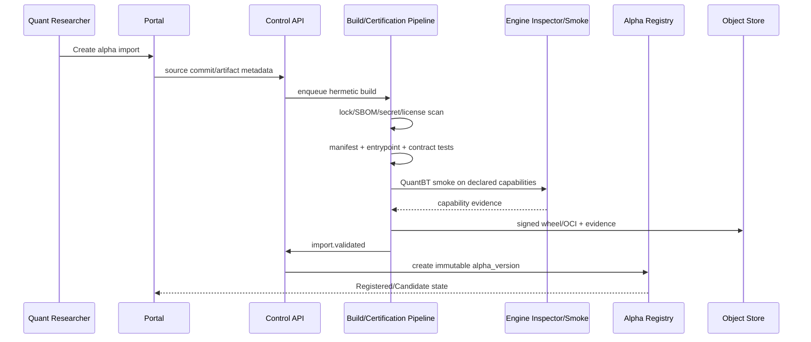

#### User-visible stages

```text
Source received
Building
Contract validation
Tests
QuantBT smoke
Evidence review
Ready to publish
Published / failed / quarantined
```

### 28.2 Flow B — Research → WFO → final audit

```mermaid
flowchart LR
    A[Choose alpha version] --> B[Choose engine capability]
    B --> C[Choose immutable data/universe]
    C --> D[Configure methodology]
    D --> E[Typed preflight]
    E --> F[Optimization/WFO study]
    F --> G[Selection trace]
    G --> H[Freeze selected params]
    H --> I[Final audit replay]
    I --> J[Compare / evidence review]
    J --> K[Approval request]
```

#### Invariants

- Optimization trials dùng profile nhẹ.
- Selected params là immutable artifact.
- Holdout không tham gia selection khi protocol cấm.
- Final audit replay dùng profile audit.
- Approval bind final audit run và evidence hash.

### 28.3 Flow C — Paper → Sandbox → Live

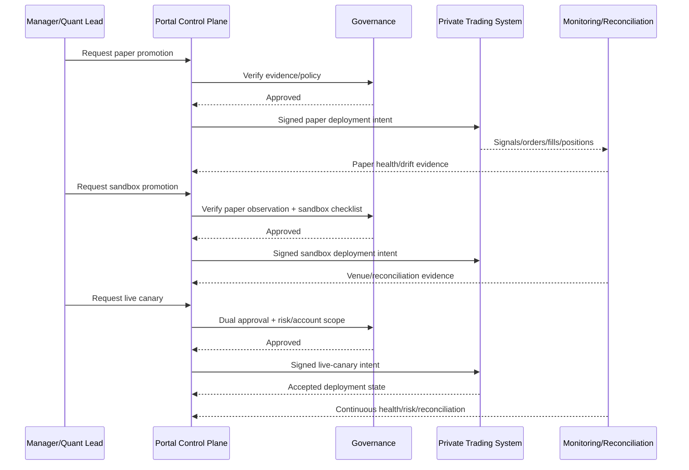

### 28.4 Flow D — Live incident

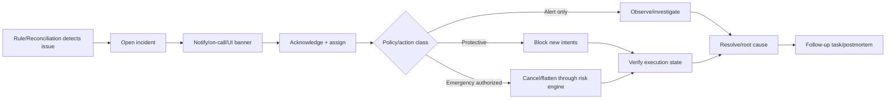

Portal button không phải action completion. Completion cần ack/observed state từ private engine và reconciliation.

### 28.5 Flow E — TradingView external signal

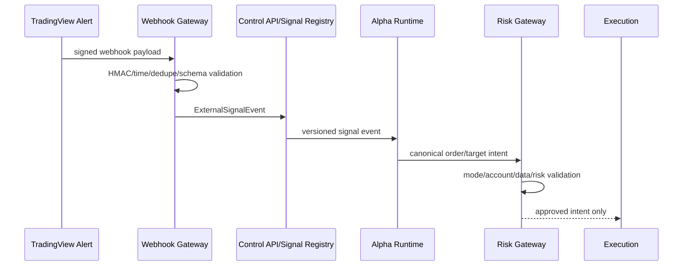

Pine/TradingView logic là source adapter; portal vẫn cần canonical execution contract và risk policy.

### 28.6 Flow F — Data quality blocks a run

```text
Run preflight
 -> dataset snapshot quality = FAIL/QUARANTINED
 -> UI disables submit and links quality evidence
 -> data engineer creates repaired dataset version
 -> new immutable snapshot
 -> user updates run draft
 -> preflight resolves new snapshot and new RunSpec hash
```

Không “unblock” bằng cách mutate quality status của snapshot cũ không có evidence.

---

## 29. Migration strategy từ portal hiện tại

### 29.0 Phase M-1A — Unified Portal Prototype trước M-1B và M0

Phase M-1A là giai đoạn bổ sung từ Draft v0.2 và phải hoàn thành trước M-1B rồi mới bắt đầu M0–M8. Nó không thay đổi nội dung các phase hiện có; nó tạo product shell và visual/route evidence để migration không phát triển theo assumption.

#### Deliverables

- Unified PortalShell dùng Fund Paper tokens.
- Feature Registry và maturity/data-mode semantics.
- Command Center và Portal Map.
- QuantBT Research được nhúng dưới canonical route nhưng giữ current backend/API.
- Docs/Roadmap/Task Board/Reports/Evidence được nhúng dưới Planning.
- Legacy routes và rollback path.
- Commissioned Feature Preview và Screen Contract template.
- Feature/screen/concern ↔ roadmap/task mapping.
- Figma prototype package.
- `AUTH_MODE=dev|cloudflare_access`, Access JWT verifier skeleton và Profile/Access page.
- Visual regression cho hai capability hiện tại.

#### Exit gate

- Một entry point, một shell, không nested navigation.
- Current QuantBT và Planning E2E parity.
- Manager hiểu được end-to-end lifecycle và phân biệt rõ màn thật/màn prototype/màn commissioned.
- Không có fake live/financial metrics.
- Mỗi commissioned feature có route preview, concern và planning link.
- External prototype có Cloudflare Access; backend không public trực tiếp.
- Review sign-off được lưu vào Planning/Evidence.

#### Rollback

- Current root QuantBT routes và `/roadmap-task-board/` vẫn deploy được.
- Feature flag có thể trả người dùng về hai current entry behavior trong parity window.
- Không migrate/delete current API hoặc SQLite data trong phase này.

#### Quan hệ với M0

M0 vẫn freeze commits, artifacts, contracts và golden evidence như đã mô tả. M-1A bổ sung shell/prototype baseline; M-1B bổ sung secure domain/login/identity boundary; M0 mới là điểm bắt đầu của migration technical authority.

### 29.0.1 Phase M-1B — Secure Domain, Login & Identity Bootstrap trước M0

Phase M-1B được thực hiện sau khi M-1A có Unified Portal shell đủ chạy và trước M0. Nó đưa prototype lên hostname thật `portal.primusspark.com` nhưng **không** biến prototype thành live trading platform.

#### Mục tiêu

- Publish Portal qua Cloudflare Access + Tunnel mà không mở public web port trên VPS.
- Chốt origin TLS/Nginx route cho một entry point.
- Verify Access JWT tại Tunnel và app.
- Dựng màn local login/first-password-change theo UI system của Portal.
- Seed ba username/role owner yêu cầu bằng unique one-time credentials.
- Có app session, RBAC, audit và rollback đủ an toàn cho manager prototype review.

#### Dependency

```text
M-1A shell/routes parity
Cloudflare zone primusspark.com active
VPS SGP reachable by controlled SSH
Portal/QuantBT/Planning services can bind loopback
Database migration path available for auth tables
```

#### Deliverables

1. Domain and edge:
   - `portal.primusspark.com` DNS route tới named Tunnel.
   - Self-hosted Access application `PrimusSpark Portal`.
   - Allow policy cho `@azdag.com`; deny-by-default.
   - Google Workspace primary IdP; OTP policy hẹp nếu cần.
2. Origin:
   - Nginx loopback TLS bằng Origin CA certificate.
   - App bind `127.0.0.1:8080`.
   - UFW không mở 80/443 public.
   - cloudflared systemd service + ingress catch-all 404.
3. Identity:
   - Access JWT verifier với JWKS, issuer, audience và expiry checks.
   - `originRequest.access.required` ở Tunnel.
   - Header spoofing tests.
4. Local authentication:
   - `AUTH_MODE=cloudflare_access_local_password`.
   - Opaque server-side session + CSRF/origin protection.
   - Argon2id credential storage.
   - login throttle/temporary lock.
5. Bootstrap users:
   - `bobby` → `ADMIN`.
   - `stan` → `USER`.
   - `thanhvuong` → `USER`.
   - unique one-time activation credential.
   - mandatory first-login password change.
6. UI:
   - Portal Local Login.
   - First-login Password Change.
   - Access Denied / Identity Binding Conflict.
   - Settings → Users & Access.
7. Operations:
   - auth audit events/metrics.
   - runbook deploy, rollback, credential reset và session revoke.
   - evidence screenshots/Playwright/security test report trong Planning.

#### Work breakdown

##### M-1B.0 — Freeze decisions và secrets inventory

- Record Cloudflare team name, team domain và application AUD.
- Record Origin CA certificate serial/expiry; không ghi private key.
- Define exact `@azdag.com` email mapping cho từng local username khi available.
- Choose secret delivery channel cho activation credential.
- Create owner/runbook for Cloudflare, VPS, Portal auth và emergency access.

Exit:

- không còn placeholder nào cần cho runtime trừ exact user email mapping có thể activate on-first-use;
- secrets không nằm trong Git/Planning attachment.

##### M-1B.1 — Loopback-only service topology

- Bind Portal gateway/app `127.0.0.1:8080`.
- Bind QuantBT/Planning internal services loopback/private network.
- Verify container port publishing không dùng `0.0.0.0`.
- Add local health/readiness endpoints.

Exit:

- external scan không thấy app ports;
- local Nginx có thể reach app.

##### M-1B.2 — Nginx Origin CA TLS

- Install cert/key với permission đúng.
- Deploy version-compatible Nginx config.
- Strip identity aliases; forward canonical Access JWT.
- Test HTTP upgrade/SSE/large artifact route cần thiết.
- `nginx -t` + local curl/SNI test pass.

Exit:

- certificate SAN/hostname valid;
- `noTLSVerify` không cần bật;
- Nginx chỉ loopback.

##### M-1B.3 — Named Tunnel và DNS route

- Install pinned/managed cloudflared package.
- Create named tunnel `sgp-vps-tunnel` hoặc owner-approved name.
- Move tunnel-specific credential vào `/etc/cloudflared`.
- Configure `portal.primusspark.com` ingress + catch-all 404.
- Add Access `required/teamName/audTag` origin control.
- Install/start systemd service.
- Bind DNS CNAME through Tunnel.

Exit:

- ingress validation/rule test pass;
- tunnel healthy after reboot;
- public 80/443 remain closed.

##### M-1B.4 — Cloudflare Access application

- Create Self-hosted app.
- Configure `@azdag.com` allow policy.
- Prefer Google Workspace + instant authentication.
- Separate restricted OTP policy only when required.
- Configure session 24h; document admin-sensitive step-up as commissioned.
- Capture AUD/team domain into runtime secret/config.
- Run policy tester with allowed/denied identities.

Exit:

- user outside policy denied;
- allowed identity reaches Portal ingress;
- missing Access token blocked before app.

##### M-1B.5 — App JWT verifier và identity binding

- Implement remote JWKS verifier.
- Validate signature/issuer/audience/time claims.
- Normalize verified identity.
- Ignore/strip unverified email aliases.
- Add binding schema and conflict policy.
- Create `/api/auth/context`.

Exit:

- tampered/wrong-AUD/wrong-issuer tests fail closed;
- valid token maps deterministic identity context;
- no raw token in logs.

##### M-1B.6 — Local credential/session service

- Add user/credential/activation/session/audit migrations.
- Implement Argon2id and password blocklist.
- Implement login, forced password change, logout, reset/revoke.
- Add opaque session cookie, CSRF/origin validation and rotation.
- Add rate limit/temporary lock.

Exit:

- first-login state cannot access Portal routes;
- password change revokes activation and rotates session;
- logout/revoke works server-side.

##### M-1B.7 — Bootstrap users

- Seed `bobby`, `stan`, `thanhvuong` idempotently.
- Generate unique one-time credential per account.
- Deliver outside Git/log/task board.
- Bind verified Access identity during controlled activation or pre-bind exact email.
- Delete bootstrap secret output after successful activation.

Exit:

- three accounts active/bound as expected;
- `bobby` has ADMIN, others USER;
- no shared/default plaintext credential remains.

##### M-1B.8 — Login and admin UX

- Build frames 01B/01C/01D.
- Preserve Fund Paper design language.
- Add Users & Access admin screen.
- Add session-expired and Access-identity-switch behavior.
- Add responsive/a11y/visual regression coverage.

Exit:

- manager can demonstrate complete Access → login → password change → Portal flow;
- USER and ADMIN views differ correctly;
- errors do not leak account/security internals.

##### M-1B.9 — Security, parity và rollout evidence

- Run edge/tunnel/JWT/login/RBAC acceptance matrix.
- Verify QuantBT and Planning current flows after auth gateway.
- Test SSE/WebSocket/deep links/session expiry.
- Test reboot and rollback.
- Attach sanitized evidence vào Planning.

Exit:

- no current capability regression;
- no public origin bypass;
- owner sign-off cho prototype external access.

#### Phase exit gate

M-1B chỉ complete khi tất cả điều kiện sau đúng:

- `https://portal.primusspark.com` được Access bảo vệ deny-by-default.
- VPS không expose web ports public; app/Nginx bind loopback.
- Cloudflare Tunnel route và local origin TLS verify thành công.
- `cloudflared` và app đều reject invalid Access JWT.
- Browser không tin/giữ raw JWT như app credential.
- Ba local user được seed đúng role bằng unique one-time credential.
- First login bắt đổi password và session được rotate.
- Shared/common bootstrap password không tồn tại trong runtime/repo/log.
- USER không truy cập admin actions; server-side authorization pass tests.
- Auth/audit/rollback runbook và sanitized evidence có trong Planning.
- QuantBT Research và Planning parity vẫn pass.

#### Rollback

- Giữ Access + Tunnel + closed origin trong mọi rollback.
- Feature flag có thể tạm chuyển account đã pre-bind sang `cloudflare_access` SSO-only nếu local login regression.
- Revert Nginx/Tunnel config về last-known-good; không mở public port.
- Revoke all app sessions/activation credentials nếu identity data nghi ngờ.
- Database auth migrations phải có backup và forward-fix/rollback plan.

#### Quan hệ với M0

```text
M-1A  product shell/prototype integration
  -> M-1B secure domain/login/identity bootstrap
       -> M0 freeze baseline, inventory and golden evidence
```

M0 bắt đầu sau khi entry point và identity boundary đủ ổn định để screenshots, golden flows, API inventory và future migrations đều được thực hiện qua cùng một Portal access path.


### 29.1 Nguyên tắc

- Không big-bang rewrite.
- Giữ current React/FastAPI QuantBT flow làm baseline.
- Pin `quantbt-engine==1.0.8` và golden artifacts.
- Dùng strangler façade: TS Control API đứng trước, proxy/read current contract trước khi thay authority.
- Mỗi phase có parity/rollback.
- Rust extraction đến sau contract/data shape, trừ khi một service độc lập có thể triển khai không ảnh hưởng core.

Migration plan cũ đã đặt đúng thứ tự: reproduce, standardize contracts/reproducibility, xây backtest platform/portal rồi mới harden monitoring/paper. fileciteturn0file1L196-L244

### 29.2 Phase M0 — Baseline, inventory và golden evidence

#### Deliverables

- Freeze current portal/QuantBT/image/config commits.
- Pin and verify PyPI `quantbt-engine==1.0.8` wheel/hash.
- Inventory current FastAPI endpoints, frontend routes, artifact schemas và Roadmap SQLite.
- Golden run set:
  - signal_notional.
  - intrabar.
  - event-driven.
  - portfolio.
  - WFO/three-window.
- Capture screenshots/Playwright flows.
- Define current SLO/RSS/payload baselines.

#### Exit gate

- Clean environment reproduces golden metrics/artifacts within defined tolerance.
- Existing portal can reopen completed artifacts.
- Current Roadmap data export has count/hash report.

#### Rollback

- Current Compose stack remains deployable and immutable.

### 29.3 Phase M1 — Contract foundation và shared design system

#### Deliverables

- `packages/ui` extract current Fund Paper token/components.
- OpenAPI snapshot of current FastAPI.
- Canonical IDs/timestamps/problem details/idempotency conventions.
- Schema repo: RunSpec, artifact manifest, events, alpha manifest draft.
- TS client generated for current API.
- Storybook/visual baseline.

#### Exit gate

- Current frontend can consume generated client without metric/result change.
- No raw color outside token exception list.
- Contract breaking CI works.

### 29.4 Phase M2 — TypeScript Control API as façade

#### Deliverables

- NestJS/Fastify application.
- OIDC login, organization/workspace/project.
- Initial RBAC.
- PostgreSQL schema for identity binding, run registry/read models, audit/outbox.
- TS API proxies existing FastAPI QuantBT actions; response parity tests.
- One public gateway; FastAPI becomes private.

#### Exit gate

- All browser calls route through TS gateway.
- Auth/permission enforced server-side.
- Golden UI/run workflow parity.
- Disable TS feature flag returns traffic to legacy gateway path.

### 29.5 Phase M3 — Worker isolation, durable queue và immutable artifacts

#### Deliverables

- NATS JetStream.
- `quant-worker-py` one-run process/container.
- Run/run-attempt state model.
- Transactional outbox.
- S3/MinIO artifact bundle and checksums.
- SSE progress from durable state/events.
- Cancel/retry/lease/redelivery.
- Legacy artifact importer/adapter.

#### Exit gate

- API remains responsive during heavy WFO.
- Kill/restart worker gives correct retry/no duplicate completed run.
- Artifact commit/reopen/checksum gate pass.
- Queue/cancel/retry/quota acceptance pass.

### 29.6 Phase M4 — Engine Capability Registry và full QuantBT UI

#### Deliverables

- `engine-inspector-py`.
- Engine release/capability registry.
- Dynamic endpoint explorer.
- Generic Run API and schema-generated wizard.
- Support stable factory list of 1.0.8.
- Capability-gated optional/experimental routes.
- Final audit replay workflow.

#### Exit gate

- Add a synthetic new capability to manifest without changing core wizard code.
- Every visible endpoint has schema, status, backend and artifact support matrix.
- Unsupported capability cannot be submitted by crafted request.

### 29.7 Phase M5 — Alpha Registry, Import, Pool và Research Workbench

#### Deliverables

- Alpha/package manifest finalization after owner sample.
- Import/build/certification pipeline.
- Alpha Pool/Detail/Versions/Lineage.
- Experiment/Research Workbench.
- Strategy Composer v1.
- Alpha Mining campaign skeleton.

#### Exit gate

- CI publishes immutable alpha version.
- Manager/researcher runs allowed params without arbitrary code.
- Same alpha artifact hash appears in run manifest.
- Quarantine blocks new runs/promotions.

### 29.8 Phase M6 — Approval, Paper và Sandbox

#### Deliverables

- Approval inbox/policies/separation of duties.
- Promotion state machine.
- Paper deployment control/telemetry/drift.
- Sandbox account/capability/checklist/reconciliation.
- Incident integration.

#### Exit gate

- Same artifact promoted to paper/sandbox.
- Paper and sandbox events trace by deployment/alpha.
- Risk/data/reconciliation gate blocks invalid promotion.
- Pause/rollback game-day test pass.

### 29.9 Phase M7 — Live control integration

#### Deliverables

- Private trading control adapter.
- Signed deployment intent.
- Live canary/scale policy.
- Live Ops dark workstation.
- Account/subaccount/risk policy bindings.
- Reconciliation and incident action.
- Step-up auth/dual approval/break-glass.

#### Exit gate

- Portal cannot bypass risk engine.
- Live action tested in staging/sandbox and canary.
- Operator action has full audit/evidence.
- Portal outage does not stop risk/monitoring/execution safety.

### 29.10 Phase M8 — Rust fast paths và scale hardening

#### Deliverables

- Benchmark current query/realtime paths.
- `artifact-query-rs` where evidence supports.
- `realtime-gateway-rs` for live fan-out/backpressure.
- Optional runner supervisor.
- Advanced caching/downsampling/read models.
- Capacity/DR/performance certification.

#### Exit gate

- Numerical/artifact parity.
- p95/p99/RSS target achieved.
- Load/fault/slow-consumer tests pass.
- Old implementation removable by feature flag/cutover plan.

### 29.11 Roadmap Task Board migration

Current repository có separate FastAPI/SQLite feature. citeturn597331view0turn597331view1

Migration chi tiết:

1. Document schema/API and export all entities/attachments.
2. Add global IDs/workspace ownership/version/timestamps.
3. Build importer with `legacy_id` and checksum.
4. Create Planning module tables in Postgres.
5. Serve compatibility API from TS under same frontend route.
6. Migrate UI to `packages/ui` and Control API client.
7. Dual-read comparison/report.
8. Freeze writes on old service for cutover window.
9. Final import and reconcile.
10. Retire SQLite companion; keep read-only archive/backup.

### 29.12 Feature flags

```text
unified_portal_shell_enabled
show_commissioned_features
embedded_quantbt_research_enabled
embedded_planning_enabled
cloudflare_access_enabled
prototype_fixture_mode_enabled
control_api_ts_enabled
worker_queue_v2_enabled
artifact_bundle_v2_enabled
engine_capability_registry_enabled
alpha_registry_enabled
paper_control_enabled
sandbox_control_enabled
live_control_enabled
artifact_query_rs_enabled
realtime_gateway_rs_enabled
planning_postgres_enabled
```

Feature flag không dùng để bypass security/policy. Server-side permission/policy vẫn bắt buộc.

---

## 30. Implementation backlog đề xuất

### 30.1 Epic map

| Epic | Name | Outcome |
|---|---|---|
| PRT | Unified Portal Prototype | One shell, two current features, status-aware future IA |
| ARCH | Architecture & contracts | Stable boundaries, ADR, schemas |
| UI | Design system & shell | Shared production component system |
| ID | Identity & authorization | Multi-user secure portal |
| CP | Control plane | TS authoritative workflow/API |
| QW | Quant worker | Isolated QuantBT execution |
| EC | Engine catalog | Full capability-driven QuantBT support |
| AR | Alpha registry | Version/import/certification/pool |
| RS | Research | Workbench/mining/composer |
| BT | Backtests | Wizard/queue/detail/compare/WFO |
| AF | Artifacts | Object store/query/export/lineage |
| AP | Approval & promotion | Governed lifecycle |
| DP | Deployments | Paper/sandbox/live control |
| OP | Operations | Monitoring/incidents/reconciliation |
| DATA | Data catalog | Snapshots/quality/lineage |
| ACCT | Accounts & brokers | Metadata/permission/secret references |
| PLAN | Roadmap & task | Integrated planning domain |
| PERF | Performance | Query/realtime/frontend optimization |
| SEC | Security | Threat controls/audit/supply chain |
| SRE | Platform operations | Observability/DR/runbooks |

### 30.2 P0 — Architecture safety and reproducibility

```text
ARCH-001  Freeze architecture invariants and authority matrix
ARCH-002  Define canonical IDs/timestamp/decimal conventions
ARCH-003  Publish RunSpec v1 schema
ARCH-004  Publish artifact manifest v2 schema
ARCH-005  Publish event envelope v1 schema
ARCH-006  Define engine capability manifest v1
ARCH-007  Define alpha manifest draft v1
ARCH-008  Establish schema compatibility CI

QW-001    Pin quantbt-engine 1.0.8 wheel/image digest
QW-002    Build golden run suite across major routes
QW-003    One-run isolated worker prototype
QW-004    Run attempt/lease/idempotency model
QW-005    Artifact temp/finalize/checksum protocol
QW-006    Cancellation and hard-kill behavior

SEC-001   OIDC baseline
SEC-002   No live secret in worker policy
SEC-003   Alpha sandbox baseline
SEC-004   Audit event baseline
```

### 30.3 P1 — Product/control foundation

```text
UI-001    Extract Fund Paper tokens to packages/ui
UI-002    App shell/product rail/top bar
UI-003    Shared table/filter/drawer pattern
UI-004    Chart frame and semantic segment palette
UI-005    Loading/empty/error/partial states
UI-006    Accessibility and visual test harness

CP-001    NestJS/Fastify bootstrap
CP-002    PostgreSQL migrations/outbox
CP-003    Organization/workspace/project modules
CP-004    Run registry/read model
CP-005    FastAPI compatibility adapter
CP-006    SSE event stream
CP-007    OpenAPI client codegen

ID-001    User/session profile
ID-002    RBAC/ABAC policy checks
ID-003    Environment-aware permissions
```

### 30.4 P2 — Full backtest platform

```text
EC-001    Engine release registration
EC-002    Engine inspector
EC-003    Capability support matrix
EC-004    Endpoint Explorer
EC-005    Dynamic schema form renderer

BT-001    Generic run preflight
BT-002    Backtest wizard v2
BT-003    Run queue
BT-004    Run detail v2
BT-005    Compare runs
BT-006    WFO Lab
BT-007    Final audit replay
BT-008    Export/evidence bundle

AF-001    S3/MinIO artifact registry
AF-002    Legacy artifact importer
AF-003    Series/table query API
AF-004    Content-addressed cache
```

### 30.5 P3 — Alpha and research platform

```text
AR-001    Alpha/alpha-version domain
AR-002    Import pipeline
AR-003    Certification pipeline
AR-004    Alpha Pool
AR-005    Alpha Detail/Versions/Lineage
AR-006    Quarantine/deprecate

RS-001    Experiment domain
RS-002    Research Workbench
RS-003    Alpha Mining campaign
RS-004    Candidate explorer
RS-005    Strategy Composer
RS-006    TradingView/lightweight chart adapter
RS-007    External signal webhook adapter
```

### 30.6 P4 — Governance and deployment lifecycle

```text
AP-001    Approval policy/version
AP-002    Approval inbox/evidence pack
AP-003    Separation of duties
AP-004    Promotion state machine
AP-005    Waiver/expiry

DP-001    Paper deployment control
DP-002    Paper drift/reconciliation
DP-003    Sandbox account/certification
DP-004    Live canary/scale model
DP-005    Signed private-engine adapter
DP-006    Pause/rollback/protective action
DP-007    Live Ops workstation

OP-001    Health map
OP-002    Incident domain
OP-003    Reconciliation UI
OP-004    Policy action timeline
```

### 30.7 Cross-cutting P0–P4

```text
DATA-001  Dataset/snapshot catalog
DATA-002  Data quality schema
DATA-003  Instrument/universe snapshot
ACCT-001  Venue/account registry
ACCT-002  Secret reference and permission probe
PLAN-001  Planning Postgres schema/importer
PLAN-002  Roadmap and task integration
PERF-001  Performance budgets/benchmarks
PERF-002  Virtual tables/downsampling
PERF-003  Rust query service gate
PERF-004  Rust realtime gateway gate
SRE-001   OTel instrumentation
SRE-002   Dashboards/alerts/runbooks
SRE-003   Backup/restore/game-day
```

---

## 31. Testing strategy và acceptance gates

### 31.1 Test pyramid theo boundary

#### Schema/contract

- JSON Schema validation.
- Protobuf breaking check.
- OpenAPI diff.
- Generated TS/Python/Rust type compile.
- Event compatibility/replay.

#### Unit/domain

- State transitions.
- Policy decisions.
- Permission/ABAC.
- Run preflight rules.
- Artifact path/hash.
- Promotion gates.

#### Integration

- PostgreSQL/outbox.
- NATS redelivery/idempotency.
- S3/MinIO finalize.
- OIDC integration.
- QuantBT worker imports exact wheel.
- Rust query reads real Parquet artifacts.
- Private engine sandbox adapter.

#### Golden/parity

- Metrics/equity/orders/fills/WFO selection parity.
- Deterministic seed.
- Python vs optional Rust backend only where capability claims parity.
- Old portal vs new worker/artifact adapter.

#### E2E

- Login/workspace.
- Import alpha.
- Create/preflight/submit/cancel/retry run.
- WFO → final audit → approval.
- Paper/sandbox promotion.
- Live canary dry-run/paused state.
- Incident/protective action.
- Roadmap task linking.

#### Non-functional

- Load/soak.
- Slow-consumer.
- Fault injection.
- Security/DAST/SAST/dependency scan.
- Accessibility.
- Visual regression.
- Backup/restore.

### 31.2 QuantBT route test matrix

| Route | Smoke | Golden metrics | Artifacts | Cancel | Retry | Capability UI |
|---|---:|---:|---:|---:|---:|---:|
| pct_equity | ✓ | ✓ | ✓ | ✓ | ✓ | ✓ |
| signal_notional | ✓ | ✓ | ✓ | ✓ | ✓ | ✓ |
| intrabar_bracket | ✓ | ✓ | fills/audit | ✓ | ✓ | ✓ |
| intrabar_reference | ✓ | parity oracle | ✓ | ✓ | ✓ | ✓ |
| fill_replay | ✓ | accounting | fills | ✓ | ✓ | ✓ |
| dca_ladder | ✓ | ✓ | conditional | ✓ | ✓ | ✓ |
| orders | ✓ | ✓ | orders/fills | ✓ | ✓ | ✓ |
| event_driven | ✓ | ✓ | profile-based | ✓ | ✓ | ✓ |
| basket | ✓ | ✓ | package evidence | ✓ | ✓ | ✓ |
| arbitrage | ✓ | ✓ | rejection/spread | ✓ | ✓ | ✓ |
| walk_forward | ✓ | fold/selection | WFO bundle | ✓ | ✓ | ✓ |
| train_test_split | ✓ | window/selection | evidence | ✓ | ✓ | ✓ |
| portfolio | ✓ | exposure/attribution | portfolio bundle | ✓ | ✓ | ✓ |
| nautilus_validation | conditional | parity/known diff | certification | ✓ | ✓ | ✓ |
| optional capabilities | manifest-driven | policy-driven | policy-driven | ✓ | ✓ | ✓ |

### 31.3 Holdout and selection tests

- Mutate Holdout data; selected params không đổi khi protocol says holdout excluded.
- Mutate outer OOS; IS-only selection không đổi.
- Fold boundary/timezone invariants.
- Duplicate trial state.
- Seed reproducibility.
- Unsupported schedule/mode raises, không fallback.
- Final audit params digest bằng selected params digest.

### 31.4 Artifact tests

- Manifest references all files.
- All checksum pass.
- Final equity equals metrics within defined tolerance.
- Series time range equals RunSpec.
- No hidden local path/secret.
- Missing capability artifact omitted + capability flag, không fabricated.
- Legacy artifact adapter round-trip.
- Corrupt/missing object marks run `CORRUPT` and blocks approval.

### 31.5 UI visual/interaction gates

- Desktop/tablet/mobile screenshots.
- No blank chart/zero-size canvas.
- No overlap at supported breakpoints.
- Keyboard navigation.
- Focus/escape behavior in modal/drawer.
- Loading/empty/error/partial states.
- Data source tooltip for metrics.
- Segment colors consistent.
- Live environment/action always explicit.
- Chart/table cross-filter reset.

Current prototype already yêu cầu Playwright screenshots, chart nonblank checks, performance/RSS report và no frontend overlap/console error; các gate này nên được giữ trong platform CI. citeturn576605view7

### 31.6 Security gates

- Unauthorized cross-workspace access denied.
- Crafted endpoint capability request denied.
- Expired/replayed command denied.
- Webhook HMAC/replay test.
- Worker network/secret isolation test.
- Artifact path traversal test.
- Signed URL scope/expiry test.
- Role/self-approval test.
- Live action step-up/dual approval test.
- Log/artifact secret scan.

### 31.7 Definition of Done cấp platform

#### Reproducibility

- Approved run có exact alpha, engine, dataset, config, seed và artifact hashes.
- Re-run same manifest đạt deterministic tolerance.
- Không approved run dùng mutable “latest”.

#### Backtest platform

- Manager chạy simple/train-test/WFO/optimization qua capability-driven UI.
- Queue/cancel/retry/timeout/quota hoạt động.
- Result có metrics/charts/audit/manifest.
- Final audit khác optimization scoring run.

#### Alpha governance

- Alpha package/version immutable.
- Manager không chạy arbitrary code.
- Same artifact promoted.
- Approval immutable và evidence-linked.

#### Paper/live

- Events query được theo alpha/deployment/account.
- Order/fill/position/PnL reconcile.
- Invalid/stale input bị risk block.
- Canary/rollback tested.
- Không manual config drift ngoài control plane.

#### Monitoring

- Detect stale feed/process failure/order reject/position mismatch.
- Incident có state/owner/timeline/evidence.
- Policy action đúng scope.
- Portal outage không phá safety plane.

Các tiêu chí này nhất quán với Definition of Done migration trước. fileciteturn0file4L415-L462

---

## 32. Risk register

| Risk | Impact | Likelihood | Mitigation |
|---|---|---:|---|
| Ba ngôn ngữ tạo overhead | Delivery/ownership chậm | Medium | Strict boundary, generated contracts, no duplicate domain logic |
| Rust hóa quá sớm | Overengineering | Medium | Extraction gate bằng benchmark/profile |
| TS control plane duplicate QuantBT logic | Numerical/audit drift | High nếu không kiểm soát | Public endpoint only, frontend/control no recompute |
| Arbitrary alpha code | Platform/secret compromise | High | CI sandbox, no live secret, network deny, signed artifact |
| Engine version drift | Non-reproducible run | Medium | Exact digest, capability manifest, compatibility matrix |
| Mutable data/latest path | False evidence | High | Immutable snapshot/content hash |
| WFO/holdout leakage | False alpha | High | Typed methodology, mutation tests, QuantBT metadata authority |
| At-least-once duplicates | Duplicate run/action | Medium | Idempotency/outbox/aggregate version |
| Large artifacts overload API/UI | Poor UX/outage | High | Parquet/object store/Rust query/downsample/virtualization |
| Live portal bypasses risk | Capital loss | Critical | Signed intent, risk engine authority, fail-closed |
| Reconciliation incomplete | Unknown real state | Critical | Continuous reconciliation, block/pause policy |
| Wealthfolio code license misuse | Legal/compliance | Medium | Clean-room pattern adaptation, AGPL review |
| TradingView licensing mismatch | Integration blocked | Medium | Lightweight default, legal review for Advanced Charts |
| Roadmap SQLite migration loss | Planning/history loss | Medium | Idempotent import, count/hash/attachment reconciliation |
| UI too dense | Operational error | Medium | Density modes, hierarchy, user testing, mobile scope |
| Too many datastores | Ops burden | Medium | PostgreSQL + object store + NATS first; optional later |
| Portal outage during live | Loss of visibility | High | Independent monitoring/risk/execution plane, direct runbooks |
| Secret in logs/artifacts | Security incident | High | Structured schemas, redaction, scans, no browser secret return |

---

## 33. Architecture Decision Records cần tạo

| ADR | Decision |
|---|---|
| ADR-001 | Portal is control plane, not execution hot path |
| ADR-002 | TypeScript/NestJS/Fastify authoritative control API |
| ADR-003 | Python isolated QuantBT worker boundary |
| ADR-004 | Rust only for artifact query/realtime/supervision fast paths |
| ADR-005 | No Java or Go in v1 platform services |
| ADR-006 | PostgreSQL + object storage as primary records |
| ADR-007 | NATS JetStream for durable jobs/domain events |
| ADR-008 | Capability-driven QuantBT integration |
| ADR-009 | Immutable alpha/dataset/engine/run/promotion identity |
| ADR-010 | Generic Run API with schema-generated UI |
| ADR-011 | Fund Paper design system + clean-room Wealthfolio patterns |
| ADR-012 | ECharts + Lightweight Charts default; Advanced Charts gated |
| ADR-013 | Roadmap/Task Board moves into Planning/Postgres module |
| ADR-014 | Final audit replay required before approval |
| ADR-015 | OIDC + RBAC/ABAC + separation of duties |
| ADR-016 | OpenTelemetry end-to-end correlation |

Mỗi ADR gồm context, decision, alternatives, consequences, rollout, rollback và owner.

---

## 34. Stack đề xuất cuối của Draft v0.1

### 34.1 Frontend

```text
React + Vite + TypeScript
React Router (giữ hiện tại) hoặc migration có chủ đích sang TanStack Router
TanStack Query
TanStack Table + Virtual
React Hook Form + Zod/Ajv
Radix primitives + portal-owned packages/ui
CSS variables preserving Fund Paper tokens
ECharts
TradingView Lightweight Charts
Dnd Kit
Lucide
Playwright + Vitest + Testing Library
```

### 34.2 Control plane

```text
Node.js LTS
NestJS + Fastify
PostgreSQL
SQL-first typed query layer
NATS + JetStream
Redis optional/ephemeral
OpenAPI + Protobuf/Buf
OpenTelemetry + structured logs
```

### 34.3 Quant compute

```text
Python 3.12 baseline
quantbt-engine[optimization]==1.0.8 exact pin
Pydantic v2
PyArrow/Parquet
NATS Python client
uv/locked build
pytest/Hypothesis
one-run isolated worker/container
```

### 34.4 Rust fast paths

```text
Rust stable toolchain pinned
Axum + Tokio + Tower
Arrow + Parquet + DataFusion
SQLx
object_store
NATS client
Tonic/Protobuf where needed
tracing/OpenTelemetry
```

### 34.5 Infrastructure

```text
S3/MinIO
PostgreSQL; Timescale optional
NATS JetStream
Redis optional
Kubernetes for distributed production compute; Compose local/CI
Vault/KMS/managed secrets
OpenTelemetry Collector + Prometheus/Grafana/Loki/Tempo class stack
Reverse proxy/WAF/TLS
```

### 34.6 Không chọn mặc định

```text
Java/Spring as additional portal backend
Go services alongside Rust
Celery as cross-language platform queue
Redis as durable source of truth
Kafka before event scale requires it
ClickHouse before query evidence requires it
Browser arbitrary Python editor
Direct TradingView-to-broker execution
```

---

## 35. Các input cần cho Draft v0.2

Tài liệu này chưa final. Những input sau sẽ làm thay đổi chi tiết contract nhưng không thay đổi kiến trúc plane chính:

1. Mẫu chuẩn Python alpha/strategy mà owner sẽ cung cấp.
2. Danh sách public capability/export API chính thức của QuantBT 1.0.8 nếu đã có machine-readable registry.
3. Current FastAPI OpenAPI và artifact samples của portal.
4. Contract private trading engine: deployment command, telemetry, risk, reconciliation và account identity.
5. Quant-data-layer API cho historical snapshot, realtime subscription và instrument master.
6. User/organization model: single organization hay multi-tenant.
7. Expected run concurrency, trial volume, data size và retention.
8. Production topology: cloud/on-prem/hybrid, Kubernetes availability.
9. Venue/account environments và exact live permission model.
10. TradingView Advanced Charts licensing status; nếu không có, giữ Lightweight Charts.
11. License posture của portal để quyết định có thể reuse AGPL code hay chỉ clean-room.
12. Existing Roadmap SQLite schema/data volume/attachments.
13. Exact color/component changes đã làm trong current `awesome-portal` nếu khác `awesome-quant-portal` reference.
14. Cloudflare Access identity option cho prototype: Access Application/hostname/team/AUD đã khóa; login method vẫn phải được owner xác nhận là Google Workspace hay One-time PIN trước external go-live.
15. Role bootstrap ban đầu và ai được xem các commissioned modules: ADMIN, MANAGER, QUANT, VIEWER.
16. Screenshot/Figma baseline được duyệt cho current QuantBT và Planning feature trước khi refactor shell.


### 35.1 Input đã được khóa trong Final Baseline v0.4

- Public hostname: `portal.primusspark.com`.
- Server target: VPS SGP Ubuntu/Debian.
- Edge/origin path: Cloudflare Access → Tunnel → Nginx loopback TLS → Portal app `127.0.0.1:8080`.
- Zero Trust team name: `primussparkquant`.
- Team domain/expected JWT issuer: `https://primussparkquant.cloudflareaccess.com`.
- Access Application Audience tag: `564a9f0023fbaa7af966e1056687ae4f6d9523f052b75b83be623678ac70684e`.
- JWKS endpoint: `https://primussparkquant.cloudflareaccess.com/cdn-cgi/access/certs`.
- Cloudflare allow boundary: verified identity có email kết thúc bằng `@azdag.com`.
- App authorization mode: local username/password + database RBAC, chỉ sau khi Access JWT hợp lệ.
- Identity binding: `first_login`; exact email không bắt buộc seed trước, nhưng được lưu từ verified JWT khi activation thành công.
- Bootstrap usernames/roles: `bobby/ADMIN`, `stan/USER`, `thanhvuong/USER`.
- Unique one-time activation credential và first-login password change là bắt buộc; shared default password bị cấm.

### 35.2 Runtime input còn cần điền trước activation

- Tunnel UUID và đường dẫn credentials JSON sau khi tạo named Tunnel.
- Google Workspace hoặc One-time PIN login method được bật và policy `Allow @azdag.com` đã được kiểm tra trên Dashboard.
- Origin CA certificate/private-key thực tế và certificate expiry inventory/alert owner.
- Portal session secret, password pepper/encryption material và database credentials.
- Kênh giao unique activation credential cho từng user.
- SSH management IP/CIDR hoặc private management path.
- Exact email cho từng account là **optional** nếu dùng controlled first-login binding; pre-bind admin email vẫn là hardening có thể áp dụng sau.

Các secret/value runtime phải đi qua secret/config management; không hard-code vào frontend hoặc commit trong repository. `AUD`, team name và hostname không phải password secret, nhưng phải được quản lý như integrity-sensitive configuration.

---

## 36. Kết luận

Hướng nên chốt cho lần thiết kế tiếp theo là:

- **TypeScript là product/control-plane authority.**
- **Python là quant compute authority và gọi đúng `quantbt-engine==1.0.8`.**
- **Rust là high-performance data/realtime layer, không duplicate QuantBT accounting hoặc portal CRUD.**
- **Java và Go không thêm vào v1.**
- **Modular monolith trước, service extraction theo bottleneck/evidence.**
- **Capability manifest là chìa khóa để support đầy đủ và future-proof mọi QuantBT endpoint.**
- **Immutable artifact + same-artifact promotion là chìa khóa để nối research với paper/sandbox/live.**
- **UI giữ Fund Paper, mở rộng thành hybrid research/ops workstation và chỉ adapt clean-room pattern của Wealthfolio.**
- **Portal không bao giờ thay risk/execution/reconciliation authority.**

Kiến trúc này tránh hai cực đoan: giữ FastAPI prototype thành một platform monolith quá lớn, hoặc rewrite tất cả sang Rust vì hiệu năng lý thuyết. Nó đưa đúng ngôn ngữ vào đúng workload, giữ được tốc độ research của Python, tốc độ product của TypeScript và hiệu năng/độ ổn định của Rust tại những đường dữ liệu thực sự cần.

---

## 37. Source notes

- Additive Draft v0.2 prototype-first stage — current mother Portal and embedded Planning boundary: <https://github.com/BobbyAxerol/awesome-portal> and <https://github.com/BobbyAxerol/awesome-portal/blob/main/docs/architecture.md>
- Current QuantBT frontend routes/module structure: <https://github.com/BobbyAxerol/awesome-portal/blob/main/apps/portal/frontend/src/App.tsx>
- Current Planning shell, views and route model: <https://github.com/BobbyAxerol/awesome-portal/blob/main/features/roadmap-task-board/frontend/src/App.tsx> and <https://github.com/BobbyAxerol/awesome-portal/blob/main/features/roadmap-task-board/frontend/src/components/PortalShell.tsx>
- Cloudflare Access self-hosted application, JWT validation and application token claims: <https://developers.cloudflare.com/cloudflare-one/access-controls/applications/http-apps/self-hosted-public-app/>, <https://developers.cloudflare.com/cloudflare-one/access-controls/applications/http-apps/authorization-cookie/validating-json/> and <https://developers.cloudflare.com/cloudflare-one/access-controls/applications/http-apps/authorization-cookie/application-token/>
- Cloudflare Tunnel origin `access.required`, TLS/origin parameters and ingress validation: <https://developers.cloudflare.com/cloudflare-one/networks/connectors/cloudflare-tunnel/configure-tunnels/origin-parameters/> and <https://developers.cloudflare.com/cloudflare-one/networks/connectors/cloudflare-tunnel/do-more-with-tunnels/local-management/configuration-file/>
- Cloudflare Access email-domain policy, session/logout and Google Workspace IdP: <https://developers.cloudflare.com/cloudflare-one/access-controls/policies/common-policies/>, <https://developers.cloudflare.com/cloudflare-one/access-controls/access-settings/session-management/> and <https://developers.cloudflare.com/cloudflare-one/integrations/identity-providers/google-workspace/>
- Cloudflare Origin CA and closed-origin firewall guidance: <https://developers.cloudflare.com/ssl/origin-configuration/origin-ca/> and <https://developers.cloudflare.com/cloudflare-one/networks/connectors/cloudflare-tunnel/configure-tunnels/tunnel-with-firewall/>
- OWASP/NIST credential and session baselines: <https://cheatsheetseries.owasp.org/cheatsheets/Password_Storage_Cheat_Sheet.html>, <https://cheatsheetseries.owasp.org/cheatsheets/Authentication_Cheat_Sheet.html>, <https://cheatsheetseries.owasp.org/cheatsheets/Session_Management_Cheat_Sheet.html> and <https://pages.nist.gov/800-63-4/sp800-63b/authenticators/>
- Current portal monorepo, FastAPI/Vite boundary và PyPI pin: citeturn597331view0turn597331view1turn597331view2
- Current QuantBT Portal design tokens, typography và chart/report direction: citeturn597331view3turn576605view0turn576605view3
- QuantBT public endpoint/factory contract và 1.0.8 capabilities: citeturn362015view0turn362015view1turn362015view5
- NATS JetStream persistence/replay/ack model: citeturn328700view6turn328700view7
- Rust query/realtime building blocks: citeturn762760search1turn762760search2turn762760search3
- Wealthfolio architecture and AGPL/trademark boundary: citeturn328700view0turn328700view1
- TradingView datafeed/custom indicator/license constraints: citeturn328700view4turn297351search1turn297351search2turn297351search3turn297351search18
- Prior migration architecture and portal requirements: fileciteturn0file0L36-L139 fileciteturn0file6L601-L609 fileciteturn0file4L415-L462
---

## 38. Additive revision log — Draft v0.2

### 38.1 Nội dung bổ sung, không thay thế Draft v0.1

- Thêm Section P0 và Phase M-1A (tên cũ M-1): Unified Portal Prototype & Current Feature Integration.
- Chốt cách ghép QuantBT Research và Roadmap/Task Board vào một mother shell.
- Thêm maturity model `AVAILABLE / PROTOTYPE / COMMISSIONED / BLOCKED`.
- Thêm Feature Registry, Screen Contract và Concern Registry.
- Thêm Command Center, Portal Map và commissioned feature preview wireframes.
- Thêm Figma-first prototype package và review flows.
- Thêm Cloudflare Access/Tunnel authentication baseline, role mapping và JWT verification.
- Chèn Phase M-1A trước M0–M8; toàn bộ phase cũ vẫn giữ nguyên.

### 38.2 Trạng thái sau revision

Tài liệu vẫn là draft thảo luận. P0 là phần có thể triển khai ngay với hai capability hiện tại; các feature khác vẫn cần deep-dive theo từng repository và screen concern trước khi chuyển từ `COMMISSIONED` sang `PROTOTYPE` hoặc `AVAILABLE`.

---

## 39. Additive revision log — Draft v0.3

### 39.1 Scope bổ sung

Draft v0.3 giữ nguyên toàn bộ product/backend/UI architecture của v0.1–v0.2 và thêm một pre-M0 security/deployment track cho hostname thật:

```text
M-1A Unified Portal Prototype & Current Feature Integration
M-1B Secure Domain, Login & Identity Bootstrap
M0   Baseline, inventory và golden evidence
```

### 39.2 Quyết định đã khóa

- Public hostname: `portal.primusspark.com`.
- Origin: VPS SGP Ubuntu/Debian.
- Edge: Cloudflare Access.
- Transport: Cloudflare Tunnel outbound-only.
- Origin router: Nginx loopback TLS bằng Origin CA.
- Portal app: `127.0.0.1:8080`.
- Deployed prototype auth mode: `cloudflare_access_local_password`.
- Access identity phải verify JWT signature/issuer/audience/expiry.
- Tunnel bật Access JWT validation với `required/teamName/audTag`.
- Browser dùng opaque server-side Portal session; không giữ raw Access JWT/app JWT dài hạn.
- Local bootstrap users:
  - `bobby` → `ADMIN`.
  - `stan` → `USER`.
  - `thanhvuong` → `USER`.
- Unique one-time activation credential và mandatory first-login password change.
- Shared weak password không được đưa vào source/database/deployment.

### 39.3 Sections mới

- §P0.25A: full deployment/auth addendum cho `portal.primusspark.com`.
- §13.9: deployed prototype identity profile.
- §21.1 Draft v0.3: Access/Login/Change Password/Denied wireframes.
- §29.0.1: Phase M-1B với deliverables, work breakdown, exit gate và rollback.
- §39: revision log v0.3.

### 39.4 Trạng thái sau Finalization v0.4

Đã khóa:

- Team name: `primussparkquant`.
- Team domain/issuer: `https://primussparkquant.cloudflareaccess.com`.
- Access Application AUD: `564a9f0023fbaa7af966e1056687ae4f6d9523f052b75b83be623678ac70684e`.
- Public hostname: `portal.primusspark.com`.
- Access allow boundary: `@azdag.com`.
- App role/account bootstrap và controlled first-login binding.

Còn cần xác nhận/sinh tại runtime:

- Tunnel UUID/credential file.
- Access login method thực tế và policy screenshot/evidence.
- Unique activation-secret delivery channel.
- Google Workspace group/MFA policy chi tiết.
- Mail service/self-service reset flow.
- Device posture, WebAuthn/passkey và live step-up policy.
- Exact `@azdag.com` email binding là optional; Portal tự bind verified email/subject ở activation nếu không pre-bind.

Các input còn lại không chặn việc implement schema, middleware, UI và deployment skeleton; external activation chỉ được phép khi checklist §40 pass.

---

## 40. Final configuration lock & agent handoff — Baseline v0.4

> **Status của section này:** FINAL cho Phase M-1A/M-1B. Section này là nguồn ưu tiên cao nhất khi có khác biệt với placeholder hoặc ghi chú lịch sử ở Draft v0.1–v0.3. Nó không tuyên bố các feature Alpha/Data/Paper/Sandbox/Live đã final; các bounded context đó vẫn tiếp tục được deep-dive theo từng repository và screen concern.

### 40.1 Mục tiêu finalization

Finalization v0.4 khóa đủ thông tin để agent có thể triển khai một Unified Portal prototype có hostname thật, Access gate, local login và RBAC mà không phải tự đoán các identifier Cloudflare:

```text
M-1A  Unified Portal shell + ghép QuantBT/Planning hiện có
  ↓
M-1B  Cloudflare Access + Tunnel + Nginx + Portal login/RBAC
  ↓
M0    Freeze baseline/golden evidence và bắt đầu migration kỹ thuật
```

M-1B chỉ đưa prototype lên một secure hostname. Nó **không** cấp quyền paper/sandbox/live và không đưa Portal vào order execution hot path.

### 40.2 Runtime identifiers đã khóa

```dotenv
PORTAL_ENV=prototype
PORTAL_PUBLIC_ORIGIN=https://portal.primusspark.com
PORTAL_BIND_HOST=127.0.0.1
PORTAL_BIND_PORT=8080

AUTH_MODE=cloudflare_access_local_password
AUTH_BINDING_MODE=first_login
AUTH_REQUIRE_ACCESS_IDENTITY_MATCH=true

CLOUDFLARE_TEAM_NAME=primussparkquant
CLOUDFLARE_TEAM_DOMAIN=https://primussparkquant.cloudflareaccess.com
CLOUDFLARE_ACCESS_ISSUER=https://primussparkquant.cloudflareaccess.com
CLOUDFLARE_ACCESS_AUD=564a9f0023fbaa7af966e1056687ae4f6d9523f052b75b83be623678ac70684e
CLOUDFLARE_ACCESS_JWKS_URI=https://primussparkquant.cloudflareaccess.com/cdn-cgi/access/certs
CLOUDFLARE_ALLOWED_EMAIL_DOMAIN=azdag.com
TRUST_CLOUDFLARE_EMAIL_HEADER=false
```

Canonical Cloudflare objects:

| Object | Giá trị / trạng thái |
|---|---|
| Zero Trust team name | `primussparkquant` |
| Team domain | `https://primussparkquant.cloudflareaccess.com` |
| Access Application | `PrimusSpark Portal` |
| Application type | `Self-hosted and private` / public hostname |
| Public hostname | `portal.primusspark.com` |
| Path | Trống, bảo vệ toàn bộ hostname |
| Application AUD | `564a9f0023fbaa7af966e1056687ae4f6d9523f052b75b83be623678ac70684e` |
| Access session duration | `24 hours` |
| Allow policy | `Allow` + `Include` + `Emails ending in` + `@azdag.com` |
| Default behavior | Deny nếu không match Allow policy |
| Origin app | `127.0.0.1:8080` |
| Nginx origin | `127.0.0.1:443` |
| Tunnel name | `sgp-vps-tunnel` |
| DNS record | Chưa tạo thủ công; tạo qua named Tunnel route |

`AUD` là application identifier dùng để validate JWT audience, không phải password/API secret. Tuy nhiên, agent không được thay bằng Account ID, Zone ID, Tunnel UUID hay Access Application ID.

### 40.3 Dashboard state phải được owner kiểm tra trước external activation

AUD đã được owner cung cấp, vì vậy Access Application đã tồn tại. Trước khi agent route DNS, owner hoặc agent có quyền Dashboard phải kiểm tra lại đúng bốn điều kiện:

```text
Zero Trust
  → Access controls
  → Applications
  → PrimusSpark Portal
```

1. **Public hostname** là `portal.primusspark.com`, path để trống.
2. **Policy** là `Allow Azdag Users` hoặc tên tương đương:

```text
Action:   Allow
Rule:     Include
Selector: Emails ending in
Value:    @azdag.com
```

3. **Login method** có ít nhất một phương thức hoạt động:
   - Google Workspace là lựa chọn ưu tiên khi đã cấu hình IdP/MFA;
   - One-time PIN có thể dùng cho prototype, nhưng vẫn phải bị giới hạn bởi `@azdag.com`.
4. **Application Audience (AUD) Tag** đúng tuyệt đối với:

```text
564a9f0023fbaa7af966e1056687ae4f6d9523f052b75b83be623678ac70684e
```

Không dùng policy `Bypass`, `Everyone` hoặc chỉ kiểm tra Login Method mà không giới hạn identity domain.

### 40.4 Thứ tự tạo Access, Tunnel và DNS

Thứ tự final:

```text
1. Create/verify Access Application                         [đã có AUD]
2. Verify Allow @azdag.com policy + login method            [owner check]
3. Deploy Portal app loopback-only                          [agent]
4. Install Origin CA cert/key + Nginx loopback TLS          [agent]
5. Create named Cloudflare Tunnel                           [agent]
6. Configure cloudflared with exact teamName + AUD          [agent]
7. Start/validate Tunnel                                    [agent]
8. Create DNS route portal.primusspark.com → Tunnel CNAME   [agent]
9. Verify Access JWT at cloudflared and Portal middleware   [agent]
10. Bootstrap users with unique activation credentials      [agent/admin]
11. Run security/parity acceptance suite                    [agent + owner]
```

Lý do Access Application phải tồn tại trước DNS route: tránh một khoảng thời gian hostname được publish qua Tunnel nhưng chưa có Access policy bảo vệ.

Không tạo A/AAAA record trỏ trực tiếp tới public IP VPS. DNS final phải là CNAME/proxied route tới `<TUNNEL_UUID>.cfargotunnel.com`.

### 40.5 Identity boundary: `@azdag.com` không đồng nghĩa có Portal account

Cloudflare và Portal giải quyết hai câu hỏi khác nhau:

```text
Cloudflare Access:
  Identity này có được phép chạm tới portal.primusspark.com không?

Portal account/RBAC:
  Identity đã qua Access này được đăng nhập thành account nào,
  role nào và được phép thực hiện action nào?
```

Vì vậy:

- mọi verified identity thuộc `@azdag.com` có thể đi tới màn Portal login nếu match Access policy;
- chỉ username đã tồn tại trong `portal_users` mới có thể activate/login;
- role không lấy từ email suffix hoặc raw header;
- role lấy từ authoritative Portal database;
- một user `@azdag.com` không có Portal account sẽ không tự được cấp quyền;
- Nginx không quản lý password và không quyết định role.

### 40.6 Exact email có bắt buộc không?

**Không bắt buộc seed exact email trước** trong baseline này. Final decision là controlled first-login binding:

```text
Verified Access JWT email/sub
        +
Known Portal username
        +
Unique one-time activation credential
        ↓
Bind username ↔ Access identity
        ↓
Force password change
        ↓
Activate account + create app session
```

Sau activation, login phải đồng thời thỏa mãn:

1. `Cf-Access-Jwt-Assertion` hợp lệ.
2. `iss` đúng `https://primussparkquant.cloudflareaccess.com`.
3. `aud` chứa đúng `564a9f0023fbaa7af966e1056687ae4f6d9523f052b75b83be623678ac70684e`.
4. Verified email kết thúc bằng `@azdag.com`.
5. Verified identity khớp binding đã lưu của Portal account.
6. Local password đúng.
7. Account không disabled/locked và không còn `must_change_password`.

Đối với `bobby/ADMIN`, pre-bind exact email là hardening tốt nhưng **không phải dependency bắt buộc** nếu activation credential đủ mạnh, riêng biệt, single-use và được giao qua kênh an toàn.

### 40.7 Bootstrap users và credential policy

Seed file chỉ chứa identity nghiệp vụ, không chứa plaintext password:

```yaml
users:
  - username: bobby
    role: ADMIN
    status: INVITED
    access_email: null
    must_change_password: true

  - username: stan
    role: USER
    status: INVITED
    access_email: null
    must_change_password: true

  - username: thanhvuong
    role: USER
    status: INVITED
    access_email: null
    must_change_password: true
```

Agent/admin chạy bootstrap command để sinh **ba activation credential khác nhau**:

```bash
sudo bash -c 'umask 077; \
  sudo -u portal /opt/portal/bin/portalctl users bootstrap \
    --file /etc/portal/bootstrap-users.yaml \
    --generate-one-time-credentials \
    --print-one-time-credentials \
    > /root/portal-bootstrap-secrets.txt'
```

Rules:

- không dùng chung `12345678` hoặc bất kỳ shared default password nào;
- chỉ lưu hash của activation credential trong DB;
- credential single-use, có expiry và revoke ngay sau activation;
- file output `0600 root:root`, xóa an toàn sau khi các account activate;
- password mới hash bằng Argon2id, salt riêng và optional server-side pepper;
- không đưa password/activation secret vào Markdown, Git, Docker image, task comment, screenshot hoặc CI log;
- reset account phải revoke toàn bộ app sessions và identity binding theo policy admin.

### 40.8 Exact `cloudflared` configuration

```yaml
# /etc/cloudflared/config.yml
tunnel: <TUNNEL_UUID>
credentials-file: /etc/cloudflared/<TUNNEL_UUID>.json

loglevel: info
metrics: 127.0.0.1:2000

ingress:
  - hostname: portal.primusspark.com
    service: https://127.0.0.1:443
    originRequest:
      originServerName: portal.primusspark.com
      httpHostHeader: portal.primusspark.com
      noTLSVerify: false
      connectTimeout: 10s
      tlsTimeout: 10s
      keepAliveTimeout: 90s

      # Reject request không có Access authorization trước khi tới Nginx.
      access:
        required: true
        teamName: primussparkquant
        audTag:
          - 564a9f0023fbaa7af966e1056687ae4f6d9523f052b75b83be623678ac70684e

  - service: http_status:404
```

Validation commands:

```bash
sudo cloudflared --config /etc/cloudflared/config.yml tunnel ingress validate
sudo cloudflared --config /etc/cloudflared/config.yml \
  tunnel ingress rule https://portal.primusspark.com
sudo systemctl restart cloudflared
sudo systemctl --no-pager --full status cloudflared
sudo journalctl -u cloudflared -n 200 --no-pager
```

Không chuyển `noTLSVerify` sang `true` để chữa lỗi certificate. Khi gặp `x509: certificate signed by unknown authority` hoặc hostname mismatch:

1. kiểm tra Origin CA certificate chain/expiry;
2. kiểm tra SAN có `portal.primusspark.com` hoặc `*.primusspark.com`;
3. giữ `originServerName: portal.primusspark.com`;
4. bổ sung Cloudflare Origin CA root vào trust store/CA pool nếu runtime thực tế yêu cầu;
5. chỉ rollback sang HTTP loopback trong maintenance window có phê duyệt, không dùng như production fix lâu dài.

### 40.9 Named Tunnel và DNS route

```bash
cloudflared tunnel login
cloudflared tunnel create sgp-vps-tunnel
```

Sau khi có UUID:

```bash
sudo install -d -o root -g root -m 0750 /etc/cloudflared
sudo install -o root -g root -m 0600 \
  "$HOME/.cloudflared/<TUNNEL_UUID>.json" \
  /etc/cloudflared/<TUNNEL_UUID>.json
```

Tạo DNS route sau khi Access policy và Tunnel config đã sẵn sàng:

```bash
cloudflared tunnel route dns sgp-vps-tunnel portal.primusspark.com
```

Expected DNS:

```text
Type:   CNAME
Name:   portal
Target: <TUNNEL_UUID>.cfargotunnel.com
Proxy:  Proxied / managed by Tunnel
```

DNS record và Tunnel lifecycle độc lập: record có thể còn tồn tại khi Tunnel dừng. Monitoring phải alert khi connector disconnect hoặc hostname trả lỗi Tunnel.

### 40.10 Nginx final trust boundary

Nginx chỉ nhận connection từ loopback `cloudflared`, forward canonical assertion và strip alias headers:

```nginx
# /etc/nginx/conf.d/00-portal-maps.conf
map $http_upgrade $portal_connection_upgrade {
    default upgrade;
    ''      close;
}

map $http_cf_connecting_ip $portal_client_ip {
    default $http_cf_connecting_ip;
    ''      $remote_addr;
}

upstream portal_app {
    server 127.0.0.1:8080;
    keepalive 32;
}
```

```nginx
# /etc/nginx/sites-available/portal.primusspark.com
server {
    listen 127.0.0.1:443 ssl http2;
    server_name portal.primusspark.com;

    ssl_certificate     /etc/ssl/certs/primusspark_origin.crt;
    ssl_certificate_key /etc/ssl/private/primusspark_origin.key;
    ssl_protocols TLSv1.2 TLSv1.3;
    ssl_session_cache shared:PORTAL_TLS:10m;
    ssl_session_timeout 1d;
    ssl_session_tickets off;

    server_tokens off;
    client_max_body_size 25m;

    location = /nginx-healthz {
        access_log off;
        return 200 "ok\n";
    }

    location / {
        proxy_pass http://portal_app;
        proxy_http_version 1.1;

        proxy_set_header Host              $host;
        proxy_set_header X-Forwarded-Host  $host;
        proxy_set_header X-Forwarded-Proto https;
        proxy_set_header X-Forwarded-Port  443;
        proxy_set_header X-Real-IP          $portal_client_ip;
        proxy_set_header X-Forwarded-For    $portal_client_ip;

        # App verify assertion; raw email aliases không được dùng làm authority.
        proxy_set_header Cf-Access-Jwt-Assertion $http_cf_access_jwt_assertion;
        proxy_set_header CF-Access-Authenticated-User-Email "";
        proxy_set_header X-Auth-User-Email "";
        proxy_set_header X-Cf-Access-Jwt "";
        proxy_set_header X-Portal-User "";
        proxy_set_header X-Portal-Role "";

        proxy_set_header Upgrade    $http_upgrade;
        proxy_set_header Connection $portal_connection_upgrade;

        proxy_connect_timeout 10s;
        proxy_send_timeout 300s;
        proxy_read_timeout 300s;
    }
}

server {
    listen 127.0.0.1:80;
    server_name portal.primusspark.com;
    return 301 https://$host$request_uri;
}
```

Activation:

```bash
sudo ln -sfn \
  /etc/nginx/sites-available/portal.primusspark.com \
  /etc/nginx/sites-enabled/portal.primusspark.com
sudo nginx -t
sudo systemctl reload nginx
```

Nginx/app tuyệt đối không bind `0.0.0.0:80`, `0.0.0.0:443` hoặc `0.0.0.0:8080` trong topology này.

### 40.11 Portal JWT verification pipeline

Request middleware chạy theo fail-closed order:

```text
1. Read Cf-Access-Jwt-Assertion
2. Parse JWT header; require supported algorithm and kid
3. Fetch/cache JWKS from https://primussparkquant.cloudflareaccess.com/cdn-cgi/access/certs
4. Verify signature
5. Verify iss == https://primussparkquant.cloudflareaccess.com
6. Verify aud contains 564a9f0023fbaa7af966e1056687ae4f6d9523f052b75b83be623678ac70684e
7. Verify exp/nbf/iat with small clock-skew tolerance
8. Read email/sub only from verified claims
9. Require normalized email suffix == @azdag.com
10. Resolve Portal account + identity binding
11. Validate opaque Portal session/local login state
12. Load role/permissions from Portal DB
13. Create internal principal context
14. Record security audit event without raw JWT/password
```

Reject examples:

| Condition | Result |
|---|---|
| Header thiếu | `401 ACCESS_ASSERTION_MISSING` |
| Signature/JWKS invalid | `401 ACCESS_ASSERTION_INVALID` |
| Issuer sai | `401 ACCESS_ISSUER_MISMATCH` |
| AUD sai | `401 ACCESS_AUDIENCE_MISMATCH` |
| Email ngoài `@azdag.com` | `403 ACCESS_DOMAIN_NOT_ALLOWED` |
| Account chưa có/không active | Login/activation flow hoặc `403 PORTAL_ACCOUNT_REQUIRED` |
| Identity khác binding | `403 IDENTITY_BINDING_MISMATCH` |
| Role không đủ | `403 PERMISSION_DENIED` |

Backend không được fallback sang `CF-Access-Authenticated-User-Email` khi JWT verify thất bại.

### 40.12 Login UX final cho prototype

End-to-end:

```text
Browser opens https://portal.primusspark.com
  → Cloudflare Access login
  → verified @azdag.com identity
  → Portal /login
  → username + password/activation credential
  → first login: bind identity + force password change
  → opaque Portal session
  → role-based navigation/API authorization
```

UI states:

1. `ACCESS_PENDING` — user đang ở Cloudflare Access, Portal chưa render.
2. `PORTAL_LOGIN` — Access identity hợp lệ nhưng chưa có app session.
3. `ACTIVATION_REQUIRED` — account `INVITED`, nhận unique activation credential.
4. `PASSWORD_CHANGE_REQUIRED` — đổi password trước khi vào shell.
5. `AUTHENTICATED` — Portal session active.
6. `ACCOUNT_LOCKED/DISABLED` — generic error + support path.
7. `IDENTITY_BINDING_CONFLICT` — không cho tự re-bind; admin xử lý.
8. `ACCESS_EXPIRED` — redirect về Access authentication.

Trang login có thể hiển thị verified email đã mask để user biết identity Cloudflare hiện tại, nhưng không dùng email đó thay cho username/role.

### 40.13 Portal role baseline

| Username | Role | Scope M-1B |
|---|---|---|
| `bobby` | `ADMIN` | Full prototype/admin settings, user/session/audit management |
| `stan` | `USER` | QuantBT/Planning capability theo ownership/assignment; không quản trị user |
| `thanhvuong` | `USER` | QuantBT/Planning capability theo ownership/assignment; không quản trị user |

Các action approval/paper/sandbox/live vẫn `COMMISSIONED` hoặc disabled theo feature gate. `ADMIN` trong prototype không được hiểu là bypass private trading-engine risk controls.

### 40.14 Server/firewall baseline

Trước khi bật UFW, xác nhận SSH hiện tại và mở đúng management port/source:

```bash
sudo ufw default deny incoming
sudo ufw default allow outgoing
sudo ufw allow 22/tcp
sudo ufw enable
sudo ufw status verbose
```

Expected listeners:

```text
127.0.0.1:8080  Portal app
127.0.0.1:443   Nginx origin TLS
127.0.0.1:80    local redirect only
127.0.0.1:2000  cloudflared metrics
<SSH binding>   management only
```

Verification:

```bash
sudo ss -lntup
sudo ufw status numbered
```

Public IP scan không được thấy 80/443/8080 open. Tunnel dùng outbound-only connection; không cần mở inbound web ports.

### 40.15 Agent implementation work order

Agent đọc theo thứ tự:

```text
1. §P0                  — product shell và maturity model
2. §P0.25A              — auth/deployment design chi tiết
3. §13.9 + §21.1        — identity boundary và login UX
4. §29.0 + §29.0.1      — M-1A/M-1B phase gates
5. §40                  — final runtime values và handoff authority
```

Agent deliverables:

- Unified Portal shell không làm regression QuantBT/Planning.
- `portal.env.example` không chứa secret nhưng có exact team/domain/AUD.
- Server-only production env file permission `0600`.
- Access JWT verifier + unit/integration tests cho issuer/audience/key rotation.
- Local account/session/activation migrations.
- User/admin settings UI tối thiểu.
- Nginx site + Origin CA paths.
- Locally-managed Tunnel config + systemd service.
- DNS route command/evidence.
- Deployment runbook, rollback runbook và security test report.
- Screenshots/evidence không chứa raw token, cookie, password hay activation secret.

Agent **không** được tự mở các commissioned feature, live command hoặc broker secret path trong M-1B.

### 40.16 Acceptance test matrix

#### Cloudflare/edge

- [ ] Email ngoài `@azdag.com` bị Access deny trước origin.
- [ ] Verified `@azdag.com` identity tới được Portal login.
- [ ] Wrong/missing AUD bị `cloudflared` hoặc app reject.
- [ ] Access session logout buộc re-authentication.
- [ ] Access Application không có `Bypass`/`Everyone` policy ngoài change window.

#### Origin/network

- [ ] App chỉ listen `127.0.0.1:8080`.
- [ ] Nginx chỉ listen loopback 80/443.
- [ ] Public VPS 80/443/8080 đóng.
- [ ] Origin TLS verify pass với `noTLSVerify: false`.
- [ ] Tunnel catch-all trả `404` cho hostname không khai báo.
- [ ] Stopping Tunnel làm hostname unavailable nhưng không expose origin.

#### JWT/app identity

- [ ] Valid JWT + exact issuer/AUD pass.
- [ ] Invalid signature, expired token, wrong issuer/AUD fail closed.
- [ ] Raw email header spoof không tạo principal.
- [ ] JWKS cache refresh theo `kid`; raw JWT không vào log.
- [ ] Verified email ngoài allowed domain fail.

#### Account/login

- [ ] `bobby`, `stan`, `thanhvuong` được seed ở `INVITED` với role đúng.
- [ ] Ba activation credentials unique, single-use và có expiry.
- [ ] First activation bind Access identity và bắt đổi password.
- [ ] Credential cũ không dùng lại được.
- [ ] Identity khác binding không thể đăng nhập cùng username.
- [ ] `USER` không truy cập user management/security audit.
- [ ] Admin disable/revoke session có hiệu lực ngay.

#### Portal parity/UI

- [ ] QuantBT current routes/run views không regression.
- [ ] Planning Docs/Roadmap/Board không regression.
- [ ] Commissioned screens có badge/preview, không fake production metrics.
- [ ] Login/change-password/error states có visual regression tests.
- [ ] Logout revoke app session và có đường logout Access rõ ràng.

### 40.17 Go/No-Go gate

**GO** khi:

- Access Application/policy/login method đã được owner review;
- exact AUD trong Dashboard, `cloudflared` và app config giống nhau;
- Tunnel/DNS/Origin TLS pass;
- direct origin ports đóng;
- JWT negative tests pass;
- bootstrap secrets unique và được giao riêng;
- RBAC tests pass;
- QuantBT/Planning parity pass;
- rollback command và backup tồn tại.

**NO-GO** nếu bất kỳ điều kiện sau tồn tại:

- shared default password;
- app tin raw email header không verify JWT;
- Access policy có `Bypass` hoặc `Everyone` ngoài approved maintenance use;
- Nginx/app listen public interface;
- `noTLSVerify: true` được dùng như permanent fix;
- AUD/issuer là placeholder hoặc mismatch;
- commissioned live/paper action được enable trước gate;
- activation secret xuất hiện trong Git/log/screenshot/task board.

### 40.18 Rollback

Rollback không xóa evidence:

```text
1. Disable DNS route hoặc stop cloudflared
2. Keep app/Nginx loopback-only
3. Revoke Portal sessions và unused activation credentials nếu auth incident
4. Restore previous Portal image/config/database migration point
5. Preserve Access/Tunnel/app audit logs
6. Re-run local parity tests before reactivation
```

Không rollback bằng cách mở public 80/443 tới VPS hoặc bypass Cloudflare Access.

### 40.19 Những value vẫn phải sinh/điền tại deployment

```text
TUNNEL_UUID
/etc/cloudflared/<TUNNEL_UUID>.json
Origin CA certificate/private key contents
PORTAL_SESSION_SECRET / encryption keys / password pepper
DATABASE_URL and database credentials
Unique per-user activation credentials
SSH management source/port
IdP/login method evidence and optional MFA policy
```

Exact user emails không phải input bắt buộc. Khi first-login binding được dùng, Portal tự lưu verified email/subject từ JWT sau activation. Admin có thể pre-bind exact email sau này như một hardening change có audit.

### 40.20 Source-of-truth và handoff conclusion

Khi agent bắt đầu implementation, ưu tiên authority theo thứ tự:

```text
§40 exact runtime/config/security decisions
  > §P0.25A detailed design
  > §29 M-1A/M-1B plan
  > historical placeholder text in earlier drafts
```

Cloudflare references dùng để kiểm tra implementation:

- Self-hosted application creation: <https://developers.cloudflare.com/cloudflare-one/access-controls/applications/http-apps/self-hosted-public-app/>
- Access policies/domain rule: <https://developers.cloudflare.com/cloudflare-one/access-controls/policies/common-policies/>
- JWT validation/AUD: <https://developers.cloudflare.com/cloudflare-one/access-controls/applications/http-apps/authorization-cookie/validating-json/>
- Tunnel origin parameters and `access.required`: <https://developers.cloudflare.com/cloudflare-one/networks/connectors/cloudflare-tunnel/configure-tunnels/origin-parameters/>
- Tunnel DNS route: <https://developers.cloudflare.com/cloudflare-one/networks/connectors/cloudflare-tunnel/routing-to-tunnel/dns/>
- Origin CA: <https://developers.cloudflare.com/ssl/origin-configuration/origin-ca/>

Final architecture outcome cho M-1B:

```text
User
  → Cloudflare Access: verified @azdag.com identity
  → Cloudflare Tunnel: outbound-only + Access JWT gate
  → Nginx: loopback TLS/reverse proxy, no RBAC
  → Portal BFF: verify JWT + local login/session
  → Portal DB: username/identity binding + role/permissions
  → QuantBT/Planning current capabilities
```

Đây là baseline đủ rõ để giao agent triển khai prototype thật mà không phải đoán hostname, team name, issuer hoặc audience, đồng thời vẫn giữ ranh giới an toàn giữa organization access và in-app authorization.

---

## 41. Final revision log — v0.4

- Khóa `CLOUDFLARE_TEAM_NAME=primussparkquant`.
- Khóa team domain/issuer `https://primussparkquant.cloudflareaccess.com`.
- Khóa Access Application AUD `564a9f0023fbaa7af966e1056687ae4f6d9523f052b75b83be623678ac70684e`.
- Xác nhận `portal.primusspark.com` là public hostname và Access Application đã tồn tại do đã có AUD.
- Khóa policy boundary `Emails ending in @azdag.com`; exact email không bắt buộc trước activation.
- Khóa controlled first-login binding và role mapping `bobby/ADMIN`, `stan/USER`, `thanhvuong/USER`.
- Giữ nguyên quyết định không sử dụng shared default password; dùng unique one-time activation credentials.
- Thêm exact env, `cloudflared`, DNS, Nginx, JWT pipeline, agent work order, acceptance matrix và go/no-go gates.
- Đánh dấu các placeholder/domain-open notes lịch sử là superseded thay vì xóa.
- Final cho M-1A/M-1B; các feature domain lớn tiếp tục được khóa ở những vòng deep-dive riêng.
