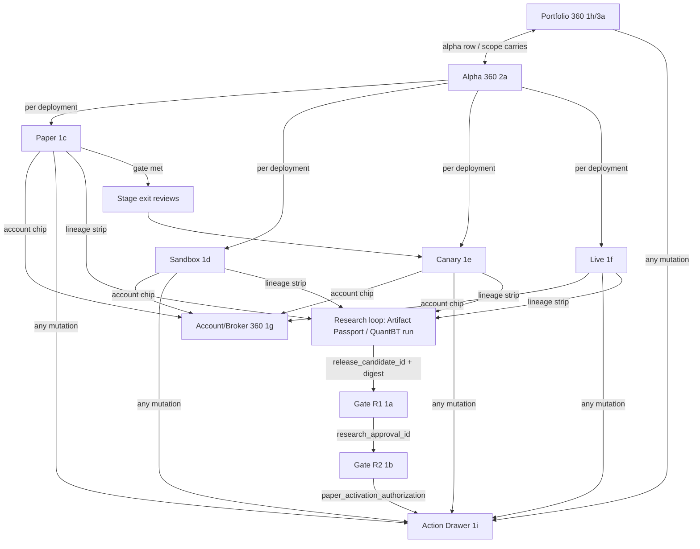

# EXECUTION_CLUSTER_GUIDE.md
> Guide for Claude/Codex implementing the Paper → Sandbox → Canary → Live cluster (+ Gates R1/R2).
> Status: WIREFRAME_LOCKED_PENDING_HIFI · Source of truth: `uploads/ALPHA_POOL_TO_LIVE_PORTFOLIO_PORTAL_DESIGN_SPEC_v0.7_vi.md` + repo `portal-stable-v1.0.1`. This file summarizes decisions taken in design review; the spec wins on conflict.

## 1. Portal = 3 clusters
```text
[Research loop]        Alpha Idea → Import/Registry → QuantBT Evidence → Artifact Passport
  (own design system, light — designed in a separate session; EXTERNAL to this cluster)
[Governance]           Approval Inbox → Gate R1 → Gate R2 → stage exit reviews
[Execution cluster]    Paper → Sandbox → Live Canary → Live Full, Portfolio/Alpha/Account 360°, Admin actions
```
This guide covers Governance + Execution only.

## 2. Locked design decisions (review 2026-08)
| # | Decision |
|---|---|
| D1 | Theme model = hybrid: ops screens default `data-theme="operations"` + `data-density="operational"`, Research/Governance default light; user may override; **safety signals never depend on theme** |
| D2 | Canary = live-red + guard treatment (text `LIVE · CANARY` + shield icon + double border). No new hue, no `mode=canary` |
| D3 | R1 + R2 both light; R2 carries a dark "operational preview" strip (capital before/after, mono, AuthorityBadge) |
| D4 | UI copy: English. Data: sample per DB schema guide until real APIs |
| D5 | Venue is DATA (venue registry): BINANCE / OKX / DERIBIT / VN MARKET today, future venues render automatically. Never hardcode. One deployment = one venue account; multi-venue alpha = parallel deployments |
| D6 | Fund Paper tokens (`apps/portal/frontend/src/styles/tokens.css`) are the shared anchor; hi-fi waits for the Research-loop DS to be locked, then extends — never forks — those tokens |

## 3. Screen inventory ↔ wireframe ids (`Execution Wireframes.dc.html`)
| Screen | WF id | Persona / decision | Theme default |
|---|---|---|---|
| Gate R1 Research Review | 1a | Quant Reviewer — RC defensible? | light |
| Gate R2 Readiness Review | 1b | PM + Risk — authorize Paper? | light + ops strip |
| Paper Workbench | 1c | Operator — tracking evidence? exit-ready? | ops dark |
| Sandbox Certification | 1d | Operator — integration certified? starts HALTED, fail-closed | ops dark |
| Canary Control Room | 1e | Operator + Live Approver — promote/hold/reduce/rollback | ops dark + guard |
| Live Full Operations | 1f | Operator — safety first, research via drill-down | ops dark + guard |
| Account/Broker 360° | 1g | Operator/Risk — internal vs physical vs diff; aggregate check lives here | ops dark |
| Portfolio 360° (v2 deep) | 1h → 3a | Manager/Quant — structure, correlation, leadership | light or dark (pref) |
| Admin Action Drawer | 1i | Operator Admin — plan/apply/verify, no shell | overlay |
| Alpha 360° drill-down | 2a | all — one alpha across venue × mode × stage | ops dark |
| Alpha Insight Charts | 2b | Quant — 12-tile catalog, honest envelopes | ops dark |
| Venue-dynamic pattern | 2c | shared VenueScope component + per-venue policy table | — |
| Link map | 3b | navigation/lineage graph | — |
| Pre-hi-fi fixes | 3c | 9 queued consistency fixes — apply at hi-fi | — |

## 4. Navigation & lineage graph
Rule: screens join by immutable IDs (artifact digest, approval ids, deployment_id, account_id) — never by name/time. No dead-end screens: every rendered ID is a navigable chip. Breadcrumb = Portfolio / Alpha / Deployment / Account.


## 5. Backend shape the UI assumes (spec §17–20, do not re-derive)
```text
Browser → TS Control API/BFF (identity, approvals, plans, research projections)
        → Execution Query API (typed reads: command-center, alphas, portfolios,
          deployments, accounts, broker-bindings, analytics) — every response carries
          {source_authority, as_of, source_sequence, freshness_state, warnings}
        → Execution Command API (plan → apply → verify; step-up, expected revision,
          idempotency, approval_ids; Trading System re-validates everything)
Events: Trading System outbox → relay/NATS → projections → SSE/WS to browser
Never: browser → Execution DB/Redis/broker; no shell; no CLI-string execution.
```
Screen ↔ API mapping: Portfolio/Alpha/Account/Deployment 360° = Query API GETs; R1/R2 = Control API approvals; every button in 1i = `commands/plan` → `commands/{id}/apply` → `operations/{id}/verify`.

## 6. Non-negotiable UI rules (from spec, enforced in every screen)
- AuthorityBadge on every data panel: `AUTHORITY · as_of · age`; freshness thresholds are **per-venue policy** (2c).
- `STALE / MISMATCH / DENIED / UNAVAILABLE / INSUFFICIENT_DATA / PARTIAL` are rendered states, never 0 or green.
- `ACTIVE ≠ READY`; `202 ≠ success`; PARTIAL never green.
- Runtime state, promotion stage, readiness, broker sync = 4 separate fields, never one badge.
- Stage naming: `PAPER_OBSERVATION · SANDBOX_VALIDATION · LIVE_CANARY · LIVE_FULL`.
- Currencies never summed across venues without FX policy (USDT/USDC/VND chips per panel).
- Mutation buttons render only for Operator Admin scope; approvals grant authority, they don't execute.
- Correlation/analytics values always carry window · samples · coverage · formula version; LLM may paraphrase deterministic insight claims only.
- Metric semantics for 3a: leadership = 3 ranked lists (exposure share, risk contribution, avg |ρ|) — never one merged score; what-ifs labeled local estimates.

## 7. Docs roadmap
- `EXECUTION_CLUSTER_GUIDE.md` (this file) — updated each design turn.
- `DESIGN_SYSTEM_EXECUTION.md` — written at hi-fi: token gap patch (canary/env/authority/freshness/runtime-state tokens), component contracts (AuthorityBadge, VenueScope, BrokerStateDiff, ObservationProgress, CommandPlanDrawer, LifecycleRail, ConditionList, GuardBand), chart envelope contract.
- Handoff README — written last, entry point for Claude/Codex.
