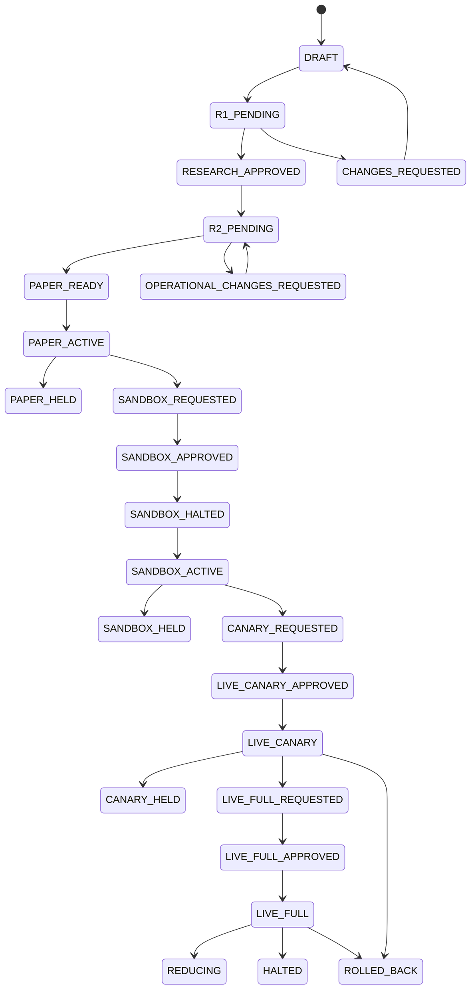

# Alpha Pool → Paper → Sandbox → Live Canary → Live
## Product Flow, Portfolio Intelligence, Design System & Backend Architecture Specification v0.7

> **Trạng thái:** Discussion draft để Bobby và Claude tiếp tục phản biện trước khi khóa contract/implementation.  
> **Phạm vi:** từ QuantBT research artifact đi vào Alpha Pool, qua **hai approval gate trước Paper**, sau đó vận hành Paper → Sandbox → Live Canary → Live Full; tập trung vào UI/UX, design system, portfolio/account/alpha intelligence, admin control và kiến trúc gần realtime.  
> **Không mở lại ở vòng này:** chi tiết nội bộ QuantBT backtest transparency/WFO replay đã được tạm khóa trong tài liệu trước.  
> **Authority bắt buộc:** `upgrade/UNIFIED_IMPLEMENTATION_PLAN.md`, backend BAR hiện hành, Trading System, `live_data_executor`, và immutable QuantBT artifacts. Portal không được tự tính lại numerical truth hoặc trở thành execution hot path.

---

## 0. Ghi chú về nguồn và mức độ chắc chắn

Tài liệu này được đối chiếu từ:

- kiến trúc Portal v0.4 hiện có;
- adjustment dual-cell v0.5;
- adjustment Paper-to-Live v0.6;
- `DB_ALPHA_PORTFOLIO_ACCOUNT_SCHEMA_GUIDE(1).md`;
- `TRADING_SYSTEM_UNIFIED_IMPLEMENTATION_PLAN(3).md`;
- `PORTFOLIO_MANAGEMENT_CLI_GUIDE.md`;
- trạng thái backend BAR được ghi nhận trong `upgrade/`.

Trong môi trường review này không fetch trực tiếp được tree GitHub mới nhất. Các nhận định repo-specific bên dưới dùng những tài liệu project đã được materialize từ `awesome-portal` và hai file Trading System mới nhất được owner cung cấp. Trước khi code, Claude phải kiểm tra lại exact branch/commit, `AGENTS.md`, `CLAUDE.md`, `upgrade/UNIFIED_IMPLEMENTATION_PLAN.md`, `upgrade/backend/README.md`, BAR đang active, schemas và source hiện hành.

Quy ước trong tài liệu:

- **CURRENT:** đã có schema/foundation/code evidence trong tài liệu dự án;
- **INTEGRATION GAP:** foundation đã có nhưng chưa nối authority thật hoặc chưa production-active;
- **PROPOSED:** thiết kế bổ sung cần owner/Claude phản biện và khóa contract.

---

# 1. Kết luận cần khóa trước khi thiết kế UI sâu

## 1.1 Mười quyết định cốt lõi

1. **Hai approval gate phải hoàn tất trước khi Paper được phép ACTIVE.**
   - Gate R1: Research Evidence Approval.
   - Gate R2: Portfolio & Operational Readiness Approval.

2. **Run không phải Alpha Version.**
   - `alpha_version_id` là package/code/contract bất biến.
   - `run_id`, `study_id`, `trial_id` là evidence được tạo từ version đó.
   - Một Release Candidate pin exact version + selected params + final audit run + engine/data digests.

3. **Paper/Sandbox/Live không tạo lại alpha artifact.**
   - Artifact được promote theo digest.
   - Không copy source tree, không rebuild giữa các stage.
   - Thay đổi code/strategy params tạo Release Candidate mới và quay lại Gate R1.

4. **Canary không phải execution mode mới.**
   - `mode=live`.
   - `promotion_stage=LIVE_CANARY`.
   - Canary khác Live Full bằng capital, risk envelope, observation policy và approval, không phải adapter khác.

5. **Alpha, Account, Deployment và Portfolio là bốn identity khác nhau.**
   - Alpha mô tả logic.
   - Deployment mô tả một runtime instance.
   - Account là virtual accounting/risk boundary.
   - Portfolio là capital container.

6. **Browser không đọc `live_data_executor`, Redis hoặc broker trực tiếp.**
   - Query qua typed Execution Query API.
   - Mutation qua versioned Execution Command API.
   - CLI và Portal dùng cùng command authority.

7. **Nút gắn với CLI chỉ dành cho Admin/Operator được cấp scope.**
   - Browser không spawn shell.
   - UI gọi cùng admin API/command service mà CLI đang wrap.
   - UI có thể hiển thị “Equivalent CLI” để audit/đào tạo, không dùng CLI text làm execution contract.

8. **TypeScript là product/control authority; Rust là query/analytics/realtime fast path; Python Trading System hiện vẫn là side-effect authority.**
   - Không rewrite risk/execution/accounting sang Rust chỉ để phục vụ Portal.
   - Rust authority chỉ mở theo scoped parity/canary hiện có, Paper trước; không tự mở Sandbox/Live.

9. **Portfolio insight phải deterministic, versioned và có evidence.**
   - LLM có thể diễn giải một insight đã được tính.
   - LLM không được tự sinh correlation, “edge” hoặc verdict đầu tư.

10. **Mọi screen đều phải phân biệt authority, freshness và stage.**
    - `ACTIVE` không đồng nghĩa `READY`.
    - `HTTP 202` không đồng nghĩa order thành công.
    - `STALE`, `MISMATCH`, `DENIED`, `UNAVAILABLE` không được đổi thành `0`.

---

# 2. Đánh giá hiện trạng `awesome-portal` và khoảng trống cần lấp

## 2.1 Những gì đã có và nên giữ

| Vùng | Trạng thái hiện tại | Quyết định |
|---|---|---|
| QuantBT frontend | `TopBar`, `RunPassport`, `NavTabs`, Overview/Optimization/Parameters/Execution/Audit | Giữ parity và promote component có domain semantics |
| Fund Paper design | Paper surface, serif narrative, mono numeric voice, chart/audit discipline | Tiếp tục là token authority cho Research/Approval |
| Control API | NestJS/Fastify, identity/RBAC, PostgreSQL, audit/outbox foundation | Dùng làm product/control plane; không duplicate Trading System logic |
| Run/worker | Run/attempt, NATS, MinIO, worker foundation | Dùng cho research artifacts/evidence, không dùng làm live execution bus |
| Alpha registry | Có registry/read-only foundation | Cần version/import/publish/pool lifecycle và real artifact binding |
| Approval/promotion | BAR-12 foundation + deterministic PaperLedger | Cần nối Trading System account/portfolio/execution authority |
| Live-control foundation | Signed intent, dual approval, step-up, fail-closed, incident skeleton | Cần Execution Gateway, broker freshness, authoritative ACK/telemetry |
| Trading System | Multi-mode paper/sandbox/live, canonical orders/fills/accounting, CLI, broker sync/reconciliation | Execution authority từ operational Paper trở đi |
| Database | Timescale/Postgres 88-table domain, current-state projections, command journal foundations | Không cho Portal dùng raw schema trực tiếp; dựng query facade/read models |

## 2.2 Khoảng trống sản phẩm quan trọng nhất

Khoảng trống không phải là thiếu thêm một dashboard PnL. Khoảng trống là thiếu một identity và decision chain xuyên suốt:

```text
QuantBT evidence
→ Alpha Version
→ Release Candidate
→ Gate R1 research approval
→ Deployment Candidate
→ Gate R2 portfolio/operations approval
→ Paper Deployment Revision
→ Paper evidence
→ Sandbox certification
→ Live Canary evidence
→ Live Full
```

Nếu chain này không khóa bằng ID/digest, Portal chỉ ghép các chart gần nhau về thời gian và không thể trả lời:

- phiên bản alpha nào đang chạy;
- params nào được deploy;
- backtest nào là evidence;
- ai duyệt và vì sao;
- capital/risk policy nào được duyệt;
- Paper/Sandbox/Canary đang dùng artifact nào;
- một thay đổi sau approval có làm evidence cũ mất hiệu lực hay không.

## 2.3 Trạng thái backend phải được mô tả đúng

Không dùng chữ `COMPLETE` mơ hồ. Dùng:

```text
CONTRACT_COMPLETE
FOUNDATION_COMPLETE
INTEGRATION_PENDING
PRODUCTION_INACTIVE
OPERATIONAL_EVIDENCE_PENDING
PRODUCT_COMPLETE
```

Paper/Sandbox/Live chỉ được chuyển thành `AVAILABLE` sau khi nối authority thật và có runtime evidence. Cho tới lúc đó UI giữ `COMMISSIONED` hoặc `PROTOTYPE`, không render fake PnL/live status.

---

# 3. Identity model từ QuantBT tới Trading System

## 3.1 Không dùng “version con của run” làm identity chính

Mô hình đề xuất:

```text
Alpha
└── AlphaVersion                         immutable package/code contract
    ├── Study / Run / RunAttempt         evidence executions
    ├── SelectedParameterArtifact        immutable selected params
    ├── FinalAuditRun                    full audit evidence
    └── ReleaseCandidate                 exact promotable combination
        ├── ResearchApproval             Gate R1
        └── DeploymentCandidate          target portfolio/account/venue plan
            ├── OperationsApproval       Gate R2
            └── DeploymentRevision       runtime binding
                ├── Paper observation
                ├── Sandbox validation
                ├── Live canary
                └── Live full
```

### Canonical semantics

| Entity | Ý nghĩa | Mutable? |
|---|---|---:|
| `alpha_id` / `strategy_id` | Parent identity của chiến lược | Có metadata lifecycle, không đổi identity |
| `alpha_version_id` | Một package/code/contract cụ thể | Không |
| `run_id` | Một backtest/research intent | Không |
| `run_attempt_id` | Một lần thực thi của run | Không |
| `selected_parameter_artifact_id` | Params được freeze từ methodology cụ thể | Không |
| `release_candidate_id` | Exact artifact có thể xin approval | Không |
| `deployment_candidate_id` | Candidate gắn target portfolio/account/risk | Không sau submit |
| `deployment_id` | Runtime identity trong Trading System | State mutable, lineage immutable |
| `deployment_revision` | Revision của config/risk/allocation binding | Append-only revision |

## 3.2 Release Candidate phải pin đủ evidence

```yaml
release_candidate_id: rc_...
alpha_id: alpha_...
alpha_version_id: av_...
alpha_artifact_digest: sha256:...
entrypoint: package.module:Alpha
selected_parameter_artifact_id: param_...
parameter_digest: sha256:...
final_audit_run_id: run_...
run_spec_digest: sha256:...
quantbt_engine_release_id: eng_...
engine_image_digest: sha256:...
dataset_snapshot_ids: [...]
universe_snapshot_id: univ_...
methodology_claim_id: claim_...
known_limitations: [...]
created_at: ...
```

## 3.3 Deployment Candidate pin target operation

```yaml
deployment_candidate_id: dc_...
release_candidate_id: rc_...
portfolio_id: pf_...
strategy_id: alpha_...
mode: paper
venue: BINANCE
account_id: paper-binance-alpha_...
account_policy_revision: 7
risk_profile_revision: 12
allocation_revision: 4
allocated_capital: "50000"
max_capital: "100000"
paper_matcher_config_revision: 3
observation_policy_id: obs_...
rollback_plan_id: rb_...
```

## 3.4 Phân loại thay đổi và re-approval

| Thay đổi | Gate phải chạy lại |
|---|---|
| Code/entrypoint/strategy logic | R1 + R2 |
| Selected strategy params | R1 + R2 |
| Data contract/warmup/timeframe semantics | R1 + R2 |
| QuantBT execution/methodology contract | R1 + R2 |
| Target venue/account/mode | R2 |
| Capital allocation/max capital | R2 hoặc stage-specific capital approval |
| Risk profile/account policy | R2 hoặc stage-specific risk approval |
| Paper fee/slippage/latency model | R2; thay đổi lớn có thể reset Paper observation |
| UI/report-only change | Không re-approve numerical artifact |
| Metadata typo không ảnh hưởng runtime | Audited metadata revision, không tự invalidate artifact |

---

# 4. Hai approval gate trước Paper

## 4.1 Gate R1 — Research Evidence Approval

### Câu hỏi quyết định

> Artifact này có đủ minh bạch, reproducible và methodologically defensible để trở thành một Release Candidate hay chưa?

### Persona

- Quant Reviewer / Research Lead.
- Risk reviewer có thể comment nhưng chưa duyệt capital/runtime.
- Không cho người tạo artifact tự hoàn tất approval duy nhất khi policy yêu cầu separation of duties.

### Evidence pack

1. Alpha Version passport.
2. Exact QuantBT engine/capability/backend.
3. Dataset/universe snapshots và quality.
4. Methodology: fullset/train-test/WFO/holdout claim.
5. Selected params lineage.
6. Final audit replay.
7. Metrics theo IS/OOS/Holdout đúng semantics.
8. Execution assumptions: fee/slippage/funding/latency.
9. Robustness/parameter stability/regime evidence.
10. Known limitations, warnings, waivers và expiry.
11. Reproducibility/parity checksums.
12. Proposed use restrictions: allowed markets/modes/venues.

### Decision outcomes

```text
APPROVED
APPROVED_WITH_CONDITIONS
CHANGES_REQUESTED
REJECTED
SUPERSEDED
EXPIRED
```

### Output

```text
research_approval_id
release_candidate_id
approved evidence digest
conditions/waivers
approver(s)
approved_at / expires_at
```

Gate R1 **không** tạo account, allocation hoặc kích hoạt Paper.

## 4.2 Gate R2 — Portfolio & Operational Readiness Approval

### Câu hỏi quyết định

> Release Candidate này có phù hợp với portfolio mục tiêu và đã được cấu hình account/risk/capital/Paper observation an toàn để cho phép phát lệnh Paper hay chưa?

### Persona

- Portfolio Manager.
- Risk/Operations Approver.
- Admin/Operator chuẩn bị plan nhưng không được tự approve mọi bước nếu policy yêu cầu tách vai trò.

### Evidence pack

1. Gate R1 còn hiệu lực và đúng digest.
2. Target `portfolio_id`, `account_id`, `mode`, `venue`.
3. Portfolio fit:
   - correlation research estimate;
   - expected marginal contribution;
   - concentration và overlap;
   - target capital weight.
4. Account policy:
   - CASH/MARGIN;
   - CROSS/ISOLATED;
   - settlement;
   - leverage;
   - broker-sync policy.
5. Risk profile:
   - order/position notional;
   - drawdown/daily loss;
   - rate limits;
   - allowed order types;
   - trading state.
6. Paper matcher config:
   - fee model;
   - slippage;
   - latency;
   - partial fill;
   - settlement.
7. Capital allocation plan với before/after.
8. Observation policy:
   - minimum duration/trades/cycles;
   - maximum drawdown;
   - reject/error ceilings;
   - data freshness requirement;
   - reporting cadence.
9. Rollback/halt/emergency plan.
10. Admin API/CLI plan preview.

### Output

```text
operations_approval_id
deployment_candidate_id
paper_activation_authorization
approved allocation/risk/account/matcher revisions
conditions and observation policy
```

Gate R2 hoàn tất mới cho phép tạo/activate `PAPER_OBSERVATION` deployment revision.

## 4.3 Hai gate không thay thế stage exit gates

Sau khi Paper bắt đầu, vẫn cần:

```text
Paper Exit Review
→ Sandbox Promotion Approval
→ Sandbox Exit Review
→ Live Canary Dual Approval
→ Canary Exit Review
→ Live Full Dual Approval
```

Hai gate R1/R2 kiểm soát **quyền bắt đầu Paper**. Các gate sau kiểm soát **quyền tăng mức realism và blast radius**.

---

# 5. Lifecycle và state machine

## 5.1 Product lifecycle



## 5.2 Runtime state, promotion stage và readiness phải tách nhau

```text
Runtime state:
  ACTIVE | REDUCING | HALTED | ARCHIVED

Promotion stage:
  PAPER_OBSERVATION | SANDBOX_VALIDATION | LIVE_CANARY | LIVE_FULL

Readiness:
  READY | DEGRADED | BLOCKED | UNKNOWN

Broker sync:
  N/A | OK | STALE | MISMATCH | ERROR | MISSING
```

Ví dụ hợp lệ:

```text
mode=sandbox
promotion_stage=SANDBOX_VALIDATION
runtime_state=HALTED
readiness=READY
broker_sync=OK
```

Đây là trạng thái bình thường trước một controlled smoke; không nên gộp thành badge “Sandbox Ready” duy nhất.

## 5.3 Operating flow theo stage

### Paper

```text
Gate R1 approved
→ Gate R2 approved
→ create/verify paper account
→ seed virtual capital
→ attach portfolio allocation
→ apply account/risk/matcher policy
→ activate deployment
→ observe sessions/orders/fills/accounting
→ compare with approved research evidence
→ Paper Exit Review
```

### Sandbox

```text
Paper Exit approved
→ create sandbox account
→ bind external_account_ref
→ require broker sync
→ keep HALTED
→ sync broker
→ reconcile positions and open orders
→ tiny controlled smoke
→ soak/observation
→ clean all exposure
→ final sync/reconciliation
→ return HALTED
→ Sandbox Exit Review
```

### Live Canary

```text
Sandbox Exit approved
→ verify live account/broker binding
→ fresh broker sync + clean reconciliation
→ very small capital allocation
→ narrow risk envelope
→ step-up auth + dual approval
→ mode=live, promotion_stage=LIVE_CANARY
→ bounded observation
→ promote, hold, reduce, halt or rollback
```

### Live Full

```text
Canary evidence approved
→ no critical unresolved finding
→ broker current state fresh
→ allocation/risk scale plan approved
→ rollback/emergency plan tested
→ same alpha artifact digest
→ LIVE_FULL
```

## 5.4 Restart authority

- Paper: DB/canonical paper working state là authority; recover `paper_open_orders`, reservations và account state.
- Sandbox/Live: broker current-state projection là physical authority; giữ HALTED, sync, reconcile position, reconcile open orders, verify clean, rồi mới ACTIVE.
- Research/Portal outage không được làm Execution tự flatten.
- WAN partition không cho phép bypass approval hoặc risk.

---

# 6. Information Architecture đề xuất

```text
Research
├── Alpha Pool
├── Alpha Versions
├── Release Candidates
├── Research Approvals                    Gate R1
├── QuantBT Runs / WFO / Compare / Audit
└── Research Evidence Reports

Governance
├── Approval Inbox
│   ├── Research Evidence                 Gate R1
│   ├── Portfolio & Readiness             Gate R2
│   ├── Paper Exit
│   ├── Sandbox Exit
│   ├── Live Canary
│   └── Live Full
├── Promotion Timeline
├── Waivers & Conditions
└── Immutable Evidence Packs

Operations
├── Command Center
├── Alpha Fleet
├── Portfolios
├── Deployments
│   ├── Paper
│   ├── Sandbox
│   ├── Live Canary
│   └── Live
├── Accounts & Broker Bindings
├── Orders / Fills / Positions
├── Risk & Sizing
├── Reconciliation
├── Incidents / Operations
└── Reports

Administration
├── Portfolio & Allocation Config
├── Account Policies
├── Risk Profiles
├── Trading State
├── Broker Sync / Credentials Metadata
├── Admin Command History
└── Users / Roles / Approvals
```

Một logical Portal, hai runtime profiles:

```text
research_full
execution_ops
```

Execution Ops không có alpha mining, arbitrary strategy editing hoặc research sweep.

---

# 7. Alpha Pool và Alpha 360°

## 7.1 Alpha Pool không chỉ là danh sách strategy

Dense table mặc định:

```text
Alpha | Version | Release Candidate | R1 | R2
Paper | Sandbox | Canary | Live | Portfolio
Net PnL | DD | Allocation | Exposure | Correlation | Findings | Freshness
```

Mỗi value có scope rõ:

- `Paper Net PnL`, không ghi chung `PnL`;
- correlation window/benchmark;
- currency;
- venue/account;
- `as_of` và data coverage.

## 7.2 Alpha Version Detail — Artifact Passport

Tabs:

1. Overview.
2. Package & Manifest.
3. QuantBT Evidence.
4. Methodology & Params.
5. Research Approval.
6. Deployment Candidates.
7. Runtime Deployments.
8. Performance by Stage.
9. Portfolio Fit.
10. Audit & Provenance.

### Header

```text
Alpha name / alpha_id
Alpha Version av_...
Artifact sha256:...
Certification: RESEARCH_APPROVED
Current stages: PAPER_ACTIVE · SANDBOX_HALTED
Owner · created_at · supersedes · restrictions
```

### “Why was this promoted?” panel

Không dùng một green check. Hiển thị:

```text
Decision: APPROVED_WITH_CONDITIONS
Gate: Research Evidence
Approvers: ...
Decision time: ...
Evidence digest: ...
Reasons:
  ✓ final audit reproducible
  ✓ outer OOS policy satisfied
  ✓ parameter stability threshold
  ! capacity evidence limited
Conditions:
  paper max capital 50,000 USDT
  no live promotion before 30-day paper observation
Waiver expiry: ...
```

## 7.3 Alpha 360° operations tabs

- Overview: stage overlay, allocation, exposure, active incidents.
- Deployments: all `deployment_id` by mode/venue/account/stage.
- Performance: equity/PnL/drawdown/fees/funding/contribution.
- Portfolio Fit: benchmark/correlation/marginal contribution.
- Positions.
- Orders & Fills.
- Risk & Sizing.
- Execution Sessions.
- Accounting.
- Reconciliation.
- Audit.

---

# 8. Approval UX và wireframes

## 8.1 Approval Inbox

```text
┌────────────────────────────────────────────────────────────────────────────┐
│ Approval Inbox       [Mine] [Research] [Ops] [Sandbox] [Live] [Overdue]   │
├────────────────────────────────────────────────────────────────────────────┤
│ Request │ Gate │ Alpha/Version │ Target │ Policy │ Blockers │ Age │ Owner  │
│ AP-201  │ R1   │ RSI v1.7      │ RC-41  │ Quant  │ 0        │ 2h  │ Lan    │
│ AP-202  │ R2   │ Carry v3.2    │ PF-MAIN│ Risk   │ 1 sync   │ 4h  │ Stan   │
│ AP-203  │ CAN  │ Grid v2.1     │ LIVE   │ Dual   │ 0        │ 1d  │ Ops    │
├────────────────────────────────────────────────────────────────────────────┤
│ SLA / overdue summary │ policy version │ separation-of-duty warnings       │
└────────────────────────────────────────────────────────────────────────────┘
```

## 8.2 Gate R1 Review

```text
┌────────────────────────────────────────────────────────────────────────────┐
│ Research Approval AP-201 — RSI v1.7                    PENDING 1/2         │
│ [Request changes] [Reject]                              [Approve]           │
├───────────────────────────────┬────────────────────────────────────────────┤
│ Artifact Passport             │ Decision Checklist                         │
│ code/package digest           │ ✓ exact engine/data/version               │
│ params digest                 │ ✓ final audit replay                      │
│ final audit run               │ ✓ methodology claim                      │
│ dataset/universe              │ ! capacity evidence limited              │
├───────────────────────────────┼────────────────────────────────────────────┤
│ Evidence                      │ Selection / Known Limitations              │
│ IS/OOS/Holdout chart          │ parameter lineage                         │
│ WFO stability                 │ warnings + waivers                         │
│ drawdown/regime               │ proposed restrictions                     │
├───────────────────────────────┴────────────────────────────────────────────┤
│ Reviewer note / condition / waiver expiry / evidence digest               │
└────────────────────────────────────────────────────────────────────────────┘
```

## 8.3 Gate R2 Review

```text
┌────────────────────────────────────────────────────────────────────────────┐
│ Operational Readiness — Carry v3.2 → PF-MAIN / Paper BINANCE              │
│ R1 APPROVED · deployment candidate DC-91                [Plan activation] │
├───────────────────────────────┬────────────────────────────────────────────┤
│ Portfolio Fit                 │ Account / Risk                             │
│ target weight 8%              │ paper-binance-carry-v32                    │
│ correlation vs BTC 0.18       │ MARGIN / CROSS / 2x                        │
│ marginal risk +5.2%           │ max order/position/DD                      │
│ diversification +0.07         │ fee/slippage/latency model                 │
├───────────────────────────────┼────────────────────────────────────────────┤
│ Capital Change Preview        │ Observation Policy                         │
│ before / after allocation     │ min days/trades/cycles                     │
│ max capital                   │ drift/reject/drawdown gates                │
│ portfolio concentration       │ reports + rollback                         │
├───────────────────────────────┴────────────────────────────────────────────┤
│ [Request changes] [Reject]                         [Approve with condition]│
└────────────────────────────────────────────────────────────────────────────┘
```

## 8.4 Rules

- Approval action không nằm trong table row overflow.
- Evidence phải load được từ immutable IDs/digests.
- Approver thấy exact policy version.
- Self-approval warning/fail theo policy.
- `Approve with conditions` tạo structured condition, không chỉ note text.
- Condition có owner, deadline, expiry và blocking behavior.
- Approval không tự execute CLI/admin mutation; nó chỉ cấp authority cho plan/apply.

---

# 9. Paper Operations Workbench

## 9.1 Mục tiêu

Paper không phải demo account. Đây là stage để kiểm tra:

- signal-to-order behavior trên live market data;
- full order lifecycle;
- sizing/risk/accounting;
- persistence/restart;
- actual operational cadence;
- drift so với approved research evidence;
- portfolio interaction và correlation thực tế.

## 9.2 Screen layout

```text
┌────────────────────────────────────────────────────────────────────────────┐
│ PAPER · Carry v3.2 · BINANCE · paper-binance-carry-v32   ACTIVE  READY    │
│ Artifact sha… · R1 AP… · R2 AP… · PF-MAIN · as_of 10:42:01 UTC           │
│ [View approvals] [Report]                          [Admin actions ▾]       │
├────────────┬────────────┬────────────┬────────────┬────────────────────────┤
│ Equity     │ Net PnL    │ Drawdown   │ Allocation │ Data/Projection age    │
├─────────────────────────────────────┬──────────────────────────────────────┤
│ Equity / benchmark / expected band │ Observation gate                     │
│ Paper solid; backtest dashed        │ 12/30 days                           │
│ drawdown + incidents annotations    │ 184/300 trades                       │
├─────────────────────────────────────┼──────────────────────────────────────┤
│ Candle + order/fill overlay         │ Runtime health                       │
│ signal → intent → risk → fill       │ sessions/rejects/dead letters        │
├─────────────────────────────────────┼──────────────────────────────────────┤
│ Portfolio contribution/correlation │ Accounting                            │
│ marginal risk / diversification     │ free/locked/margin/reservations      │
├─────────────────────────────────────┴──────────────────────────────────────┤
│ Orders/Fills/Positions/Execution Sessions table                           │
└────────────────────────────────────────────────────────────────────────────┘
```

## 9.3 Paper-specific evidence

- persisted open orders;
- fee/slippage/latency config revision;
- full/partial fill behavior;
- order rejection reasons;
- risk grants/sizing decisions;
- reservations and pending exposure;
- cash/margin/settlement ledger;
- restart recovery result;
- data freshness and session state;
- Paper return/correlation/edge metrics with sample coverage;
- drift against backtest, only when linked by artifact/run IDs.

## 9.4 Paper Exit Review

Không dùng một composite score để auto-promote. Review pack gồm:

- observation coverage;
- numerical/behavioral drift;
- drawdown and loss limits;
- rejection/error/dead-letter rates;
- accounting and reconciliation health;
- portfolio fit observed vs expected;
- unresolved conditions/waivers;
- operator recommendation.

---

# 10. Sandbox Certification Workbench

## 10.1 Sandbox luôn bắt đầu HALTED

Workflow UI:

```text
Account created
→ Broker binding verified
→ Broker sync
→ Position reconciliation dry-run
→ Open-order reconciliation dry-run
→ Findings reviewed/applied
→ Readiness READY
→ Admin activates bounded smoke
→ Smoke/soak
→ Clean exposure
→ Final reconciliation
→ Return HALTED
```

## 10.2 Layout

```text
┌────────────────────────────────────────────────────────────────────────────┐
│ SANDBOX VALIDATION · Carry v3.2 · BINANCE TESTNET          HALTED READY    │
│ Virtual account ↔ external_account_ref binance_testnet_main                │
├───────────────────────────────┬────────────────────────────────────────────┤
│ Internal virtual state        │ Physical broker state                      │
│ positions/open orders/equity  │ positions/open orders/balance              │
├───────────────────────────────┴────────────────────────────────────────────┤
│ Difference / reconciliation findings                                      │
│ status · severity · identity · local · broker · action                     │
├───────────────────────────────┬────────────────────────────────────────────┤
│ Order-type certification      │ Execution quality                          │
│ MARKET/LIMIT/STOP/TP/TIF      │ ACK/fill latency/slippage when evidenced   │
├───────────────────────────────┼────────────────────────────────────────────┤
│ Smoke plan                    │ Cleanup checklist                          │
│ quantity/capital/timebox      │ no open order · no residual position       │
├───────────────────────────────┴────────────────────────────────────────────┤
│ [Sync] [Dry-run reconcile] [Open plan] [Request Sandbox Exit Review]       │
└────────────────────────────────────────────────────────────────────────────┘
```

## 10.3 Fail-closed rules

Không cho `ACTIVE` nếu:

- broker sync missing/stale/error/mismatch;
- unresolved critical finding;
- deployment/allocation/account HALTED;
- credentials/token state invalid;
- risk profile missing;
- approved artifact/approval lineage không resolve;
- pending cleanup từ smoke trước.

---

# 11. Live Canary và Live Full

## 11.1 Canary Control Room

```text
┌────────────────────────────────────────────────────────────────────────────┐
│ LIVE CANARY · Grid v2.1 · PF-CRYPTO · BINANCE             ACTIVE GUARDED  │
│ LIVE text + shield icon + border; không chỉ dựa vào màu                    │
├────────────┬────────────┬────────────┬────────────┬────────────────────────┤
│ Capital    │ Net PnL    │ DD         │ Risk used  │ Broker freshness       │
├─────────────────────────────────────┬──────────────────────────────────────┤
│ Live vs Paper vs Backtest           │ Canary envelope                      │
│ same artifact digest                │ max capital / DD / orders / duration │
├─────────────────────────────────────┼──────────────────────────────────────┤
│ Positions / Orders / Fills          │ Incidents / Reconciliation           │
│ live tape + latency                 │ current blockers / partial ops       │
├─────────────────────────────────────┼──────────────────────────────────────┤
│ Portfolio marginal contribution     │ Promotion decision                   │
│ correlation / concentration         │ hold / reduce / rollback / scale     │
├─────────────────────────────────────┴──────────────────────────────────────┤
│ [Protective action] [Request scale] — admin/dual approval only             │
└────────────────────────────────────────────────────────────────────────────┘
```

## 11.2 Canary guardrails

- tiny explicit capital allocation;
- stage-specific max order/position/exposure;
- stricter drawdown/daily loss;
- lower order-rate ceiling;
- mandatory broker freshness;
- no unresolved critical finding;
- bounded duration/observation policy;
- tested halt/rollback/emergency plan;
- dual approval for activation and scale;
- no automatic promotion on elapsed time.

## 11.3 Live Full

Live Full screen prioritizes:

1. portfolio risk and capital;
2. broker/reconciliation truth;
3. open exposure and order state;
4. incidents/protective actions;
5. contribution/edge evidence;
6. detailed research evidence only qua drill-down.

Research evidence vẫn visible qua lineage nhưng không chiếm vị trí của live safety.

---

# 12. Portfolio 360° và “alpha có thực sự tạo edge không?”

## 12.1 Portfolio screen phải trả lời sáu câu hỏi

1. Portfolio đang có bao nhiêu capital/equity và drawdown?
2. Alpha nào đang đóng góp hoặc làm tổn hại PnL/risk?
3. Các alpha có đang trở nên quá correlated với nhau hoặc với market benchmark?
4. Edge đến từ alpha logic, beta thị trường, leverage hay timing/cost?
5. Allocation hiện tại có tạo diversification hay chỉ duplicate exposure?
6. Nếu tăng/giảm một alpha, marginal risk/return thay đổi thế nào?

## 12.2 Canonical metrics có thể lấy từ hệ thống hiện tại

| Nhóm | Metrics | Source hiện có |
|---|---|---|
| Portfolio capital | allocated/max capital, cash free/locked | allocations, capital ledger, portfolio snapshots |
| NAV/PnL | equity, realized/unrealized, gross/net PnL | portfolio/account equity snapshots |
| Drawdown | current/historical drawdown | equity snapshots |
| Exposure | long/short/gross/net notional | positions/performance snapshots |
| Cost | fees, funding | snapshots/funding accruals/fills |
| Activity | orders, fills, rejects, turnover proxy | canonical orders/fills |
| Risk utilization | notional/leverage/daily loss/DD vs limits | risk profiles + projections |
| Accounting | reservations, cash/margin/settlement | canonical ledgers |
| Health | broker sync/reconciliation/dead letters | current-state/finding tables |
| Contribution | account/deployment equity delta grouped by strategy | derived from canonical snapshots |

## 12.3 Metrics cần analytics contract mới

Không coi các metric sau là “đã có” chỉ vì có thể viết query:

- rolling correlation;
- beta/alpha against benchmark;
- information ratio/tracking error;
- up/down capture;
- tail correlation;
- marginal contribution to risk;
- diversification benefit;
- backtest → Paper → Sandbox → Live degradation;
- execution slippage/latency đầy đủ;
- FX-normalized cross-currency contribution;
- capacity/liquidity estimate.

Chúng cần formula version, source window, benchmark identity, sample count, missing-data policy và artifact/query manifest.

## 12.4 Benchmark model

Không hard-code “BTC là benchmark cho mọi alpha”. Tạo `BenchmarkDefinition`:

```yaml
benchmark_id: bm_crypto_core_v3
name: Crypto Core Top-5 Equal Weight
venue_scope: [BINANCE, OKX]
asset_class: CRYPTO
currency: USDT
composition_snapshot_id: bms_...
components:
  - BTCUSDT: 0.20
  - ETHUSDT: 0.20
  - BNBUSDT: 0.20
  - SOLUSDT: 0.20
  - XRPUSDT: 0.20
rebalance_policy: monthly
return_interval: 1h
formula_version: benchmark_return.v1
```

Benchmark options theo portfolio:

- BTC/ETH single benchmark;
- top-N market basket;
- venue/index benchmark;
- cash/risk-free baseline;
- owner-defined custom basket;
- VN index/sector benchmark khi data contract tồn tại.

Mọi composition phải snapshot/digest để historical comparison reproducible.

## 12.5 Portfolio analytics matrix

| Metric | Ý nghĩa quyết định | Guardrail |
|---|---|---|
| Rolling correlation alpha ↔ benchmark | Alpha có đang trở thành beta proxy? | Hiển thị window/sample/coverage |
| Cross-alpha correlation | Duplicate edge/exposure | Không dùng một full-period number duy nhất |
| Beta | Sensitivity với benchmark | Model version; không diễn giải causal |
| Excess return | Return vượt benchmark model | Scope theo mode/currency/window |
| Information ratio | Excess return trên tracking error | Chỉ khi đủ observations |
| Up/down capture | Hành vi trong market up/down | Threshold/regime definition rõ |
| Tail correlation | Correlation khi benchmark drawdown | Định nghĩa tail percentile |
| PnL contribution | Absolute contribution | Không nhầm với marginal risk |
| Risk contribution | Contribution vào variance/risk budget | Covariance matrix version |
| Marginal contribution to risk | Tác động nếu tăng allocation | Local estimate, không phải certainty |
| Diversification benefit | Risk portfolio giảm nhờ alpha | So với counterfactual versioned |
| Cost drag | Fees/funding/slippage trên gross edge | Slippage chỉ khi evidence đủ |
| Drawdown overlap | Các alpha cùng drawdown lúc nào | Timeline/regime annotation |
| Capacity utilization | Capital vs market/liquidity constraints | Chỉ khi volume/order-book source đủ |

## 12.6 Edge decomposition

UI không ghi chung “Edge +8.2%”. Đề xuất decomposition:

```text
Observed net return
= benchmark-linked component
+ residual/excess component
+ timing/selection component where model supports
− fees
− funding/borrow
− execution slippage
```

Một panel “What generated the result?” gồm:

- benchmark exposure;
- long/short directional contribution;
- symbol contribution;
- regime contribution;
- fee/funding drag;
- leverage/capital utilization;
- residual unexplained component;
- model limitations.

## 12.7 Deterministic insight, không phải AI verdict

Schema đề xuất:

```yaml
insight_id: ins_...
claim_code: LOW_BETA_EXCESS_RETURN_POSITIVE
scope_type: DEPLOYMENT
scope_id: dep_...
window: 30d
benchmark_id: bm_crypto_core_v3
metrics:
  beta: "0.18"
  excess_return: "0.041"
  information_ratio: "0.72"
sample_count: 720
coverage: "0.994"
formula_versions: [...]
evidence_refs: [...]
confidence_grade: B
limitations: [...]
generated_at: ...
```

UI copy có thể là:

> Trong 30 ngày Paper, alpha có beta thấp với Crypto Core và excess return dương; bằng chứng còn hạn chế vì chỉ có 720 hourly observations và chưa có live slippage đầy đủ.

LLM chỉ được paraphrase claim trên; không tự sinh claim mới không có evidence.

## 12.8 Portfolio 360° wireframe

```text
┌────────────────────────────────────────────────────────────────────────────┐
│ PF-MAIN · USDT                ACTIVE · 7 alphas · as_of/freshness          │
│ [Window 30d▾] [Mode Paper▾] [Venue All▾] [Benchmark Crypto Core▾]          │
├────────────┬────────────┬────────────┬────────────┬────────────────────────┤
│ Equity     │ Net PnL    │ DD         │ Gross/Net  │ Allocated / Max         │
├─────────────────────────────────────┬──────────────────────────────────────┤
│ NAV + benchmark + drawdown          │ Risk & concentration                │
├─────────────────────────────────────┼──────────────────────────────────────┤
│ Alpha contribution waterfall       │ Correlation matrix                  │
├─────────────────────────────────────┼──────────────────────────────────────┤
│ Marginal risk / diversification     │ Edge decomposition                  │
├─────────────────────────────────────┴──────────────────────────────────────┤
│ Alpha table: allocation · PnL · risk · corr · beta · DD · stage · health  │
├────────────────────────────────────────────────────────────────────────────┤
│ Capital ledger / incidents / findings / approvals                         │
└────────────────────────────────────────────────────────────────────────────┘
```

---

# 13. Account 360° và Broker Binding 360°

## 13.1 Account 360°

Account là screen quan trọng nhất từ Paper trở đi vì nó là boundary của:

- cash/margin;
- positions;
- orders/fills;
- risk;
- allocation;
- PnL;
- settlement;
- reconciliation.

Header:

```text
account_id · strategy_id · deployment_id · portfolio_id
mode · venue · account type · margin mode · settlement
runtime state · broker sync · revision · freshness
```

Sandbox/live layout bắt buộc:

```text
Internal virtual state | Physical broker state | Difference
```

Không gán toàn bộ broker physical position cho từng alpha khi nhiều virtual account dùng chung `external_account_ref`.

## 13.2 Broker Binding 360°

Hiển thị:

- external account reference;
- venue/mode/market type;
- credential alias/status, không lộ secret;
- NET/HEDGE position accounting mode;
- all linked virtual accounts;
- aggregate virtual exposure;
- physical exposure;
- open-order difference;
- sync source/status/age/digest;
- reconciliation history;
- operational actions.

Physical binding screen là nơi phát hiện tổng virtual exposure vượt physical broker state; Alpha screen không được tự kết luận điều này.

---

# 14. Admin-only CLI-backed control UX

## 14.1 Nguyên tắc

CLI hiện là thin wrapper qua admin APIs và đã có password confirmation. Portal phải giữ cùng authority nhưng dùng web identity/step-up thay vì chuyển shared admin password qua browser.

```text
CLI over SSH ───────────────┐
                            ├── Versioned Execution Command API
Portal Admin Action Drawer ─┘          ↓
                                  Trading domain services
                                      ↓
                         command journal / audit / operation
```

Browser tuyệt đối không:

- chạy `docker compose`;
- spawn shell;
- gửi raw CLI string để server execute;
- ghi DB/Redis trực tiếp;
- gọi broker SDK.

## 14.2 Role model

| Role | Read | Approve | Plan mutation | Apply mutation |
|---|---:|---:|---:|---:|
| Viewer | Có | Không | Không | Không |
| Manager | Có | Comment/request | Không | Không |
| Quant Reviewer | Có | Gate R1 | Không | Không |
| Portfolio/Risk Approver | Có | Gate R2/stage policy | Có thể xem plan | Không mặc định |
| Operator Admin | Có | Theo scope | Có | Có với step-up |
| Live Approver | Có | Canary/Live dual approval | Không mặc định | Không tự apply nếu separation required |
| SRE Break-glass | Ops scope | Không thay approval | Protective plan | Apply theo break-glass policy |

Theo yêu cầu owner, mọi nút hiện đang tương đương CLI mutation chỉ render/enable cho `Operator Admin` hoặc break-glass role được policy cấp.

## 14.3 Plan → Apply → Verify

### PLAN

- target resource và exact IDs;
- before/after state;
- blast radius;
- linked alpha version/artifact/approvals;
- current freshness;
- expected revision;
- policy checks;
- affected orders/positions/accounts;
- equivalent CLI command;
- rollback path.

### APPLY

- step-up authentication;
- explicit reason;
- short-lived delegated actor assertion;
- approval IDs;
- idempotency key;
- expected revision;
- one `command_id`/`operation_id`.

### VERIFY

- wait for authoritative ack/terminal state;
- show every sub-intent;
- expose `PARTIAL` residue;
- link reconciliation/finding;
- never display PARTIAL as green success.

## 14.4 Action Drawer wireframe

```text
┌────────────────────────────────────────────────────────────────────────────┐
│ Change Allocation — PF-MAIN / paper-binance-carry-v32                     │
│ ADMIN ACTION · expected revision 14                                       │
├───────────────────────────────┬────────────────────────────────────────────┤
│ Before                        │ After                                      │
│ allocated 50,000              │ allocated 75,000                           │
│ portfolio weight 8.1%         │ portfolio weight 11.7%                     │
│ marginal risk 5.2%            │ marginal risk 8.9%                         │
├───────────────────────────────┴────────────────────────────────────────────┤
│ Policy/evidence: R2 approval · max capital · concentration · freshness     │
│ Affected: deployment/account/risk capacity                                 │
│ Equivalent CLI: docker compose ... cli allocation ...                      │
├────────────────────────────────────────────────────────────────────────────┤
│ Reason [.................................................................] │
│ [Cancel] [Generate plan]                              [Apply after step-up] │
└────────────────────────────────────────────────────────────────────────────┘
```

## 14.5 Actions thuộc program này

- create/update portfolio;
- allocation/rebalance/withdraw;
- account seed/policy;
- risk profile/trading state;
- deployment halt/reduce/resume;
- broker sync;
- reconciliation dry-run/apply;
- Paper activation;
- Sandbox controlled activation;
- Canary activation/scale/rollback;
- emergency close;
- engine authority transition where explicitly allowed.

---

# 15. Design system

## 15.1 Một product language, hai operating modes

```text
Research / Approval:
  Fund Paper light
  evidence-first
  narrative + methodology hierarchy

Operations / Live:
  dark institutional workstation
  compact
  state/risk/freshness-first

Shared:
  same typography roles
  same spacing/grid
  same IDs/status/audit vocabulary
  same component anatomy
  same keyboard/accessibility behavior
```

## 15.2 Không tạo palette mới tùy ý

Fund Paper hiện tại là token authority. Bổ sung semantic aliases:

```css
--surface-research
--surface-operations
--surface-elevated
--border-hairline
--text-primary
--text-muted
--text-numeric

--stage-research
--stage-paper
--stage-sandbox
--stage-canary
--stage-live

--state-ready
--state-degraded
--state-blocked
--state-halted
--state-reducing
--state-stale
--state-mismatch

--authority-research
--authority-execution
--authority-broker
--authority-derived
```

Live luôn có text `LIVE`, icon và border treatment; không chỉ dùng màu đỏ. Red vẫn ưu tiên cho risk/destructive state.

## 15.3 Typography

- Heading/narrative: serif hiện tại.
- Body/UI: sans hiện tại.
- IDs, timestamps, numeric, tickers: mono/tabular.
- Numeric columns right-aligned.
- Không abbreviate số trong audit/blotter.
- Price/qty precision theo instrument metadata.

## 15.4 Component program

### Reuse trước

```text
TopBar
RunPassport
NavTabs
StateView
Badge / Chip
SegmentedControl
DefinitionList
MetricHero
ChartFigure
FoldGantt
ECharts wrapper/theme
```

### Shared domain components đề xuất

```text
ArtifactPassport
ApprovalGateRail
EvidencePackDrawer
PromotionTimeline
EnvironmentBadge
AuthorityBadge
FreshnessIndicator
LifecycleRail
RiskStateBanner
ObservationProgress
PortfolioAllocationMap
AlphaContributionTable
CorrelationHeatmap
BenchmarkSelector
EdgeEvidencePanel
BrokerStateDiff
ExecutionFunnel
CommandPlanDrawer
CLIEquivalentBlock
OperationTimeline
ConditionList
WaiverBadge
```

Chỉ promote component khi:

- dùng ở ≥2 screen/domain;
- encode domain semantics;
- có interaction/accessibility phức tạp;
- encode chart/table/destructive-action safety.

Không tạo `MagicMetric`, `AIInsightBox`, `FancyCard`, `GradientPanel`.

## 15.5 Density modes

- **Manager:** summary + decision/blockers + drill-down.
- **Quant:** metric/methodology/portfolio-fit density.
- **Operator:** compact live state, tables, freshness, action context.
- **Audit:** exact IDs/digests/formula/source/evidence.

Đây là view preference, không thay role/authority.

---

# 16. Chart, candle và table contract

## 16.1 Chart technology

- ECharts: portfolio analytics, contribution, correlation, drawdown, heatmap, waterfall.
- TradingView Lightweight Charts hoặc licensed Advanced Charts qua `ExecutionReplayChartAdapter`: candle/order/fill/position overlays.
- TradingView-style interaction là reference UX; candle evidence vẫn phải đến từ exact `data_layer`/dataset authority, không dùng hosted TradingView data làm source of truth.

## 16.2 Mọi chart phải có envelope

```text
schema_version
source authority / artifact digest / source sequence
scope IDs
mode / venue / account / portfolio
benchmark/composition snapshot
window/interval/timezone
currency/unit
as_of/freshness
source_rows/returned_rows
formula_version
downsample method
coverage/missing-data policy
warnings
```

## 16.3 Visual rules

- Không smoothing làm thay đổi extrema/event timing.
- Missing intervals tạo gap.
- Paper/Sandbox/Canary/Live khác line/dash/label, không chỉ color.
- Benchmark là secondary line.
- Orders/fills/risk/incident là annotation layers riêng.
- Correlation heatmap luôn có numeric tooltip và sample coverage.
- Cross-filter chart ↔ table có reset rõ.
- Export giữ title, source, as-of, unit, warnings.

## 16.4 Performance

- Server-side range/downsample.
- Mặc định ≤5.000 điểm/series trong interactive viewport.
- Large tables dùng cursor pagination + virtualization.
- Không polling từng card mỗi giây.
- REST snapshot lần đầu; SSE cho status thông thường; WebSocket chỉ cho dense tape cần thật.

---

# 17. Backend architecture phù hợp repo hiện tại

## 17.1 Kiến trúc dual-cell

```text
                         portal.primusspark.com
                                  │
                         Cloudflare Access
                                  │
                  ┌───────────────┴────────────────┐
                  │ Research Cell — DO SGP         │
                  │                                │
                  │ React/Vite Portal              │
                  │ TypeScript Control API         │
                  │ Research PostgreSQL            │
                  │ NATS JetStream                 │
                  │ MinIO/S3 artifacts             │
                  │ QuantBT workers                │
                  │ Approval/Promotion workflow    │
                  └───────────────┬────────────────┘
                                  │ WireGuard + mTLS
                                  │ signed delegated actor
                  ┌───────────────┴────────────────┐
                  │ Execution Cell — AWS HK        │
                  │                                │
                  │ Execution Gateway              │
                  │ Rust Query/Analytics/Realtime  │
                  │ Python Trading System          │
                  │ live_data_executor Timescale   │
                  │ Trading Redis + data_layer     │
                  │ Broker adapters/secrets        │
                  └───────────────┬────────────────┘
                                  │
                           Venue/Broker APIs
```

## 17.2 TypeScript responsibility

TypeScript/NestJS Control API sở hữu:

- identity/workspace/project/RBAC;
- Alpha Pool and version workflow;
- Release Candidate lifecycle;
- approval/promotion workflow;
- screen-oriented BFF;
- command plan/apply orchestration;
- delegated actor signing;
- report job orchestration;
- Research projection/read models;
- UI contracts and OpenAPI client.

TypeScript không:

- tính lại QuantBT metrics;
- quyết định fill/PnL/accounting;
- bypass risk;
- ghi Execution DB;
- giữ broker secret.

## 17.3 Rust responsibility

### `execution-query-rs`

- query Timescale/current-state efficiently;
- Arrow record batches;
- range aggregation/downsample;
- order/fill/position large-table scans;
- portfolio/account chart APIs.

### `portfolio-analytics-rs`

- incremental return buckets;
- rolling covariance/correlation/beta;
- contribution/risk attribution;
- benchmark alignment;
- deterministic insight claims;
- artifact/report datasets in Parquet.

### `realtime-gateway-rs`

- subscribe versioned projection events;
- multiplex SSE/WS topics;
- sequence/gap/backpressure handling;
- no business mutation.

### Rust authority limit

Current Trading System rollout documents only permit controlled Rust authority after shadow/parity and Paper scope first. Therefore:

- Rust analytics/read/realtime can ship independently.
- Rust risk/execution authority must follow existing engine authority scopes/transitions.
- Không mở Rust authority cho Sandbox/Live chỉ vì Portal cần latency thấp.

## 17.4 Python Trading System responsibility

Python Trading System tiếp tục sở hữu:

- gateway order contract;
- risk and grants;
- paper matcher;
- execution adapters;
- canonical orders/fills;
- account/position/ledger/settlement;
- broker sync/reconciliation;
- operational CLI/admin APIs;
- command journal/ACK evidence where activated.

## 17.5 Không thay Redis hot path ngay

Trading System hiện dùng Redis streams/cache. Portal integration nên:

1. giữ execution hot path hiện hành;
2. phát authoritative changes qua transactional outbox/event relay;
3. project sang Research read model/NATS;
4. chỉ thay transport nội bộ khi reliability/benchmark plan riêng chứng minh cần thiết.

Không dùng một shared Redis hoặc shared Postgres xuyên WAN.

---

# 18. Data flow

## 18.1 Artifact flow

```text
QuantBT worker
→ immutable artifact bundle in MinIO/S3
→ Release Candidate
→ Gate R1
→ Gate R2
→ Execution pulls artifact/release by digest
→ deployment release binding persisted
```

Execution không nhận arbitrary source upload từ browser.

## 18.2 Query flow

```text
Browser
→ Control API/BFF
→ Research projection for fleet/list/summary
→ authoritative Execution Query API for sensitive current state
→ response with authority/as_of/sequence/freshness
```

## 18.3 Command flow

```text
Browser admin
→ plan command in Control API
→ approvals/policy/expected revision checked
→ short-lived delegated actor assertion
→ Execution Command API
→ local Trading System re-validates everything
→ durable command/operation evidence
→ authoritative ACK/events
→ Portal verifies terminal state
```

## 18.4 Event flow

```text
Trading System canonical commit
→ transactional outbox / versioned execution event
→ authenticated relay / NATS
→ Research projection idempotent consumer
→ SSE/WS to browser
```

Event envelope:

```text
event_id
aggregate_id
aggregate_version
source_sequence
schema_version
correlation_id
causation_id
occurred_at
recorded_at
producer
traceparent
```

## 18.5 Analytics flow

```text
performance/account/portfolio events
+ benchmark market bars from data_layer
→ Rust incremental bucket engine
→ rolling analytics state
→ versioned analytics snapshots/artifacts
→ Query API / report pack
```

---

# 19. Storage architecture

## 19.1 Execution authority

`live_data_executor` PostgreSQL/Timescale keeps:

- canonical orders/fills/events;
- positions/account/portfolio current projections;
- performance/equity snapshots;
- broker sync/current-state/history;
- reconciliation findings;
- capital/accounting ledgers;
- operator/command evidence.

## 19.2 Research/control storage

Research PostgreSQL keeps:

- Alpha Pool/version metadata;
- Release Candidates;
- approvals/decisions/conditions;
- promotion workflow;
- projection/read models;
- report registry;
- user/workspace/audit.

## 19.3 Object store

MinIO/S3 keeps:

- QuantBT artifacts;
- evidence packs;
- reports;
- long-window chart/analytics Parquet;
- benchmark composition snapshots;
- export bundles;
- checksums/manifests.

## 19.4 Timescale trước, ClickHouse sau gate

Không thêm ClickHouse ngay chỉ vì dữ liệu “nhiều”. Dùng trước:

- Timescale hypertables/current-state/change-only history;
- continuous aggregates/materialized projections;
- Rust + SQLx/Arrow query;
- Parquet object storage cho cold history.

Chỉ thêm ClickHouse nếu production evidence cho thấy:

- event/order/fill scan p95 không đạt;
- retention/compaction quá nặng;
- high-cardinality analytics làm ảnh hưởng execution DB;
- read replica/Timescale aggregate không đủ.

Execution DB không được chịu ad-hoc research query nặng.

---

# 20. API và contract đề xuất

## 20.1 Research/Control API

```text
GET  /v1/alpha-pool
GET  /v1/alpha-versions/{alpha_version_id}
GET  /v1/release-candidates/{id}
POST /v1/release-candidates/{id}/submit-research-approval
POST /v1/deployment-candidates
POST /v1/deployment-candidates/{id}/submit-operations-approval
GET  /v1/approvals
GET  /v1/approvals/{id}
POST /v1/approvals/{id}/decisions
GET  /v1/promotions/{id}
```

## 20.2 Execution Query API

```text
GET /portal/execution/v1/command-center
GET /portal/execution/v1/alphas/{strategy_id}
GET /portal/execution/v1/portfolios/{portfolio_id}
GET /portal/execution/v1/deployments/{deployment_id}
GET /portal/execution/v1/accounts/{account_id}
GET /portal/execution/v1/broker-bindings/{external_account_ref}
GET /portal/execution/v1/sessions/{execution_session_id}
GET /portal/execution/v1/orders/{account_id}/{client_order_id}
GET /portal/execution/v1/analytics/portfolio/{portfolio_id}
GET /portal/execution/v1/analytics/alpha/{strategy_id}
```

Mọi response:

```json
{
  "schema_version": "1",
  "data": {},
  "source_authority": "execution-cell",
  "as_of": "...Z",
  "source_sequence": 123456,
  "aggregate_version": 17,
  "freshness_state": "FRESH",
  "warnings": [],
  "request_id": "req_..."
}
```

## 20.3 Execution Command API

```text
POST /portal/execution/v1/commands/plan
POST /portal/execution/v1/commands/{command_id}/apply
GET  /portal/execution/v1/operations/{operation_id}
POST /portal/execution/v1/operations/{operation_id}/verify
```

Canonical command:

```json
{
  "command_id": "cmd_...",
  "command_type": "deployment.activate_paper",
  "actor_id": "usr_...",
  "workspace_id": "ws_...",
  "resource_type": "DEPLOYMENT",
  "resource_id": "dep_...",
  "idempotency_key": "...",
  "expected_aggregate_version": 17,
  "approval_ids": ["ap_r1_...", "ap_r2_..."],
  "alpha_version_id": "av_...",
  "artifact_digest": "sha256:...",
  "reason": "approved paper observation",
  "issued_at": "...Z",
  "expires_at": "...Z",
  "payload_schema_version": "1",
  "payload": {}
}
```

Execution re-checks service identity, delegated actor, permission, expected version, approval/evidence, account/portfolio/risk state, expiry và idempotency.

---

# 21. Near-realtime portfolio analytics

## 21.1 Update cadence theo data class

| Data | Target UX cadence đề xuất |
|---|---|
| Order/fill/position state | event-driven, target visible age <1–2s khi healthy |
| Account/portfolio equity | event + bounded periodic projection, target <2–5s |
| Broker sync | theo venue/policy; UI hiển thị exact age |
| Rolling return/correlation | bucket 1m/5m tùy portfolio |
| Full correlation matrix | 1–5 phút hoặc on-demand |
| Heavy attribution/report | background artifact job |

Đây là target product budget, không phải claim hiện tại.

## 21.2 Incremental computation

Rust analytics service có thể giữ bounded state:

- aligned return buckets;
- online mean/variance/covariance;
- rolling window ring buffers;
- contribution accumulators;
- benchmark composition lookup;
- data quality/coverage counters.

Không tính correlation trên raw tick nếu decision use case là hourly/daily portfolio risk. Interval phải theo policy.

## 21.3 Correctness rules

- Return series tính từ canonical equity/NAV buckets.
- Không forward-fill qua gap mà không flag.
- Không mix currency nếu chưa có FX policy.
- Benchmark và alpha phải align timestamp/window.
- Window không đủ sample trả `INSUFFICIENT_DATA`.
- Recompute job định kỳ kiểm tra incremental state với batch oracle.
- Mọi metric có formula version và checksumable input manifest.

## 21.4 Suggested SLOs

```text
Execution current-state query p95       < 200 ms same cell
Cross-cell BFF query p95                < 500 ms normal path
Cached chart query p95                  < 500 ms
Uncached medium chart query p95         < 1.5 s
First event after authoritative commit  < 2 s target
Correlation snapshot age                < 5 min policy default
Command plan acknowledgement p95        < 500 ms
```

Final command completion không có một fixed latency SLO chung vì phụ thuộc broker/order lifecycle; UI phải stream state thay vì timeout rồi gọi success.

---

# 22. Mapping vào schema hiện có

| Product concept | Existing authority |
|---|---|
| Alpha identity | `strategies.strategy_id`; legacy `alpha_id` alias |
| Internal account | `accounts` |
| Deployment | `strategy_deployments` |
| Portfolio | `portfolios` |
| Allocation | `portfolio_allocations`, `portfolio_capital_ledger` |
| Account policy | `account_policies` |
| Risk | `risk_profiles`, `risk_grants` |
| Paper working orders | `paper_open_orders`, `paper_matcher_config` |
| Orders/fills | `orders`, `fills` |
| Positions | `positions_v2` |
| Accounting | balances, reservations, cash/margin ledgers, settlement |
| Performance | performance/account/portfolio equity snapshots |
| Broker binding | `venue_accounts`, current broker sync projections |
| Reconciliation | `reconciliation_findings` |
| Execution cycle | `execution_sessions` |
| Sizing | `sizing_decisions` |
| Emergency operation | `operator_operations` |
| Audit | `portfolio_audit_log`, domain/command evidence |
| Rust rollout evidence | `engine_shadow_comparisons`, authority scope/decisions/transitions |

## 22.1 Những gì không nên nhét vào Trading System DB

- full QuantBT artifacts;
- research trials/folds;
- Alpha Pool editorial metadata;
- report HTML/images;
- full correlation matrix history;
- LLM text summaries;
- UI preferences.

Các dữ liệu này thuộc Research/control DB hoặc object store, với execution references bằng immutable IDs/digests.

---

# 23. Additive backend gaps cần khóa

## 23.1 Immutable deployment release binding

Current `strategy_deployments` chưa đủ typed lineage tới Research artifact. Đề xuất additive table hoặc typed columns:

```text
deployment_release_bindings
  binding_id
  deployment_id
  deployment_revision
  alpha_version_id
  release_candidate_id
  alpha_artifact_digest
  selected_parameter_artifact_id
  parameter_digest
  final_audit_run_id
  research_approval_id
  operations_approval_id
  runtime_image_digest
  config_digest
  policy_digest
  valid_from / superseded_at
```

## 23.2 Promotion stage

Thêm typed `promotion_stage`, không thêm `mode=canary`.

## 23.3 Approval evidence replication

Execution không cần copy toàn bộ Research DB. Nó cần signed/minimal approval evidence:

- approval ID;
- policy version;
- resource/digest scope;
- decision;
- approvers;
- conditions;
- expiry;
- signature/evidence digest.

## 23.4 Execution quality

Nếu muốn slippage/latency chart chuẩn, thêm `execution_quality_events` hoặc equivalent projection với decision/arrival/ACK/fill/accounting timestamps và formula version.

## 23.5 Analytics contracts

Bổ sung:

- benchmark definition/composition snapshots;
- return bucket contract;
- portfolio analytics snapshot;
- deterministic insight claim;
- report manifest.

## 23.6 Operations scope

`operator_operations.scope_type` hiện hẹp ở ACCOUNT/ALPHA. Portfolio/Deployment/Broker Binding actions cần:

- extend checked scope types additively; hoặc
- dùng command journal + new typed operation projection.

Không overload JSON mà thiếu typed target identity.

## 23.7 Audit writer

Security/admin audit phải có active canonical writer. Có thể hợp nhất rõ ràng với:

- Control API audit/outbox;
- `portfolio_audit_log` cho capital/config state;
- `operator_operations` cho operational actions;
- command journal/ACK evidence cho delivery;
- approval decision audit cho governance.

---

# 24. Security và governance

## 24.1 Invariants

```text
ADMIN role ≠ bypass risk
Approval ≠ execution success
Portal state ≠ broker truth
Projection state ≠ authoritative live state
Research outage ≠ execution outage
Portal outage ≠ automatic flatten
WAN partition ≠ permission bypass
```

## 24.2 Live safeguards

- step-up auth;
- dual approval;
- no self-approval where policy prohibits;
- delegated actor assertion 30–60s TTL;
- mTLS service identity;
- expected revision;
- command idempotency;
- broker freshness;
- local risk revalidation;
- immutable audit;
- break-glass separated from normal promotion.

## 24.3 Secrets

- Research never gets broker secret.
- Portal shows credential alias/status only.
- DNSE OTP/token remains Execution admin workflow.
- Alpha runtime never gets admin token or broker token.

---

# 25. Delivery plan

## APX-0 — Contract & authority freeze

Deliverables:

- identity model;
- R1/R2 gate schemas;
- deployment release binding;
- promotion stage;
- authority/freshness envelopes;
- role/action matrix;
- current BAR/status reconciliation.

Exit:

- no ambiguous `alpha latest` or `run latest`;
- same IDs resolve across Research and Execution;
- no frontend field invented outside contract.

## APX-1 — Alpha Pool + two approval gates

- Alpha Pool/version detail;
- Release Candidate passport;
- Gate R1/R2 inbox and review;
- immutable evidence packs;
- conditions/waivers;
- no operational mutation yet.

## APX-2 — Read-only Paper Operations

- Alpha/Deployment/Account/Portfolio 360°;
- Paper sessions/orders/fills/accounting;
- broker-independent paper health;
- report pack;
- exact freshness/authority.

## APX-3 — Admin Paper controls

- same APIs as CLI;
- plan/apply/verify;
- allocation/account/risk/matcher config;
- Paper activation/halt/reduce;
- audited operations;
- no browser shell.

## APX-4 — Sandbox certification

- broker binding 360°;
- sync/reconciliation;
- controlled smoke plan;
- order-type certification;
- cleanup/exit gate;
- fail-closed activation.

## APX-5 — Canary/Live governance

- promotion records;
- small capital/risk envelope;
- step-up/dual approval;
- live operations screen;
- rollback/emergency flow;
- independent emergency path after BAR gate.

## APX-6 — Portfolio Intelligence

- benchmark registry;
- Rust analytics service;
- rolling correlation/beta/contribution/risk;
- deterministic edge insights;
- backtest/Paper/Sandbox/Live linked comparison;
- immutable report artifacts.

## APX-7 — Scale hardening

- Rust query/realtime after benchmark gate;
- load/backpressure/gap tests;
- cold storage/retention;
- DR/game-day;
- production dual-cell release activation.

---

# 26. Acceptance gates

## Identity and lineage

- Every active deployment resolves exact Alpha Version, artifact, params, audit run và approvals.
- No stage uses mutable `latest`.
- Strategy/runtime change invalidates the correct approvals.

## Approval

- R1 and R2 are separate resources/decisions.
- Evidence pack immutable and checksum-valid.
- Conditions/waivers typed, owned and expiring.
- Separation-of-duty tests pass.

## Paper

- Same canonical order/fill/accounting path.
- Persisted open orders/restart recovery.
- No stale reservation/pending exposure.
- Paper Exit evidence reproducible.

## Sandbox/Live

- Broker sync/reconciliation fail closed.
- Canary remains `mode=live` with stage-specific envelope.
- No action without authoritative ACK/verify.
- No unresolved critical residue after cleanup/promotion.

## Portfolio analytics

- Every metric has window, benchmark, currency, sample, formula and freshness.
- Insufficient data is explicit.
- Incremental metrics pass batch parity corpus.
- LLM cannot create numerical truth.

## UI/UX

- No fake KPI/live status.
- Research and Operations share product language but differ appropriately in density/surface.
- All loading/empty/stale/denied/partial/error states exist.
- Tables/charts are virtualized/downsampled.
- Dangerous actions use plan/apply/verify.
- CLI-mutating buttons are admin-only.

## Architecture

- Browser never queries Execution DB/Redis directly.
- No shared DB/mutable volume across cells.
- Research cannot bypass Execution risk/approval.
- Execution continues safely through Research/WAN outage.
- Rust authority does not expand beyond approved scope.

---

# 27. Những điều không nên làm

- Không biến mỗi run thành một Alpha Version.
- Không tạo `mode=canary`.
- Không cho UI gọi CLI shell.
- Không dùng tên alpha/timestamp để join backtest và live.
- Không cộng currency khác nhau khi chưa có FX policy.
- Không tính live Sharpe/correlation ở browser.
- Không dùng one-number “Alpha Score” để auto-promote.
- Không dùng physical broker account làm per-alpha account identity.
- Không cho một `account_id` dùng chung hai alpha.
- Không show green success khi command mới `202 ACCEPTED` hoặc operation `PARTIAL`.
- Không đưa research sweep/analytics query nặng vào Execution hot DB.
- Không rewrite Trading System thành TS/Rust chỉ vì Portal dùng TS/Rust.
- Không mở Rust authority cho Sandbox/Live trước parity/authority transition gate.
- Không tạo generic AI dashboard với card/icon/gradient không có domain semantics.

---

# 28. Brief để Claude phản biện và triển khai design tiếp

Claude cần đọc đúng thứ tự:

1. `AGENTS.md`, `CLAUDE.md`.
2. `upgrade/UNIFIED_IMPLEMENTATION_PLAN.md`.
3. `upgrade/backend/README.md` và BAR active, đặc biệt BAR-12/13 và runway BAR-17→20.
4. `upgrade/quantbt_portal_architecture_uiux_final_v0.4_vi.md`.
5. adjustment dual-cell v0.5 và Paper-to-Live v0.6.
6. `apps/portal/registry/FRONTEND_HANDOFF.md`, schemas, fixtures.
7. source frontend hiện hành và design tokens.
8. hai file Trading System/DB do owner cung cấp.
9. tài liệu này.

Claude hãy trả lại:

### A. Current-state reconciliation

- Exact code/route/component/service đã có.
- BAR nào `FOUNDATION_COMPLETE`, `INTEGRATION_PENDING`, `PRODUCTION_INACTIVE`.
- Mọi discrepancy giữa plan, backend README, production compose và source.

### B. Identity & contract critique

- Phản biện mô hình AlphaVersion/Run/ReleaseCandidate/DeploymentRevision.
- Khóa schema Gate R1/R2.
- Khóa invalidation/re-approval rules.
- Đề xuất additive schema tối thiểu, không duplicate existing BAR models.

### C. Design system

- Token mapping từ Fund Paper hiện tại.
- Research/Approval light và Operations dark.
- Component reuse matrix.
- Không tạo generic UI kit thay component hiện tại.

### D. Figma-ready wireframes

Ưu tiên sáu frame:

1. Alpha Pool.
2. Alpha Version / Artifact Passport.
3. Gate R1 Review.
4. Gate R2 Portfolio & Readiness Review.
5. Paper Operations Workbench.
6. Portfolio 360°.

Sau đó:

7. Sandbox Certification.
8. Canary Control Room.
9. Account/Broker Binding 360°.
10. Admin Command Plan Drawer.

Mỗi frame phải có:

- persona/decision;
- authority IDs;
- loading/empty/stale/denied/error/partial states;
- component reuse;
- chart/table contract;
- permissions;
- API/backend gaps.

### E. Backend design

- TypeScript Control API modules.
- Execution Gateway contract.
- Rust query/analytics/realtime service boundaries.
- Event/outbox/projection flow.
- No direct DB/Redis/browser coupling.
- Exact API/OpenAPI/JSON Schema changes.
- Migration and rollback.

### F. Portfolio analytics

- Formula contract cho rolling correlation, beta, excess return, contribution, marginal risk và diversification.
- Benchmark registry/composition snapshot.
- Incremental Rust algorithm + batch parity oracle.
- Sample/coverage/missing-data rules.
- Deterministic insight schema.

### G. Vertical slices

Đề xuất triển khai theo thứ tự:

```text
Slice 1: Alpha Version Passport + Gate R1 read/review
Slice 2: Gate R2 + Paper deployment candidate
Slice 3: Read-only Paper 360°
Slice 4: Admin Paper plan/apply/verify
Slice 5: Portfolio 360° baseline metrics
Slice 6: Sandbox certification
Slice 7: Correlation/benchmark analytics
Slice 8: Canary/Live governance
```

Mỗi slice phải có exit gate, test matrix, feature flag và rollback.

---

# 29. Quyết định cuối của draft v0.7

1. **Alpha Pool là nơi quản lý version/artifact/evidence, không phải nơi giữ execution state.**
2. **Hai approval gate trước Paper là bắt buộc:** Research Evidence và Portfolio/Operational Readiness.
3. **Paper là operational stage thật**, dùng full canonical lifecycle và live market data nhưng virtual account.
4. **Sandbox và Live lấy broker truth qua sync/reconciliation**, không tin projection nội bộ một cách mù quáng.
5. **Canary là live promotion stage**, không phải mode.
6. **Portfolio 360° phải đo contribution, correlation, benchmark exposure và edge decomposition**, nhưng chỉ qua versioned analytics contracts.
7. **Admin buttons dùng cùng command authority với CLI**, không chạy shell và không ghi DB trực tiếp.
8. **TypeScript + Rust tối ưu product/read/analytics/realtime; Python Trading System tiếp tục sở hữu side effects hiện tại.**
9. **Mọi promotion phải giải thích được “vì sao được đẩy lên stage này”** bằng evidence, decision, approver, conditions và immutable lineage.
10. **UI phải giống institutional research/operations software**, không giống generic AI dashboard.
