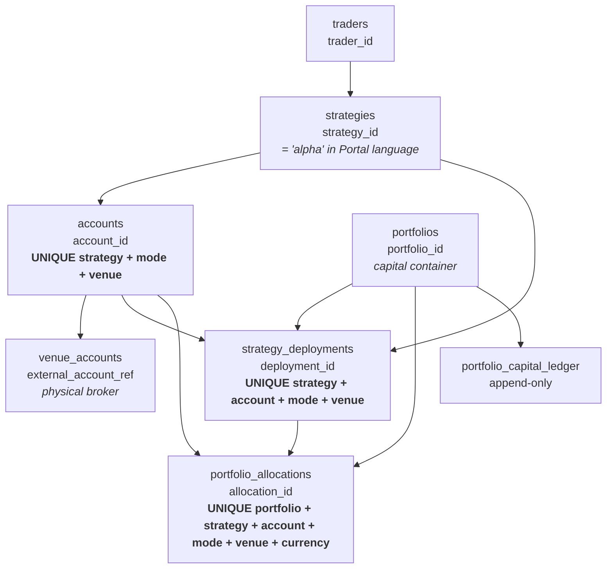

# EXECUTION_SCALE_AND_REFINE.md

> **Status:** v2 — owner figures and the four blocking decisions locked 2026-08-21.
> **Audience:** Claude (frontend lead) and codex (backend lead). Sections 1–5 are
> the shared contract surface; section 6 is frontend working detail.
> **Authority:** subordinate to `uploads/ALPHA_POOL_TO_LIVE_PORTFOLIO_PORTAL_DESIGN_SPEC_v0.7_vi.md`.
> This file does not restate spec §16.4 / §21.1 / §21.4 — it applies them at the
> figures below and fills the one gap they leave: **per-screen layout and
> interaction behaviour when N grows.**

The hi-fi screens are composed at one 1440px viewport over the nine-deployment
`CANONICAL_CAST`. That cast proves the design; it does not prove the design
survives production cardinality. Every screen in `IMPLEMENTATION_PHASES.md` is
answered here against the six fields required by `CLAUDE.md` §8.

---

## 1. Scale envelope

Owner figures, 2026-08-21. **This table is the single source of truth for N.**
Neither side may assume a different number without changing it here first.

| Dimension | Value | Note |
|---|---|---|
| Portfolios | **3–5** | current stage; each is a capital container |
| Alphas per portfolio | **50–100** | "smooth and realtime" is required at this number, not aspirational |
| Venues | **5** | BINANCE / OKX / DERIBIT / VN MARKET + 1 headroom |
| Orders + fills per day | **1,000** | combined, all deployments |
| Order/fill retention, default view | **6 months** | older rows remain queryable; see §8 decision 3 |
| Other domain data retention | longer / unbounded | approvals, audit, operations, incidents, equity |
| Equity & chart default resolution | **1h**, tunable per window | |

### 1.1 Derived figures

| Derived | Calculation | Result |
|---|---|---|
| Deployments, system-wide | 3–5 portfolios × 50–100 | **150–500** |
| Full Blotter rows at 6 months | 1,000/day × 182 d | **~182,000** |
| Orders+fills per deployment per day | 1,000 ÷ 150–500 | ~2–7 |
| Execution event rate, average | 1,000/day | **0.7 / min** |
| Execution event rate, 20× burst | | ~14 / min |
| Equity points, 1h × 6 months | 24 × 182 | 4,368 |
| Equity points, 1h × 1 year | 24 × 365 | 8,760 — **over budget** |
| Correlation cells, per portfolio | 100 × 100 | **10,000** (4,950 unique pairs) |
| Correlation samples per pair, 1h × 6 mo | | 4,368 — ample |
| Virtual accounts per physical broker ref | 500 ÷ ~5 refs | **up to ~100** — see §2.3 |
| Alpha 360° insight tiles at full resolution | 12 × 4,368 | 52,416 points on one screen |

> **One figure to confirm:** 1,000 orders+fills/day across 150–500 deployments is
> ~2–7 per deployment per day. That is coherent for low-frequency alphas, and
> every budget here is built on it. If the real mix includes higher-frequency
> alphas, this is the number that moves first — and it moves the blotter, the
> event rate and the workbench budgets together.

### 1.2 What these figures rule OUT

Stating the non-requirements is as valuable as stating the requirements: each
line below is a workstream that must **not** be built.

| Not needed | Why |
|---|---|
| Approximate / estimated row counts | 182k rows counts exactly in milliseconds on an indexed column. `COUNT` stays exact, so no `~` prefix and no "10,000+" label anywhere. |
| Event coalescing or batching for execution events | 0.7/min average, ~14/min burst. Naive per-event rendering is already correct. |
| WebSocket transport | Spec §16.4 reserves WS for "dense tape". 1,000 events/day is not dense tape. **SSE covers every Execution Loop surface.** |
| VenueScope overflow / multiselect summary | 5 chips fit the hi-fi chip row as drawn. Keep the threshold rule documented (§4 M4) but build nothing. |
| Virtualization in workbench blotters | ~2–7 rows/day/deployment. Plain DOM. Virtualization applies to Full Blotter and history tabs only. |
| Portfolio switcher search / filter | 3–5 portfolios. A plain select. |

---

## 2. Identity model

Every scope filter, breadcrumb, aggregate and cross-link in the Execution Loop
rides on these relationships. Getting one wrong produces a screen that looks
authoritative and is arithmetically false, so they are written out rather than
assumed. Source: `upgrade/DB_ALPHA_PORTFOLIO_ACCOUNT_SCHEMA_GUIDE.md`
(Layer 2 §4, Layer 3 §5, Layer 5 §8, Layer 9 §12).



### 2.1 The rules that matter to the UI

| # | Rule | Source | UI consequence |
|---|---|---|---|
| I-1 | **One account per (strategy, mode, venue). Accounts are never shared across strategies.** | `accounts` convention | An account chip always resolves to exactly one alpha. Account 360° may state its alpha without ambiguity. |
| I-2 | `strategy_deployments` is unique on (strategy, account, mode, venue) — the same key `accounts` is unique on. **Deployment : account is 1 : 1.** | `strategy_deployments` | The lineage strip's `deployment` and `account` chips are two views of one row, not two hops. Do not render them as if a deployment could span accounts. |
| I-3 | `portfolio_id` lives **on the deployment**, not on the strategy. | `strategy_deployments.portfolio_id` | A deployment belongs to exactly one portfolio. **The same alpha may appear in two portfolios through two deployments** — so Alpha 360° is portfolio-scoped, and its scope bar's Portfolio select is load-bearing, not decoration. |
| I-4 | Allocation is unique per **currency**: (portfolio, strategy, account, mode, venue, currency). | `portfolio_allocations` | One deployment can carry several allocations. Capital panels must group by currency and must never sum across currencies without an FX policy — the schema makes the multi-currency case normal, not exceptional. |
| I-5 | **Many virtual accounts may share one `external_account_ref`.** Isolation is by (strategy, account, mode, venue); the broker snapshot is aggregate. | `venue_accounts` binding rule | This is why Account/Broker 360°'s aggregate headroom check exists, and why spec §13.1 forbids assigning a physical position to a single alpha. See §2.3. |
| I-6 | Capital movement is an append-only ledger with before/after amounts. | `portfolio_capital_ledger` | The Portfolio 360° Capital Ledger tab is append-only by construction; it grows without bound and never edits in place. |

### 2.2 Portal language ↔ schema

The hi-fi says "alpha"; the schema says `strategies`. The mapping is exact and
should be stated once rather than re-derived per screen:

| Hi-fi / spec term | Schema | |
|---|---|---|
| Alpha | `strategies.strategy_id` | Alpha *versions* (`av_2041`) are Portal-side identity (spec §3), not a Trading System column |
| Deployment (`dep_88`) | `strategy_deployments.deployment_id` | |
| Account (`acct-live-grid-v21`) | `accounts.account_id` | virtual/internal |
| Broker binding (`binance_main_01`) | `venue_accounts.external_account_ref` | physical |
| Portfolio (`PF-CRYPTO`) | `portfolios.portfolio_id` | |
| Venue | `venues.venue` | registry-driven per D5 |

### 2.3 The consequence nobody has costed yet

I-5 plus §1.1 produces a number the hi-fi never faced. With 150–500 virtual
accounts over roughly five physical broker references, **one binding can have on
the order of 100 linked virtual accounts.** `HiFi Account Broker 360.dc.html`
shows three, and its footer sums them in the browser:

```
Σ virtual 41,000 vs physical 43,120 → headroom +2,120
```

That sum is the screen's core safety claim, and spec §13.2 says this screen is
where over-exposure is detected. Summing rows the browser happens to have loaded
is safe at three rows and **silently wrong at one hundred** the moment the table
paginates or virtualizes. The aggregate must therefore be computed server-side
over the full set and delivered as a value (BR-EX-14), leaving the table free to
scroll. Recorded here because it is a scale problem that only appears once the
identity model is taken seriously.

---

## 3. Budgets derived from the spec

### 3.1 Chart resolution ladder

Spec §16.4 caps an interactive series at **≤5,000 points**. The server selects
the interval; the client sends a range and an intent and never an interval
(BR-EX-04, ruled MODIFY).

**Revised 2026-08-21** after the backend master plan landed. The rule is not a
table of range brackets — it is *"the finest interval whose point count is
≤ 5,000"*. Stating it as brackets was a mistake in the first draft and the same
mistake is in master plan §4.2; see `BACKEND_PLAN_REVIEW.md` F-2.

| Interval | Fits a range up to | At the top of its band |
|---|---|---:|
| 1m | 3.47 days | 4,999 |
| **5m** | 17.4 days | 4,999 |
| 15m | 52 days | 4,999 |
| 1h | 208 days | 4,999 |
| 4h | 2.3 years | 4,999 |
| 1d | 13.7 years | 4,999 |

The 5m rung is the one the bracket form dropped, and it is the expensive one to
drop: a 10-day window under brackets gets 15m and 960 points, under this rule
gets 5m and 2,880. Four to seventeen days is the post-incident and weekly-review
window, so the loss lands exactly where it is felt.

**Every rung lands under 5,000, so no rung requires lossy downsampling.** This is
the cleanest possible answer to spec §16.3 "no smoothing that moves extrema":
we never decimate a series, we select the interval it was aggregated at. Bucket
aggregation is OHLC-preserving by construction; point decimation is not.

If a future window/interval combination does exceed the cap, the fallback is
**LTTB or M4 with extrema retention**, never stride sampling — stride sampling
silently deletes the drawdown spike that the screen exists to show. Whichever
path is used, `downsample_method` and `source_rows`/`returned_rows` are already
mandatory envelope fields (§16.2) and must be rendered in the caption.

### 3.2 Table budgets

| Rule | Value |
|---|---|
| Keyset page size | 100 rows |
| Virtualize above | 200 loaded rows |
| Max rows resident in memory | 2,000 (drop the far end when scrolling past) |
| Count | exact, filtered and total, both from the server |
| Pagination | keyset cursor only — never `OFFSET` (spec §16.4, hi-fi footer `c_ab34…`) |

### 3.3 Realtime budgets

Cadence targets are spec §21.1 verbatim; the right column is what they mean for
the client at our figures.

| Data class | §21.1 target | Client consequence |
|---|---|---|
| Order / fill / position state | event-driven, visible age < 1–2 s | SSE, render per event, no batching |
| Account / portfolio equity | event + bounded periodic, < 2–5 s | 150–500 deployments × one projection — **the heaviest steady-state stream in the product**; memoise per cell, never re-render a panel |
| Broker sync | per venue policy, exact age shown | age ticks locally between pushes; ticking must not re-render its panel |
| Rolling return / correlation | 1m/5m buckets | |
| Full correlation matrix | 1–5 min or on demand | never on the interactive path |
| Heavy attribution / report | background artifact job | poll the job, not the data |

Two hard rules follow from §16.4 "no per-card polling every second":

1. **Command Center opens exactly one subscription**, not one per fleet cell or
   watchlist row. Fleet counts now span 150–500 deployments; 500 cells behind
   500 streams is the failure §16.4 names, at ten times the scale it names it.
2. **A sequence gap is a state, not a retry.** On discontinuity in
   `projection_sequence` (revised — see M3): mark the surface `STALE`, re-fetch
   the REST snapshot, resume from the snapshot's `{epoch}:{sequence}`. Never
   interpolate across the gap and never let a stale projection keep rendering as
   live truth.

---

## 4. Shared mechanisms

Defined once here; the seventeen screens reference them by id rather than each
inventing a variant.

**M1 — Keyset table.** *Built 2026-08-21 as `components/table.tsx`; BR-EX-17 was
accepted, so it is bidirectional.* Mutually exclusive `after`/`before` in,
`next_cursor`/`prev_cursor` out, stable sort with an immutable-ID tie-break, no
`OFFSET`. Virtualize above 200 loaded rows at a fixed 32px row height. Sticky
header. Horizontal overflow scrolls **inside the panel**, never the page
(DS §8). Exact `total` and `filtered` counts from the server.

Three rules the component enforces rather than documents:

- **No page-number control exists.** Keyset cannot seek to page *n*, so offering
  one would advertise a capability the contract does not have. The component
  cannot be configured to render one.
- **Counts never come from `rows.length`** (M7). A count taken from loaded rows
  is right until the list paginates and confidently wrong afterwards.
- **A numeric column ignores a caller's truncate flag** (M6). Per-column opt-out
  of "never ellipsis a number" would make the rule advisory.

Rows are a fixed height because the funnel opens in a **drawer**, not inline.
The Full Blotter hi-fi draws an expand caret; the owner chose the drawer, and
variable-height rows are the reason — they make virtualization at 182k rows
unworkable, which is the same argument that produced BR-EX-13.

**M2 — Resolution-selected series.** Client sends a range and an intent, **never
an interval**; the server selects per §3.1 and returns the full §16.2 envelope.
`dataZoom` past the current interval's usefulness **re-queries at the next rung
down** — it never zooms into an already-aggregated array, which would render a
shape the data does not have. The caption always states the interval actually
served. *(Re-query behaviour is the unruled half of BR-EX-05; see review §5.)*

**M3 — Subscription with gap resync.** *Revised 2026-08-21: BR-EX-11 was ruled
MODIFY and the mechanism changes with it.* REST snapshot first, then SSE resumed
via `Last-Event-ID` = `{projection_epoch}:{projection_sequence}`. One
subscription per screen.

- **Sequence gap within an epoch** → `STALE` + resnapshot (§3.3).
- **Epoch change** → the previous cursor is void. Full resnapshot, never a
  resume, and the client waits for a server-assigned delay if one is supplied
  rather than inventing its own backoff (review F-5).
- **Disconnect** → visible `reconnecting` state carrying the last-good `as_of`,
  never a silent freeze that looks live.

What this mechanism can and cannot claim has to be said plainly, because the
screens are built on it: a contiguous `projection_sequence` proves nothing was
lost between the edge and the browser. It does **not** prove nothing was lost
between the Trading System and the edge — only `ORDER_STATUS` is event-driven
today and everything else is polled, so a value that changed and changed back
between two polls leaves a contiguous sequence and no trace. That is what
BR-EX-16 asks for and until it lands, M3's guarantee stops at the edge.

**M4 — Representation switch by cardinality.** Where a visual encoding stops
being readable past a threshold, the switch is a declared rule, not a judgement
call at implementation time:

| Encoding | ≤ threshold | above |
|---|---|---|
| Labelled correlation matrix | ≤ 15 alphas | clustered canvas heatmap, labels on axes only |
| Clustered heatmap | ≤ 150 alphas | ranked top-N pair list; heatmap becomes secondary |
| Chip row (venue, status) | ≤ 8 chips | multiselect with "3 of 15" summary |
| Un-virtualized table | ≤ 200 rows | M1 |

At 50–100 alphas per portfolio the correlation surface is a **clustered canvas
heatmap**: 100 × 100 at 6px per cell is a 600px square, which reads as structure
and resolves individual values on hover. Spec §16.3 already assumes this
("correlation heatmap always has numeric tooltip and sample coverage"); the
hi-fi's labelled grid is an artefact of a nine-alpha cast.

**M5 — Honest capping.** Any capped, ranked or truncated view states its own
truncation in the UI: `showing top 10 of 214`. A capped list without that label
is a lie of omission, and it is the exact failure mode the Execution Loop's state
discipline exists to prevent. Corollary: because counts are exact (§1.2), the
label carries a real denominator, never an estimate.

**M6 — Numeric column sizing.** DS §3 forbids abbreviating numerics in blotters,
therefore a numeric cell may never ellipsis. Columns are sized from instrument
precision metadata (tick size, decimals, currency) so the widest legal value
fits. What may truncate — with a title attribute — is prose: alpha names,
reasons, actor names. **Never an ID, never an amount.**

**M7 — Server-side aggregates.** Any figure that asserts something about a whole
set — headroom sums, fleet counts, gate progress, contribution shares — is
computed by the server over the full set and delivered as a value. **A total
derived from the rows currently loaded in the browser is forbidden**, because it
stays correct until the day the list paginates and then becomes confidently
wrong. See §2.3 for the case that forced this rule.

---

## 5. Backend contract requests

For codex. Each maps to screens in §6 and to a spec section. Written to be
actionable, not aspirational.

| ID | Request | Why (UI consequence if absent) | Spec |
|---|---|---|---|
| **BR-EX-01** | Keyset cursor on every list endpoint: orders/fills, operations, approvals, audit, sessions, sync history, findings, capital ledger. Opaque cursor, stable composite sort key, `next_cursor`. | `OFFSET` paging over 182k rows drifts rows across pages while events arrive; the hi-fi footer already promises a keyset cursor. | §16.4 |
| **BR-EX-02** | Server-side **filter and sort**, with filter sets matching the hi-fi chips exactly: Blotter `All/Filled/Partial/Rejected/Open`; Inbox `Mine/All/R1/R2/Exit/Live gates/Overdue`; Queue `Needs attention/Mine/All (24h)`. | `IMPLEMENTATION_PHASES` Phases 1/7/14 say "filters actually filter rows", which reads as client-side. Correct at 100 rows, structurally wrong at 182k. | §16.4 |
| **BR-EX-03** | Exact `total` and `filtered` counts in every list response. | Drives the hi-fi footer "412 in selection / 48,213 total" and M5 capping labels. Exact is affordable at 182k, so no estimate is acceptable. | §1.2 |
| **BR-EX-04** | Series endpoint accepting `window` + optional `interval`; server selects per the §3.1 ladder; response carries the full §16.2 envelope including `interval`, `source_rows`, `returned_rows`, `downsample_method`, `coverage`. | Without a served `interval` the caption cannot state what was actually rendered, and the chart silently misrepresents its own resolution. | §16.2, §16.4 |
| **BR-EX-05** | Re-query at the next ladder rung on zoom, within the §21.4 cached-chart budget (p95 < 500 ms). | Zooming an aggregated array shows a shape the data does not have. | §21.4 |
| **BR-EX-06** | Batch endpoint for Alpha 360°'s 12 insight tiles at **preview** resolution (~600 points/tile) in one request; full ladder resolution only for an expanded tile. | 12 round-trips at 4,368 points each is 52k points and 12 requests for a screen that is mostly glanced at. | §16.4 |
| **BR-EX-07** | Correlation snapshot for a portfolio: pairwise values + per-pair `samples` and `coverage` + `formula_version` + **server-computed clustering order**. Cadence 1–5 min or on demand. At 100 alphas this is 4,950 pairs — deliver as **packed parallel arrays** (values, samples, coverage) with an id index, not 4,950 JSON objects. | 4,950 pairs cannot be clustered client-side per render, a client-chosen order would differ between users viewing the same portfolio, and an object-per-pair payload is roughly 500 KB where a packed one is tens of KB. | §21.1, §21.3 |
| **BR-EX-08** | Ranked triage endpoint for Command Center: server ranks by severity → SLA → age, returns top-N **and** the total. | Phase 9 defines the ranking as the screen's whole point. Ranking client-side requires shipping every open item to rank ten of them, and the M5 label needs the denominator. | §21.1 |
| **BR-EX-09** | Alert grouping by (typed object, account) with occurrence counts. | Phase 7's rail renders one card per alert. Repeated findings on one account produce a wall of near-identical cards and bury the critical one. | §21.1 |
| **BR-EX-10** | One combined fleet + triage + watchlist subscription for Command Center. | §16.4 explicitly forbids per-card polling; fleet counts now span 150–500 deployments. | §16.4 |
| **BR-EX-11** | `source_sequence` continuity guarantees, a resume token, and **documented gap semantics** on the event stream. | M3 cannot detect a gap it has no contract for, and an undetected gap turns a stale projection into rendered "live" truth. | §16.2, §21.3 |
| **BR-EX-12** | Instrument precision metadata: tick size, decimals, quote currency, per instrument. | M6 sizes numeric columns from it. Without it a VND amount beside an 8-decimal USDT amount either wraps or gets ellipsised — and ellipsising a number is forbidden. | §15.3, §16.3 |
| **BR-EX-13** | Order funnel detail (`signal → intent → risk grant → ACK → fill`, per-hop timestamps) as a **separate per-order endpoint**, not embedded in blotter list rows. | Phase 14 expands the funnel inside the row. Embedding it makes rows variable-height, which breaks virtualization; fetching on demand keeps rows uniform. | §16.4 |
| **BR-EX-14** | **Server-computed aggregate exposure per broker binding**: Σ virtual across *all* linked accounts, physical exposure, headroom, and the linked-account count — as values, independent of any page of the linked-accounts table. | §2.3. One physical reference can back ~100 virtual accounts; a browser-side sum over loaded rows is the screen's safety claim quietly computed on a subset. | §13.2, M7 |
| **BR-EX-15** | Portfolio scope on Alpha 360° reads: the same alpha may be deployed in two portfolios (I-3), so every alpha query takes `portfolio_id` and states which one it answered. | Without it, an alpha in two portfolios silently mixes their deployments, capital and PnL into one screen that belongs to neither. | §12, I-3 |

Two requests are **removed** relative to the pre-figures draft, and are recorded
here so they are not re-raised: approximate counts (unnecessary at 182k) and
event batching (unnecessary at 0.7/min).

**Status, 2026-08-21.** All fifteen are ruled in master plan §15.1 — eleven
ACCEPT, four MODIFY, none refused. The four MODIFYs strengthen the request rather
than narrow it, except `BR-EX-05`, whose behavioural half was not addressed.
Seven further requests, **BR-EX-16 … BR-EX-22**, were raised after reading that
plan and live in [`BACKEND_PLAN_REVIEW.md`](BACKEND_PLAN_REVIEW.md) §4 rather
than being appended here — this table is the record of what the *screens* need at
scale, and those seven come from what the *backend contract* turned out to leave
open.

---

## 6. Per-screen refine

Screens whose cardinality is bounded by construction are marked **BOUNDED** with
the reason, and are not padded with invented analysis.

### Phase 0 — Shell & shared components
**BOUNDED.** Sidebar is registry-driven with a fixed group set; the component
fixture page renders one instance of each state. The only scale obligation is
that **every shared component is built against M1–M7 from the start** —
retrofitting virtualization, honest capping or server aggregates into eleven
components later is the expensive path.

### Phase 1 — Approval Inbox
- **Cardinality** — hi-fi 5 pending / 4 decided. Real: pending scales with fleet (150–500 deployments × gates), tens at a time; decided history is unbounded and retained beyond 6 months.
- **Break point** — the pending table stays small; **Recently-decided is the unbounded one** and breaks past ~200 rows.
- **Degradation** — pending list un-virtualized (it is a work queue; if it exceeds 200 the problem is operational, not visual — surface that honestly rather than paginating it away). Recently-decided gets M1 with a default 30-day window.
- **Server contract** — BR-EX-01, BR-EX-02 (the seven filter chips), BR-EX-03.
- **Invariant** — SoD-dimmed rows (`AP-311`, "not you") are **dimmed, never filtered out**; a server-side filter must not drop them, because their visibility is the separation-of-duty proof. Overdue sort order survives paging.
- **Perf budget** — no virtualization; one snapshot + SSE for new arrivals.

### Phase 2 — Gate R1 Review
**BOUNDED.** One release candidate, one evidence pack, one checklist. Cardinality
is fixed by the artifact. Watch only: an evidence pack with many waiver/condition
rows — cap the composer list at M4's table threshold and scroll inside its panel.

### Phase 3 — Gate R2 Review
**BOUNDED.** One decision, one R1 reference, one capital preview. The dark
operational preview strip recomputes from a single requested amount. Note I-4:
the capital diff is **per currency**, so the strip must name its currency rather
than implying a single number.

### Phase 4 — Paper Workbench
- **Cardinality** — ~2–7 orders/day for this deployment; 30-day observation ⇒ ~60–210 blotter rows. Equity 1h × 30 days = 720 points. Positions: single digits.
- **Break point** — none at these numbers. Comfortably inside budget.
- **Degradation** — none required. Blotter un-virtualized, capped at the observation window with "full blotter →" for the rest.
- **Server contract** — BR-EX-04 for the equity series; M7 for gate progress.
- **Invariant** — the `STALE` demo state must **mark the projection, not hide it**; the panel stays visible and stale. Gate progress (`12/30 days · 184/300 trades`) is server-computed (M7), never counted from visible rows.
- **Perf budget** — one M3 subscription; equity redraws on bucket close, not per fill.

### Phase 5 — Paper Exit Review
**BOUNDED.** One exit request, four evidence panels, a fixed decision footer.
Evidence numbers link out rather than embedding lists.

### Phase 6 — Admin Action Drawer
**BOUNDED.** 21 commands in 6 groups, fixed by the CLI guide. The verify timeline
grows with sub-intents (single digits).
- **Invariant worth restating** — `202 — NOT success yet` is the first timeline line and `PARTIAL` never renders green, however long the verify list grows.

### Phase 7 — Operations Queue
- **Cardinality** — hi-fi 5 rows. Operations track mutations, not fills — tens per day, retained beyond 6 months. Alert rail: one card per alert today.
- **Break point** — "All (24h)" is bounded; unbounded history breaks past ~200. The rail breaks at ~15 cards, well before the table does.
- **Degradation** — table M1 with the 24h default preserved. Rail uses BR-EX-09 grouping: one card per (typed object, account) carrying an occurrence count.
- **Server contract** — BR-EX-01, BR-EX-02 (three chips), BR-EX-09.
- **Invariant** — grouping must not merge distinct severities; a group containing a CRITICAL renders CRITICAL. The badge still counts **CRITICAL only**. `ack ≠ resolve` survives grouping.
- **Perf budget** — one M3 subscription shared with the rail.

### Phase 8 — Incident Detail
**BOUNDED.** One incident, one finding, a forward-only state rail, a handful of
operation rows. The timeline grows with the incident's own life — M1 only if it
exceeds 200 entries, which would itself be a signal.

### Phase 9 — Command Center
- **Cardinality** — hi-fi 4 triage rows, 6 fleet cells, 5 watchlist pins. Real: triage draws from every open incident/approval/operation across **150–500 deployments**; watchlist capped at 5 by design.
- **Break point** — the "Needs you now" panel is a **ranked view, not the whole truth**, from the first busy morning. Ranking 200 items client-side needs all 200 shipped.
- **Degradation** — server-ranked top-N (BR-EX-08) with an M5 label `showing top 10 of 214` and a link to the full queue. Fleet cells are counts only (as drawn) and link to stage lists.
- **Server contract** — BR-EX-08, BR-EX-10; fleet counts via M7.
- **Invariant** — triage must derive from **the same typed objects as the alert rail** (Phase 9's DoD); two ranking implementations would drift. `QUIET` means genuinely nothing open — never "nothing in the top N".
- **Perf budget** — **one** subscription (BR-EX-10). This screen carries the product's heaviest steady-state update rate (§3.3): each equity change must repaint only its own cell — memoise per cell, keyed on value, not on object identity.

### Phase 10 — Sandbox Certification
**BOUNDED.** One deployment, 7 fixed certification steps, a 3-column triptych, a
findings table in single digits. The cert run is capped at 30 minutes by policy,
which bounds its own event volume.

### Phase 11 — Canary Control Room
- **Cardinality** — one deployment, day 9/14, canary-window blotter (~30–100 rows), 5 KPIs, envelope compliance bars.
- **Break point** — none at these numbers.
- **Degradation** — none required.
- **Server contract** — BR-EX-04.
- **Invariant** — the **protective/scale asymmetry is the screen** (`brokerSync STALE` blocks scale-up, leaves halt/reduce/close enabled). No loading, empty or degraded state may disable a protective action — degradation must never remove the ability to stop trading.
- **Perf budget** — one M3 subscription; the guard band renders from state, never from a timer.

### Phase 12 — Live Full Operations
- **Cardinality** — as Phase 11, plus an open-order footer.
- **Break point** — none at these numbers.
- **Degradation** — none required.
- **Server contract** — BR-EX-04, BR-EX-11.
- **Invariant** — `brokerState MISMATCH` **replaces the broker panel and suppresses every broker-derived value on the screen**. This interacts with M3: a sequence gap on the broker stream must reach MISMATCH/STALE handling, not quietly leave last-good numbers on a live screen.
- **Perf budget** — as Phase 11.

### Phase 13 — Paper Workbench VNM
- **Cardinality** — as Phase 4, ~6/30 sessions, VND amounts (the largest digit count in the system).
- **Break point** — **column width, not row count.** VND beside 8-decimal USDT is the widest numeric pairing in the product, and I-4 makes that pairing normal rather than exceptional.
- **Degradation** — M6 sizing from BR-EX-12; the panel scrolls before any number is abbreviated.
- **Server contract** — BR-EX-12, plus the venue calendar for the paused-freshness clock.
- **Invariant** — `SUSPENDED_BY_CALENDAR` is neutral gray, the banner is INFO tone, and freshness **pauses** against the venue calendar rather than aging to STALE. A generic freshness implementation that ignores the calendar renders a false STALE every night — this is the screen's whole reason to exist.
- **Perf budget** — the paused clock must stop ticking, not tick and get suppressed at render.

### Phase 14 — Full Blotter
- **Cardinality** — **~182,000 rows** in the default 6-month view; 9 columns; funnel expansion per FILLED row.
- **Break point** — DOM dies around 2,000 un-virtualized rows. Separately: **inline row expansion makes row height variable, which is what breaks virtualization** — the two features in the hi-fi are in direct tension.
- **Degradation** — M1 throughout. Funnel moves to a right-hand drawer fed by BR-EX-13 (owner decision, §8.2), keeping list rows uniform.
- **Server contract** — BR-EX-01, BR-EX-02, BR-EX-03, BR-EX-13.
- **Invariant** — counts stay exact on both sides of the cross-filter chip ("412 in selection" ↔ "48,213 total"). REJECTED rows keep their risk reason **inline** — the reason is why the row exists and must not be demoted into the drawer. Numerics never abbreviate (M6). The footer states the 6-month default horizon so an empty older range reads as *the current view's window*, not as *no activity* (§8.3).
- **Perf budget** — 100-row pages, 2,000 resident, fixed row height, sticky header; drawer fetch on demand.

### Phase 15 — Alpha 360°
- **Cardinality** — **the heaviest screen**: 9 tables, 9 tabs, 12 insight tiles, a deployment map of ≤5 venue rows for this alpha *within the selected portfolio* (I-3).
- **Break point** — tiles, not tables. 12 charts at 4,368 points each will not hold an interactive frame budget; per-tab tables are small for a single alpha.
- **Degradation** — tiles render at ~600-point preview resolution via BR-EX-06; expanding a tile fetches the full ladder rung. Orders & Fills / Sessions / Audit tabs use M1. The tab row scrolls horizontally, never the page.
- **Server contract** — BR-EX-06, BR-EX-04, BR-EX-15, BR-EX-01/02 for the tabbed tables.
- **Invariant** — a `venueScope` change must re-filter **all nine tabs and the KPIs** (Phase 15 DoD), so scope belongs in the query, not in client-side row filtering, or tabs will silently disagree. **Portfolio scope is equally load-bearing** (I-3): the screen must name which portfolio it is answering for, since the same alpha can live in two. `INSUFFICIENT_DATA` stays a rendered tile state; a preview-resolution tile still carries its envelope caption.
- **Perf budget** — one batched tile request; charts in inactive tabs are not mounted; `large: true` on any series over 2,000 points.

### Phase 16 — Portfolio 360°
- **Cardinality** — hi-fi ~9 alphas (81 cells). Real: **50–100 alphas per portfolio ⇒ up to 10,000 cells / 4,950 unique pairs**, each with ~4,368 hourly samples over 6 months. Capital ledger is append-only and unbounded (I-6).
- **Break point** — cell labels become unreadable around **15 alphas**; 10,000 DOM cells make hover and repaint stutter long before that matters.
- **Degradation** — M4: clustered canvas heatmap (100 × 100 at 6px ⇒ ~600px square), axis labels only, hover by coordinate hit-test; **leader lens becomes the primary way in**, the matrix becomes context. Capital Ledger and Audit tabs use M1. Alpha rows table (50–100) stays un-virtualized, just under the M1 threshold.
- **Server contract** — BR-EX-07 (packed arrays + clustering order + per-pair samples/coverage), BR-EX-01 for the ledger.
- **Invariant** — pairs below the sample threshold render a **visible `INSUFFICIENT_DATA` cell, not a blank**. With staggered deployment dates this will be common, and the honest matrix is legitimately patchy — the hi-fi's fully-populated grid is a nine-alpha artefact, not a target. Clustering reorders display only; it never alters a value. Contribution shares come from M7, not from summing visible rows. Overview tab stays the honest APX-6 empty state.
- **Perf budget** — canvas, not 10,000 nodes; repaint ≤ 16 ms; the matrix refreshes on the §21.1 1–5 min cadence, never on the interactive path.

### Phase 17 — Account/Broker 360°
- **Cardinality** — one account; 3-column triptych; **linked virtual accounts up to ~100 per physical binding** (§2.3, I-5); sync history and findings grow continuously.
- **Break point** — the linked-accounts table past ~50 rows, and sync history past ~200.
- **Degradation** — M1 on sync history, findings **and the linked-accounts table**. The table may paginate *only because* the aggregate no longer depends on it (BR-EX-14).
- **Server contract** — BR-EX-14 (the aggregate), BR-EX-01 (histories), BR-EX-12 (amount columns).
- **Invariant** — the headroom figure (`Σ virtual 41,000 vs physical 43,120 → +2,120`) is **server-computed over every linked account** (M7). It must never be summed from a page, and the panel must state the linked-account count so a reader can see the sum covers more rows than the table shows. Per spec §13.1 a physical position is never attributed to a single alpha.
- **Perf budget** — one M3 subscription; the `SYNC OK 0.9s` age ticks without re-rendering the triptych.

---

## 7. Deltas from the hi-fi

Where implementation must deviate from the mock, recorded so the difference
reads as a decision rather than as drift.

| # | Screen | Hi-fi shows | Implementation | Reason |
|---|---|---|---|---|
| D-1 | Portfolio 360° | labelled correlation matrix | clustered canvas heatmap, axis labels only | up to 10,000 cells at 100 alphas; spec §16.3 already assumes a heatmap |
| D-2 | Full Blotter | funnel expands inline in the row | funnel in a right drawer | variable row height breaks virtualization at 182k rows (owner-approved, §8.2) |
| D-3 | Alpha 360° | 12 tiles at full fidelity | preview resolution; full only on expand | 52,416 points on one screen |
| D-4 | Inbox / Queue / Blotter | filters described as filtering rows | filters are server-side query parameters | correct at 100 rows, structurally wrong at 182k |
| D-5 | Command Center | triage panel reads as the complete list | server-ranked top-N + `showing top 10 of 214` | ranking 200 items client-side ships all 200 |
| D-6 | Operations Queue | one rail card per alert | grouped by (object, account) with counts | repeated findings bury the critical card |
| D-7 | Account/Broker 360° | 3 linked accounts, summed in the footer | paginated table + server-computed aggregate | one binding can back ~100 virtual accounts (§2.3) |
| D-8 | Alpha 360° | scope bar without a portfolio dimension | portfolio is part of the scope | the same alpha can be deployed in two portfolios (I-3) |

None of these change layout proportion, hierarchy or copy — they change what
feeds the layout. The hi-fi remains the visual truth (HANDOFF §3b).

---

## 8. Decisions

### 8.1 Theme — LOCKED: follow the hi-fi
Operations Dark is the IBM Carbon identity of DS §7; the hex values rendered in
the hi-fi files are authoritative. Individual components may be adjusted where
the mock is visually weak, but the direction is the hi-fi's.

Constraint that shapes *how*: `CLAUDE.md` §0 forbids touching Research or
Planning, and 46 of the 100 committed visual baselines are operations-theme.
Carbon therefore lands as an **Execution-scoped surface** — the shared
`data-theme="operations"` that Research renders in is not restyled. Mechanism
(a separate theme value vs. route-scoped tokens) is an implementation choice to
settle in Phase 0; the constraint is that no Research baseline moves.

### 8.2 Blotter funnel — LOCKED: drawer
Right-hand drawer fed by BR-EX-13. Rows stay uniform height, virtualization
stays simple. Costs one click versus the mock.

### 8.3 History beyond 6 months — LOCKED: defer, keep honest
Older execution data remains queryable; a user reaches it by request to an
admin, and an admin-side range control is a later, low-priority design. **No
Portal UI is built for it now.** The obligation this leaves on Phase 14 is only
that the blotter footer names its 6-month window, so an empty older range reads
as the view's horizon rather than as an absence of trading.

### 8.4 Portfolio and alpha cardinality — LOCKED
3–5 portfolios, 50–100 alphas each. Folded into §1 and §2, and it is what moves
Phase 16 from a 2,500-cell surface to a 10,000-cell one.

### 8.5 Still open
1. **The orders/fills ratio** flagged in §1.1: 1,000/day across 150–500
   deployments is ~2–7 per deployment per day. Confirm, or name the
   higher-frequency subset — it is the figure the blotter, event and workbench
   budgets all rest on.
2. **Registry revision 3** — the hi-fi's nav groups (COMMAND / GOVERNANCE /
   DEPLOYMENTS / ADMINISTRATION) and its seventeen screens do not exist in
   registry revision 2. Nav is registry-driven by hard rule, and `registry.json`
   is backend-owned, so Phase 0's nav half stays blocked on codex regardless of
   the component half.

---

## BR-EX-23 — R2 review row phải mang `portfolio_id` và `currency`

**Ngày raise:** 2026-08-22, sau khi `EX-BE-07b` giao
`POST /api/v1/execution/approvals/{approvalId}/capital-preview`.

**Endpoint/field cần:** thêm `portfolio_id` và `currency` vào payload của
`GET /api/v1/execution/governance/approvals/{id}/r2`.

**Lý do UI:** `CapitalPreviewRequest` bắt buộc ba trường — `portfolio_id`,
`requested_amount`, `currency`. Gate R2 có `requested_amount` (nằm trong
request), nhưng **không có hai trường kia**: row R2 hiện chỉ trả `capital[]` đã
dựng sẵn, không nói deployment này thuộc portfolio nào.

**Ảnh hưởng hiện tại:** `GateR2ReviewContainer` đang nhận chúng qua prop với
default trỏ vào fixture (`PF-1` / `USDT`). Chạy được với fixture, **không chạy
được với endpoint thật** — mỗi màn R2 sẽ hỏi preview của cùng một portfolio.

**Vì sao không tự suy ra:** có thể đoán currency từ nhãn trong `capital[]`, và
đoán portfolio từ `subject` (`"Carry v3.2 → PF-MAIN · Paper · BINANCE"`). Cả hai
đều là **màn hình tự quyết định nó đang nhìn portfolio nào** để rồi hỏi tiền của
portfolio đó. Parse sai một chuỗi hiển thị thì reviewer duyệt vốn cho nhầm
portfolio — nên chỗ này đợi field thật, không đoán.

**Đề xuất schema** (chỉ đề xuất — codex quyết):

```json
{ "approval": { "portfolio_id": "PF-1", "currency": "USDT" } }
```

**Trạng thái:** đang treo. Cho tới khi giao, R2 chạy fixture với prop mặc định,
và `containers.tsx` ghi rõ lý do ngay tại chỗ.

**ĐÃ LÀM — `d7cab88`.**
`governance.controller.ts:63-71`, `governance.service.ts:277-302` và
`governance.repository.ts:407-452` tạo `GET /api/v1/execution/governance/approvals/{id}/r2`:
read-only, workspace-bound R2 review trả immutable `portfolio_id` / `currency`.
Repository dùng một `REPEATABLE READ READ ONLY` snapshot, không lộ scope
cross-workspace, closed hoặc expired. Test
`governance.spec.ts:475-525` chứng minh ADMIN/USER/cross-workspace/expired;
OpenAPI, fixture và generated type đã có. Claude cần map hai field từ
`readGateR2Detail` và bỏ default `PF-1` / `USDT` khi dùng endpoint.

---

## BR-EX-24 — Full Blotter cần endpoint list order (keyset)

**Ngày raise:** 2026-08-22, khi dựng phase 14.

**Endpoint/field cần:** một endpoint list order theo keyset, ví dụ
`GET /api/v1/execution/orders` với `filter` (bucket 5 chip), `after`/`before`,
`limit`, `scope` (alpha/deployment/venue/time), trả `keyset-page.v1` với
`total_count` **và** `filtered_count`.

**Lý do UI:** `EX-BE-07b` đã giao `/orders/{orderId}/funnel` — nhưng đó là chi
tiết một order. Không có gì trả **danh sách** order. Màn blotter là màn duy nhất
có p95 10⁵–10⁷ dòng, nên nó không thể lấy dữ liệu từ chỗ khác rồi lọc.

**Ảnh hưởng hiện tại:** `FullBlotter` chạy bằng typed props +
`blotter.fixtures.ts`, đúng cách Gate R1/R2 chạy trước khi `EX-BE-05a` giao.
Khi endpoint có, chỉ thêm một mapper — màn không đổi.

**Hai thứ server phải giữ, không phải client:**

1. **Bucket 5 chip phải server-side.** `BLOTTER_BUCKET` trong `contracts.ts` là
   *đề xuất* map 12 `OrderStatus` → 5 chip. Hai bên phải bucket **giống hệt**,
   nếu không count ở footer sẽ không khớp số dòng trong bảng. Chip lọc ở browser
   là nói dối ở quy mô này: 9 dòng `FILLED` cạnh footer "48,213 total" là hai
   con số mô tả hai population, trình bày như một.
2. **Hai count riêng.** `total_count` và `filtered_count` là hai trường, không
   phải một số client trừ đi.

**Trạng thái:** đang treo.

**CẦN BOBBY —** source runtime hiện chỉ có `GET /v1/orders` với `ALPHA_KEY`;
không có delegated Portal capability, keyset, bucket semantics hay hai count.
Rust generic query foundation không được expose thành raw evaluator. Cần source
publish read capability versioned/scope-bound, snapshot-completeness, cursor,
`total_count` + `filtered_count`, và mapping server-side cho 5 bucket; trước đó
Full Blotter tiếp tục fixture. Không có commit/backend route cho request này.

---

## BR-EX-25 — Funnel: hi-fi vẽ 5 hop, contract publish 4 stage

**Ngày raise:** 2026-08-22.

**Chênh lệch:** `HiFi Full Blotter.dc.html` vẽ `signal → intent → risk grant →
order ACK → fill`. `EX-BE-07a` publish `SUBMIT → SOURCE_ACK → BROKER_ACK →
FILL`. Không phải đổi tên: `signal` (`sig_7f21`) và `intent` (`int_9c04`) là hai
bước **upstream của order**, endpoint funnel không mang.

**Đã xử lý thế nào:** render đúng 4 stage server publish, và **nói thẳng trên
màn** rằng hai hop kia không nằm trong endpoint này. Không bịa card `signal` từ
stage `SUBMIT` — đó là vẽ một hop không nguồn nào bảo đảm, trên đúng màn có
nhiệm vụ nói ta nắm được sự thật nào.

**Hỏi codex:** hai hop upstream có tồn tại trong source không? Nếu có, xin thêm
vào `OrderFunnelData.stages` (và nới `maxItems` 4 → 6). Nếu không, hi-fi cần sửa
— và đây là chỗ `IMPLEMENTATION_PHASES` §14 ("`signal → intent → risk grant ✓ →
order ACK → fill`") mô tả thứ backend không có.

**Trạng thái:** đang treo, cần codex trả lời trước khi đóng phase 14.

**KHÔNG LÀM —** source-backed funnel chỉ có bốn stage
`SUBMIT → SOURCE_ACK → BROKER_ACK → FILL`
(`analytics/src/funnel.rs:14-25,59-67`). Không có lifecycle fact signal/intent
đủ identity, timestamp, order binding và completeness; `intent` trong command
hay `risk_grant_id` không đủ để bịa hai hop. Hi-fi giữ 4 stage và limitation rõ
ràng; muốn 5/6 hop cần source publish fact mới. Không có commit cho request
này.

---

## BR-EX-26 — Aggregate headroom phải do server phán, không phải browser cộng

**Ngày raise:** 2026-08-22, khi dựng phase 17.

**Endpoint/field cần:** thêm vào `BindingExposureData` (hoặc endpoint riêng):

```json
{ "aggregate": {
    "virtual_total": "41000.00", "physical_total": "43120.00",
    "headroom": "+2120.00", "currency": "USDT",
    "verdict": "OK" } }
```

`verdict` ∈ `OK | EXCEEDED | UNKNOWN`.

**Lý do UI:** hi-fi 1g ghi *"the aggregate check is THIS screen's job"* và
`IMPLEMENTATION_PHASES` §17 ghi *"headroom computes from the linked-accounts
table, not a hardcoded value"*. Đọc kỹ thì hai câu đó nói **hai việc khác nhau**,
và chỉ một việc thuộc về frontend:

- *Hiển thị* aggregate ở màn này — **đúng**, đây là chỗ duy nhất kết luận được,
  vì một physical account đỡ nhiều virtual account.
- *Tính* aggregate ở browser — **không**. Đây là control **fail-closed**: nếu
  browser cộng ra `+2,120` trong khi execution cell giữ `46,800` và chặn mọi
  lệnh, màn hình vừa nói với operator điều **ngược lại** với thứ sắp xảy ra. Một
  phán quyết an toàn phải đến từ thứ thi hành nó.

Và browser **không thể** cộng đúng kể cả khi muốn: nó chỉ thấy `linked[]` mà
endpoint trả về. `BindingExposureData` có sẵn `account_count` vs
`expected_account_count` chính vì population có thể thiếu — cộng 21 dòng rồi gọi
là tổng của 24 account là đúng thứ `isFullPopulation` sinh ra để chặn.

**Ảnh hưởng hiện tại:** `AccountBroker360` đọc prop `aggregate`; `null` render
thành panel `unavailable` kèm lý do, **không** render thành OK. Fixture cấp cả
ba verdict. Không có phép cộng nào trong màn — test chứng minh bằng cách đổi
verdict mà giữ nguyên các dòng: banner đi theo verdict, không theo số học.

**Trạng thái:** đang treo.

**CẦN BOBBY —** Portal chỉ có virtual exposure input, không có physical broker
exposure authoritative, reconciliation epoch/as-of/freshness hay verdict để
phán (`analytics/src/exposure.rs:26-53,66-74`). Browser không được cộng thay.
Cần source capability trả full virtual population + physical amount theo
currency, `as_of`/freshness/reconciliation và `OK|EXCEEDED|UNKNOWN`; thiếu hoặc
stale phải là `UNKNOWN`. Không có commit cho request này.

---

## BR-EX-27 — Packed correlation matrix cần `sample_counts`

**Ngày raise:** 2026-08-22, khi dựng phase 16.

**Endpoint/field cần:** thêm mảng song song vào `PackedMatrixRepresentation.matrix`:

```json
{ "dimension": 47,
  "packing": "LOWER_INCLUDING_DIAGONAL_ROW_MAJOR",
  "values": ["1", "0.31", ...],
  "sample_counts": [720, 720, 96, ...] }
```

Cùng cách index `row×(row+1)/2 + column`, cùng độ dài `n(n+1)/2`.

**Lý do UI:** `IMPLEMENTATION_PHASES` §16 đóng phase bằng đúng câu *"correlation
panels render INSUFFICIENT_DATA when samples < threshold instead of numbers"*.
Hiện **không làm được per-cell**: `CorrelationPair` (RANKED_PAIRS) có
`sample_count`, còn `PackedMatrixRepresentation` **không có gì**. Hai
representation của cùng một phép đo mà một cái kiểm được đủ dữ liệu, một cái
không.

**Ảnh hưởng hiện tại:** `readCorrelation` đọc `sample_counts` nếu có (forward
compatible, mảng thiếu độ dài thì **từ chối** chứ không pad — index sai sẽ làm
luật insufficiency bắn nhầm ô, tệ hơn là không bắn). Khi vắng, màn **nói thẳng**
trên caption: *"per-pair sample counts are not published for a packed matrix, so
the 200-sample floor could not be applied to individual cells"*.

Im lặng ở đây là tệ nhất: các con số sẽ đọc như đã qua một bước kiểm chưa từng
chạy. Và **không** đánh dấu ô là insufficient chỉ vì thiếu count — "không kiểm
được" khác "kiểm rồi và không đạt".

**Trạng thái:** đang treo.

**CẦN BOBBY —** off-diagonal pairs có `sample_count`, nhưng diagonal `1` đang
được synthesize và self-pair bị source từ chối
(`analytics/src/correlation.rs:20-25,50-61,173-218`), nên không có số count
trung thực cho mọi packed cell. Cần chọn semantics source: publish self-pair
counts (khuyến nghị) hoặc contract cho phép diagonal nullable; sau đó mới
publish `sample_counts` cùng packing/độ dài với `values`. Không thêm số giả và
không có commit cho request này.

---

## CẦN BOBBY — Phase 6 Admin Action Drawer: đối chiếu capability (2026-08-22)

| Nguồn | Fact đã publish | Hệ quả / quyết định cần owner |
|---|---|---|
| Hi-fi `HiFi Admin Action Drawer.dc.html` | Thực tế có **24** entry, không phải 21: `7 + 4 + 4 + 2 + 4 + 3` trong 6 group. Phần mutation chung vẽ flow `Generate plan → Apply → Verify`. | Đây là UX mục tiêu, không phải source authority; con số 21 trong §Phase 6 cần được sửa sau khi Bobby chốt scope. |
| `command-catalog.yaml` | 13 action family; chỉ **emergency close/protective action** có `plan: true`, `apply: true`, `verify: true`. 12 family còn lại `plan: false`; destructive lab reset bị block. | Hi-fi hiện khái quát flow plan/apply/verify vượt capability publish cho đa số action. |
| `extract/cli-command-map.json` | 19 noun / 64 action: 47 HTTP, 10 HTTP+Postgres+Redis, 2 Postgres direct, 5 Redis direct; 7 action không có HTTP equivalent. | “Portal reachable” không phải authorization. 10 mixed, 7 direct-only, host-only lab reset và shared-testnet reset không được Portal gọi. |

**Câu hỏi chốt cho Bobby:** với từng mutation muốn giữ trong drawer, chọn một
trong hai: (1) source xuất capability `plan/apply/verify` versioned,
scope-bound, audited và delegated; hoặc (2) hi-fi hiển thị capability hiện có
(`plan: false` / unavailable). Không suy luận quyền từ CLI hay bật runtime flag.

---

## BR-EX-29 — Plan payload cần `conditions[]`, không phải một chuỗi

**Ngày raise:** 2026-08-22.

**Hiện trạng:** `DecisionPlanRequestSchema` nhận
`payload.condition: string | null`. Frontend giờ đã gửi nó — trước đó
`APPROVE_WITH_CONDITION` đi ra **không kèm condition nào**, tức quyết định mà
toàn bộ ý nghĩa nằm ở điều kiện đính kèm lại không đính kèm gì.

**Vấn đề còn lại:** một `TypedCondition` trên UI có **owner, deadline, expiry**
— hi-fi footnote R2 ghi rõ *"conditions are typed objects with owner/deadline/
expiry, never free text"*. Contract chỉ nhận một chuỗi, nên frontend đang phải
**bẹp cấu trúc thành câu**:

```
"reduce max position notional · owner Lan · deadline 2026-09-15 · expires 2026-10-01"
```

Server nhận được một chuỗi. Nghĩa là **server không cưỡng chế được gì**: không
biết deadline nào đã qua, không nhắc được owner nào, không hết hạn được điều
kiện nào. Một điều kiện không cưỡng chế được là một ghi chú.

Và Approval Inbox có cột `conditions` đếm *"2 active · exp 2026-10-01"* — con số
đó chỉ đúng nếu server hiểu cấu trúc.

**Đề xuất:**

```json
{ "payload": { "decision": "APPROVE_WITH_CONDITION",
    "conditions": [
      { "text": "...", "owner": "usr_lan",
        "deadline": "2026-09-15", "expires_at": "2026-10-01" }
    ] } }
```

Nhiều điều kiện vì hi-fi cho phép đính nhiều. Giữ `condition` chuỗi làm
deprecated alias nếu cần chuyển dần.

**Ảnh hưởng hiện tại:** frontend gửi điều kiện mới nhất, bẹp thành chuỗi, và
`describeCondition` trong `containers.tsx` ghi rõ tại chỗ vì sao. Khi
`conditions[]` có, xoá hàm đó và gửi mảng.

---

## BR-EX-30 — R2 response thiếu bảy trường màn R2 đang đọc

**Phát hiện:** 2026-08-22, trong lúc làm C-PI04-01 (audit contract consumption).
**Cách tìm:** đối chiếu bằng máy mọi tên snake_case reader frontend đọc với
`packages/contracts/generated/*.d.ts`, rồi tra ngược từng cái không khớp.

### Vấn đề

`execution-governance-r2-review.v1.schema.json` publish `data.actor` và
`data.approval` (25 khoá). `readGateR2Detail` đọc **bảy** tên không có ở đó:

| Trường frontend đọc | Có trong R2 schema | Có trong contract pack | Có trong Control API |
|---|---|---|---|
| `r1_reference` | ❌ | ❌ | ❌ |
| `r1_state` | ❌ | ❌ | ❌ |
| `r1_id` | ❌ | ❌ | ❌ |
| `grant_name` | ❌ | ❌ | ❌ |
| `approver_role` | ❌ | ❌ | ❌ |
| `plan_author` | ❌ | ❌ | ❌ |
| `evidence_manifest` | ❌ | ❌ | 1 lần |

Chúng được viết từ hi-fi **trước khi** schema tồn tại. Với endpoint thật, cả
bảy trả `null` — chip lineage R1, tên grant, vai trò người duyệt và passport
bằng chứng trên Gate R2 sẽ **trống**, và không gì nói tại sao.

### Vì sao đây là việc của backend

Hi-fi 1b bắt Gate R2 phải cho người duyệt thấy **R2 này dựa trên R1 nào**. Đó
là yêu cầu an toàn, không phải trang trí: duyệt cấp vốn mà không thấy chuỗi
thẩm quyền phía trước là duyệt mù. Frontend không bịa được thứ contract không
gửi.

### Xin codex

Publish trong `R2ReviewResponse` (tên là đề xuất, codex quyết):

```
data.approval.r1_reference: { approval_id, state, decided_at } | null
data.approval.grant_name: string | null
data.approval.approver_role: string | null
data.approval.plan_author: string | null
data.evidence_manifest: { entries[] } | null
```

Nếu một trong số đó **cố ý không publish**, xin nói rõ — frontend sẽ hiện
`unavailable` kèm lý do thay vì để trống.

### Frontend đã làm gì

`contractFixtures.test.ts` có một gate khẳng định bảy tên này **vẫn vắng**.
Ngày codex publish bất kỳ cái nào, test đỏ và reader thôi đoán. Đây là bản ghi
sống của khoảng trống, không phải chấp nhận lỗi.

---

## BR-EX-31 — `delivery_policy` chưa có cờ cho **write của Portal**

**Phát hiện:** 2026-08-22, khi làm B8 (policy Portal-governance-write riêng).

### Vấn đề

`portal-registry-source.v1.schema.json` publish **7** cờ trong `delivery_policy`:

```
query_enabled · projection_ingestion_enabled · sse_enabled
paper_commands_enabled · sandbox_commands_enabled
live_protective_commands_enabled · live_risk_increasing_commands_enabled
```

Không cờ nào mô tả **ghi governance của Portal** — duyệt, từ chối, gia hạn,
reject. Nên frontend đang phải mượn `paper_commands_enabled`, và **sai cả hai
chiều**:

| Tình huống | Hệ quả hôm nay | Đúng ra |
|---|---|---|
| Workspace tắt lệnh paper | **không ghi được một quyết định nào**, dù duyệt chỉ cấp thẩm quyền và không chạy gì | ghi được |
| Workspace bật lệnh paper | **quyết được cả live gate**, vì tier đang duyệt không liên quan tới cờ được tra | phải theo cờ riêng |

Duyệt **không phải** là chạy lệnh. Duyệt cấp thẩm quyền; lệnh mới là thứ dùng
thẩm quyền đó. Gộp hai thứ vào một cờ nghĩa là bật một cái là bật cái kia.

### Xin codex

Thêm vào `delivery_policy` (tên là đề xuất):

```
governance_write_enabled: boolean
```

Nếu cần chi tiết hơn theo tier đang duyệt, xin nói rõ hình dạng — frontend sẽ
theo, miễn là nó **không** phải cờ lệnh Trading System.

### Frontend đã làm gì

Gom toàn bộ chỗ nhập nhằng vào **một** hàm `governanceWriteBlocked(policy)` ở
`profile.ts`, thay vì rải `commandBlockedReason(policy, "R1")` ở từng call site.
Thông báo cho operator nêu thẳng đây là cờ mượn và trỏ tới BR-EX-31. Ngày cờ
thật xuất hiện, đây là **một** chỗ sửa chứ không phải một cuộc tìm kiếm.

---

## BR-EX-32 — `GET /operations` thiếu filter theo actor

**Phát hiện:** 2026-08-23, khi audit phase 7.

### Vấn đề

Hi-fi 4e vẽ ba chip: **Needs attention · Mine · All (24h)**. Endpoint publish
12 tham số — `workspace_id`, `after`, `before`, `limit`, `triage_state`,
`environment`, `source_status`, `verification_result`, `severity`,
`target_type`, `command_key`, `sort` — **không có** actor, assignee, owner hay
user.

Nên chip "Mine" gửi **y hệt** chip "All (24h)" và trả về **cùng một danh sách**.
Một chip ghi *Mine* mà hiện công việc của mọi người không phải chip vô dụng — nó
là chip người vận hành **tin tưởng** và bị dẫn sai.

### Xin

Một tham số lọc theo người, tên tuỳ codex chọn:

```
GET /api/v1/execution/operations?assigned_to=me
```

hoặc `actor_user_id=<id>`. Ngữ nghĩa "của tôi" cũng cần codex chốt: người
**acknowledge**, người **resolve**, hay người được **giao**? Ba nghĩa khác nhau
và hi-fi không nói rõ.

### Frontend đã làm gì

Chip vẫn **hiện** và bị **disable**, kèm lý do — chứ không xoá. Chip biến mất
đọc như một lựa chọn thiết kế; chip lặng lẽ trả về mọi thứ thì tệ hơn cả hai.

`operations.test.tsx` có gate khẳng định endpoint **vẫn chưa** có tham số nào
khớp `actor|assignee|owner|user`. Ngày codex publish, test đỏ — đó là tín hiệu
bật chip, không phải hỏng.

### BR-EX-33 — operation ↔ incident reference on Operations Queue rows (2026-08-24, EL-V2-03)

- **Endpoint/field cần:** `GET /operations` row: `incident_id: string | null` (và/hoặc `target.type =
  "incident"` với `target.id`).
- **Lý do UI:** HiFi 4e next-step "review in incident inc_44 →" và journey §8.2 #6 (Queue → Incident).
  Không có trường này, hop Queue→Incident chỉ có thể render **disabled kèm lý do** (đang làm vậy) —
  frontend không đoán incident từ tên account/deployment.
- **Ảnh hưởng hiện tại:** `/execution/operations` triage panel hiện "Open incident — not published
  (BR-EX-33)"; journey #6 đi vào incident qua Command Center (href server) thay vì từ Queue.
- **Đề xuất schema:** thêm `incident_id` nullable vào `execution-operations.v1` row; null khi operation
  không thuộc incident nào.

### BR-EX-34 — equity projection series for Paper/Canary/Live/Alpha charts (2026-08-24, EL-V2-04)

- **Endpoint/field cần:** `GET /deployments/{deployment_id}/equity-projection?window=30d&bucket=1h`
  trả `execution-analytics.equity-projection.v1`: `points[{bucket_start, equity, drawdown}]` (decimal
  string), `approved_band[{bucket_start, lower, upper}]` từ research evidence (joined by artifact
  digest + run id), `gaps[{from,to,reason}]`, envelope (authority, as_of, formula_version
  `equity_projection.v1`, `buckets_returned/expected`, `joined_run_id`).
- **Lý do UI:** HiFi 1c/1e/1f/2a/2b "Equity vs approved research evidence" — chart trung tâm của mọi
  workbench. Hiện **không contract nào publish series** (insight-batch chỉ scalar), nên product route
  chỉ có thể hiện trạng thái honest; cơ chế chart đã dựng và test trên fixtures.
- **Ảnh hưởng hiện tại:** Paper/Canary/Live/Alpha render "Equity series not published (BR-EX-34)".
- **Đề xuất schema:** như trên; gap là gap (không nội suy); band từ run đã duyệt; số là chuỗi decimal.

### BR-EX-35 — approval history endpoint (2026-08-24, EL-V2-05)

- **Endpoint cần:** `GET /approvals/history?cursor&limit&gate&subject` — keyset page của quyết định đã
  chốt (id, gate, subject, outcome, decided_by, decided_at, policy_version, evidence_digest).
- **Lý do UI:** HiFi Inbox "Recently decided → full history"; hiện Inbox chỉ có `decided` cửa sổ 30 ngày.
- **Ảnh hưởng:** nút *Full history* disabled + lý do đúng chữ.

### BR-EX-36 — decision verb `REQUEST_CHANGES` (2026-08-24, EL-V2-05)

- **Verb cần:** `planDecision.decision = "REQUEST_CHANGES"` + `reason` + `conditions[]` (yêu cầu sửa
  cụ thể), trả về approval ở trạng thái `CHANGES_REQUESTED`, không đóng gate.
- **Lý do UI:** HiFi R1/R2 có nút *Request changes*; không publish verb ⇒ Portal không bịa write.
- **Ảnh hưởng:** nút disabled với lý do trỏ BR này trên R1, R2 (và Exit không có nút này theo HiFi).

### BR-EX-37 — R1 detail: `known_limitations[]` có kiểu (2026-08-24, EL-V2-05)

- **Field cần:** `known_limitations[{kind: lineage|warning|restriction|waiver, label, statement, expires_at?}]`
  trong R1 detail (đi cùng passport/checklist).
- **Lý do UI:** HiFi 1a "Selection & Known Limitations" — bảng 4 loại có expiry; hiện chỉ fixture có,
  route product hiện "not published" (không bịa).

### BR-EX-38 — Sandbox smoke plan bounded (2026-08-24, EL-V2-06)

- **Field cần:** `smoke_plan {plan_id, qty, cap, currency, timebox_minutes, operator, status, approved_by}` trong Sandbox certification.
- **Lý do UI:** HiFi 1d "Smoke plan (bounded)" là bảng; model hiện không có ⇒ không render (không bịa).

### BR-EX-39 — envelope + payload mẫu cho từng `event_type` Execution, và kiểu `schema_version` (2026-08-25, EL-V2-09)

- **Cần:** với mỗi `event_type` edge publish (`order.updated`, `fill.recorded`, `position.updated`, …) một mẫu **envelope Portal + payload** đã qua D4 mapper; và chốt kiểu `schema_version` (fixture Portal: int `1`; extract TS: string `"v1"`).
- **Lý do:** parity fixture ↔ extract (`SHADOW_PARITY_EXTRACT_2026-08-25.md`) chỉ so được envelope với payload body — khác tầng; lệch kiểu `schema_version` là lệch thật.
- **Ảnh hưởng:** SSE mapper Portal đọc `projection_epoch/sequence` từ `id`; payload chưa được đọc — chưa lỗi, nhưng Lane B cần mẫu để test.

### BR-EX-40 — kiểu chart + schema series theo từng tile Insight (2026-08-25, EL-V2-10)

- **Cần:** với 12 tile Alpha 360 (và bộ tương ứng Portfolio/Account 360) một `tile_kind`
  (`line | histogram | funnel | waterfall | heatmap | bar`) và schema series cho từng kind trong
  `execution-analytics.*.v1`, kèm fixture canonical mỗi tile — mở rộng BR-EX-34 (hiện chỉ
  equity line).
- **Lý do:** frontend chỉ có `EquityChart` (line). "Trade return histogram", "Order funnel",
  "Cost drag waterfall", "Execution density day × hour" vẽ bằng line là sai kiểu; smoke data
  hiện tại (`alpha360.smoke.ts`) cố ý ghi rõ điều này và sẽ xoá khi BR-EX-34/40 giao.
- **Ảnh hưởng:** 9/12 tile Alpha 360 đang là smoke; Portfolio 360 2 chart line; chưa màn nào
  hiển thị sai số liệu (smoke có nhãn), nhưng review hình ảnh chưa thể ký cho tile khác line.

### BR-EX-41 — stage telemetry cho Paper/Sandbox/Canary/Live (2026-08-25, EL-V2-10) — **spec cho codex**

Bobby duyệt 2026-08-25: các màn stage phải có chart + chỉ số trực quan (hi-fi 1c/1d/1e/1f). Frontend
đã dựng đủ component và đang chạy bằng **smoke data có nhãn** (`apps/portal/frontend/src/execution/stage.smoke.ts`,
cờ `STAGE_SMOKE`). Gói này định nghĩa contract để thay smoke bằng dữ liệu thật; mỗi mục ghi rõ
component nào tiêu thụ.

| # | Cần | Shape (đề xuất — codex quyết) | Component |
|---|---|---|---|
| 41.1 | **Equity by stage** — cùng artifact digest, chuẩn hoá 100 | `GET /deployments/{id}/stage-equity?window=30d&bucket=1h` → `execution-analytics.stage-equity.v1`: `lines[{stage: paper\|sandbox\|live\|backtest, points[{bucket_start, value}]}]`, envelope §16.2, `joined_by: artifact_digest` | `StageLinesChart` (Canary/Live/Paper) |
| 41.2 | **Envelope consumption** | `GET /deployments/{id}/envelope-consumption` → `caps[{key, label, used, cap, unit, kind: cap\|target, as_of}]` — `kind=target` (30/30 days) không phải breach | `CapGauges` |
| 41.3 | **Execution quality** | `GET /deployments/{id}/execution-quality?window=30d` → `ack_latency{buckets[{from_ms,to_ms,count}], p50, p95}`, `fill_latency_p50[]`, `slippage_bp[{day, value}]`, `reject_rate[{day,value}]`, `ceilings{slippage_bp, reject_rate}` | `HistogramChart`, `SparkTile` |
| 41.4 | **Positions snapshot** (BROKER authority) | `GET /deployments/{id}/positions` → `rows[{symbol, side, qty, entry, upnl, leverage, ack_latency_p50_ms}]` decimal string, `as_of`, `digest` | `PositionsTable` |
| 41.5 | **Daily contribution** (Live) | `GET /deployments/{id}/contribution?window=30d` → `bars[{day, value, currency}]`, `formula_version contrib.v1` | `DailyBarsChart` |
| 41.6 | **Order-type certification** (Sandbox) | trong `sandbox-certification.v1`: `order_types[{type, state: certified\|pending\|untested, note}]` | `OrderTypeMatrix` |
| 41.7 | **KPI null-fill** | các KPI đang `null` ở fixture (capital_consumed, gross_notional, daily_pnl, open_orders, broker_equity) publish giá trị thật; `suppressed` giữ nguyên ngữ nghĩa | `ExecutionDecisionStrip` |

- **Lý do UI:** không có 41.x, 4 màn stage là 100% chữ "not published"; owner không duyệt được.
- **Invariant:** frontend không tính gì — mọi số đến dưới dạng chuỗi/decimal; gauge chỉ vẽ tỉ lệ;
  histogram nhận bucket sẵn; downsample/coverage nằm trong envelope caption.
- **Xoá smoke:** khi 41.1–41.7 có fixture canonical trong `packages/contracts/fixtures` → xoá
  `stage.smoke.ts` theo hợp đồng ghi ở đầu file (một commit).

### BR-EX-42 — Pinned watchlist: stage + status + figure theo hi-fi 5a (2026-08-25, Command Center) — **spec cho codex**

- **Endpoint/field cần:** trong `command-center.v1` panel `pinned.items[]` thêm
  `stage` (`PAPER | SANDBOX | LIVE_CANARY | LIVE_FULL`), `status` (`READY | HALTED | BLOCKED | DEGRADED`),
  `figure` (chuỗi đã format, ví dụ `"+112"`, `"12/30d"`, `"cert 5/7"`) và `figure_tone` (`good | warn | bad | mute`),
  `venue`, `deployment_id`. Giữ nguyên `label`, `target_label`, `target_authority`, `target_freshness`.
- **Lý do UI:** hi-fi 5a hàng pinned = *chip stage* (CANARY viền đôi đỏ / PAPER tím / SANDBOX vàng) ·
  `Grid v2.1 · BINANCE · dep_88` · *figure* (+112 xanh) · *chip status* (READY/HALTED). Model hiện chỉ có
  `label`/`target_label` nên hàng đang in "Carry v3.2 · Carry v3.2 EXECUTION fresh" — trùng và không có stage.
- **Ảnh hưởng:** `/execution` Pinned — panel render nhưng thiếu 3 cột hi-fi; frontend **không** tự suy
  stage từ id (rule §3.5). Frontend đã có chip/tone sẵn; giao là hiện.
- **Đề xuất fixture:** `packages/contracts/fixtures/execution-command-center.pinned.valid.json` với 3 dòng
  đúng hi-fi (dep_88 CANARY READY +112 · dep_74 PAPER READY 12/30d · dep_77 SANDBOX HALTED cert 5/7).

### BR-EX-43 — Alerts summary cho topbar `⚑ Alerts · n critical` (2026-08-25, Command Center) — **spec cho codex**

- **Endpoint/field cần:** `GET /api/v1/execution/alerts/summary` → `{critical, high, as_of, href}` (đếm
  alert đang mở theo severity, `href` tới Operations Queue/Alerts), ETag + `no-cache, must-revalidate`
  như registry; hoặc thêm `alerts_summary` vào `command-center.v1` root.
- **Lý do UI:** hi-fi 5a topbar có chip đỏ `⚑ Alerts · 1 critical` (viền `#fa4d56`, mono 11/600) khi có
  critical; chip là **shell** (hiện trên mọi route Execution), nên cần một nguồn độc lập với màn đang mở.
- **Ảnh hưởng:** chưa có endpoint → shell không render chip (không bịa số). Poll 30s hoặc SSE `alerts.summary`
  nếu realtime bật.

### BR-EX-44 — Fleet health cells: chú thích phụ + link stage (2026-08-25) — **spec cho codex**

- **Cần:** `fleet.cells[]` thêm `sub` (chuỗi phụ, ví dụ `"d9/14"`, `"1 HALTED"`), `sub_tone`, `tone` cho
  giá trị chính (`bad` khi Live có deployment DEGRADED), `href` tới danh sách stage.
- **Lý do UI:** hi-fi 5a cell `CANARY 1 d9/14`, `SANDBOX 2 1 HALTED`, `LIVE 2` màu đỏ; cells là link.

### BR-EX-45 — Promotion pipeline: funnel + ma trận alpha × stage (2026-08-25, Command Center hi-fi 5a) — **spec cho codex**

- **Endpoint/field cần:** `GET /api/v1/execution/promotion-pipeline?window=90d` (hoặc panel `pipeline` trong
  `command-center.v1`) →
  `stages[{key: PAPER|SANDBOX|CANARY|LIVE, entered, in_stage_now, halted, conversion{num,den}, notes[]}]`,
  `rows[{alpha_version_id, alpha_label, cells{PAPER|SANDBOX|CANARY|LIVE: {kind: done|current|none, decision_id
  ("PX-22"/"SX-14"/"CX-08"), progress_label ("30/30 gate met"/"d9/14"/"cert 5/7"), venue, paused, href}}}]`,
  envelope `{authority: EXECUTION, as_of, window, source: registry}`.
- **Lý do UI:** hi-fi 5a panel "Promotion pipeline — alpha versions, all modes": funnel 4 cột (số vào stage,
  tỉ lệ chuyển, thanh, ghi chú "in stage now") + ma trận một hàng = một alpha version, ô = deployment ở
  stage đó (✓ = link quyết định exit, ● = đang ở stage). Frontend đã dựng (`PromotionPipeline`) và đang
  chạy bằng smoke `commandCenter.smoke.ts`.
- **Invariant:** funnel đếm **version**, không đếm deployment (một version trên 2 venue vẫn là 1) —
  server tính, frontend chỉ vẽ tỉ lệ.
- **Xoá smoke:** khi BR-EX-42/44/45 có fixture canonical → xoá `commandCenter.smoke.ts` theo hợp đồng đầu file.

### BR-EX-46 — Incident Detail v2 (hi-fi WF 4d): market band, evidence facts, resolve budget, gate rows (2026-08-25) — **spec cho codex**

- **Cần trong `incident-detail.v1` (hoặc panel phụ):**
  - `subject` (chuỗi "position MISMATCH · acct-live-grid-v21 · BINANCE"), `opened_at`, `owner`, `origin` (`alert|manual`), `sla_ack{minutes, met}`;
  - `resolve_budget{seconds, started_at}` → frontend vẽ đồng hồ "open for" và thanh budget;
  - `market{symbol, last_price, prev_price, spark[48], unreconciled{qty, unit}}` — stream (SSE `market.tick`, BR-EX-43) hoặc poll 1.4s; Δ re-price = qty × last_price tính **server-side** hoặc ghi rõ là dẫn xuất hiển thị;
  - `evidence_facts[{label: finding|sync_snapshots|blast_radius|probable_cause, text, link{label,href}, emphasis}]`;
  - `operations_taken[{at, operation_id, command, status: VERIFIED|AWAITING_APPLY, note, href}]`, `apply_plan{label, href}`;
  - `resolution_gates[{key, state: done|open|waiting, text, link}]` — bản "lời" của `resolution_gate.blocker_codes`, server-enforced;
  - `timeline_lines[{at, text}]`, `waiting_line`, `resolved{resolved_in, resolved_at, timeline_tail, footer_note}`.
- **Lý do UI:** hi-fi 4d là màn "sửa trong lúc thị trường chạy": dải Market live, Evidence 4 dòng, Operations taken có chip trạng thái, 5 gate bằng lời, Timeline. Contract hiện chỉ có state/gate code/hash/op id → màn toàn "not stated". Frontend đã dựng và chạy bằng smoke `incident.smoke.ts` (cờ `INCIDENT_SMOKE`), motion đúng hi-fi (clock 1s, price 1.4s).
- **Invariant:** giá và Δ không tính ở browser trừ khi contract ghi `derived_display`; gate list chỉ là gương của server.
- **Xoá smoke:** khi 46 có fixture canonical → xoá `incident.smoke.ts` theo hợp đồng đầu file.

### BR-EX-47 — Operations Queue v2 (hi-fi WF 4e): priority, phase, detail, next step, KPI strip, throughput, countdowns, alerts rail (2026-08-25) — **spec cho codex**

- **Cần trong `operations-queue.v1` (list) — mỗi row thêm:** `priority` (`P1|P2|P3`, **server tính** = severity × age × blast radius),
  `phases[{phase: plan|apply|verify, mark: done|active|pending|failed}]`, `state_chip{label, tone: warn|accent|good|mute, pulse}`
  (`"PARTIAL 1/2"`, `"AWAITING_APPLY"`, `"RUNNING · 2/3"`), `age_seconds`, `age_tone`, `next_step{label, href|null}`
  (`"plan residue re-apply →"`, `"review in incident inc_44 →"`, `"watch — 202 ≠ success"`), `detail_parts[{text, tone, href, live: escalate|plan_expiry|null}]`,
  `sub_intents{done, total, progress_pct}`, `escalate_at` (ISO, PARTIAL >15m auto-escalates), `plan_expires_at` (ISO), `incident_id` (BR-EX-33).
- **Root:** `kpis[{key: partial|awaiting_apply|running|verified_24h, value:int, sub, tone}]`, `throughput_verified_per_hour[24]`,
  `source{authority: EXECUTION, journal: "command journal", live: bool, as_of}`, `attention_count`.
- **Alerts rail:** `GET /api/v1/execution/alerts?limit=20` → `[{level: CRITICAL|WARN|INFO, age_seconds, title, meta, href, object{type: finding|sync|operation|condition, id}, escalate_at?}]`
  — alert = state change of a typed object, never free text; badge đếm CRITICAL (BR-EX-43 summary).
- **Lý do UI:** hi-fi 4e là bảng triage một liếc: pri chip, phase trail, chip trạng thái (PARTIAL nhấp nháy), dòng chi tiết với đếm ngược, KPI strip, throughput sparkline, rail alert 4 thẻ. Contract hiện chỉ có 3 state thô + page.
- **Ảnh hưởng hiện tại:** `/execution/operations` chạy `operationsQueue.smoke.ts` (`QUEUE_SMOKE`), hàng contract thật (`op_fixture_queue_1`) in mờ dưới hàng smoke; motion: age +1s, escalate/plan-expiry đếm ngược, sub-intent bar loop 66→96%.
- **Invariant:** priority/escalation là **server rule**; frontend chỉ vẽ; "Mine" vẫn disabled tới khi có actor filter (BR-EX-32).
- **Fixture:** `execution-operations-queue.attention.valid.json` (3 hàng hi-fi + 3 done) và `execution-alerts.valid.json` (4 thẻ).
- **Xoá smoke:** khi 47 + 43 giao → xoá `operationsQueue.smoke.ts` theo hợp đồng đầu file.

### BR-EX-48 — Full Blotter v2 (hi-fi WF 4c): order detail, conditionals, brackets/OCO, fills + lineage, live price (2026-08-25) — **spec cho codex**

- **Cần trong `blotter-orders.v1` mỗi row:** `client_order_id`, `tif` (`GTC|IOC|FOK|DAY`), `flags[]` (`REDUCE-ONLY|POST-ONLY|BUY|SELL`),
  `order_type` mở rộng (`STOP_MKT|STOP_MARKET|TAKE_PROFIT|TRAILING_STOP_MKT|BRACKET`), `trigger_price`, `trigger_source` (`mark|last|index`),
  `oco_with` (order id), `bracket_group_id`, `risk_grant_id`, `avg_price`, `slippage_bp` (string, signed), `fee{amount,currency,liquidity: maker|taker}`,
  `fill_count`, `age_seconds`, `detail` (một dòng do server soạn: "armed server-side at venue · …", "rejected pre-venue by risk gate rg_2188 — max position notional").
- **Bracket group:** `GET /orders/{bracket_group_id}/legs` → `legs[{role: ENTRY|TP|SL|TRAILING, order_id, client_order_id, order_type, flags, price|trigger, qty_filled, qty_total, avg_price, status, activation_policy, callback_pct?}]`.
- **Fills + lineage:** `GET /orders/{id}/fills` → `fills[{fill_id, at(ms), liquidity, trade_id, price, qty, fee{amount,currency}, status: SETTLED|PENDING}]`, `lineage{signal_id, signal_at, intent_id, sizing, risk_grant{id, checks[]}, venue_ack_at, hops[{from,to,ms}]}` — đây là BR-EX-25 (5 hop) chốt.
- **Live:** `market.tick` (BR-EX-43) cho pill giá + `last_fill_at` trong envelope; WORKING/conditional rows re-price khoảng cách tới trigger từ tick (server gửi `trigger_price`, frontend hiển thị `last_price − trigger_price` **ghi rõ derived_display**).
- **Chips:** `counts{working, conditional, brackets, filled, partial, rejected}` server-side; filter enum thêm `CONDITIONAL|BRACKETS|WORKING` (alias OPEN).
- **Lý do UI:** hi-fi 4c là blotter đối soát được: id, cờ, trigger, nhóm OCO, fill từng lệnh với lineage/latency; contract hiện chỉ có type/side/qty/price/status/fee.
- **Ảnh hưởng hiện tại:** `/deployments/blotter` hiển thị 5 hàng smoke (`blotter.smoke.ts`) trên đầu bảng, hàng contract thật giữ nguyên bên dưới (keyset, virtualized, M7 totals). Motion: giá 1.3s, "last fill Ns ago", "−1,138 to trigger" nhấp nháy, slice bar TP leg loop.
- **Invariant:** số luôn chuỗi decimal đúng precision; không tổng hợp chéo tiền tệ (USDC ≠ USDT); rejected là hàng hạng nhất.
- **Fixture:** `execution-blotter-orders.hifi.valid.json` (5 hàng + legs + fills). **Xoá smoke:** khi 48 (+24/25/43) giao.

### BR-EX-49 — Alpha Fleet list (hi-fi "Alpha Fleet (list)", entry screen WF 2a) (2026-08-25) — **spec cho codex**

- **Cần:** `GET /api/v1/execution/fleet?stage=all|live|canary|sandbox|paper|research&venue&owner` → `fleet-list.v1`:
  `summary{alphas, deployments, live}`, `kpis{live_exposure{value,ccy,physical,account}, fleet_pnl_session{value,ccy,live:true}, deployments{total, by_stage{live,canary,sandbox,paper}}, attention{mismatch,halted,gate_overdue}, portfolios[{id,href}]}`,
  `counts{all,live,canary,sandbox,paper,research}`, `rows[{alpha_id, name, version, artifact_digest, research_status, owner, portfolios[], stage_presence[{stage, label, strong, dashed}], alloc{value,ccy}, net_pnl_30d{value,ccy,note}, max_dd_30d, equity_30d[10..30] (sparkline), health{text,tone,link}, note, deployments[{deployment_id, venue, mode, stage, stage_note, alloc, pnl{value,ccy}, dd, account_id, portfolio, health{text,tone,link}, sync_age_seconds}]}]`.
- **Sort server-side:** live exposure desc, then furthest stage; research rows (no deployment) sau cùng, `dim:true`; BLOCKED giữ hiển thị.
- **Live:** `fleet_pnl_session` + canary `sync_age_seconds` từ tick (BR-EX-43); `as_of` mỗi giây từ envelope.
- **Lý do UI:** feature `EXECUTION_ALPHA_FLEET` là COMMISSIONED/`NONE`; hi-fi là màn vào của WF 2a (row → Alpha 360, deployment row → workbench, account → Account 360).
- **Ảnh hưởng hiện tại:** `/deployments/alphas` chạy `alphaFleet.smoke.ts` (6 alpha / 8 deployment hi-fi). Motion: as_of clock, pnl jitter 1.4s, sync age, VN MARKET session theo lịch ICT.
- **Invariant:** PnL theo tiền tệ (USDT/USDC/VND) không FX-mix; số string decimal; research row không có số → `—` với lý do.
- **Fixture:** `execution-fleet-list.valid.json`. **Xoá smoke:** khi 49 giao.

### BR-EX-50 — Alpha 360 · Trade Replay (candles + fill markers + bracket legs + trade log) (2026-08-25) — **spec cho codex**

- **Cần:** `GET /api/v1/execution/deployments/{id}/replay?symbol&interval=1h&window=120` → `replay.v1`:
  `candles[{t, o, h, l, c}]` (string decimal, venue OHLC, last bucket live), `markers[{t, index, kind: ENTRY_FILL|EXIT_FILL_TP|EXIT_FILL_SL|EXIT_PARTIAL|BRACKET_ARMED|REJECT, price, order_id, fill_id, bracket_group_id}]`,
  `round_trips[{entry_index, entry_price, exit_index, exit_price, pnl{value,ccy}, kind: TP|SL}]`, `legs[{role: TP|SL|TRAILING, order_id, trigger_price, order_type, flags, filled, total, activation_policy}]`,
  `mark{price, at}` (tick BR-EX-43), `job{id, table: execution_replay_jobs, status}`, `log[{t(ms), event: FILL|SUBMIT|ACK|REJECT|TRIGGER, order_id, fill_id, leg, type, side, qty, price_or_trigger, fee{amount,liquidity}, note}]` (keyset ≤200).
- **Pickers:** `deployments[]` và `symbols[]` cho deployment trong scope alpha.
- **Lý do UI:** hi-fi tab "Trade Replay" — đọc leg so với thiết kế (entry POST-ONLY tại grid line, STOP dưới, TP trên); marker ↔ trade log chung id.
- **Ảnh hưởng hiện tại:** `components/TradeReplay.tsx` vẽ SVG từ `alphaReplay.smoke.ts` (120 nến seed 7 như hi-fi, 3 round trip, bracket br_0092, reject); zoom/pan/wheel/drag/Fit; mark tick 1.4s.
- **Invariant:** marker time = fill event ts (UTC); candle không downsample dưới 1h; replay job id hiện trong footer.
- **Fixture:** `execution-replay.dep_88.valid.json`. **Xoá smoke:** khi 50 (+43) giao.

### BR-EX-51 — Portfolio 360 v2 (hi-fi WF 3a): live NAV strip, revision-segmented equity, cross-portfolio, configuration log, what-if, overlap (2026-08-25) — **spec cho codex**

- **Cần trong `portfolio-360.v1` → v1.1 (additive):** `status` (`ACTIVE|PAUSED|CLOSED`), `facts{alphas, accounts, base_ccy}`,
  `strip{nav{value,ccy,as_of,live}, today{value}, allocated{value,max,free}, exposure{gross, accounts, venues}, return_30d{value, benchmark_value, alpha}, max_dd_30d{value, limit, headroom_pt}, attention{mismatch, incident_id, note}}`,
  `equity_segmented{windows:[{key:30d|90d|all, label, nav[{t,v}], benchmark[{t,v}], eras[{rev, from, to, label, tone}]}]}` (1d TWR),
  `cross_portfolio[{portfolio_id, sleeve?, nav{value,ccy}, ret_30d, max_dd, alphas, live_exposure, spark[7..30]}]` + `cross_corr{pair, rho, window, note}`,
  `config_log[{rev, current, retired, date, change: CANARY_JOIN|ALLOC_UP|ALLOC_DOWN|RISK_PROFILE|ALPHA_ADDED|ALPHA_REMOVED, detail, account_id, operation_id, approval_id, actor, since_rev_pnl{value,ccy}}]`,
  Structure: `structure_kpis{equity, net_pnl_30d, drawdown, gross_exposure, net_exposure, allocated, max}`, `what_if[{scenario, estimate_text, headline, formula:"marginal.v1"}]`, `symbol_overlap[{symbol, alphas[], same_direction_notional, tone}]`, `links{ledger, incidents_open, recon_findings, approvals[]}`.
- **Actions:** `report_pack` (export) và `rebalance_plan` (plan → apply → verify) — cần route + RBAC step-up; hiện disabled với lý do.
- **Lý do UI:** hi-fi Overview 3a là "NAV live + hiệu năng theo cấu hình + so sánh sổ + lịch sử cấu hình"; contract hiện chỉ có KPI tĩnh + holdings + correlation.
- **Ảnh hưởng hiện tại:** `/deployments/portfolios/PF-CRYPTO` chạy `portfolio360.smoke.ts`; KPI contract giữ trong `<details>`; holdings chuyển sang tab Structure (đúng hi-fi). Motion: clock 1s, NAV/today/exposure jitter 1.4s, attention pulse.
- **Invariant:** per-currency; era = revision đang hiệu lực; mỗi rev ↔ 1 operation_id + approval; VND sleeve liệt kê, không cộng.
- **Bổ sung 2026-08-26 (phụ lục I.7):** Structure (matrix ★BM + insufficient, market corr + tail ρ, leadership 3 list + insight, influence map, drawdown overlap), Capital Ledger v1.1 (type/before/after/approval), Approvals, Incidents (open count server), Audit keyset.
- **Fixture:** `execution-portfolio-360.PF-CRYPTO.v1_1.valid.json`. **Xoá smoke:** khi 51 giao.

### BR-EX-52 — Accounts & Bindings list (hi-fi, entry screen WF 1g) (2026-08-26) — **spec cho codex**

- **Cần:** `GET /api/v1/execution/bindings?filter=all|live|testnet|paper|issues` → `bindings-list.v1`: `summary{bindings, venues, virtual_accounts}`, `kpis{physical_equity{value,ccy,binding_id,live}, virtual_allocated{value, headroom, invariant_ok}, credentials{valid, expiring[{alias,days}], otp}, findings{mismatch, incident_id, account_id}, sync_health{ok, total, na_reason}}`, `counts{all,live,testnet,paper,issues}`,
  `rows[{binding_id, venue, env: MAINNET|TESTNET|PAPER_FEED, purpose_note, credential{alias, state: VALID|EXPIRING|OTP_FLOW|REVOKED, days_to_expiry?, scopes[], withdraw:bool, rotate_href?}, physical_equity{value,ccy}|{kind: TEST_FUNDS|SIMULATED}, virtual{sum, ccy, headroom}, accounts:int, sync{kind: ws|rest|md_feed|calendar, age_seconds, policy_seconds, snapshot_minutes?, state}, health{text, tone, link?}, note, virtual_accounts[{account_id, stage, alpha, deployment_id, portfolio, equity, alloc, sync{state}, health{text,tone}}]}]`.
- **Nguồn:** `broker_bindings` (MISSING trong DB guide → `venue_accounts` + `venue_credentials`), `accounts` (virtual, by `external_account_ref`), `strategy_deployments`, `account_balances`/`margin_balances`, `broker_account_sync_snapshots`, `venue_rate_limits`, `venues.trading_sessions`, `reconciliation_findings`, PORTAL incidents.
- **Invariant:** Σ virtual ≤ physical ở allocation time (server enforce); test funds không vào NAV; paper không có recon; VND/USDC không FX-mix.
- **Ảnh hưởng hiện tại:** `/deployments/accounts` chạy `accounts.smoke.ts` (5 binding, 8 virtual). Motion: clock, physical equity jitter, ws/rest age, EXPIRING pulse, VN session.
- **Fixture:** `execution-bindings-list.valid.json`. **Xoá smoke:** khi 52 giao.

### BR-EX-53 — Binding Detail (hi-fi "Binding Detail — binance_main_01") (2026-08-26) — **spec cho codex**

- **Cần:** `GET /api/v1/execution/bindings/{binding_id}` → `binding-detail.v1`: `binding{id, venue, env, settle_ccy, open_findings}`, `capital{physical, virtual_sum, headroom, segments[{account_id, label, allocated}]}`,
  `credential{alias, state, scopes[], withdraw_granted:false, scope_verified_at, secret{fingerprint, vaulted:true}, ip_allowlist{count, last_drift_check_at, state}, rotation{created_at, rotated_at, operation_id, next_due_at, policy_days}, rate_budget{used_per_min, limit_per_min, order_budget_pct}}`,
  `sync_stream[{t, state: OK|SNAPSHOT|MISMATCH|STALE, digest, note, finding_id?, incident_id?}]` (≤50, SSE `binding.snapshot` khi N08), `virtual_accounts[{account_id, stage, alpha, deployment_id, portfolio, allocated, equity, exposure, recon{state, finding_id|incident_id}}]`, `audit[{t, text, operation_id, approval_id?, actor, step_up}]`.
- **Action:** `POST /bindings/{id}/rotate-credential` → plan → apply → verify qua Admin Action Drawer (step-up, dual-key window).
- **Nguồn:** `venue_credentials` (alias/state/scopes/fingerprint — **secret không bao giờ qua API**), `venue_rate_limits`, `broker_account_sync_snapshots` (digest = content hash), `accounts` ⋈ `strategy_deployments` ⋈ `portfolio_allocations`, `reconciliation_findings`, `audit_log` (binding-scoped), `operator_operations`.
- **Fixture:** `execution-binding-detail.binance_main_01.valid.json`. **Xoá smoke:** khi 53 giao.

### BR-EX-54 — Account/Broker 360 v2 (hi-fi WF 1g) (2026-08-26) — **spec cho codex**

- **Cần trong `account-broker-360.v1` → v1.1 (additive):** `masthead{env: LIVE|…, sync{state, age_seconds}, headroom_state: OK|EXCEEDED, facts: "live · BINANCE · MARGIN / CROSS · settle USDT · account rev 14"}`, `internal{positions, open_orders, equity, cash_free, locked_reserved, as_of}`, `broker{positions, open_orders, balance, digest, age_seconds, source: REST|WS}`, `difference{rows[{key, verdict: MATCH|DELTA, delta, severity: INFO|WARN|CRITICAL, note}], formula:"diff.v1", action_href}`, `binding{external_account_ref, credential{alias,state}, position_mode, linked[{account_id, alpha, virtual_exposure, stage, current}], aggregate{virtual, physical, headroom, verdict}}`, `sync_history[{t, source, status: OK|STALE, age_seconds?, digest}]`, `findings{open, last_dry_run{verdict, at, id}, resolved_30d, history_href}`; actions `sync_now`, `dry_run_reconcile` (đã có simulate).
- **Ảnh hưởng hiện tại:** màn đã có contract; restyle theo grammar hi-fi 1g (khung LIVE đỏ, 3 panel mono, binding table, sync history, findings + 2 nút). Smoke chỉ cho `facts` masthead nếu thiếu.
- **Fixture:** cập nhật `execution-account-broker-360.*.valid.json`.

### BR-EX-55 — Entity display names for breadcrumbs / mastheads (cross-screen) (2026-08-26) — **spec cho codex**

- **Vấn đề:** breadcrumb và masthead cần tên người vận hành dùng (`av_2041 → "Grid v2.1"`, `PF-CRYPTO`, `acct-live-grid-v21`, `binance_main_01`, `dep_88 → "Grid v2.1 · BINANCE canary"`, `inc_44`, `AP-352`, `EX-771`). Frontend hiện map cứng `av_2041 → Grid v2.1` (fixture cast) — mọi id khác chỉ in id. Lỗi vừa sửa (route list mang đuôi entity của fixture) là hệ quả của việc thiếu resolver: entity phải đến từ route + server, không từ screenId.
- **Cần:** `GET /api/v1/execution/entities?ids=av_2041,dep_88,acct-live-grid-v21,binance_main_01,PF-CRYPTO,inc_44,AP-352,EX-771` → `entity-names.v1`: `[{id, kind: alpha|deployment|account|binding|portfolio|incident|approval|exit_review, label, sub?, href, env?: LIVE|MAINNET|TESTNET|PAPER}]`; batch ≤50 id, ETag; 404 từng id → `{id, kind: null, label: null}` (frontend in id thô, không bịa).
- **Áp dụng cho các màn đã làm:** Alpha 360 (h1 + crumb), Portfolio 360 (h1 hiện dùng `portfolioId`), Account 360 (crumb + `alpha · dep · portfolio` links), Binding Detail (title venue/env/settle), Incident (subject), Gate R1/R2/Exit review (approval subject), Command Center/Queue/Blotter (mọi link id → label khi hover/title).
- **Nguồn:** `strategies`/`alphas` (name, version), `strategy_deployments` (+venue/stage), `accounts`, `venue_accounts`, `portfolios`, PORTAL incidents/approvals/exit reviews.
- **Invariant:** label chỉ là hiển thị; id vẫn là khoá trong URL và mọi liên kết; không có label → id.
- **Fixture:** `execution-entity-names.valid.json`. Không có smoke riêng; map cứng `av_2041` trong `ExecutionPreviewRoute.tsx` xoá khi 55 giao.

### BR-EX-56 — Live Overview (hi-fi "Live Overview (entry)", WF 1f/1e) (2026-08-26) — **spec cho codex**

- **Cần:** `GET /api/v1/execution/live?filter=all|full|canary|issues&venue` → `live-overview.v1`: `summary{deployments, full, canary, venues_today}`, `kpis{live_capital{value, full, canary_envelope, ccy}, session_pnl{value, live:true}, gross_exposure{value, pct_of_capital}, fail_closed{n, of, deployment_id, incident_id}, protective_ladder{state: ARMED|DEGRADED, steps[]}, broker_sync{kind, age_seconds, binding_id, policy_seconds}}`, `counts{all,full,canary,issues}`, `venues[{venue, live:bool}]`,
  `rows[{deployment_id, alpha, stage: LIVE_FULL|LIVE_CANARY, canary{day,total}?, since, gate_id, venue, account_id, portfolio, alloc, exposure, session_pnl{value, live}, dd, pulse_60m[24], health{state: READY|FAIL_CLOSED|DEGRADED, incident_id?}, note, note_links[]}]`, `tape[{t, deployment_id, event: FILL|QUOTE_REFRESH|MISMATCH, text, tone}]` (≤20, SSE `live.tape`).
- **Nguồn:** `strategy_deployments` (stage LIVE_*) ⋈ `accounts`/`portfolio_allocations` ⋈ `positions_v2` (exposure) ⋈ `execution_sessions` (session pnl) ⋈ `fills` (tape) ⋈ `broker_account_sync_snapshots` ⋈ `reconciliation_findings`/PORTAL incidents (fail-closed) ⋈ approvals/conditions (notes).
- **Motion:** BTCUSDT tick (BR-EX-43) → session pnl/exposure/pulse; ws age; incident age.
- **Ảnh hưởng:** `/deployments/live` chạy `live.smoke.ts` (4 hàng). **Fixture:** `execution-live-overview.valid.json`. **Xoá smoke:** khi 56 giao.

### BR-EX-57 — Live Full Operations v1.1 (hi-fi WF 1f) (2026-08-26) — **spec cho codex**

- **Cần thêm (additive) trong `live-full.v1`:** `masthead{alpha, portfolio, venue, active:bool, readiness: READY|BLOCKED, stage, promoted_from, promoted_at}`, `meta{artifact_digest, canary_exit_id, live_approval_id, portfolio_id, deployment_id, account_id, venue}`, `lifecycle[{stage: R1|R2|PAPER|SANDBOX|CANARY, decision_id, href}]` + `current{stage, since}`,
  `kpis{capital{value,ccy}, gross_exposure, net_exposure, risk_envelope_used_pct, daily_loss{value, limit}, broker_freshness_seconds}`, `broker_truth{sync{state, age_seconds, digest}, last_recon{verdict, at, id}, positions_match{n, of}, open_orders_match{n, of}, balance_delta{value,ccy}, mismatch?{symbol, local, broker, delta, detected_at}}`,
  `open_exposure{positions[{symbol, side, qty, upnl, leverage}], open_orders{count, type, pending_exposure}, reservations}`, `incidents{active[], ladder{steps[], rollback_plan{id, tested_at}}, last_operation{id, kind, verdict, at}}`, `contribution_30d{bars[{day, value}], total, cost_drag, formula:"contrib.v1"}`.
- **Actions** (đã có policy trong v1: halt/reduce/emergency close) — giữ, thêm `step_up_required:true`.
- **Ảnh hưởng:** `LiveFullOperationsScreen` restyle theo 1f; phần thiếu lấy từ `live.smoke.ts.full`. **Fixture:** cập nhật `execution-live-full.*.valid.json`.

